Python 日志 装饰器

## 1、简陋版装饰器
写一个装饰器非常简单，因为本质上装饰器就是一个返回函数的“高阶”函数而已： 1) 函数作为参数传递进装饰器。 2) 装饰器内定义一个函数，处理作为参数传递进来的函数。 3) 返回这个装饰器内定义的函数 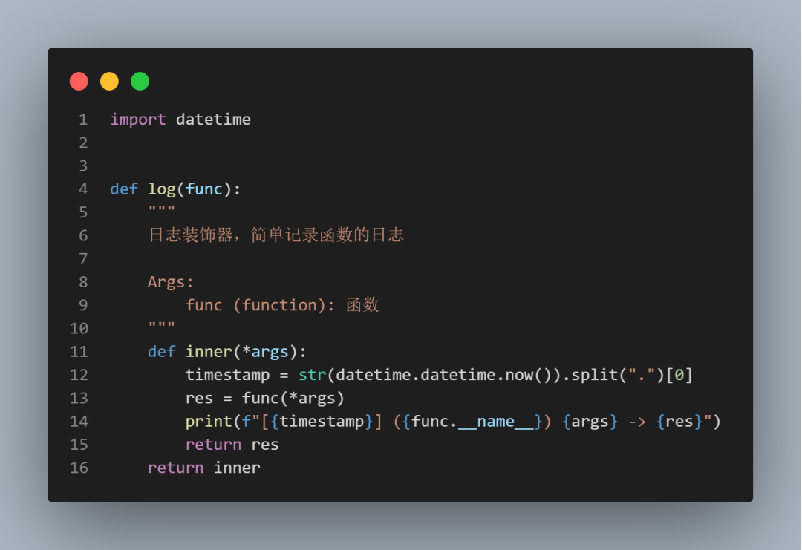 用一下试试看： 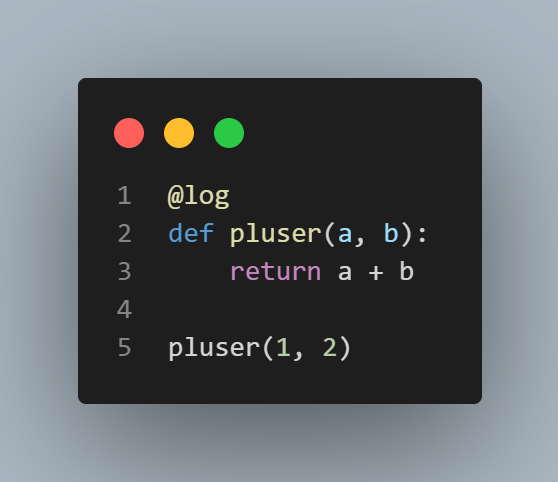 效果如下： 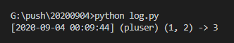 虽然这样可以实现所需要的功能，但其实有很大的优化空间。

## 2、普通版装饰器
第一版代码中有一个显而易见的问题，装饰器内定义的处理函数不支持`kwargs`，而在装饰器中支持`kwargs`仅仅是举手之劳而已。 第二个问题是，生成时间戳的时候采用字符串截取的形式，这种形式过于粗暴。其实可以使用`strftime`做字符串转换。 修改如下： 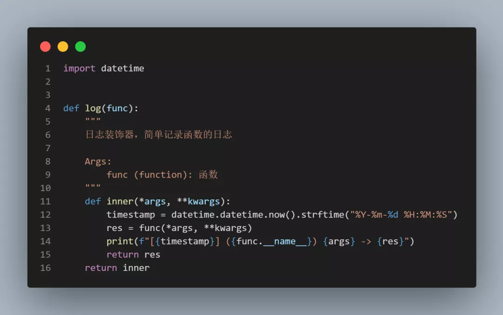 似乎优化得差不多了，不过依然存在改进空间。

## 3、优化版装饰器
在前两版代码中，使用`print`进行日志输出，其实这种处理日志的方式并不标准。 使用`logging`模块控制日志输出是一个更好地选择。 为了使用`logging`模块记录日志，需要先配置好`logging`相关的选项。

### 1) 首先，生成一个日志记录器，并配置日志等级：
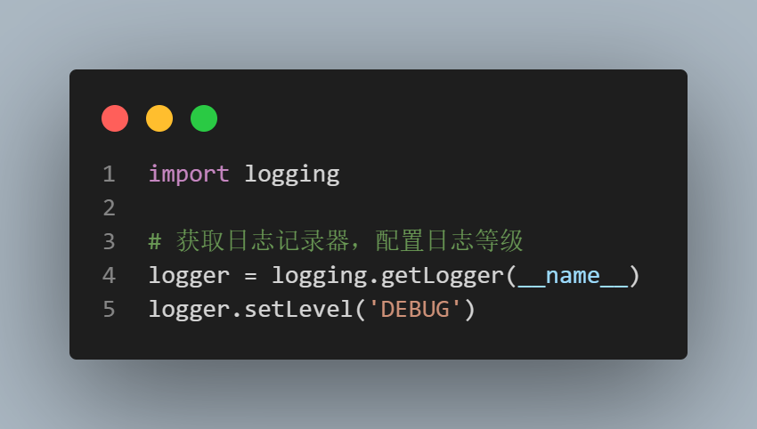

### 2) 配置日志格式、增加`handler`控制输出流：
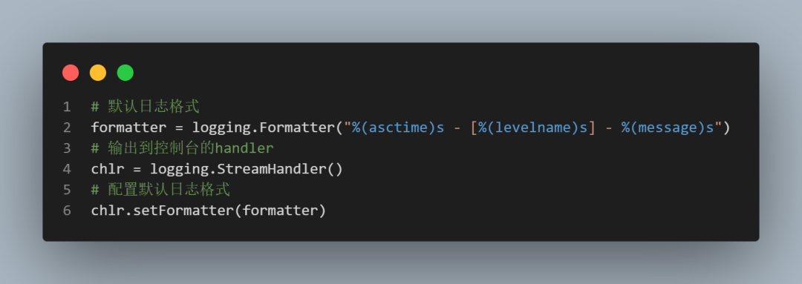 此处可以设置`handler`所需要处理的日志等级，没有设置则默认使用`logger`自身的`Level`，即`DEBUG`等级。

### 3) 最后，将此`handler`加入到日志记录器内：
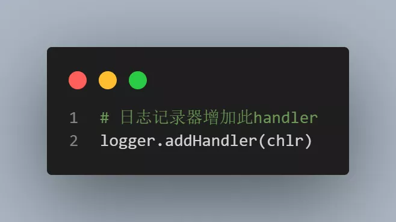 `logging`完整配置如下： 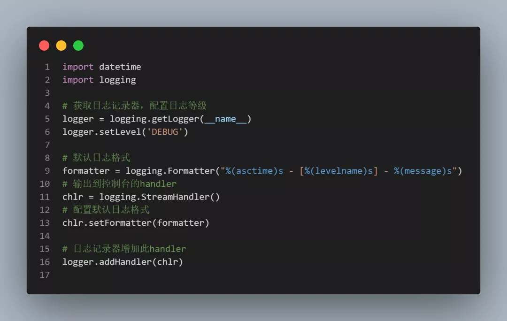 使用的时候非常简单，就是把`print`换成`logger.debug`即可： 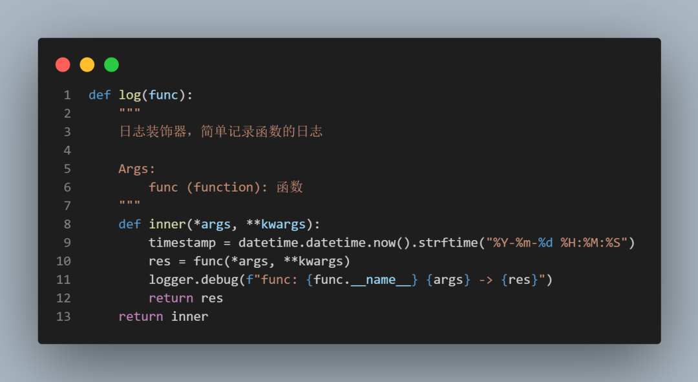

效果如下： 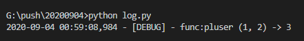 这样，一个比较完善的日志装饰器就完成了。 附常用的日志等级配置： 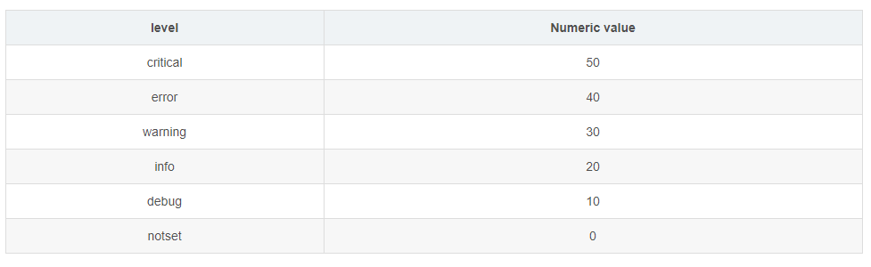
