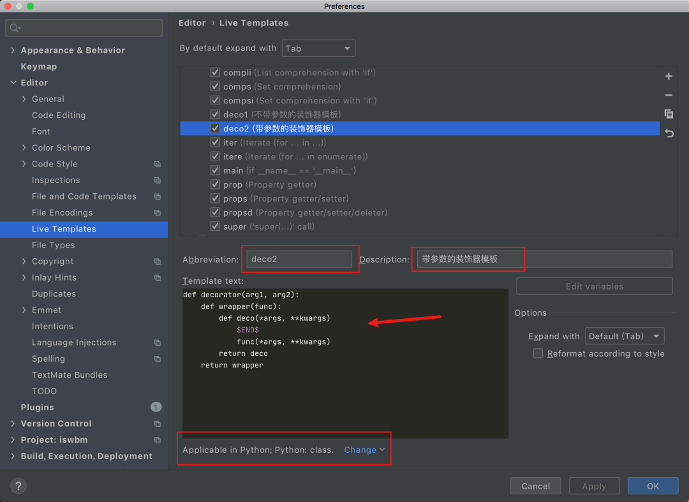
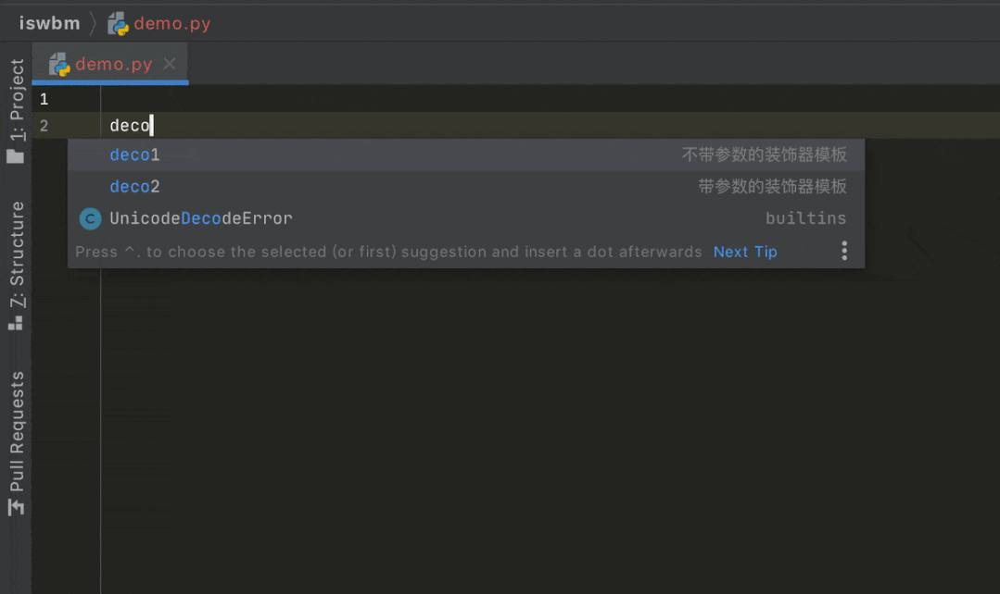

Python 装饰器 decorator<br />decorator可以更方便地写Python装饰器代码，更重要的是，它让 Python 中被装饰器装饰后的方法长得更像装饰前的方法。
<a name="amDqE"></a>
## 1、常规的装饰器
下面这是一个最简单的装饰器示例，在运行myfunc函数的前后都会打印一条日志。
```python
def deco(func):
    def wrapper(*args, **kw):
        print("Ready to run task")
        func(*args, **kw)
        print("Successful to run task")
    return wrapper

@deco
def myfunc():
    print("Running the task")

myfunc()
```
装饰器使用起来，似乎有些高端和魔幻，对于一些重复性的功能，往往会封装成一个装饰器函数。<br />在定义一个装饰器的时候，都需要像上面一样机械性的写一个嵌套的函数，对装饰器原理理解不深的初学者，往往过段时间就会忘记如何定义装饰器。<br />有一些比较聪明的同学，会利用 PyCharm 来自动生成装饰器模板<br /><br />然后要使用的时候，直接敲入deco就会生成一个简单的生成器代码，提高编码的准备效率<br />
<a name="Vj73k"></a>
## 2、使用神库
使用 PyCharm 的 Live Template ，虽然能降低编写装饰器的难度，但却要依赖 PyCharm 这一专业的代码编辑器。<br />这里推荐一个更加简单的方法，使用这个方法呢，需要先安装一个库 ：decorator，使用 pip 可以很轻易地去安装它
```bash
$ python3 -m pip install decorator
```
从库的名称不难看出，这是一个专门用来解决装饰器问题的第三方库。<br />有了它之后，以后自己定义的装饰器，就再也不需要写嵌套的函数了
```python
from decorator import decorator

@decorator
def deco(func, *args, **kw):
    print("Ready to run task")
    func(*args, **kw)
    print("Successful to run task")

@deco
def myfunc():
    print("Running the task")

myfunc()
```
deco 作为装饰函数，第一个参数是固定的，都是指被装饰函数，而后面的参数都固定使用 可变参数`*args`和`**kw`的写法，代码被装饰函数的原参数。<br />这种写法，更加符合直觉，代码的逻辑也更容易理解。
<a name="Wj1aW"></a>
## 3、带参数的装饰器可用？
装饰器根据有没有携带参数，可以分为两种
<a name="em95H"></a>
### 第一种：不带参数，最简单的示例，上面已经举例
```python
def decorator(func):
    def wrapper(*args, **kw):
        func(*args, **kw)
    return wrapper
```
<a name="vqiPd"></a>
### 第二种：带参数，这就相对复杂了，理解起来了也不是那么容易。
```python
def decorator(arg1, arg2):
    def wrapper(func):
        def deco(*args, **kwargs)
            func(*args, **kwargs)
        return deco
    return wrapper
```
那么对于需要带参数的装饰器，decorator是否也一样能很好的支持呢？<br />下面是一个官方的示例
```python
from decorator import decorator

@decorator
def warn_slow(func, timelimit=60, *args, **kw):
    t0 = time.time()
    result = func(*args, **kw)
    dt = time.time() - t0
    if dt > timelimit:
        logging.warn('%s took %d seconds', func.__name__, dt)
    else:
        logging.info('%s took %d seconds', func.__name__, dt)
    return result

@warn_slow(timelimit=600)  # warn if it takes more than 10 minutes
def run_calculation(tempdir, outdir):
    pass
```
可以看到

- 装饰函数的第一个参数，还是被装饰器 func ，这个跟之前一样
- 而第二个参数 timelimit 写成了位置参数的写法，并且有默认值
- 再往后，就还是跟原来一样使用了可变参数的写法

不难推断，只要在装饰函数中第二个参数开始，使用了非可变参数的写法，这些参数就可以做为装饰器调用时的参数。
<a name="becgr"></a>
## 4、签名问题有解决？
在自己写装饰器的时候，通常都会顺手加上一个叫functools.wraps的装饰器，那他有啥用呢？<br />先来看一个例子
```python
def wrapper(func):
    def inner_function():
        pass
    return inner_function

@wrapper
def wrapped():
    pass

print(wrapped.__name__)
#inner_function
```
为什么会这样子？不是应该返回`func`吗？<br />这也不难理解，因为上边执行`func`和下边`decorator(func)` 是等价的，所以上面`func.__name__`是等价于下面`decorator(func).__name__`的，那当然名字是`inner_function`
```python
def wrapper(func):
    def inner_function():
        pass
    return inner_function

def wrapped():
    pass

print(wrapper(wrapped).__name__)
#inner_function
```
目前，可以看到当一个函数被装饰器装饰过后，它的签名信息会发生变化（譬如上面看到的函数名）<br />那如何避免这种情况的产生？<br />**解决方案就是使用前面所说的 **`**functools .wraps**`** 装饰器。**<br />它的作用就是将 被修饰的函数(wrapped) 的一些属性值赋值给 修饰器函数(wrapper) ，最终让属性的显示更符合直觉。
```python
from functools import wraps

def wrapper(func):
    @wraps(func)
    def inner_function():
        pass
    return inner_function

@wrapper
def wrapped():
    pass

print(wrapped.__name__)
# wrapped
```
那么问题就来了，使用了 decorator 之后，是否还会存在这种签名的问题呢？<br />写个例子来验证一下就知道了
```python
from decorator import decorator

@decorator
def deco(func, *args, **kw):
    print("Ready to run task")
    func(*args, **kw)
    print("Successful to run task")

@deco
def myfunc():
    print("Running the task")

print(myfunc.__name__)
```
输出的结果是myfunc，说明decorator已经默认处理了一切可预见的问题。
<a name="F4KG5"></a>
## 5、总结一下
decorator是一个提高装饰器编码效率的第三方库，它适用于对装饰器原理感到困惑的新手，可以让你很轻易的写出更符合人类直觉的代码。<br />对于带参数装饰器的定义，是非常复杂的，它需要要写多层的嵌套函数，并且需要熟悉各个参数的传递路径，才能保证写出来的装饰器可以正常使用。<br />这时候，只要用上decorator这个库，就可以很轻松的写出一个带参数的装饰器。同时也不用担心他会出现签名问题，这些它都妥善的处理好了。
