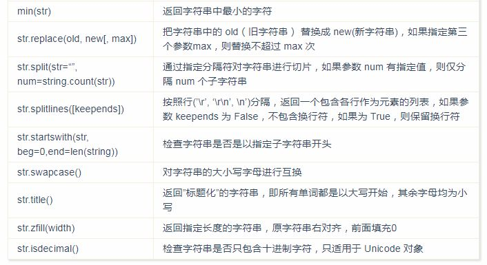

Python
<a name="7CM69"></a>
## 简介
Python 是一种高层次的结合了解释性、编译性、互动性和面向对象的脚本语言。Python 由 Guido van Rossum 于 1989 年底在荷兰国家数学和计算机科学研究所发明，第一个公开发行版发行于 1991 年。
<a name="8ABWc"></a>
### 特点

- 易于学习：Python 有相对较少的关键字，结构简单，和一个明确定义的语法，学习起来更加简单。
- 易于阅读：Python 代码定义的更清晰。
- 易于维护：Python 的成功在于它的源代码是相当容易维护的。
- 一个广泛的标准库：Python 的最大的优势之一是丰富的库，跨平台的，在 UNIX，Windows 和 macOS 兼容很好。
- 互动模式：互动模式的支持，您可以从终端输入执行代码并获得结果的语言，互动的测试和调试代码片断。
- 可移植：基于其开放源代码的特性，Python 已经被移植（也就是使其工作）到许多平台。
- 可扩展：如果需要一段运行很快的关键代码，或者是想要编写一些不愿开放的算法，可以使用 C 或 C++ 完成那部分程序，然后从 Python 程序中调用。
- 数据库：Python 提供所有主要的商业数据库的接口。
- GUI 编程：Python 支持 GUI 可以创建和移植到许多系统调用。
- 可嵌入：可以将 Python 嵌入到 C/C++ 程序，让程序的用户获得”脚本化”的能力。
- 面向对象：Python 是强面向对象的语言，程序中任何内容统称为对象，包括数字、字符串、函数等。
<a name="8u9AY"></a>
## 基础语法
<a name="vCURG"></a>
### 运行 Python
<a name="Q6A1e"></a>
#### 交互式解释器
在命令行窗口执行python后，进入 Python 的交互式解释器。`exit()` 或 Ctrl + D 组合键退出交互式解释器。
<a name="Qe2FG"></a>
#### 命令行脚本
在命令行窗口执行`python script-file.py`，以执行 Python 脚本文件。
<a name="16UYd"></a>
#### 指定解释器
如果在 Python 脚本文件首行输入`#!/usr/bin/env python`，那么可以在命令行窗口中执行/path/to/script-file.py以执行该脚本文件。
:::warning
注：该方法不支持 Windows 环境。
:::
<a name="XMaWL"></a>
### 编码
默认情况下，3.x 源码文件都是 UTF-8 编码，字符串都是 Unicode 字符。也可以手动指定文件编码：
```python
# -*- coding: utf-8 -*-
```
或者
```python
# encoding: utf-8
```
:::tips
注意: 该行标注必须位于文件第一行
:::
<a name="THHhl"></a>
### 标识符

- 第一个字符必须是英文字母或下划线 `_` 。
- 标识符的其他的部分由字母、数字和下划线组成。
- 标识符对大小写敏感。
:::info
注：从 3.x 开始，非 ASCII 标识符也是允许的，但不建议。
:::
<a name="L12xw"></a>
### 保留字
保留字即关键字，不能把它们用作任何标识符名称。Python 的标准库提供了一个 keyword 模块，可以输出当前版本的所有关键字：
```python
>>> import keyword
>>> keyword.kwlist
['False', 'None', 'True', 'and', 'as', 'assert', 'break', 'class', 'continue', 'def',
 'del', 'elif', 'else', 'except', 'finally', 'for', 'from', 'global', 'if', 'import', 
 'in', 'is', 'lambda', 'nonlocal', 'not', 'or', 'pass', 'raise', 'return', 'try', 'while', 'with', 'yield']
```
<a name="pSI1N"></a>
### 注释
单行注释采用`#`，多行注释采用`'''`或`"""`。
```python
# 这是单行注释
'''
这是多行注释
这是多行注释
'''
"""
这也是多行注释
这也是多行注释
"""
```
<a name="gQjuc"></a>
### 行与缩进
Python 最具特色的就是使用缩进来表示代码块，不需要使用大括号 {}。缩进的空格数是可变的，但是同一个代码块的语句必须包含相同的缩进空格数。缩进不一致，会导致运行错误。
<a name="oiFzB"></a>
### 多行语句
Python 通常是一行写完一条语句，但如果语句很长，可以使用反斜杠\来实现多行语句。
```python
total = item_one + \
        item_two + \
        item_three
```
在 [], {}, 或 () 中的多行语句，不需要使用反斜杠\。
<a name="ywYoU"></a>
### 空行
函数之间或类的方法之间用空行分隔，表示一段新的代码的开始。类和函数入口之间也用一行空行分隔，以突出函数入口的开始。<br />空行与代码缩进不同，空行并不是 Python 语法的一部分。书写时不插入空行，Python 解释器运行也不会出错。但是空行的作用在于分隔两段不同功能或含义的代码，便于日后代码的维护或重构。
:::info
记住：空行也是程序代码的一部分。
:::
<a name="OcAwh"></a>
### 等待用户输入
input函数可以实现等待并接收命令行中的用户输入。
```python
content = input("\n\n请输入点东西并按 Enter 键\n")
print(content)
```
<a name="5nDxF"></a>
### 同一行写多条语句
Python 可以在同一行中使用多条语句，语句之间使用分号;分割。
```python
import sys; x = 'hello world'; sys.stdout.write(x + '\n')
```
<a name="ybIu3"></a>
### 多个语句构成代码组
缩进相同的一组语句构成一个代码块，称之代码组。<br />像if、while、def和class这样的复合语句，首行以关键字开始，以冒号:结束，该行之后的一行或多行代码构成代码组。<br />将首行及后面的代码组称为一个子句(clause)。
<a name="9xVNR"></a>
### print 输出
print 默认输出是换行的，如果要实现不换行需要在变量末尾加上end=""或别的非换行符字符串：
```python
print('123') # 默认换行
print('123', end = "") # 不换行
```
<a name="hORBK"></a>
### import 与 from…import
在 Python 用 import 或者 `from...import` 来导入相应的模块。<br />将整个模块导入，格式为：`import module_name`<br />从某个模块中导入某个函数，格式为：`from module_name import func1`<br />从某个模块中导入多个函数，格式为：`from module_name import func1, func2, func3`<br />将某个模块中的全部函数导入，格式为：`from module_name import *`
<a name="wc5Jf"></a>
## 运算符
<a name="sX3v8"></a>
### 算术运算符
| 运算符 | 描述 |
| --- | --- |
| + | 加 |
| - | 减 |
| * | 乘 |
| / | 除 |
| % | 取模 |
| ** | 幂 |
| // | 取整除 |

<a name="rG6MZ"></a>
### 比较运算符
| 运算符 | 描述 |
| --- | --- |
| == | 等于 |
| != | 不等于 |
| > | 大于 |
| < | 小于 |
| >= | 大于等于 |
| <= | 小于等于 |

<a name="g7xcP"></a>
### 赋值运算符
| 运算符 | 描述 |
| --- | --- |
| = | 简单的赋值运算符 |
| += | 加法赋值运算符 |
| -= | 减法赋值运算符 |
| *= | 乘法赋值运算符 |
| /= | 除法赋值运算符 |
| %= | 取模赋值运算符 |
| **= | 幂赋值运算符 |
| //= | 取整除赋值运算符 |

<a name="A4qP5"></a>
### 位运算符
| 运算符 | 描述 |
| --- | --- |
| & | 按位与运算符:参与运算的两个值，如果两个相应位都为1，则该位的结果为1，否则为0 |
| &#124; | 按位或运算符:只要对应的二个二进位有一个为1时，结果位就为1 |
| ^ | 按位异或运算符:当两对应的二进位相异时，结果为1 |
| ~ | 按位取反运算符:对数据的每个二进制位取反，即把1变为0，把0变为1。~x类似于-x-1 |
| << | 左移动运算符︰运算数的各二进位全部左移若干位，由"<<“右边的数指定移动的位数，高位丢<br />弃，低位补0 |
| >> | 右移动运算符:把”>>“左边的运算数的各二进位全部右移若干位，">>“右边的数指定移动的位数 |

<a name="PEvzt"></a>
### 逻辑运算符
| 运算符 | 逻辑表达式 | 描述 |
| --- | --- | --- |
| and | x and y | 布尔"与"-如果×为False，x and y返回False，否则它返回y的计算值 |
| or | x or y | 布尔"或"-如果×是True，它返回x的值，否则它返回y的计算值 |
| not | not x | 布尔"非"-如果×为True，返回False。如果×为False，它返回True |

<a name="vGcUW"></a>
### 成员运算符
| 运算符 | 描述 |
| --- | --- |
| in | 如果在指定的序列中找到值返回True，否则返回False |
| not in | 如果在指定的序列中没有找到值返回True，否则返回False |

<a name="6ZlAR"></a>
### 身份运算符
| 运算符 | 描述 | 实例 |
| --- | --- | --- |
| is | is是判断两个标识符是不是引<br />用自一个对象 | `x is y`，类似`id(x) == id(y)`，如果引用的是同一个对象则返回True，否则返回False |
| is not | is not是判断两个标识符是不<br />是引用自不同对象 | `x is not y` ，类似`id(a) != id(b)`。如果引用的不是同一个对象则返回结果True，否则返回False |

<a name="7BXUl"></a>
### 运算符优先级
| 运算符 | 描述 |
| --- | --- |
| (expressions...),[expressions...] ,{key:value...}, {expressions...} | 表示绑定或元组、表示列表、表示字典．表示集合 |
| x[index],x[index: index], x(arguments. . .),<br />x.attribute | 下标、切片、调用、属性引用 |
| ** | 指数(最高优先级) |
| ~ + - | 按位翻转，一元加号和减号(最后两个的方法名为+@和-@) |
| *、/ 、%、 // | 乘，除，取模和取整除 |
| +、- | 加法减法 |
| >>、<< | 右移，左移运算符 |
| & | 位'AND' |
| ^ ` | ` |
| <=、<、>、>= | 比较运算符 |
| <> 、==、!= | 等于运算符 |
| =、%=、/=、//=、-=、+=、*=、**= | 赋值运算符 |
| is、is not | 身份运算符 |
| in、not in | 成员运算符 |
| and、or、not | 逻辑运算符 |
| if - else | 条件表达式 |
| lambda | Lambda表达式 |

具有相同优先级的运算符将从左至右的方式依次进行。用小括号()可以改变运算顺序。
<a name="tDMS1"></a>
## 变量
变量在使用前必须先”定义”（即赋予变量一个值），否则会报错：
```python
>>> name
Traceback (most recent call last):
  File "<stdin>", line 1, in <module>
NameError: name 'name' is not defined
```
<a name="2uShc"></a>
## 数据类型
<a name="5WTqk"></a>
### 布尔(bool)
只有 True 和 False 两个值，表示真或假。
<a name="FoY8m"></a>
### 数字(number)
<a name="arR95"></a>
#### 整型(int)
整数值，可正数亦可复数，无小数。3.x 整型是没有限制大小的，可以当作 Long 类型使用，所以 3.x 没有 2.x 的 Long 类型。
<a name="aovbu"></a>
#### 浮点型(float)
浮点型由整数部分与小数部分组成，浮点型也可以使用科学计数法表示（2.5e2 = 2.5 x 10^2 = 250）
<a name="xz00y"></a>
#### 复数(complex)
复数由实数部分和虚数部分构成，可以用a + bj，或者`complex(a,b)`表示，复数的实部 a 和虚部 b 都是浮点型。
<a name="2WDXs"></a>
#### 数字运算

- 不同类型的数字混合运算时会将整数转换为浮点数
- 在不同的机器上浮点运算的结果可能会不一样
- 在整数除法中，除法 / 总是返回一个浮点数，如果只想得到整数的结果，丢弃可能的分数部分，可以使用运算符 //。
- // 得到的并不一定是整数类型的数，它与分母分子的数据类型有关系
- 在交互模式中，最后被输出的表达式结果被赋值给变量 _，_ 是个只读变量
<a name="R17xd"></a>
#### 数学函数
注：以下函数的使用，需先导入 math 包。<br />
<a name="wxUqQ"></a>
#### 随机数函数
注：以下函数的使用，需先导入 random 包。<br />
<a name="bODxm"></a>
#### 三角函数
注：以下函数的使用，需先导入 math 包。<br />
<a name="jrK8Y"></a>
#### 数学常量

<a name="TT5SU"></a>
### 字符串(string)

- 单引号和双引号使用完全相同
- 使用三引号('''或""")可以指定一个多行字符串
- 转义符(反斜杠\)可以用来转义，使用r可以让反斜杠不发生转义，如r"this is a line with \n"，则\n会显示，并不是换行
- 按字面意义级联字符串，如"this " "is " "string"会被自动转换为this is string
- 字符串可以用 + 运算符连接在一起，用 * 运算符重复
- 字符串有两种索引方式，从左往右以 0 开始，从右往左以 -1 开始
- 字符串不能改变
- 没有单独的字符类型，一个字符就是长度为 1 的字符串
- 字符串的截取的语法格式如下：变量[头下标:尾下标]
<a name="emNsk"></a>
#### 转义字符

<a name="QchZN"></a>
#### 字符串运算符

<a name="qJI66"></a>
#### 字符串格式化
在 Python 中，字符串格式化不是 sprintf 函数，而是用 % 符号。例如：
```python
print("我叫%s， 今年 %d 岁！" % ('小明', 10))
// 输出:
我叫小明， 今年 10 岁！
```
格式化符号:<br /><br />辅助指令:<br /><br />Python 2.6 开始，新增了一种格式化字符串的函数 `str.format()`，它增强了字符串格式化的功能。
<a name="fPdOB"></a>
#### 多行字符串

- 用三引号(`'''` 或 `"""`)包裹字符串内容
- 多行字符串内容支持转义符，用法与单双引号一样
- 三引号包裹的内容，有变量接收或操作即字符串，否则就是多行注释

实例：
```python
string = '''
print(\tmath.fabs(-10))
print(\nrandom.choice(li))
'''
print(string)
```
输出：
```python
print(  math.fabs(-10))
print(
random.choice(li))
```
<a name="thYkC"></a>
#### Unicode
在 2.x 中，普通字符串是以 8 位 ASCII 码进行存储的，而 Unicode 字符串则存储为 16 位 Unicode 字符串，这样能够表示更多的字符集。使用的语法是在字符串前面加上前缀 u。<br />在 3.x 中，所有的字符串都是 Unicode 字符串。
<a name="E37sd"></a>
#### 字符串函数
<br /><br />
<a name="P0XHG"></a>
### 字节(bytes)
在 3.x 中，字符串和二进制数据完全区分开。文本总是 Unicode，由 str 类型表示，二进制数据则由 bytes 类型表示。Python 3 不会以任意隐式的方式混用 str 和 bytes，不能拼接字符串和字节流，也无法在字节流里搜索字符串（反之亦然），也不能将字符串传入参数为字节流的函数（反之亦然）。

- bytes 类型与 str 类型，二者的方法仅有 encode() 和 decode() 不同。
- bytes 类型数据需在常规的 str 类型前加个 b 以示区分，例如 b'abc'。
- 只有在需要将 str 编码(encode)成 bytes 的时候，比如：通过网络传输数据；或者需要将 bytes 解码(decode)成 str 的时候，才会关注 str 和 bytes 的区别。
<a name="17dc7791"></a>
#### bytes 转 str：
```python
b'abc'.decode()
str(b'abc')
str(b'abc', encoding='utf-8')
```
<a name="CQJhR"></a>
#### str 转 bytes：
```python
'中国'.encode()
bytes('中国', encoding='utf-8')
```
<a name="TxQJa"></a>
### 列表(list)

- 列表是一种无序的、可重复的数据序列，可以随时添加、删除其中的元素。
- 列表页的每个元素都分配一个数字索引，从 0 开始
- 列表使用方括号创建，使用逗号分隔元素
- 列表元素值可以是任意类型，包括变量
- 使用方括号对列表进行元素访问、切片、修改、删除等操作，开闭合区间为[)形式
- 列表的元素访问可以嵌套
- 方括号内可以是任意表达式
<a name="2rdFq"></a>
#### 创建列表
```python
hello = (1, 2, 3)
li = [1, "2", [3, 'a'], (1, 3), hello]
```
<a name="Dbim6"></a>
#### 访问元素
```python
li = [1, "2", [3, 'a'], (1, 3)]
print(li[3])        # (1, 3)
print(li[-2])       # [3, 'a']
```
<a name="uWYfE"></a>
#### 切片访问
格式: list_name[begin:end:step] begin 表示起始位置(默认为0)，end 表示结束位置(默认为最后一个元素)，step 表示步长(默认为1)
```python
hello = (1, 2, 3)
li = [1, "2", [3, 'a'], (1, 3), hello]
print(li)           # [1, '2', [3, 'a'], (1, 3), (1, 2, 3)]
print(li[1:2])      # ['2']
print(li[:2])       # [1, '2']
print(li[:])        # [1, '2', [3, 'a'], (1, 3), (1, 2, 3)]
print(li[2:])       # [[3, 'a'], (1, 3), (1, 2, 3)]
print(li[1:-1:2])   # ['2', (1, 3)]
```
访问内嵌 list 的元素：
```python
li = [0, 1, 2, 3, 4, 5, 6, 7, 8, 9, ['a', 'b', 'c']]
print(li[1:-1:2][1:3])      # (3, 5)
print(li[-1][1:3])          # ['b', 'c']
print(li[-1][1])            # b
```
<a name="Ndv94"></a>
#### 修改列表
通过使用方括号，可以非常灵活的对列表的元素进行修改、替换、删除等操作。
```python
li = [0, 1, 2, 3, 4, 5]
li[len(li) - 2] = 22    # 修改 [0, 1, 2, 3, 22, 5]
li[3] = 33              # 修改 [0, 1, 2, 33, 22, 5]
li[1:-1] = [9, 9]       # 替换 [0, 9, 9, 5]
li[1:-1] = []           # 删除 [0, 5]
```
<a name="yxLG2"></a>
#### 删除元素
可以用 del 语句来删除列表的指定范围的元素。
```python
li = [0, 1, 2, 3, 4, 5]
del li[3]       # [0, 1, 2, 4, 5]
del li[2:-1]    # [0, 1, 5]
```
<a name="LfjbB"></a>
#### 列表操作符

- + 用于合并列表
- * 用于重复列表元素
- in 用于判断元素是否存在于列表中
- for ... in ... 用于遍历列表元素
```python
[1, 2, 3] + [3, 4, 5]           # [1, 2, 3, 3, 4, 5]
[1, 2, 3] * 2                   # [1, 2, 3, 1, 2, 3]
3 in [1, 2, 3]                  # True
for x in [1, 2, 3]: print(x)    # 1 2 3
```
<a name="YyEZQ"></a>
#### 列表函数

- len(list) 列表元素个数
- max(list) 列表元素中的最大值
- min(list) 列表元素中的最小值
- list(seq) 将元组转换为列表
```python
li = [0, 1, 5]
max(li)     # 5
len(li)     # 3
```
:::danger
注: 对列表使用 max/min 函数，2.x 中对元素值类型无要求，3.x 则要求元素值类型必须一致。
:::
<a name="jitaG"></a>
#### 列表方法

- `list.append(obj)`在列表末尾添加新的对象
- `list.count(obj)`返回元素在列表中出现的次数
- `list.extend(seq)`在列表末尾一次性追加另一个序列中的多个值
- `list.index(obj)`返回查找对象的索引位置，如果没有找到对象则抛出异常
- `list.insert(index, obj)`将指定对象插入列表的指定位置
- `list.pop([index=-1]])`移除列表中的一个元素（默认最后一个元素），并且返回该元素的值
- `list.remove(obj)`移除列表中某个值的第一个匹配项
- `list.reverse()`反向排序列表的元素
- `list.sort(cmp=None, key=None, reverse=False)`对原列表进行排序，如果指定参数，则使用比较函数指定的比较函数
- `list.clear()`清空列表 还可以使用 `del list[:]`、`li = []` 等方式实现
- `list.copy()`复制列表 默认使用等号赋值给另一个变量，实际上是引用列表变量。如果要实现
<a name="ZffO4"></a>
#### 列表推导式
列表推导式提供了从序列创建列表的简单途径。通常应用程序将一些操作应用于某个序列的每个元素，用其获得的结果作为生成新列表的元素，或者根据确定的判定条件创建子序列。<br />每个列表推导式都在 for 之后跟一个表达式，然后有零到多个 for 或 if 子句。返回结果是一个根据表达从其后的 for 和 if 上下文环境中生成出来的列表。如果希望表达式推导出一个元组，就必须使用括号。<br />将列表中每个数值乘三，获得一个新的列表：
```python
vec = [2, 4, 6]
[(x, x**2) for x in vec]
# [(2, 4), (4, 16), (6, 36)]
```
对序列里每一个元素逐个调用某方法：
```python
freshfruit = ['  banana', '  loganberry ', 'passion fruit  ']
[weapon.strip() for weapon in freshfruit]
# ['banana', 'loganberry', 'passion fruit']
```
用 if 子句作为过滤器：
```python
vec = [2, 4, 6]
[3*x for x in vec if x > 3]
# [12, 18]
```
```python
vec1 = [2, 4, 6]
vec2 = [4, 3, -9]
[x*y for x in vec1 for y in vec2]
# [8, 6, -18, 16, 12, -36, 24, 18, -54]
[vec1[i]*vec2[i] for i in range(len(vec1))]
# [8, 12, -54]
```
列表嵌套解析：
```python
matrix = [
[1, 2, 3],
[4, 5, 6],
[7, 8, 9],
]
new_matrix = [[row[i] for row in matrix] for i in range(len(matrix[0]))]
print(new_matrix)
# [[1, 4, 7], [2, 5, 8], [3, 6, 9]]
```
<a name="5jZKq"></a>
### 元组(tuple)

- 元组与列表类似，不同之处在于元组的元素不能修改
- 元组使用小括号，列表使用方括号
- 元组创建很简单，只需要在括号中添加元素，并使用逗号隔开即可
- 没有 append()，insert() 这样进行修改的方法，其他方法都与列表一样
- 字典中的键必须是唯一的同时不可变的，值则没有限制
- 元组中只包含一个元素时，需要在元素后面添加逗号，否则括号会被当作运算符使用
<a name="0L6N5"></a>
#### 访问元组
访问元组的方式与列表是一致的。元组的元素可以直接赋值给多个变量，但变量数必须与元素数量一致。
```python
a, b, c = (1, 2, 3)
print(a, b, c)
```
<a name="JC3Bi"></a>
#### 组合元组
元组中的元素值是不允许修改的，但可以对元组进行连接组合
```python
tup1 = (12, 34.56);
tup2 = ('abc', 'xyz')
tup3 = tup1 + tup2;
print (tup3)
# (12, 34.56, 'abc', 'xyz')
```
<a name="rY8Yt"></a>
#### 删除元组
元组中的元素值是不允许删除的，但可以使用 del 语句来删除整个元组
<a name="6MDnr"></a>
#### 元组函数

- `len(tuple)` 元组元素个数
- `max(tuple)` 元组元素中的最大值
- `min(tuple)` 元组元素中的最小值
- `tuple(tuple)` 将列表转换为元组
<a name="LeyQG"></a>
#### 元组推导式
```python
t = 1, 2, 3
print(t)
# (1, 2, 3)
u = t, (3, 4, 5)
print(u)
# ((1, 2, 3), (3, 4, 5))
```
<a name="RgTiZ"></a>
### 字典(dict)

- 字典是另一种可变容器模型，可存储任意类型对象
- 字典的每个键值(key=>value)对用冒号(:)分割，每个对之间用逗号(,)分割，整个字典包括在花括号({})中
- 键必须是唯一的，但值则不必
- 值可以是任意数据类型
- 键必须是不可变的，例如：数字、字符串、元组可以，但列表就不行
- 如果用字典里没有的键访问数据，会报错
- 字典的元素没有顺序，不能通过下标引用元素，通过键来引用
- 字典内部存放的顺序和 key 放入的顺序是没有关系的

格式如下:
```python
d = {key1 : value1, key2 : value2 }
```
<a name="KHBFT"></a>
#### 访问字典
```python
dis = {'a': 1, 'b': [1, 2, 3]}
print(dis['b'][2])
```
<a name="9Bxxm"></a>
#### 修改字典
```python
dis = {'a': 1, 'b': [1, 2, 3], 9: {'name': 'hello'}}
dis[9]['name'] = 999
print(dis)
# {'a': 1, 9: {'name': 999}, 'b': [1, 2, 3]}
```
<a name="UKMHa"></a>
#### 删除字典
用 del 语句删除字典或字典的元素。
```python
dis = {'a': 1, 'b': [1, 2, 3], 9: {'name': 'hello'}}
del dis[9]['name']
print(dis)
del dis         # 删除字典
# {'a': 1, 9: {}, 'b': [1, 2, 3]}
```
<a name="mV3vl"></a>
#### 字典函数

- `len(dict)` 计算字典元素个数，即键的总数
- `str(dict)` 输出字典，以可打印的字符串表示
- `type(variable)` 返回输入的变量类型，如果变量是字典就返回字典类型
- `key in dict` 判断键是否存在于字典中
<a name="XP2RY"></a>
#### 字典方法

- `dict.clear()`删除字典内所有元素
- `dict.copy()`返回一个字典的浅复制
- `dict.fromkeys(seq[, value])`创建一个新字典，以序列 seq 中元素做字典的键，value 为字典所有键对应的初始值
- `dict.get(key, default=None)`返回指定键的值，如果值不在字典中返回默认值
- `dict.items()`以列表形式返回可遍历的(键, 值)元组数组
- `dict.keys()`以列表返回一个字典所有的键
- `dict.values()`以列表返回字典中的所有值
- `dict.setdefault(key, default=None)`如果 key 在字典中，返回对应的值。如果不在字典中，则插入 key 及设置的默认值 default，并返回 default ，default 默认值为 None。
- `dict.update(dict2)`把字典参数 dict2 的键/值对更新到字典 dict 里
```python
dic1 = {'a': 'a'}
dic2 = {9: 9, 'a': 'b'}
dic1.update(dic2)
print(dic1)
# {'a': 'b', 9: 9}
```

- `dict.pop(key[,default])`删除字典给定键 key 所对应的值，返回值为被删除的值。key 值必须给出，否则返回 default 值。
- `dict.popitem()`随机返回并删除字典中的一对键和值(一般删除末尾对)
<a name="KLkiS"></a>
#### 字典推导式
构造函数 dict() 直接从键值对元组列表中构建字典。如果有固定的模式，列表推导式指定特定的键值对：
```python
>>> dict([('sape', 4139), ('guido', 4127), ('jack', 4098)])
{'sape': 4139, 'jack': 4098, 'guido': 4127}
```
此外，字典推导可以用来创建任意键和值的表达式词典：
```python
>>> {x: x**2 for x in (2, 4, 6)}
{2: 4, 4: 16, 6: 36}
```
如果关键字只是简单的字符串，使用关键字参数指定键值对有时候更方便：
```python
>>> dict(sape=4139, guido=4127, jack=4098)
{'sape': 4139, 'jack': 4098, 'guido': 4127}
```
<a name="4T3lZ"></a>
### 集合(set)
集合是一个无序不重复元素的序列
<a name="7IZGZ"></a>
#### 创建集合

- 可以使用大括号 `{}` 或者 `set()` 函数创建集合
- 创建一个空集合必须用 `set()` 而不是 `{}`，因为 `{}` 是用来创建一个空字典
- set(value) 方式创建集合，value 可以是字符串、列表、元组、字典等序列类型
- 创建、添加、修改等操作，集合会自动去重
```python
{1, 2, 1, 3}            # {} {1, 2, 3}
set('12345')            # 字符串 {'3', '5', '4', '2', '1'}
set([1, 'a', 23.4])     # 列表 {1, 'a', 23.4}
set((1, 'a', 23.4))     # 元组 {1, 'a', 23.4}
set({1:1, 'b': 9})      # 字典 {1, 'b'}
```
<a name="xKda3"></a>
#### 添加元素
将元素 val 添加到集合 set 中，如果元素已存在，则不进行任何操作：
```python
set.add(val)
```
也可以用 update 方法批量添加元素，参数可以是列表，元组，字典等：
```python
set.update(list1, list2,...)
```
<a name="j4cjB"></a>
#### 移除元素
如果存在元素 val 则移除，不存在就报错：
```python
set.remove(val)
```
如果存在元素 val 则移除，不存在也不会报错：
```python
set.discard(val)
```
随机移除一个元素：
```python
set.pop()
```
<a name="lsi81"></a>
#### 元素个数
与其他序列一样，可以用 `len(set)` 获取集合的元素个数。
<a name="BzNVS"></a>
#### 清空集合
```python
set.clear()
set = set()
```
<a name="pqJSo"></a>
#### 判断元素是否存在
```python
val in set
```
<a name="TSfMq"></a>
#### 其他方法

- `set.copy()`复制集合
- `set.difference(set2)`求差集，在 set 中却不在 set2 中
- `set.intersection(set2)`求交集，同时存在于 set 和 set2 中
- `set.union(set2)`求并集，所有 set 和 set2 的元素
- `set.symmetric_difference(set2)`求对称差集，不同时出现在两个集合中的元素
- `set.isdisjoint(set2)`如果两个集合没有相同的元素，返回 True
- `set.issubset(set2)`如果 set 是 set2 的一个子集，返回 True
- `set.issuperset(set2)`如果 set 是 set2 的一个超集，返回 True
<a name="tmD0c"></a>
#### 集合计算
```python
a = set('abracadabra')
b = set('alacazam')
print(a)                                  # a 中唯一的字母
# {'a', 'r', 'b', 'c', 'd'}
print(a - b)                              # 在 a 中的字母，但不在 b 中
# {'r', 'd', 'b'}
print(a | b)                              # 在 a 或 b 中的字母
# {'a', 'c', 'r', 'd', 'b', 'm', 'z', 'l'}
print(a & b)                              # 在 a 和 b 中都有的字母
# {'a', 'c'}
print(a ^ b)                              # 在 a 或 b 中的字母，但不同时在 a 和 b 中
# {'r', 'd', 'b', 'm', 'z', 'l'}
```
<a name="xUnBp"></a>
#### 集合推导式
```python
a = {x for x in 'abracadabra' if x not in 'abc'}
print(a)
# {'d', 'r'}
```
<a name="CxhBk"></a>
## 流程控制
<a name="iTwAx"></a>
### if 控制
```python
if 表达式1:
    语句
    if 表达式2:
        语句
    elif 表达式3:
        语句
    else:
        语句
elif 表达式4:
    语句
else:
    语句
```
1、每个条件后面要使用冒号 `:`，表示接下来是满足条件后要执行的语句块。<br />2、使用缩进来划分语句块，相同缩进数的语句在一起组成一个语句块。<br />3、在 Python 中没有 switch - case 语句。<br />三元运算符：
```python
<表达式1> if <条件> else <表达式2>
```
编写条件语句时，应该尽量避免使用嵌套语句。嵌套语句不便于阅读，而且可能会忽略一些可能性。
<a name="hkpZg"></a>
### for 遍历
```python
for <循环变量> in <循环对象>：
    <语句1>
else:
    <语句2>
```
else 语句中的语句2只有循环正常退出（遍历完所有遍历对象中的值）时执行。<br />在字典中遍历时，关键字和对应的值可以使用 `items()` 方法同时解读出来：
```python
knights = {'gallahad': 'the pure', 'robin': 'the brave'}
for k, v in knights.items():
    print(k, v)
```
在序列中遍历时，索引位置和对应值可以使用 enumerate() 函数同时得到：
```python
for i, v in enumerate(['tic', 'tac', 'toe']):
    print(i, v)
```
同时遍历两个或更多的序列，可以使用 `zip()` 组合：
```python
questions = ['name', 'quest', 'favorite color']
answers = ['lancelot', 'the holy grail', 'blue']
for q, a in zip(questions, answers):
    print('What is your {0}?  It is {1}.'.format(q, a))
```
要反向遍历一个序列，首先指定这个序列，然后调用 `reversed()` 函数：
```python
for i in reversed(range(1, 10, 2)):
    print(i)
```
要按顺序遍历一个序列，使用 `sorted()` 函数返回一个已排序的序列，并不修改原值：
```python
basket = ['apple', 'orange', 'apple', 'pear', 'orange', 'banana']
for f in sorted(set(basket)):
    print(f)
```
<a name="hckej"></a>
### while 循环
```python
while<条件>：
    <语句1>
else：
    <语句2>
```
<a name="rquv4"></a>
### break、continue、pass
break 语句用在 while 和 for 循环中，break 语句用来终止循环语句，即循环条件没有 False 条件或者序列还没被完全递归完，也会停止执行循环语句。continue 语句用在 while 和 for 循环中，continue 语句用来告诉 Python 跳过当前循环的剩余语句，然后继续进行下一轮循环。continue 语句跳出本次循环，而 break 跳出整个循环。
:::info
pass 是空语句，是为了保持程序结构的完整性。pass 不做任何事情，一般用做占位语句。
:::
<a name="L5h22"></a>
## 迭代器

- 迭代器是一个可以记住遍历的位置的对象。
- 迭代器对象从集合的第一个元素开始访问，直到所有的元素被访问完结束。迭代器只能往前不会后退。
- 迭代器有两个基本的方法：`iter()` 和 `next()`。
- 字符串，列表或元组对象都可用于创建迭代器。

迭代器可以被 for 循环进行遍历：
```python
li = [1, 2, 3]
it = iter(li)
for val in it:
    print(val)
```
迭代器也可以用 `next()` 函数访问下一个元素值：
```python
import sys
li = [1,2,3,4]
it = iter(li)
while True:
    try:
        print (next(it))
    except StopIteration:
        sys.exit()
```
<a name="d22bZ"></a>
## 生成器

- 在 Python 中，使用了 yield 的函数被称为生成器（generator）。
- 跟普通函数不同的是，生成器是一个返回迭代器的函数，只能用于迭代操作，更简单点理解生成器就是一个迭代器。
- 在调用生成器运行的过程中，每次遇到 yield 时函数会暂停并保存当前所有的运行信息，返回 yield 的值，并在下一次执行 `next()` 方法时从当前位置继续运行。
- 调用一个生成器函数，返回的是一个迭代器对象。
```python
import sys
def fibonacci(n): # 生成器函数 - 斐波那契
    a, b, counter = 0, 1, 0
    while True:
        if (counter > n):
            return
        yield a
        a, b = b, a + b
        counter += 1
f = fibonacci(10) # f 是一个迭代器，由生成器返回生成
while True:
    try:
        print(next(f))
    except StopIteration:
        sys.exit()
```
<a name="cdBAR"></a>
## 函数
<a name="Qpefs"></a>
### 自定义函数
函数（Functions）是指可重复使用的程序片段。它们允许为某个代码块赋予名字，允许通过这一特殊的名字在程序任何地方来运行代码块，并可重复任何次数。这就是所谓的调用（Calling）函数。

- 函数代码块以 def 关键词开头，后接函数标识符名称和圆括号 ()。
- 任何传入参数和自变量必须放在圆括号中间，圆括号之间可以用于定义参数。
- 函数的第一行语句可以选择性地使用文档字符串—用于存放函数说明。
- 函数内容以冒号起始，并且缩进。
- return [表达式] 结束函数，选择性地返回一个值给调用方。不带表达式的 return 相当于返回 None。
- return 可以返回多个值，此时返回的数据为元组类型。
- 定义参数时，带默认值的参数必须在无默认值参数的后面。
```python
def 函数名（参数列表）:
    函数体
```
<a name="UKFhp"></a>
### 参数传递
在 Python 中，类型属于对象，变量是没有类型的：
```python
a = [1,2,3]
a = "Runoob"
```
以上代码中，[1,2,3] 是 List 类型，”Runoob” 是 String 类型，而变量 a 是没有类型，她仅仅是一个对象的引用（一个指针），可以是指向 List 类型对象，也可以是指向 String 类型对象。
<a name="l0YOg"></a>
#### 可更改与不可更改对象
在 Python 中，字符串，数字和元组是不可更改的对象，而列表、字典等则是可以修改的对象。

- 不可变类型：变量赋值 a=5 后再赋值 a=10，这里实际是新生成一个 int 值对象 10，再让 a 指向它，而 5 被丢弃，不是改变a的值，相当于新生成了a。
- 可变类型：变量赋值 la=[1,2,3,4] 后再赋值 `la[2]=5` 则是将 list la 的第三个元素值更改，本身la没有动，只是其内部的一部分值被修改了。

Python 函数的参数传递：

- 不可变类型：类似 c++ 的值传递，如 整数、字符串、元组。如`fun(a)`，传递的只是a的值，没有影响a对象本身。比如在 `fun(a)`内部修改 a 的值，只是修改另一个复制的对象，不会影响 a 本身。
- 可变类型：类似 c++ 的引用传递，如 列表，字典。如 `fun(la)`，则是将 la 真正的传过去，修改后fun外部的la也会受影响

Python 中一切都是对象，严格意义不能说值传递还是引用传递，应该说传不可变对象和传可变对象。
<a name="sz0E2"></a>
### 参数
<a name="UQYau"></a>
#### 必需参数
必需参数须以正确的顺序传入函数。调用时的数量必须和声明时的一样。
<a name="7bJBh"></a>
#### 关键字参数
关键字参数和函数调用关系紧密，函数调用使用关键字参数来确定传入的参数值。使用关键字参数允许函数调用时参数的顺序与声明时不一致，因为 Python 解释器能够用参数名匹配参数值。
```python
def print_info(name, age):
    "打印任何传入的字符串"
    print("名字: ", name)
    print("年龄: ", age)
    return
print_info(age=50, name="john")
```
<a name="Wrl6V"></a>
#### 默认参数
调用函数时，如果没有传递参数，则会使用默认参数。
```python
def print_info(name, age=35):
    print ("名字: ", name)
    print ("年龄: ", age)
    return
print_info(age=50, name="john")
print("------------------------")
print_info(name="john")
```
<a name="Rwunk"></a>
#### 不定长参数

- 加了星号 * 的参数会以元组的形式导入，存放所有未命名的变量参数。
- 如果在函数调用时没有指定参数，它就是一个空元组。也可以不向函数传递未命名的变量。
```python
def print_info(arg1, *vartuple):
    print("输出: ")
    print(arg1)
    for var in vartuple:
        print (var)
    return
print_info(10)
print_info(70, 60, 50)
```

- 加了两个星号 ** 的参数会以字典的形式导入。变量名为键，变量值为字典元素值。
```
def print_info(arg1, **vardict):
    print("输出: ")
    print(arg1)
    print(vardict)
print_info(1, a=2, b=3)
```
<a name="KRg1h"></a>
### 匿名函数
Python 使用 lambda 来创建匿名函数。<br />所谓匿名，意即不再使用 def 语句这样标准的形式定义一个函数。<br />lambda 只是一个表达式，函数体比 def 简单很多。lambda 的主体是一个表达式，而不是一个代码块。仅仅能在 lambda 表达式中封装有限的逻辑进去。lambda 函数拥有自己的命名空间，且不能访问自己参数列表之外或全局命名空间里的参数。虽然 lambda 函数看起来只能写一行，却不等同于 C 或 C++ 的内联函数，后者的目的是调用小函数时不占用栈内存从而增加运行效率。
```python
# 语法格式
lambda [arg1 [,arg2,.....argn]]:expression
```
<a name="8Wbdr"></a>
## 变量作用域

- L （Local） 局部作用域
- E （Enclosing） 闭包函数外的函数中
- G （Global） 全局作用域
- B （Built-in） 内建作用域

以 L –> E –> G –> B 的规则查找，即：在局部找不到，便会去局部外的局部找（例如闭包），再找不到就会去全局找，再者去内建中找。<br />Python 中只有模块（module），类（class）以及函数（def、lambda）才会引入新的作用域，其它的代码块（如 if/elif/else/、try/except、for/while等）是不会引入新的作用域的，也就是说这些语句内定义的变量，外部也可以访问。<br />定义在函数内部的变量拥有一个局部作用域，定义在函数外的拥有全局作用域。<br />局部变量只能在其被声明的函数内部访问，而全局变量可以在整个程序范围内访问。调用函数时，所有在函数内声明的变量名称都将被加入到作用域中。<br />当内部作用域想修改外部作用域的变量时，就要用到global和nonlocal关键字。
```python
num = 1
def fun1():
    global num  # 需要使用 global 关键字声明
    print(num)
    num = 123
    print(num)
fun1()
```
如果要修改嵌套作用域（enclosing 作用域，外层非全局作用域）中的变量则需要 nonlocal 关键字。
```python
def outer():
    num = 10
    def inner():
        nonlocal num   # nonlocal关键字声明
        num = 100
        print(num)
    inner()
    print(num)
outer()
```
<a name="0fmD1"></a>
## 模块
编写模块有很多种方法，其中最简单的一种便是创建一个包含函数与变量、以 .py 为后缀的文件。<br />另一种方法是使用撰写 Python 解释器本身的本地语言来编写模块。举例来说，可以使用 C 语言来撰写 Python 模块，并且在编译后，可以通过标准 Python 解释器在 Python 代码中使用它们。<br />模块是一个包含所有定义的函数和变量的文件，其后缀名是.py。模块可以被别的程序引入，以使用该模块中的函数等功能。这也是使用 Python 标准库的方法。<br />当解释器遇到 import 语句，如果模块在当前的搜索路径就会被导入。<br />搜索路径是一个解释器会先进行搜索的所有目录的列表。如想要导入模块，需要把命令放在脚本的顶端。<br />一个模块只会被导入一次，这样可以防止导入模块被一遍又一遍地执行。<br />搜索路径被存储在 sys 模块中的 path 变量。当前目录指的是程序启动的目录。
<a name="IN6SC"></a>
### 导入模块
导入模块：
```python
import module1[, module2[,... moduleN]]
```
从模块中导入一个指定的部分到当前命名空间中：
```python
from modname import name1[, name2[, ... nameN]]
```
把一个模块的所有内容全都导入到当前的命名空间：
```python
from modname import *
```
<a name="fjfsc"></a>
### `__name__` 属性
每个模块都有一个 `__name__` 属性，当其值是 `'__main__'` 时，表明该模块自身在运行，否则是被引入。<br />一个模块被另一个程序第一次引入时，其主程序将运行。如果想在模块被引入时，模块中的某一程序块不执行，可以用 `__name__` 属性来使该程序块仅在该模块自身运行时执行。
```python
if __name__ == '__main__':
    print('程序自身在运行')
else:
    print('我来自另一模块')
```
<a name="lDPvN"></a>
### dir 函数
内置的函数 `dir()` 可以找到模块内定义的所有名称。以一个字符串列表的形式返回。<br />如果没有给定参数，那么 `dir()` 函数会罗列出当前定义的所有名称。<br />在 Python 中万物皆对象，int、str、float、list、tuple等内置数据类型其实也是类，也可以用 `dir(int)` 查看 int 包含的所有方法。也可以使用 `help(int)` 查看 int 类的帮助信息。
<a name="7GL84"></a>
### 包
包是一种管理 Python 模块命名空间的形式，采用”点模块名称”。<br />比如一个模块的名称是 A.B， 那么他表示一个包 A中的子模块 B 。<br />就好像使用模块的时候，不用担心不同模块之间的全局变量相互影响一样，采用点模块名称这种形式也不用担心不同库之间的模块重名的情况。<br />在导入一个包的时候，Python 会根据 sys.path 中的目录来寻找这个包中包含的子目录。<br />目录只有包含一个叫做 __init__.py 的文件才会被认作是一个包，主要是为了避免一些滥俗的名字（比如叫做 string）不小心的影响搜索路径中的有效模块。<br />最简单的情况，放一个空的 __init__.py 文件就可以了。当然这个文件中也可以包含一些初始化代码或者为 __all__ 变量赋值。
<a name="jJFux"></a>
### 第三方模块

- easy_install 和 pip 都是用来下载安装 Python 一个公共资源库 PyPI 的相关资源包的，pip 是 easy_install 的改进版，提供更好的提示信息，删除 package 等功能。老版本的 python 中只有 easy_install，没有pip。
- easy_install 打包和发布 Python 包，pip 是包管理。

easy_install 的用法：

- 安装一个包
```python
easy_install 包名
easy_install "包名 == 包的版本号"
```

- 升级一个包
```python
easy_install -U "包名 >= 包的版本号"
```
pip 的用法：

- 安装一个包
```bash
pip install 包名
pip install 包名 == 包的版本号
```

- 升级一个包 （如果不提供version号，升级到最新版本）
```bash
pip install —upgrade 包名 >= 包的版本号
```

- 删除一个包
```bash
pip uninstall 包名
```

- 已安装包列表
```bash
pip list
```
<a name="vfRBV"></a>
## 面向对象
类与对象是面向对象编程的两个主要方面。一个类（Class）能够创建一种新的类型（Type），其中对象（Object）就是类的实例（Instance）。可以这样来类比：可以拥有类型 int 的变量，也就是说存储整数的变量是 int 类的实例（对象）。

- 类(Class)：用来描述具有相同的属性和方法的对象的集合。它定义了该集合中每个对象所共有的属性和方法。对象是类的实例。
- 方法：类中定义的函数。
- 类变量：类变量在整个实例化的对象中是公用的。类变量定义在类中且在函数体之外。类变量通常不作为实例变量使用。
- 数据成员：类变量或者实例变量用于处理类及其实例对象的相关的数据。
- 方法重写：如果从父类继承的方法不能满足子类的需求，可以对其进行改写，这个过程叫方法的覆盖（override），也称为方法的重写。
- 实例变量：定义在方法中的变量，只作用于当前实例的类。
- 继承：即一个派生类（derived class）继承基类（base class）的字段和方法。继承也允许把一个派生类的对象作为一个基类对象对待。例如，有这样一个设计：一个Dog类型的对象派生自Animal类，这是模拟”是一个（is-a）”关系（例图，Dog是一个Animal）。
- 实例化：创建一个类的实例，类的具体对象。
- 对象：通过类定义的数据结构实例。对象包括两个数据成员（类变量和实例变量）和方法。

Python 中的类提供了面向对象编程的所有基本功能：类的继承机制允许多个基类，派生类可以覆盖基类中的任何方法，方法中可以调用基类中的同名方法。<br />对象可以包含任意数量和类型的数据。
<a name="NYM8h"></a>
### self
self 表示的是当前实例，代表当前对象的地址。类由 `self.__class__` 表示。<br />self 不是关键字，其他名称也可以替代，但 self 是个通用的标准名称。
<a name="sHKhH"></a>
### 类
类由 class 关键字来创建。类实例化后，可以使用其属性，实际上，创建一个类之后，可以通过类名访问其属性。
<a name="mYYki"></a>
### 对象方法
方法由 def 关键字定义，与函数不同的是，方法必须包含参数 self，且为第一个参数，self 代表的是本类的实例。
<a name="MFCro"></a>
### 类方法
装饰器 `@classmethod` 可以将方法标识为类方法。类方法的第一个参数必须为 cls，而不再是 self。
<a name="Oidk8"></a>
### 静态方法
装饰器 `@staticmethod` 可以将方法标识为静态方法。静态方法的第一个参数不再指定，也就不需要 self 或 cls。
<a name="hPUYw"></a>
### `__init__` 方法
`__init__` 方法即构造方法，会在类的对象被实例化时先运行，可以将初始化的操作放置到该方法中。<br />如果重写了 `__init__`，实例化子类就不会调用父类已经定义的 `__init__`。
<a name="VWqhr"></a>
### 变量
类变量（Class Variable）是共享的（Shared）——它们可以被属于该类的所有实例访问。该类变量只拥有一个副本，当任何一个对象对类变量作出改变时，发生的变动将在其它所有实例中都会得到体现。<br />对象变量（Object variable）由类的每一个独立的对象或实例所拥有。在这种情况下，每个对象都拥有属于它自己的字段的副本，也就是说，它们不会被共享，也不会以任何方式与其它不同实例中的相同名称的字段产生关联。<br />在 Python 中，变量名类似 `__xxx__` 的，也就是以双下划线开头，并且以双下划线结尾的，是特殊变量，特殊变量是可以直接访问的，不是 private 变量，所以，不能用 `__name__`、`__score__` 这样的变量名。
<a name="hD0Wz"></a>
### 访问控制

- 私有属性<br />`__private_attr`：两个下划线开头，声明该属性为私有，不能在类的外部被使用或直接访问。
- 私有方法<br />`__private_method`：两个下划线开头，声明该方法为私有方法，只能在类的内部调用，不能在类地外部调用。

还认为约定，一个下划线开头的属性或方法为受保护的。比如，`_protected_attr`、`_protected_method`。
<a name="SY85w"></a>
### 继承
类可以继承，并且支持继承多个父类。在定义类时，类名后的括号中指定要继承的父类，多个父类之间用逗号分隔。<br />子类的实例可以完全访问所继承所有父类的非私有属性和方法。<br />若是父类中有相同的方法名，而在子类使用时未指定，Python 从左至右搜索，即方法在子类中未找到时，从左到右查找父类中是否包含方法。
<a name="Pi6kt"></a>
### 方法重写
子类的方法可以重写父类的方法。重写的方法参数不强制要求保持一致，不过合理的设计都应该保持一致。<br />super() 函数可以调用父类的一个方法，以多继承问题。
<a name="KxlyB"></a>
### 类的专有方法：

- `__init__`: 构造函数，在生成对象时调用
- `__del__`: 析构函数，释放对象时使用
- `__repr__`: 打印，转换
- `__setitem__`: 按照索引赋值
- `__getitem__`: 按照索引获取值
- `__len__`: 获得长度
- `__cmp__`: 比较运算
- `__call__`: 函数调用
- `__add__`: 加运算
- `__sub__`: 减运算
- `__mul__`: 乘运算
- `__div__`: 除运算
- `__mod__`: 求余运算
- `__pow__`: 乘方

类的专有方法也支持重载。
<a name="F3Ozg"></a>
### 实例
```python
class Person:
    """人员信息"""
    # 姓名(共有属性)
    name = ''
    # 年龄(共有属性)
    age = 0
    def __init__(self, name='', age=0):
        self.name = name
        self.age = age
    # 重载专有方法: __str__
    def __str__(self):
        return "这里重载了 __str__ 专有方法, " + str({'name': self.name, 'age': self.age})
    def set_age(self, age):
        self.age = age
class Account:
    """账户信息"""
    # 账户余额(私有属性)
    __balance = 0
    # 所有账户总额
    __total_balance = 0
    # 获取账户余额
    # self 必须是方法的第一个参数
    def balance(self):
        return self.__balance
    # 增加账户余额
    def balance_add(self, cost):
        # self 访问的是本实例
        self.__balance += cost
        # self.__class__ 可以访问类
        self.__class__.__total_balance += cost
    # 类方法(用 @classmethod 标识，第一个参数为 cls)
    @classmethod
    def total_balance(cls):
        return cls.__total_balance
    # 静态方法(用 @staticmethod 标识，不需要类参数或实例参数)
    @staticmethod
    def exchange(a, b):
        return b, a
class Teacher(Person, Account):
    """教师"""
    # 班级名称
    _class_name = ''
    def __init__(self, name):
        # 第一种重载父类__init__()构造方法
        # super(子类，self).__init__(参数1，参数2，....)
        super(Teacher, self).__init__(name)
    def get_info(self):
        # 以字典的形式返回个人信息
        return {
            'name': self.name,  # 此处访问的是父类Person的属性值
            'age': self.age,
            'class_name': self._class_name,
            'balance': self.balance(),  # 此处调用的是子类重载过的方法
        }
    # 方法重载
    def balance(self):
        # Account.__balance 为私有属性，子类无法访问，所以父类提供方法进行访问
        return Account.balance(self) * 1.1
class Student(Person, Account):
    """学生"""
    _teacher_name = ''
    def __init__(self, name, age=18):
        # 第二种重载父类__init__()构造方法
        # 父类名称.__init__(self,参数1，参数2，...)
        Person.__init__(self, name, age)
    def get_info(self):
        # 以字典的形式返回个人信息
        return {
            'name': self.name,  # 此处访问的是父类Person的属性值
            'age': self.age,
            'teacher_name': self._teacher_name,
            'balance': self.balance(),
        }
# 教师 John
john = Teacher('John')
john.balance_add(20)
john.set_age(36)  # 子类的实例可以直接调用父类的方法
print("John's info:", john.get_info())
# 学生 Mary
mary = Student('Mary', 18)
mary.balance_add(18)
print("Mary's info:", mary.get_info())
# 学生 Fake
fake = Student('Fake')
fake.balance_add(30)
print("Fake's info", fake.get_info())
# 三种不同的方式调用静态方法
print("john.exchange('a', 'b'):", john.exchange('a', 'b'))
print('Teacher.exchange(1, 2)', Teacher.exchange(1, 2))
print('Account.exchange(10, 20):', Account.exchange(10, 20))
# 类方法、类属性
print('Account.total_balance():', Account.total_balance())
print('Teacher.total_balance():', Teacher.total_balance())
print('Student.total_balance():', Student.total_balance())
# 重载专有方法
print(fake)
```
输出：
```python
John's info: {'name': 'John', 'age': 36, 'class_name': '', 'balance': 22.0}
Mary's info: {'name': 'Mary', 'age': 18, 'teacher_name': '', 'balance': 18}
Fake's info {'name': 'Fake', 'age': 18, 'teacher_name': '', 'balance': 30}
john.exchange('a', 'b'): ('b', 'a')
Teacher.exchange(1, 2) (2, 1)
Account.exchange(10, 20): (20, 10)
Account.total_balance(): 0
Teacher.total_balance(): 20
Student.total_balance(): 48
这里重载了 __str__ 专有方法, {'name': 'Fake', 'age': 18}
```
<a name="Rqa5i"></a>
## 错误和异常
<a name="qFflu"></a>
### 语法错误
SyntaxError 类表示语法错误，当解释器发现代码无法通过语法检查时会触发的错误。语法错误是无法用 try...except...捕获的。
```python
>>> print:
  File "<stdin>", line 1
    print:
         ^
SyntaxError: invalid syntax
```
<a name="bKCTq"></a>
### 异常
即便程序的语法是正确的，在运行它的时候，也有可能发生错误。运行时发生的错误被称为异常。错误信息的前面部分显示了异常发生的上下文，并以调用栈的形式显示具体信息。
```python
>>> 1 + '0'
Traceback (most recent call last):
  File "<stdin>", line 1, in <module>
TypeError: unsupported operand type(s) for +: 'int' and 'str'
```
<a name="lcSZn"></a>
### 异常处理
Python 提供了 try ... except ... 的语法结构来捕获和处理异常。<br />try 语句执行流程大致如下：


- 首先，执行 try 子句（在关键字 try 和关键字 except 之间的语句）
- 如果没有异常发生，忽略 except 子句，try 子句执行后结束。
- 如果在执行 try 子句的过程中发生了异常，那么 try 子句余下的部分将被忽略。如果异常的类型和 except 之后的名称相符，那么对应的 except 子句将被执行。最后执行 try 语句之后的代码。
- 如果一个异常没有与任何的 except 匹配，那么这个异常将会传递给上层的 try 中。
- 一个 try 语句可能包含多个 except 子句，分别来处理不同的特定的异常。
- 最多只有一个 except 子句会被执行。
- 处理程序将只针对对应的 try 子句中的异常进行处理，而不是其他的 try 的处理程序中的异常。
- 一个 except 子句可以同时处理多个异常，这些异常将被放在一个括号里成为一个元组。
- 最后一个 except 子句可以忽略异常的名称，它将被当作通配符使用。可以使用这种方法打印一个错误信息，然后再次把异常抛出。
- try except 语句还有一个可选的 else 子句，如果使用这个子句，那么必须放在所有的 except 子句之后。这个子句将在 try 子句没有发生任何异常的时候执行。
- 异常处理并不仅仅处理那些直接发生在 try 子句中的异常，而且还能处理子句中调用的函数（甚至间接调用的函数）里抛出的异常。
- 不管 try 子句里面有没有发生异常，finally 子句都会执行。
- 如果一个异常在 try 子句里（或者在 except 和 else 子句里）被抛出，而又没有任何的 except 把它截住，那么这个异常会在 finally 子句执行后再次被抛出。
<a name="F48Uc"></a>
### 抛出异常
使用 raise 语句抛出一个指定的异常。<br />raise 唯一的一个参数指定了要被抛出的异常。它必须是一个异常的实例或者是异常的类（也就是 Exception 的子类）。<br />如果只想知道这是否抛出了一个异常，并不想去处理它，那么一个简单的 raise 语句就可以再次把它抛出。
<a name="0cH4K"></a>
### 自定义异常
可以通过创建一个新的异常类来拥有自己的异常。异常类继承自 Exception 类，可以直接继承，或者间接继承。<br />当创建一个模块有可能抛出多种不同的异常时，一种通常的做法是为这个包建立一个基础异常类，然后基于这个基础类为不同的错误情况创建不同的子类。<br />大多数的异常的名字都以”Error”结尾，就跟标准的异常命名一样。
<a name="5a5Bl"></a>
### 实例
```python
import sys
class Error(Exception):
    """Base class for exceptions in this module."""
    pass
# 自定义异常
class InputError(Error):
    """Exception raised for errors in the input.
    Attributes:
        expression -- input expression in which the error occurred
        message -- explanation of the error
    """
    def __init__(self, expression, message):
        self.expression = expression
        self.message = message
try:
    print('code start running...')
    raise InputError('input()', 'input error')
    # ValueError
    int('a')
    # TypeError
    s = 1 + 'a'
    dit = {'name': 'john'}
    # KeyError
    print(dit['1'])
except InputError as ex:
    print("InputError:", ex.message)
except TypeError as ex:
    print('TypeError:', ex.args)
    pass
except (KeyError, IndexError) as ex:
    """支持同时处理多个异常, 用括号放到元组里"""
    print(sys.exc_info())
except:
    """捕获其他未指定的异常"""
    print("Unexpected error:", sys.exc_info()[0])
    # raise 用于抛出异常
    raise RuntimeError('RuntimeError')
else:
    """当无任何异常时, 会执行 else 子句"""
    print('"else" 子句...')
finally:
    """无论有无异常, 均会执行 finally"""
    print('finally, ending')
```
<a name="NYdMZ"></a>
## 文件操作
<a name="dgcN1"></a>
### 打开文件
open() 函数用于打开/创建一个文件，并返回一个 file 对象：
```python
open(filename, mode)
```

- filename：包含了要访问的文件名称的字符串值
- mode：决定了打开文件的模式：只读，写入，追加等

文件打开模式：<br />
<a name="Xr4Ht"></a>
### 文件对象方法

- `fileObject.close()`<br />`close()` 方法用于关闭一个已打开的文件。关闭后的文件不能再进行读写操作，否则会触发 ValueError 错误。`close()` 方法允许调用多次。<br />当 file 对象，被引用到操作另外一个文件时，Python 会自动关闭之前的 file 对象。使用 `close()` 方法关闭文件是一个好的习惯。
- `fileObject.flush()`<br />`flush()` 方法是用来刷新缓冲区的，即将缓冲区中的数据立刻写入文件，同时清空缓冲区，不需要是被动的等待输出缓冲区写入。<br />一般情况下，文件关闭后会自动刷新缓冲区，但有时需要在关闭前刷新它，这时就可以使用 `flush()` 方法。
- `fileObject.fileno()`<br />`fileno()` 方法返回一个整型的文件描述符(file descriptor FD 整型)，可用于底层操作系统的 I/O 操作。
- `fileObject.isatty()`<br />`isatty()` 方法检测文件是否连接到一个终端设备，如果是返回 True，否则返回 False。
- `next(iterator[,default])`<br />Python 3 中的 File 对象不支持 next() 方法。Python 3 的内置函数 `next()` 通过迭代器调用 `__next__()` 方法返回下一项。在循环中，`next()` 函数会在每次循环中调用，该方法返回文件的下一行，如果到达结尾(EOF)，则触发 StopIteration。
- `fileObject.read()`<br />`read()` 方法用于从文件读取指定的字节数，如果未给定或为负则读取所有。
- `fileObject.readline()`<br />`readline()` 方法用于从文件读取整行，包括 “\n” 字符。如果指定了一个非负数的参数，则返回指定大小的字节数，包括 “\n” 字符。
- `fileObject.readlines()`<br />`readlines()` 方法用于读取所有行(直到结束符 EOF)并返回列表，该列表可以由 Python 的 for... in ... 结构进行处理。如果碰到结束符 EOF，则返回空字符串。
- `fileObject.seek(offset[, whence])`<br />`seek()` 方法用于移动文件读取指针到指定位置。<br />whence 的值，如果是 0 表示开头，如果是 1 表示当前位置，2 表示文件的结尾。whence 值为默认为0，即文件开头。例如：<br />`seek(x, 0)`：从起始位置即文件首行首字符开始移动 x 个字符<br />`seek(x, 1)`：表示从当前位置往后移动 x 个字符<br />`seek(-x, 2)`：表示从文件的结尾往前移动 x 个字符
- `fileObject.tell(offset[, whence])`<br />`tell()` 方法返回文件的当前位置，即文件指针当前位置。
- `fileObject.truncate([size])`<br />`truncate()` 方法用于从文件的首行首字符开始截断，截断文件为 size 个字符，无 size 表示从当前位置截断；截断之后 V 后面的所有字符被删除，其中 Widnows 系统下的换行代表2个字符大小。
- `fileObject.write([str])`<br />`write()` 方法用于向文件中写入指定字符串。<br />在文件关闭前或缓冲区刷新前，字符串内容存储在缓冲区中，这时在文件中是看不到写入的内容的。<br />如果文件打开模式带 b，那写入文件内容时，str (参数)要用 encode 方法转为 bytes 形式，否则报错：TypeError: a bytes-like object is required, not 'str'。
- `fileObject.writelines([str])`<br />`writelines()` 方法用于向文件中写入一序列的字符串。这一序列字符串可以是由迭代对象产生的，如一个字符串列表。换行需要指定换行符 \n。
<a name="RRZ6M"></a>
### 实例
```python
filename = 'data.log'
# 打开文件(a+ 追加读写模式)
# 用 with 关键字的方式打开文件，会自动关闭文件资源
with open(filename, 'w+', encoding='utf-8') as file:
    print('文件名称: {}'.format(file.name))
    print('文件编码: {}'.format(file.encoding))
    print('文件打开模式: {}'.format(file.mode))
    print('文件是否可读: {}'.format(file.readable()))
    print('文件是否可写: {}'.format(file.writable()))
    print('此时文件指针位置为: {}'.format(file.tell()))
    # 写入内容
    num = file.write("第一行内容\n")
    print('写入文件 {} 个字符'.format(num))
    # 文件指针在文件尾部，故无内容
    print(file.readline(), file.tell())
    # 改变文件指针到文件头部
    file.seek(0)
    # 改变文件指针后，读取到第一行内容
    print(file.readline(), file.tell())
    # 但文件指针的改变，却不会影响到写入的位置
    file.write('第二次写入的内容\n')
    # 文件指针又回到了文件尾
    print(file.readline(), file.tell())
    # file.read() 从当前文件指针位置读取指定长度的字符
    file.seek(0)
    print(file.read(9))
    # 按行分割文件，返回字符串列表
    file.seek(0)
    print(file.readlines())
    # 迭代文件对象，一行一个元素
    file.seek(0)
    for line in file:
        print(line, end='')
# 关闭文件资源
if not file.closed:
    file.close()
```
输出：
```python
文件名称: data.log
文件编码: utf-8
文件打开模式: w+
文件是否可读: True
文件是否可写: True
此时文件指针位置为: 0
写入文件 6 个字符
 16
第一行内容
 16
 41
第一行内容
第二次
['第一行内容\n', '第二次写入的内容\n']
第一行内容
第二次写入的内容
```
<a name="p5Uxi"></a>
## 序列化
在 Python 中 pickle 模块实现对数据的序列化和反序列化。pickle 支持任何数据类型，包括内置数据类型、函数、类、对象等。
<a name="yLIXW"></a>
### 方法
<a name="Iellm"></a>
#### dump
将数据对象序列化后写入文件
```python
pickle.dump(obj, file, protocol=None, fix_imports=True)
```
必填参数 obj 表示将要封装的对象。必填参数 file 表示 obj 要写入的文件对象，file 必须以二进制可写模式打开，即wb。可选参数 protocol 表示告知 pickle 使用的协议，支持的协议有 0,1,2,3，默认的协议是添加在 Python 3 中的协议3。
<a name="AO1Rb"></a>
#### load
从文件中读取内容并反序列化
```python
pickle.load(file, fix_imports=True, encoding='ASCII', errors='strict')
```
必填参数 file 必须以二进制可读模式打开，即rb，其他都为可选参数。
<a name="RUrUj"></a>
#### dumps
以字节对象形式返回封装的对象，不需要写入文件中
```python
pickle.dumps(obj, protocol=None, fix_imports=True)
```
<a name="Sxv75"></a>
#### loads
从字节对象中读取被封装的对象，并返回
```python
pickle.loads(bytes_object, fix_imports=True, encoding='ASCII', errors='strict')
```
<a name="wOw6q"></a>
### 实例
```python
import pickle
data = [1, 2, 3]
# 序列化数据并以字节对象返回
dumps_obj = pickle.dumps(data)
print('pickle.dumps():', dumps_obj)
# 从字节对象中反序列化数据
loads_data = pickle.loads(dumps_obj)
print('pickle.loads():', loads_data)
filename = 'data.log'
# 序列化数据到文件中
with open(filename, 'wb') as file:
    pickle.dump(data, file)
# 从文件中加载并反序列化
with open(filename, 'rb') as file:
    load_data = pickle.load(file)
    print('pickle.load():', load_data)
```
输出：
```python
pickle.dumps(): b'\x80\x03]q\x00(K\x01K\x02K\x03e.'
pickle.loads(): [1, 2, 3]
pickle.load(): [1, 2, 3]
```
<a name="d7JGe"></a>
## 命名规范
Python 之父 Guido 推荐的规范<br />
