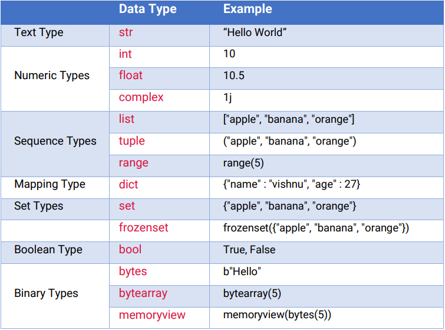
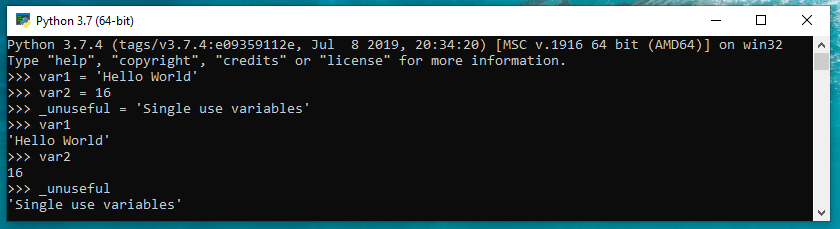

Python<br />Python在编程语言流行指数PYPL中已多次排名第一。<br />由于其代码可读性和更简单的语法，它被认为是有史以来最简单的语言。<br />NumPy、Pandas、TensorFlow等各种AI和机器学习库的丰富性，是Python核心需求之一。<br />如果是数据科学家或 AI/机器学习的初学者，那么Python是开始旅程的正确选择。<br />探索一些Python编程的基础知识，虽然简单但都很有用。

- 目录
   - 数据类型
   - 变量
   - 列表
   - 集合
   - 字典
   - 注释
   - 基本功能
   - 条件语句
   - 循环语句
   - 函数
   - 异常处理
   - 字符串操作
   - 正则表达式
<a name="S5WYo"></a>
## ▍1、数据类型
数据类型是可以存储在变量中的数据规范。解释器根据变量的类型为变量分配内存。<br />下面是Python中的各种数据类型。<br />
<a name="mJLqj"></a>
## ▍2、变量
变量是存放数据值的容器。<br />变量可以使用短名称（如x和y）或更具描述性的名称（age、carname、total_volume）。 <br />Python 变量命名规则：

- 变量名必须以字母或下划线字符开头
- 变量名称不能以数字开头
- 变量名只能包含字母数字字符和下划线（A-z、0-9和_）
- 变量名称区分大小写（age、Age和AGE是三个不同的变量）
```python
var1 = 'Hello World'
var2 = 16
_unuseful = 'Single use variables'
```
输出结果如下。<br />
<a name="EfURX"></a>
## ▍3、列表
列表（List）是一种有序和可更改的集合，允许重复的成员。<br />它可能不是同质的，可以创建一个包含不同数据类型（如整数、字符串和对象）的列表。‍
```python
>>> companies = ["apple","google","tcs","accenture"]
>>> print(companies)
['apple', 'google', 'tcs', 'accenture']
>>> companies.append("infosys")
>>> print(companies)
['apple', 'google', 'tcs', 'accenture', 'infosys']
>>> print(len(companies))
5
>>> print(companies[2])
tcs
>>> print(companies[-2])
accenture
>>> print(companies[1:])
['google', 'tcs', 'accenture', 'infosys']
>>> print(companies[:1])
['apple']
>>> print(companies[1:3])  
['google', 'tcs']
>>> companies.remove("infosys")
>>> print(companies)
["apple","google","tcs","accenture"]
>>> companies.pop()
>>> print(companies)
["apple","google","tcs"]
```
<a name="zmdoa"></a>
## ▍4、集合
集合（Set）是一个无序和无索引的集合，没有重复的成员。<br />对于从列表中删除重复条目非常有用。它还支持各种数学运算，例如并集、交集和差分。
```python
>>> set1 = {1,2,3,7,8,9,3,8,1}
>>> print(set1)
{1, 2, 3, 7, 8, 9}
>>> set1.add(5)
>>> set1.remove(9)
>>> print(set1)
{1, 2, 3, 5, 7, 8}
>>> set2 = {1,2,6,4,2} 
>>> print(set2)
{1, 2, 4, 6}
>>> print(set1.union(set2))        # set1 | set2
{1, 2, 3, 4, 5, 6, 7, 8}
>>> print(set1.intersection(set2)) # set1 & set2
{1, 2}
>>> print(set1.difference(set2))   # set1 - set2
{8, 3, 5, 7}
>>> print(set2.difference(set1))   # set2 - set1
{4, 6}
```
<a name="j5nLB"></a>
## ▍5、字典
字典是作为键值对的可变无序项集合。<br />与其他数据类型不同，它以【键:值】对格式保存数据，而不是存储单个数据。此功能使其成为映射JSON响应的最佳数据结构。
```python
>>> # example 1
>>> user = { 'username': 'Fan', 'age': 20, 'mail_id': 'codemaker2022@qq.com', 'phone': '18650886088' }
>>> print(user)
{'mail_id': 'codemaker2022@qq.com', 'age': 20, 'username': 'Fan', 'phone': '18650886088'}
>>> print(user['age'])
20
>>> for key in user.keys():
>>>     print(key)
mail_id
age
username
phone
>>> for value in user.values():
>>>  print(value)
codemaker2022@qq.com
20
Fan
18650886088
>>> for item in user.items():
>>>  print(item)
('mail_id', 'codemaker2022@qq.com')
('age', 20)
('username', 'Fan')
('phone', '18650886088')
>>> # example 2
>>> user = {
>>>     'username': "Fan",
>>>     'social_media': [
>>>         {
>>>             'name': "Linkedin",
>>>             'url': "https://www.linkedin.com/in/codemaker2022"
>>>         },
>>>         {
>>>             'name': "Github",
>>>             'url': "https://github.com/codemaker2022"
>>>         },
>>>         {
>>>             'name': "QQ",
>>>             'url': "https://codemaker2022.qq.com"
>>>         }
>>>     ],
>>>     'contact': [
>>>         {
>>>             'mail': [
>>>                     "mail.Fan@sina.com",
>>>                     "codemaker2022@qq.com"
>>>                 ],
>>>             'phone': "18650886088"
>>>         }
>>>     ]
>>> }
>>> print(user)
{'username': 'Fan', 'social_media': [{'url': 'https://www.linkedin.com/in/codemaker2022', 'name': 'Linkedin'}, {'url': 'https://github.com/codemaker2022', 'name': 'Github'}, {'url': 'https://codemaker2022.qq.com', 'name': 'QQ'}], 'contact': [{'phone': '18650886088', 'mail': ['mail.Fan@sina.com', 'codemaker2022@qq.com']}]}
>>> print(user['social_media'][0]['url'])
https://www.linkedin.com/in/codemaker2022
>>> print(user['contact']) 
[{'phone': '18650886088', 'mail': ['mail.Fan@sina.com', 'codemaker2022@qq.com']}]
```
<a name="avUOj"></a>
## ▍6、注释
单行注释，以井字符(`#`)开头，后面带有消息并在行尾结束。
```python
# 定义用户年龄
age = 27
dob = '16/12/1994' # 定义用户生日
```
多行注释，用特殊引号(`"""`)括起来，可以将消息放在多行中。
```python
"""
Python小常识
This is a multi line comment
"""
```
<a name="MM6rW"></a>
## ▍7、基本功能
`print()`函数在控制台中打印提供的消息。此外还可以提供文件或缓冲区输入作为在屏幕上打印的参数。
```python
print(object(s), sep=separator, end=end, file=file, flush=flush)

print("Hello World")               # prints Hello World 
print("Hello", "World")            # prints Hello World?
x = ("AA", "BB", "CC")
print(x)                           # prints ('AA', 'BB', 'CC')
print("Hello", "World", sep="---") # prints Hello---World
```
`input()`函数用于收集来自控制台的用户输入 。<br />这里需要注意，`input()`会把输入的任何内容转换为字符串。<br />因此，如果将年龄作为整数值提供，但`input()`方法将其作为字符串返回，此时就需要手动将其转换为整数。
```python
>>> name = input("Enter your name: ")
Enter your name: Codemaker
>>> print("Hello", name)
Hello Codemaker
```
`len()`可以查看对象的长度。如果输入一个字符串，则可以获取指定字符串中的字符数。
```python
>>> str1 = "Hello World"
>>> print("The length of the string  is ", len(str1))
The length of the string  is 11
```
`str()`用于将其他数据类型转换为字符串值。
```python
>>> str(123)
123
>>> str(3.14)
3.14
```
`int()`用于将字符串转换为整数。
```python
>>> int("123")
123
>>> int(3.14)
3
```
<a name="u7OAe"></a>
## ▍8、条件语句
条件语句是用于根据特定条件更改程序流程的代码块。这些语句只有在满足特定条件时才会执行。<br />在Python中，使用if，if-else，循环(for，while)作为条件语句根据某些条件来改变程序的流程。<br />if-else语句。
```python
>>> num = 5
>>> if (num > 0):
>>>    print("Positive integer")
>>> else:
>>>    print("Negative integer")
```
elif语句。
```python
>>> name = 'admin'
>>> if name == 'User1':
>>>     print('Only read access')
>>> elif name == 'admin':
>>>     print('Having read and write access')
>>> else:
>>>     print('Invalid user')
Having read and write access
```
<a name="EyBzc"></a>
## ▍9、循环语句
循环是一个条件语句，用于重复某些语句（在其主体中），直到满足某个条件。<br />在Python中，通常使用for和while循环。<br />for循环。
```python
>>> # loop through a list
>>> companies = ["apple", "google", "tcs"]
>>> for x in companies:
>>>     print(x)
apple
google
tcs
>>> # loop through string
>>> for x in "TCS":
>>>  print(x)
T
C
S
```
`range()`函数返回一个数字序列，它可以用作for循环控制。<br />它基本上需要三个参数，其中第二个和第三个是可选的。参数是开始值、停止值和步进数。步进数是每次迭代循环变量的增量值。
```python
>>> # loop with range() function
>>> for x in range(5):
>>>  print(x)
0
1
2
3
4
>>> for x in range(2, 5):
>>>  print(x)
2
3
4
>>> for x in range(2, 10, 3):
>>>  print(x)
2
5
8
```
还可以使用else关键字在循环结束时执行一些语句。<br />在循环结束时提供else语句以及循环结束时需要执行的语句。
```python
>>> for x in range(5):
>>>  print(x)
>>> else:
>>>  print("finished")
0
1
2
3
4
finished
```
while循环。
```python
>>> count = 0
>>> while (count < 5):
>>>  print(count)
>>>  count = count + 1
0
1
2
3
4
```
可以在while循环的末尾使用else，类似于for循环，当条件为假时执行一些语句。
```python
>>> count = 0
>>> while (count < 5):
>>>  print(count)
>>>  count = count + 1
>>> else:
>>>  print("Count is greater than 4")
0
1
2
3
4
Count is greater than 4
```
<a name="IjGKA"></a>
## ▍10、函数
函数是用于执行任务的可重用代码块。在代码中实现模块化并使代码可重用，这是非常有用的。
```python
>>> # This prints a passed string into this function
>>> def display(str):
>>>  print(str)
>>>  return
>>> display("Hello World")
Hello World
```
<a name="vsrZD"></a>
## ▍11、异常处理
即使语句在语法上是正确的，它也可能在执行时发生错误。这些类型的错误称为异常。可以使用异常处理机制来避免此类问题。 <br />在Python中，使用`try`,`except`和`finally`关键字在代码中实现异常处理。
```python
>>> def divider(num1, num2):
>>>     try:
>>>         return num1 / num2
>>>     except ZeroDivisionError as e:
>>>         print('Error: Invalid argument: {}'.format(e))
>>>     finally:
>>>         print("finished")
>>>
>>> print(divider(2,1))
>>> print(divider(2,0))
finished
2.0
Error: Invalid argument: division by zero
finished
None
```
<a name="lCLGI"></a>
## ▍12、字符串操作
字符串是用单引号或双引号(',")括起来的字符集合。<br />可以使用内置方法对字符串执行各种操作，如连接、切片、修剪、反转、大小写更改和格式化，如`split()`、`lower()`、`upper()`、`endswith()`、`join()`和`ljust()`、`rjust()`、`format()`。
```python
>>> msg = 'Hello World'
>>> print(msg)
Hello World
>>> print(msg[1])
e
>>> print(msg[-1])
d
>>> print(msg[:1])
H
>>> print(msg[1:])
ello World
>>> print(msg[:-1])
Hello Worl
>>> print(msg[::-1])
dlroW olleH
>>> print(msg[1:5])
ello
>>> print(msg.upper())
HELLO WORLD
>>> print(msg.lower())
hello world
>>> print(msg.startswith('Hello'))
True
>>> print(msg.endswith('World'))
True
>>> print(', '.join(['Hello', 'World', '2022']))
Hello, World, 2022
>>> print(' '.join(['Hello', 'World', '2022']))
Hello World 2022
>>> print("Hello World 2022".split())
['Hello', 'World', '2022']
>>> print("Hello World 2022".rjust(25, '-'))
---------Hello World 2022
>>> print("Hello World 2022".ljust(25, '*'))
Hello World 2022*********
>>> print("Hello World 2022".center(25, '#'))
#####Hello World 2022####
>>> name = "Codemaker"
>>> print("Hello %s" % name)
Hello Codemaker
>>> print("Hello {}".format(name))
Hello Codemaker
>>> print("Hello {0}{1}".format(name, "2022"))
Hello Codemaker2022
```
<a name="I6EmV"></a>
## ▍13、正则表达式

- 导入regex模块，`import re`。 
- `re.compile()`使用该函数创建一个Regex对象。 
- 将搜索字符串传递给`search()`方法。 
- 调用`group()`方法返回匹配的文本。
```python
>>> import re
>>> phone_num_regex = re.compile(r'\d\d\d-\d\d\d-\d\d\d\d')
>>> mob = phone_num_regex.search('My number is 996-190-7453.')
>>> print('Phone number found: {}'.format(mob.group()))
Phone number found: 996-190-7453
>>> phone_num_regex = re.compile(r'^\d+$')
>>> is_valid = phone_num_regex.search('+919961907453.') is None
>>> print(is_valid)
True
>>> at_regex = re.compile(r'.at')
>>> strs = at_regex.findall('The cat in the hat sat on the mat.')
>>> print(strs)
['cat', 'hat', 'sat', 'mat']
```
