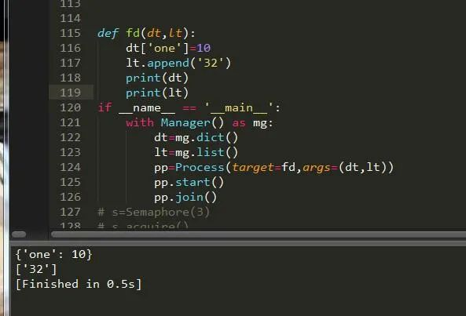

Python 进程
<a name="CSati"></a>
## 前言
进程，它是系统某个运行程序的载体，这个程序可以有单个或者多个进程，一般来说，进程是通过系统CPU 内核数来分配并设置的，可以来看下系统中的进程：<br />
<a name="zlSKM"></a>
## 基本用法
进程能干什么，这是要深思熟虑的事情。一个程序运行会创建进程，所以程序在创建这些进程的时候，为了让它们更能有条不紊的工作，肯定也加入了线程。<br />那么一条进程里面就会有多个线程协同作战，但是进程不可以创建过多，不然会消耗资源，除非开发的是一个大型的系统。那么现在就来创建一个进程吧。
<a name="S99Nb"></a>
### 1、创建进程
在创建进程之前，先导入进程的模块，代码如下：
```python
import multiprocess as m
m.Process(target，args)
```
其实这种写法是不对的，就好比bs4中的`BeautifulSoup`，想通过先导入bs4，然后再引入`BeautifulSoup`是行不通的，必须这样：
```python
from multiprocessing import Process
Process(group, target, args, kwargs, name)
```
`group`：用户组<br />`target`：调用函数<br />`args`：参数元组<br />`kwargs`：参数字典<br />`name`：子进程名称<br />可以看出进程和线程的用法基本差不多，只是名称功能不同而已。而且还有很多其它优秀的方法：
```python
# 返回当前进程存活的子进程的列表。调用该方法有“等待”已经结束的进程的副作用。
multiprocessing.active_children()
# 返回系统的CPU数量。
multiprocessing.cpu_count()
```
<a name="PSKWp"></a>
### 2、创建单个进程
由上述参数可知函数的返回值，基本与线程无差异化。
```python

#启动进程，调用进程中的run()方法。
start()

#进程活动的方法
run()

#强制终止进程，不会进行任何清理操作。如果终止前创建了子进程，那么该子进程在其强制结束后变为僵尸进程；如果该进程还保存了一个锁，那么也将不会被释放，进而导致死锁。
terminate()

#判断某进程是否存活，存活返回True，否则False。
is_alive()

#主线程等待子线程终止。timeout为可选择超时时间；需要强调的是：p.join只能join住start开启的进程，而不能join住run开启的进程。
join([timeout])

#设置进程为后台守护进程；当该进程的父进程终止时，该进程也随之终止，并且该进程不能创建子进程，设置该属性必须在start()之前
daemon

#进程名称。
name

#进程pid，在start后才能产生
pid

#子进程的退出代码。如果进程尚未终止，这将是 None，负值-N表示子进程被信号N终止。
exitcode

#进程身份验证，默认是os.urandom()随机生成的字符串。校验网进程连接是否正确
authkey

#系统对象的数字句柄，当进程结束时将变为 "ready" 。
sentinel

#杀进程
kill()

#关闭进程
close()
```
请注意：创建进程务必将它加入如下语句中：
```python
if __name__ == '__main__':
```
<br />这样就实现了一个关于进程的程序了。另外也可以通过继承进程类来实现：<br /><br />可以说每创建一个进程它就会有一个ID来标志它，下面情况：<br />
<a name="INljw"></a>
### 3、创建多个进程
单个进程往往都是不够用的，所有需要创建一个多进程，多进程创建方法也很简单，加一层循环即可：<br /><br />这样就轻松创建了多进程的任务，速度比以往就要更快了。
<a name="SULil"></a>
### 4、进程池
进程池的设计之初就是为了方便更有效的利用资源，避免浪费，如果任务量大就多个核一起帮忙，如果少就只开一两个核，下面来看看实现过程：<br />首先导入包:
```python
from multiprocessing import Pool
import multiprocessing as m
```
进程池的安装包为Pool，然后来看下它的CPU内核数：
```python
num=m.cpu_count()#CPU内核数
```
紧接着在来创建进程池：
```python
pool=multiprocessing.Pool(num)
```
进程池中也有很多方法供使用：
```python

apply(func，args，kwargs)                 同步执行（串行） 阻塞

apply_async(func，args，kwargs)           异步执行（并行） 非阻塞

terminate()            强制终止进程，不在处理未完成的任务。

join()     主进程阻塞，等待子进程的退出。必须在close或terminate()之后使用

close()            等待所有进程结束后，才关闭进程池

map(func，iterable，chunksize=int) map函数的并行版本，保持阻塞直到获得结果

#返回一个可用于获取结果的对象，回调函数应该立即执行完成，否则会阻塞负责处理结果的线程
map_async(func，iterable，chunksize，callback，error_callback)

imap(func，iterable，chunksize) map的延迟执行版本

#和imap() 相同，只不过通过迭代器返回的结果是任意的
imap_unordered(func，iterable，chunksize)

#和 map() 类似，不过 iterable 中的每一项会被解包再作为函数参数。
starmap(func，iterable，chunksize)
```
为此可以创建同步和异步的程序，如果对这对于爬虫来说是很不错的选择，小点的爬虫同步就好，大的爬虫异步效果更佳，很多人不了解异步和同步，其实同步异步就是串行和并行的意思串行和并行简单点说就是串联和并联。下面通过实例一起来看一下：
<a name="gxaPP"></a>
#### 一、串行

<a name="U4YNS"></a>
#### 二、并行
<br />可以看到，仅仅只是一个参数的变化而已，其它的都是大同小异，获取到了当前进程的pid，然后把它打印出来了。

<a name="mZuFX"></a>
### 5、锁
虽然异步编程多进程带来了便利，但是进程启动后是不可控的，需要将它控制住，让它干有意义的事，这个时候需要给它加锁，和线程一样都是lock：<br />首先导入进程锁的模块：
```python
from multiprocessing import Lock
```
然后来创建一个关于锁的程序：<br /><br />可以看到，加锁的过程还是比较顺利的，跟多线程一样简单，但是相对来说速度会慢一点。既然有Lock，那么势必就有RLock了，在python 中，进程和线程的很多用法一致，锁就是。可以把它改为RLock，下面便是可重入锁，也就是可以递归:
```python
import time
lock1=RLock()
lock2=RLock()
s=time.time()
def jc(num):
    lock1.acquire()
    lock2.acquire()
    print('start')
    print(m.current_process().pid，'run----'，str(num))
    lock1.release()
    lock2.release()
    print('end')
if __name__ == '__main__':
    aa=[]
    for y in range(12):
        pp=Process(target=jc，args=(y，))
        pp.start()
        aa.append(pp)
    for x in aa:
        x.join()
    e=time.time()
    print(e-s)
```
<a name="rEQiD"></a>
### 6、进程间通信
<a name="ecNVq"></a>
#### 一、Event
进程间用于通信，方法和线程的一模一样，主要说其它的进程间通信方式，下面请看：
```python
import time
e=Event()
def main(num):
    while True:
        if num<5:
            e.clear()   #清空信号标志
            print('清空')
        if num>=5:
            e.wait(timeout=1) #等待信号标志为真
            e.set()
            print('启动')
            
        if num==10:
            e.wait(timeout=3)
            e.clear()
            print('退出')
            break
        num+=1
        time.sleep(2)
if __name__ == '__main__':
    for y in range(10):
        pp=Process(target=main，args=(y，))
        pp.start()
        pp.join()
```
<a name="ojm9A"></a>
#### 二、管道传递消息
管道模块初始化后返回两个参数，一个为发送者，一个为接收者，它有个参数可以设置模式为全双工或者半双工，全双工收发一体，半双工只收或者只发，先了解下它的方法：
```python
p1，p2=m.Pipe(duplex=bool) #设置是否全双工，返回两个连接对象
```
```python
p1.send()  #发送
p2.recv()  #接收
p1.close()  #关闭连接
p1.fileno() #返回连接使用的整数文件描述符
p1.poll([timeout]) #如果连接上的数据可用，返回True，timeout指定等待的最长时限。
p2.recv_bytes([maxlength]) #接收最大字节数
p1.send_bytes([maxlength]) #发送最大字节数
#接收一条完整的字节消息，并把它保存在buffer对象中，offset指定缓冲区中放置消息处的字节位移.
p2.recv_bytes_into(buffer [， offset])
```
<br />先收后发，其实完全可以使用锁来控制它的首发，可以让它一边收一边发。
<a name="w6vpO"></a>
#### 三、队列
队列与其它不同的是它采取插入和删除的方法，来看下：
```python
def fd(a):
    for y in range(10):
        a.put(y)  #插入数据
        print('插入：'，str(y))
def df(b):
    while True:
        aa=b.get(True) #删除数据
        print('释放：'，str(aa))
if __name__ == '__main__':
    q=Queue()
    ff=Process(target=fd，args=(q，))
    dd=Process(target=df，args=(q，))
    ff.start() #开始运行
    dd.start()
    dd.terminate() #关闭
    ff.join()
```
以上讲的队列主要用于多进程的队列，还有一个进程池的队列，它在Manager模块中。
<a name="mZMLr"></a>
### 7、信号量
与线程中完全一样，这里不在赘述，看下例：
```python
s=Semaphore(3)
s.acquire()
print(s.get_value())
s.release()
print(s.get_value())
print(s.get_value())
s.release()
print(s.get_value())
s.release()
```
output：
```python
2
3
3
4
```
<a name="IbrmO"></a>
### 8、数据共享
共享数据类型可以直接通过进程模块来设置：<br />数值型：`m.Value()`  <br />数组性：`m.Array()` <br />字典型：`m.dict()`  <br />列表型：`m.list()`<br />也可以通过进程的Manager模块来实现：
```python
Manager().dict()
Manager.list()
```
下面就来举例说明下吧：<br /><br />可以看到成功的将数据添加了进去，形成了数据的共享。
