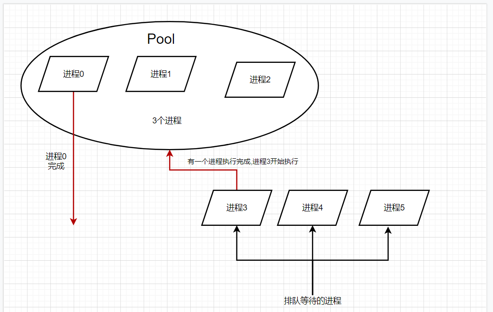
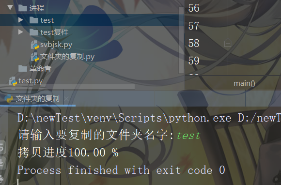

Python 多进程
<a name="VoP9g"></a>
## 一、进程介绍
进程：正在执行的程序，由程序、数据和进程控制块组成，是正在执行的程序，程序的一次执行过程，是资源调度的基本单位。<br />程序：没有执行的代码，是一个静态的。
<a name="zcjsj"></a>
## 二、线程和进程之间的对比
进程：能够完成多任务，如一台电脑上可以同时运行多个 QQ<br />线程：能够完成多任务，如一个 QQ 中的多个聊天窗口<br />根本区别：进程是操作系统资源分配的基本单位，而线程是任务调度和执行的基本单位.
<a name="UAaVn"></a>
### 使用多进程的优势:
<a name="SDf0p"></a>
#### 1、拥有独立GIL
首先由于进程中 GIL 的存在，Python 中的多线程并不能很好地发挥多核优势，一个进程中的多个线程，在同 一时刻只能有一个线程运行。而对于多进程来说，每个进程都有属于自己的 GIL，所以，在多核处理器下，多进程的运行是不会受 GIL的影响的。因此，多进 程能更好地发挥多核的优势。
<a name="pKryQ"></a>
#### 2、效率高
当然，对于爬虫这种 IO 密集型任务来说，多线程和多进程影响差别并不大。对于计算密集型任务来说，Python 的多进程相比多线 程，其多核运行效率会有成倍的提升。<br />
<a name="gusun"></a>
## 三、Python 实现多进程
先用一个实例来感受一下：
<a name="pDij6"></a>
### 1、使用 process 类
```python
import multiprocessing 
def process(index): 
    print(f'Process: {index}') 
if __name__ == '__main__': 
    for i in range(5): 
        p = multiprocessing.Process(target=process, args=(i,)) 
        p.start() 
```
这是一个实现多进程最基础的方式：通过创建 `Process` 来新建一个子进程，其中 `target` 参数传入方法名，`args` 是方法的参数，是以 元组的形式传入，其和被调用的方法 `process` 的参数是一一对应的。<br />注意：这里 `args` 必须要是一个元组，如果只有一个参数，那也要在元组第一个元素后面加一个逗号，如果没有逗号则 和单个元素本身没有区别，无法构成元组，导致参数传递出现问题。创建完进程之后，通过调用 `start` 方法即可启动进程了。<br />运行结果如下：
```
Process: 0 
Process: 1 
Process: 2 
Process: 3 
Process: 4 
```
可以看到，运行了 5 个子进程，每个进程都调用了 `process` 方法。`process` 方法的 `index` 参数通过 Process 的 args 传入，分别是 0~4 这 5 个序号，最后打印出来，5 个子进程运行结束。
<a name="E5dmD"></a>
### 2、继承 process 类
```python
from multiprocessing import Process
import time

class MyProcess(Process):
    def __init__(self,loop):
        Process.__init__(self)
        self.loop = loop


    def run(self):
        for count in range(self.loop):
            time.sleep(1)
            print(f'Pid:{self.pid} LoopCount: {count}')
if __name__ == '__main__':
    for i in range(2,5):
        p = MyProcess(i)
        p.start()
```
首先声明了一个构造方法，这个方法接收一个 loop 参数，代表循环次数，并将其设置为全局变量。在 `run`方法中，又使用这 个 loop 变量循环了 loop 次并打印了当前的进程号和循环次数。<br />在调用时，用 range 方法得到了 2、3、4 三个数字，并把它们分别初始化了 MyProcess 进程，然后调用 start 方法将进程启动起 来。<br />注意：这里进程的执行逻辑需要在 run 方法中实现，启动进程需要调用 `start` 方法，调用之后 `run` 方法便会执行。<br />运行结果如下：
```
Pid:12976 LoopCount: 0
Pid:15012 LoopCount: 0
Pid:11976 LoopCount: 0
Pid:12976 LoopCount: 1
Pid:15012 LoopCount: 1
Pid:11976 LoopCount: 1
Pid:15012 LoopCount: 2
Pid:11976 LoopCount: 2
Pid:11976 LoopCount: 3
```
注意，这里的进程 pid 代表进程号，不同机器、不同时刻运行结果可能不同。
<a name="wy44o"></a>
## 四、进程之间的通信
<a name="vVkEP"></a>
### 1、Queue-队列 先进先出
```python
from multiprocessing import Queue
import multiprocessing

def download(p): # 下载数据
    lst = [11,22,33,44]
    for item in lst:
        p.put(item)
    print('数据已经下载成功....')


def savedata(p):
    lst = []
    while True:
        data = p.get()
        lst.append(data)
        if p.empty():
            break
    print(lst)

def main():
    p1 = Queue()

    t1 = multiprocessing.Process(target=download,args=(p1,))
    t2 = multiprocessing.Process(target=savedata,args=(p1,))

    t1.start()
    t2.start()


if __name__ == '__main__':
    main()
```
```
数据已经下载成功....
[11, 22, 33, 44]
```
<a name="twcPo"></a>
### 2、共享全局变量不适用于多进程编程
```python
import multiprocessing

a = 1


def demo1():
    global a
    a += 1


def demo2():
    print(a)

def main():
    t1 = multiprocessing.Process(target=demo1)
    t2 = multiprocessing.Process(target=demo2)

    t1.start()
    t2.start()

if __name__ == '__main__':
    main()
```
运行结果:
```
1
```
有结果可知：全局变量不共享；
<a name="R16xx"></a>
## 五、进程池之间的通信
<a name="oJHwM"></a>
### 1、进程池引入
当需要创建的子进程数量不多时，可以直接利用 `multiprocessing` 中的 `Process` 动态生成多个进程，但是如果是上百甚至上千个目标，手动的去创建的进程的工作量巨大，此时就可以用到 `multiprocessing` 模块提供的 `Pool` 方法。
```python
from multiprocessing import Pool
import os,time,random

def worker(a):
    t_start = time.time()
    print('%s开始执行,进程号为%d'%(a,os.getpid()))

    time.sleep(random.random()*2)
    t_stop = time.time()
    print(a,"执行完成,耗时%0.2f"%(t_stop-t_start))


if __name__ == '__main__':
    po = Pool(3)        # 定义一个进程池
    for i in range(0,10):
        po.apply_async(worker,(i,))    # 向进程池中添加worker的任务

    print("--start--")
    po.close()      

    po.join()       
    print("--end--")
```
运行结果:
```
--start--
0开始执行,进程号为6664
1开始执行,进程号为4772
2开始执行,进程号为13256
0 执行完成,耗时0.18
3开始执行,进程号为6664
2 执行完成,耗时0.16
4开始执行,进程号为13256
1 执行完成,耗时0.67
5开始执行,进程号为4772
4 执行完成,耗时0.87
6开始执行,进程号为13256
3 执行完成,耗时1.59
7开始执行,进程号为6664
5 执行完成,耗时1.15
8开始执行,进程号为4772
7 执行完成,耗时0.40
9开始执行,进程号为6664
6 执行完成,耗时1.80
8 执行完成,耗时1.49
9 执行完成,耗时1.36
--end--
```
一个进程池只能容纳 3 个进程，执行完成才能添加新的任务，在不断的打开与释放的过程中循环往复。<br />
<a name="GXqsg"></a>
## 六、案例:文件批量复制
操作思路:

- 获取要复制文件夹的名字
- 创建一个新的文件夹
- 获取文件夹里面所有待复制的文件名
- 创建进程池
- 向进程池添加任务

代码如下:<br />导包
```python
import multiprocessing
import os
import time

定制文件复制函数
def copy_file(Q,oldfolderName,newfolderName,file_name):
    # 文件复制,不需要返回
    time.sleep(0.5)
    # print('\r从%s文件夹复制到%s文件夹的%s文件'%(oldfolderName,newfolderName,file_name),end='')

    old_file = open(oldfolderName + '/' + file_name,'rb') # 待复制文件
    content = old_file.read()
    old_file.close()

    new_file = open(newfolderName + '/' + file_name,'wb') # 复制出的新文件
    new_file.write(content)
    new_file.close()

    Q.put(file_name) # 向Q队列中添加文件
```
定义主函数
```python
def main():
    oldfolderName = input('请输入要复制的文件夹名字:') # 步骤1获取要复制文件夹的名字(可以手动创建,也可以通过代码创建,这里手动创建)
    newfolderName = oldfolderName + '复件'
    # 步骤二 创建一个新的文件夹
    if not os.path.exists(newfolderName):
        os.mkdir(newfolderName)

    filenames = os.listdir(oldfolderName) # 3.获取文件夹里面所有待复制的文件名
    # print(filenames)

    pool = multiprocessing.Pool(5) # 4.创建进程池

    Q = multiprocessing.Manager().Queue() # 创建队列,进行通信
    for file_name in filenames:
        pool.apply_async(copy_file,args=(Q,oldfolderName,newfolderName,file_name)) # 5.向进程池添加任务
      po.close()

    copy_file_num = 0
    file_count = len(filenames)
    # 不知道什么时候完成,所以定义一个死循环
    while True:
        file_name = Q.get()
        copy_file_num += 1
        time.sleep(0.2)
        print('\r拷贝进度%.2f %%'%(copy_file_num  * 100/file_count),end='') # 做一个拷贝进度条

        if copy_file_num >= file_count:
            break
```
程序运行
```python
if __name__ == '__main__':
    main()
```
运行结果如下图所示：<br />
<a name="D5QrY"></a>
### 运行前后文件目录结构对比
<a name="r4PtJ"></a>
#### 运行前

<a name="vcBZi"></a>
#### 运行后

