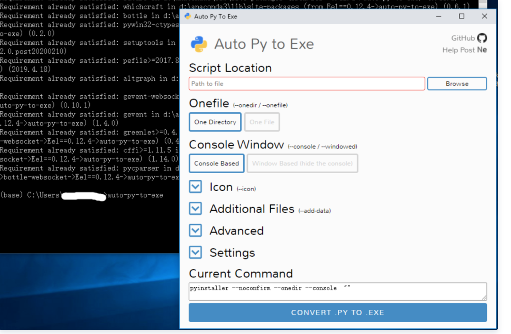
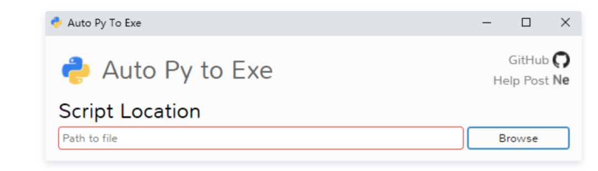
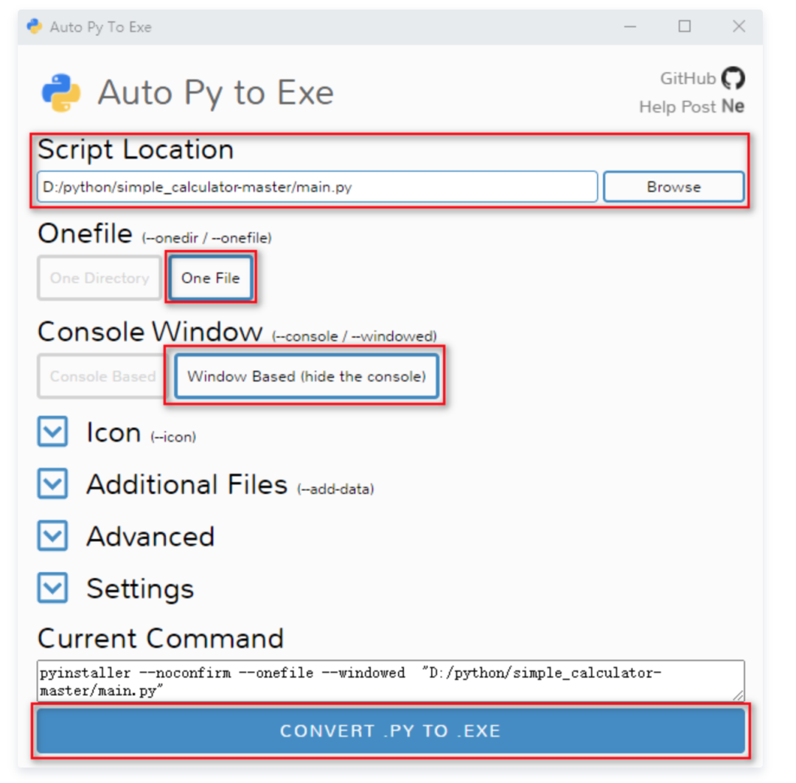
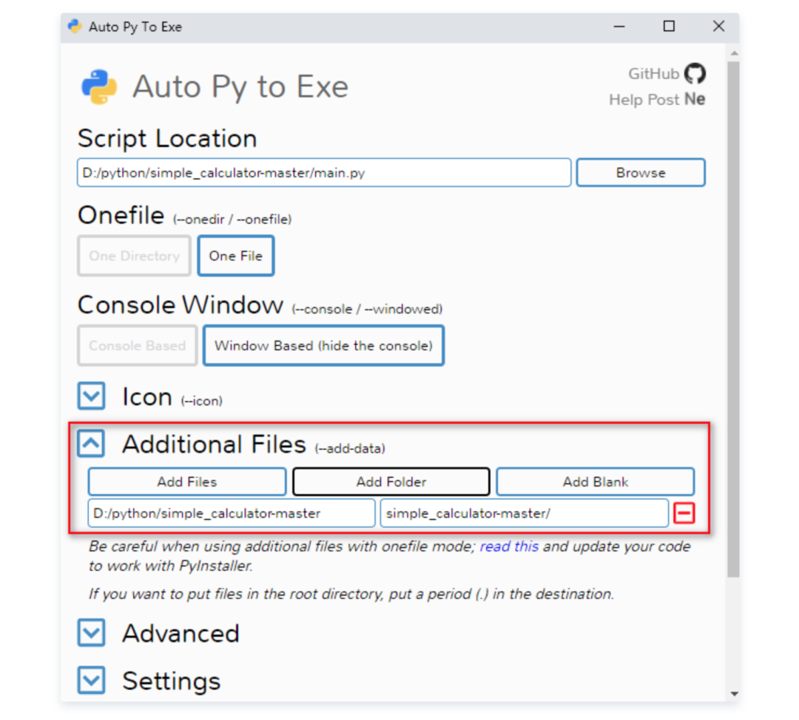
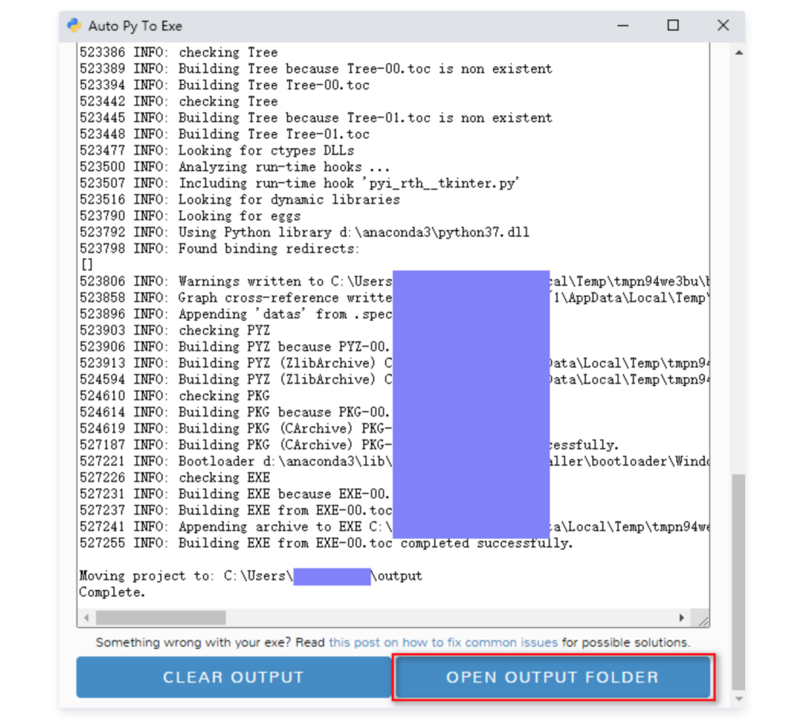
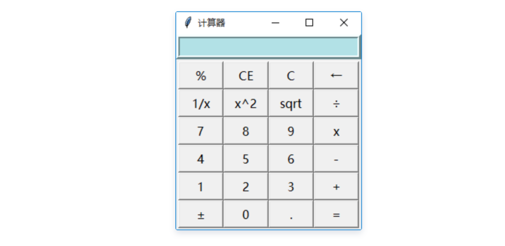

## 1、什么是auto-py-to-exe
auto-py-to-exe 是一个用于将Python程序打包成可执行文件的图形化工具。本文就是主要介绍如何使用 auto-py-to-exe 完成 Python 程序打包。auto-py-to-exe 基于 pyinstaller ，相比于 pyinstaller ，它多了 GUI 界面，用起来更为简单方便

## 2、安装 auto-py-to-exe
首先要确保 Python 环境要大于或等于 2.7 然后在 cmd 里面输入：`pip install auto-py-to-exe` ，输入完成之后，pip 就会安装 auto-py-to-exe 包了。安装完成之后，就可以在 cmd 输入：auto-py-to-exe，来启动 auto-py-to-exe 程序了。  出现上述图片，auto-py-to-exe 就安装成功了。

## 3、auto-py-to-exe 部分选项介绍
在使用 auto-py-to-exe 打包 Python 程序的时候，有许多配置选项需要去指定，能正确知道这些选项的作用是十分重要的。下面介绍其中一些重要的选项。

### (1) Script Location
Script Location 主要是指定要打包的 Python 文件 

### (2) Onefile
Onefile 下有两个选项，分别是：One Directory 和 One File

- 如果选择 One Directory ，那么程序打包完成后会是一个文件夹的形式展现
- 如果选择 One File ，那么程序打包完成后就一个 .exe 文件

### (3) Console Window
Console Window 主要设置打包程序运行时，是否出现控制台

- Console Based：当打包的程序运行时会显示一个控制台界面
- Window Based (hide the console)：会隐藏控制台界面，主要用于带有 GUI 的 Python 程序打包

### (4) Icon
用于指定打包程序的图标

## 4、auto-py-to-exe 实战
本节主要以一个计算器程序来介绍如何使用 auto-py-to-exe 来打包程序。 auto-py-to-exe 打包程序主要分 3 部分，分别是：

- 打开 auto-py-to-exe
- 配置打包选项
- 查看打包效果

### 1、打开 auto-py-to-exe
打开 cmd ，输入：auto-py-to-exe 打开 auto-py-to-exe 后，就要进行配置选择了。

### 2、配置打包选项
计算器程序，大家可以到 GitHub 去下载，地址是：[https://github.com/pythonprogrammingbook/simple_calculator](https://github.com/pythonprogrammingbook/simple_calculator) 在打包时，要进行的配置主要有：

- Script Location
- Onefile
- Console Window

Script Location 选择程序的主程序，在计算器项目里，选择的是 main.py Onefile 选择 One File ，因为一个文件看起来比较简洁 由于计算器项目带有 GUI，所以 Console Window 选择 Window Based (hide the console) Icon 选择一个 ico 文件，此处不是必须操作，可以不设置  如果程序里面有自己的模块，必须把模块的目录添加到 Additional Files 里面。不然会出现 Failed to execute script XXX 错误  在计算器程序里面所有的模块都在 calculation 目录下，所有需要将 calculation 路径添加到 Additional Files 里面  配置完成之后点击 CONVERT .PY TO .EXE 按钮 这样就完成一个计算器项目的打包。

### 3、查看打包效果 
程序完成打包后，可以点击 OPEN OUTPUT FOLDER 按钮，然后就会打开打包文件的路径。  在打包文件目录中，可以看到一个 main.exe 文件，这就是打包文件。 点击 main.exe ，就可以看到一个计算器程序了。  至此，打包工作圆满完成。

## 5、总结一下
主要介绍了如何使用 auto-py-to-exe 来对 Python 程序进行打包。但只是介绍最简单的 Python 程序打包，如果想对复杂的程序进行打包，上面的配置肯定是不行的。 如果想更加深入的了解 auto-py-to-exe ，建议大家去研究一下 pyinstaller 。auto-py-to-exe 是基于 pyinstaller 的，研究 pyinstaller ，将会对深入使用 auto-py-to-exe 有非常明显的效果。 想更加深入了解 pyinstaller 可以去阅读官方文档。
