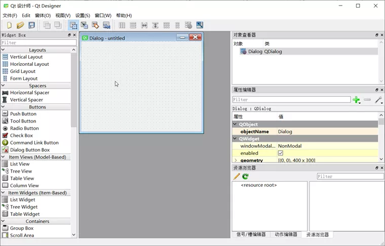
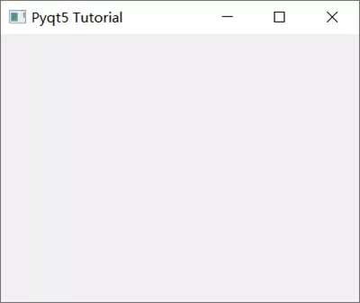
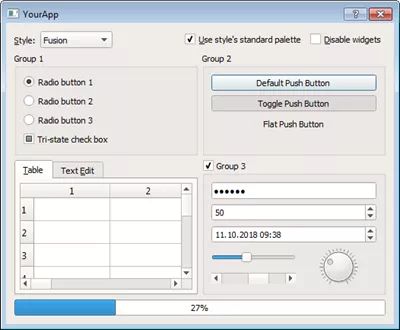
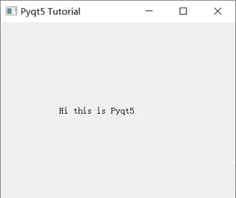
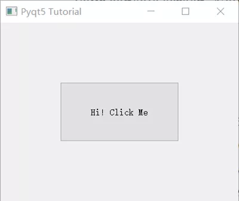
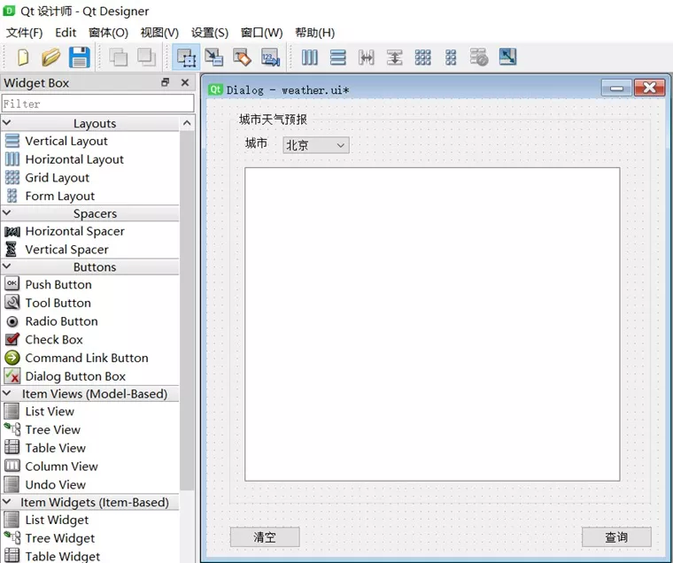
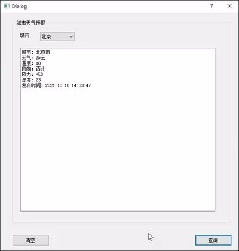
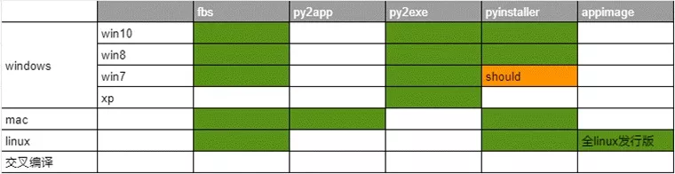
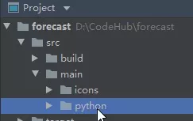

Python GUI PyQt5
<a name="dAWFr"></a>
## 常见GUI框架

- [PyQt5](https://riverbankcomputing.com/software/pyqt/intro)：[Qt](https://www.qt.io/)是一个跨平台的 C++图形用户界面库。QT一度被诺基亚拥，后出售给芬兰的软件公司Digia Oyj。PyQt5是基于Digia公司Qt5的Python接口，由一组Python模块构成。PyQt5本身拥有超过620个类和6000函数及方法。在可以运行于多个平台，包括：Unix，Windows，and Mac OS。
- [Pyside6](https://doc.qt.io/qtforpython/index.html)：Pyside是QT公司官方提供的Python包，上一版本为Pyside2，对应的是QT5，最新版命名规则进行了调整，更改为Pyside6，对应的是QT6版本。由于官方出品的比较看好，缺点是发布比较晚，网上的资料没有PyQt5多。
- [Tkinter](https://wiki.python.org/moin/TkInter)：Python内置的GUI框架，使用TCL实现，Python中内嵌了TCL解释器，使用它的时候不用安装额外的扩展包，直接import，跨平台。不足之处在于UI布局全靠代码实现，只有15种常用部件，显示效果简陋。
- [PySimpleGUI](https://github.com/PySimpleGUI/PySimpleGUI)：PySimpleGUI 是 Tkinter 一层包装。使用 PySimpleGUI 实现自定义 GUI 所需的代码量要比使用 Tkinter 直接编写相同的 GUI 要少得多。
- [WxPython](https://wxpython.org/)：wxPython是Python语言对流行的wxWidgets跨平台GUI工具库的绑定。用得比较广泛，跨平台，C++编写，文档少，用户可能就需要根据编程内容对不同平台中的GUI代码做一些调整。遇到问题不好解决，代码布局控件，不直观。
- [Wax](https://pypi.org/project/wax/)：基于wxPython ，为克服wxPython的问题而制作的一个包。
- [Kivy](https://kivy.org/#home)：主要针对多点触控程序，智能手机平板等，也可以在没有触屏功能的系统上，全平台支持（Windows, Linux，Mac OS X，Android and iOS.）使用Python和cython编写，中文支持差，需要自己下载中文库并且制定路径。
- [BeeWare](https://beeware.org/)：Write once. Deploy everywhere.需要与Kivy配合使用。
- [Toga](https://github.com/pybee/toga)：一个使用Python开发原生APP的GUI工具包。Toga由一个具有共享接口的基础组件库组成，以简化与平台无关的GUI开发。Toga适用于Mac OS、Windows、Linux（GTK）以及Android和iOS等移动平台。
- [Eel](https://github.com/ChrisKnott/Eel)：一个轻量的 Python 库，用于制作简单的类似于 Electron（但是比它更轻量） 的离线 HTML/JS GUI 应用程序，并具有对 Python 功能（capabilities）和库的完全访问权限。
- [Flexx](https://github.com/zoofIO/flexx)：一个纯 Python 工具包，用来创建图形化界面应用程序。其使用 Web 技术进行界面的渲染。可以用 Flexx 来创建桌面应用，同时也可以导出一个应用到独立的 HTML 文档。因为使用纯 Python 开发，所以 Flexx 是跨平台的。只需要有 Python 和浏览器就可以运行。
- [pywebview](https://github.com/r0x0r/pywebview/)是围绕 webview 组件的轻量型跨平台包装器（wrapper），它允许在其自己的本机 GUI 窗口中显示 HTML 内容。它使您可以在桌面应用程序中使用 Web 技术，同时尽最大可能隐藏使用浏览器构建GUI的事实。
- [enaml](https://github.com/nucleic/enaml)：一种能够用最小的努力就可以实现高质量GUI界面的的Python框架，也是一种独特的编程语言。enaml将声明性语言与基于约束的布局系统结合在一起，使用户可以轻松地定义灵活布局的UI。enaml应用程序可以在任何支持Python和Qt的平台上运行。

个人想法：太多学不完，先学PyQt5，原因是资料多，学有余力再学pyside6，最后看下PySimpleGUI，看能否解决一些简单问题。
<a name="RbBaP"></a>
## PyQt5简介
PyQt是Qt框架的Python语言实现，由Riverbank Computing开发，是最强大的GUI库之一。PyQt提供了一个设计良好的窗口控件集合，每一个PyQt控件都对应一个Qt控件，因此PyQt的API接口与Qt的API接口很接近，但PyQt不再使用QMake系统和Q_OBJECT宏。<br />PyQt5提供GPL版和商业版证书，自由开发者可以使用免费的GPL许可，如果需要将PyQt用于商业应用，则必须购买商业许可。<br />PyQt5特性如下：

- 基于高性能的Qt的GUI控件集。
- 能够跨平台运行在Linux、Window和Mac OS系统上。
- 使用信号槽机制进行通信。
- 对Qt库进行完全封装。
- 可以使用成熟的IDE进行界面设计，并自动生成可执行的Python代码。
- 提供一整套种类齐全的窗口控件。

PyQt5是由一系列Python模块组成，有超过620个类，6000个函数和方法，主要模块如下：

- QtCore：包含了核心的非 GUI 的功能。主要和时间、文件与文件夹、各种数据、流、URLs、mime 类文件、进程与线程一起使用。
- QtGui：包含了窗口系统、事件处理、2D 图像、基本绘画、字体和文字类。
- QtWidgets：包含了一系列创建桌面应用的 UI 元素。
- QtMultimedia：包含了处理多媒体的内容和调用摄像头 API 的类。
- QtBluetooth：包含了查找和连接蓝牙的类。
- QtNetwork：包含了网络编程的类，这些工具能让 TCP/IP 和 UDP 开发变得更加方便和可靠。
- QtPositioning：包含了定位的类，可以使用卫星、WiFi 甚至文本。
- Enginio：包含了通过客户端进入和管理 Qt Cloud 的类。
- QtWebSockets：包含了 WebSocket 协议的类。
- QtWebKit：包含了一个基 WebKit2 的 web 浏览器。
- QtWebKitWidgets：包含了基于 QtWidgets 的 WebKit1 的类。
- QtXml：包含了处理 xml 的类，提供了 SAX 和 DOM API 的工具。
- QtSvg：提供了显示 SVG 内容的类，Scalable Vector Graphics (SVG) 是一种是一种基于可扩展标记语言 (XML)，用于描述二维矢量图形的图形格式（这句话来自于维基百科）。
- QtSql：提供了处理数据库的工具。
- QtTest：提供了测试 PyQt5 应用的工具。
<a name="nPQBn"></a>
## PyQt5的安装
由于后期要使用fbs进行打包，fbs对Python 3.7以后的版本可能存在兼容问题，所以选择了Python 3.6.8进行了整个环境的搭建。主要内容为：Python + PyCharm + PyQt5
<a name="jqiOs"></a>
### 安装PyQt5
```bash
pip install pyqt5
pip install pyqt5-tools
```
其中pyqt5-tools为Qt Designer拖拽式的界面设计工具。安装过程中可能会报如下错误：
```bash
qt5-tools 5.15.2.1.2 has requirement click~=7.0, but you'll have click 8.0.1 which is incompatible.
```
解决方案：
```bash
pip install click~=7.0
```
<a name="rapOk"></a>
### Qt Designer的配置
Qt Designer 是通过拖拽的方式放置控件，并实时查看控件效果进行快速UI设计。<br /><br />整个画面的构成：

- 左侧的“Widget Box”就是各种可以自由拖动的组件
- 中间的“MainWindow – untitled”窗体就是画布
- 右上方的”Object Inspector”可以查看当前ui的结构
- 右侧中部的”Property Editor”可以设置当前选中组件的属性
- 右下方的”Resource Browser”可以添加各种素材，比如图片，背景等等

最终生成.ui文件（实质上是XML格式的文件），可直接使用，也可以通过pyuic5工具转换成.py文件。
<a name="VNuTf"></a>
#### QtDisigner配置
在Pycharm中，依次打开 File – Settings – Tools – External Tools，点击 + Create Tool，配置如下：
```python
Name: QtDisigner
Program : D:\Program Files\Python36\Lib\site-packages\qt5_applications\Qt\bin\designer.exe # 请根据实际修改
Working directory: $FileDir$
```
<a name="Un5Zi"></a>
#### PyUIC配置
PyUIC主要是把Qt Designer生成的.ui文件换成.py文件。<br />在Pycharm中，依次打开 File – Settings – Tools – External Tools，点击 + Create Tool，配置如下：
```python
Name: PyUIC
Program : D:\Program Files\Python36\python.exe # 当前Python目录，请根据实际修改
Arguments: -m PyQt5.uic.pyuic $FileName$ -o $FileNameWithoutExtension$.py
Working directory: $FileDir$
```
<a name="loNLI"></a>
#### PyRCC配置
PyRCC主要是把编写的.qrc资源文件换成.py文件。<br />在Pycharm中，依次打开 File – Settings – Tools – External Tools，点击 + Create Tool，配置如下：
```python
Name: PyRCC
Program: D:\Program Files\Python36\pyrcc5.exe # 当前rcc工具目录，请根据实际修改
Arguments: $FileName$ -o $FileNameWithoutExtension$_rc.py
Working directory: $FileDir$
```
<a name="jb2ja"></a>
## PyQt5使用示例
创建一个空白的界面：
```python
import sys
from PyQt5.QtWidgets import QApplication, QMainWindow, QLabel
app = QApplication(sys.argv)
win = QMainWindow()
win.setGeometry(400, 400, 400, 300)
win.setWindowTitle("Pyqt5 Tutorial")
win.show()
sys.exit(app.exec_())
```
<br />其中：

- `Qapplication()`：每个GUI都必须包含一个Qapplication，argv表示获取命令行参数，如果不用获取，则可以使用[]代替。
- `QMainWindow()`：类似一个容器（窗口）用来包含按钮、文本、输入框等widgets。arg标识可以获取命令行执行时的参数。
- SetGeometry是用来定义 `QMainWindow()` 窗口的尺寸， 语法：`setGeometry(x, y, width, height )`，其中x,y为屏幕上的坐标点。
- `show()`：用来显示窗口
- `exit(app.exec_())`：设置窗口一直运行指导使用关闭按钮进行关闭

PyQt5支持的常见Widgets有：<br /><br />从上到下，从左到右依次为：Qlabel、QcomboBox、QcheckBox、QradioButton、QpushButton、QtableWidget、QlineEdit、Qslider、QProgressBar<br />对于使用Pyqt5设置文本内容，使用Qlabel：
```python
import sys
from PyQt5.QtWidgets import QApplication, QMainWindow, QLabel
app = QApplication(sys.argv)
win = QMainWindow()
win.setGeometry(400, 400, 400, 300)
win.setWindowTitle("Pyqt5 Tutorial")
\# Label Text
label = QLabel(win)
label.resize(200, 100)
label.setText("Hi this is Pyqt5")
label.move(100, 100)
win.show()
sys.exit(app.exec_())
```
<br />按钮与事件：
```python
import sys
from PyQt5.QtWidgets import QApplication, QMainWindow, QPushButton
def click():
    print("Hy Button is clicked!")
app = QApplication(sys.argv)
win = QMainWindow()
win.setGeometry(400, 400, 400, 300)
win.setWindowTitle("Pyqt5 Tutorial")
\# Button
button = QPushButton(win)
button.resize(200, 100)
button.setText("Hi! Click Me")
button.move(100, 100)
button.clicked.connect(click)
win.show()
sys.exit(app.exec_())
```
<br />`button.clicked.connect()` 在按钮点击后执行特定的事件。
<a name="bwg2s"></a>
## PyQt5实战
实战项目：简易的天气查询软件
<a name="HH731"></a>
### 1、使用Qt Designer设计一个界面
<br />用到的控件有Button, GroupBox, Label,ComboBox,TextEdit，同时定义了两个按钮queryBtn及clearBtn，分别用来查询及清空天气数据。需要绑定槽函数，方法如下：

- 在Qt Designer右下角选择 信号/槽编辑器，点击+号新增
- 分别选择queryBtn及clearBtn，选择信号 `clicked()`，接收者 Dialog 及槽 accept()，（槽函数这里不知道如何定义，后期在代码里再进行修改）

以上完成后保存为Weather.ui文件。
<a name="XAQeR"></a>
### 2、转换.ui文件为.py文件
PyQt5支持直接使用.ui文件：
```python
import sys
from PyQt5 import QtWidgets, uic
app = QtWidgets.QApplication(sys.argv)
window = uic.loadUi("mainwindow.ui")
window.show()
app.exec()
```
但是为了更好的自定义及修改上面的槽函数，可以使用External Tools – PyUIC，即可生成Weather.py，实际运行命令如下：
```bash
D:\Program Files\Python36\python.exe -m PyQt5.uic.pyuic Weather.ui -o Weather.py
```
其中，需要把两个按钮绑定的槽函数：
```python
\# self.queryBtn.clicked.connect(Dialog.accept)
\# self.clearBtn.clicked.connect(Dialog.accept)
\# 修改为：
self.queryBtn.clicked.connect(Dialog.queryWeather)
self.clearBtn.clicked.connect(Dialog.clearText)
```
最终的Weather.py内容如下：
```python
\# -*- coding: utf-8 -*-
\# Form implementation generated from reading ui file 'Weather.ui'
\#
\# Created by: PyQt5 UI code generator 5.15.4
\#
\# WARNING: Any manual changes made to this file will be lost when pyuic5 is
\# run again.  Do not edit this file unless you know what you are doing.
from PyQt5 import QtCore, QtGui, QtWidgets
class Ui_Dialog(object):
    def setupUi(self, Dialog):
        Dialog.setObjectName("Dialog")
        Dialog.resize(600, 600)
        self.groupBox = QtWidgets.QGroupBox(Dialog)
        self.groupBox.setGeometry(QtCore.QRect(30, 20, 551, 511))
        self.groupBox.setObjectName("groupBox")
        self.label_2 = QtWidgets.QLabel(self.groupBox)
        self.label_2.setGeometry(QtCore.QRect(20, 30, 31, 16))
        self.label_2.setObjectName("label_2")
        self.comboBox = QtWidgets.QComboBox(self.groupBox)
        self.comboBox.setGeometry(QtCore.QRect(70, 30, 87, 22))
        self.comboBox.setObjectName("comboBox")
        self.comboBox.addItem("")
        self.comboBox.addItem("")
        self.comboBox.addItem("")
        self.textEdit = QtWidgets.QTextEdit(self.groupBox)
        self.textEdit.setGeometry(QtCore.QRect(20, 70, 491, 411))
        self.textEdit.setObjectName("textEdit")
        self.queryBtn = QtWidgets.QPushButton(Dialog)
        self.queryBtn.setGeometry(QtCore.QRect(490, 560, 93, 28))
        self.queryBtn.setObjectName("queryBtn")
        self.clearBtn = QtWidgets.QPushButton(Dialog)
        self.clearBtn.setGeometry(QtCore.QRect(30, 560, 93, 28))
        self.clearBtn.setObjectName("clearBtn")
        self.retranslateUi(Dialog)
        self.clearBtn.clicked.connect(Dialog.clearText)
        self.queryBtn.clicked.connect(Dialog.queryWeather)
        QtCore.QMetaObject.connectSlotsByName(Dialog)
    def retranslateUi(self, Dialog):
        _translate = QtCore.QCoreApplication.translate
        Dialog.setWindowTitle(_translate("Dialog", "Dialog"))
        self.groupBox.setTitle(_translate("Dialog", "城市天气预报"))
        self.label_2.setText(_translate("Dialog", "城市"))
        self.comboBox.setItemText(0, _translate("Dialog", "北京"))
        self.comboBox.setItemText(1, _translate("Dialog", "苏州"))
        self.comboBox.setItemText(2, _translate("Dialog", "上海"))
        self.queryBtn.setText(_translate("Dialog", "查询"))
        self.clearBtn.setText(_translate("Dialog", "清空"))
```
<a name="PXaOF"></a>
### 3、调用MainDialog
在MainDialog中调用界面类Ui_Dialog，然后在其中中添加查询天气的业务逻辑代码，这样就做到了界面显示和业务逻辑的分离。新增demo.py文件， 在MainDialog类中定义了两个槽函数`queryWeather()`和`clearText()`，以便在界面文件Weather.ui中定义的两个按钮(queryBtn 和clearBtn) 触发clicked 信号与这两个槽函数进行绑定。<br />完整代码如下：
```python
import sys
import Weather
from PyQt5.QtWidgets import QApplication, QDialog
import requests
class MainDialog(QDialog):
    def __init__(self, parent=None):
        super(QDialog, self).__init__(parent)
        self.ui = Weather.Ui_Dialog()
        self.ui.setupUi(self)
    def queryWeather(self):
        cityName = self.ui.comboBox.currentText()
        cityCode = self.getCode(cityName)
        r = requests.get(
            "https://restapi.amap.com/v3/weather/weatherInfo?key=f4fd5b287b6d7d51a3c60fee24e42002&city={}".format(
                cityCode))
        if r.status_code == 200:
            data = r.json()['lives'][0]
            weatherMsg = '城市：{}\n天气：{}\n温度：{}\n风向：{}\n风力：{}\n湿度：{}\n发布时间：{}\n'.format(
                data['city'],
                data['weather'],
                data['temperature'],
                data['winddirection'],
                data['windpower'],
                data['humidity'],
                data['reporttime'],
            )
        else:
            weatherMsg = '天气查询失败，请稍后再试！'
        self.ui.textEdit.setText(weatherMsg)
    def getCode(self, cityName):
        cityDict = {"北京": "110000",
                    "苏州": "320500",
                    "上海": "310000"}
        **return** cityDict.get(cityName, '101010100')
    def clearText(self):
        self.ui.textEdit.clear()
if __name__ == '__main__':
    myapp = QApplication(sys.argv)
    myDlg = MainDialog()
    myDlg.show()
    sys.exit(myapp.exec_())
```
运行demo.py并执行查询后的效果：<br />
<a name="j8xcz"></a>
### 4、将代码打包成exe文件
将.py文件打包成可执行的exe在Python中称为freezing，常用的工具有：PyInstaller, py2exe, cx_Freeze, bbfreze, py2app等。功能对比：<br />

- py2exe：软件更新已经不活跃，因此也就略过。
- pyinstaller：明确支持win8、win10、理论上支持win7,，支持apple Macos, linux。pyinsaller可以打包成文件夹形式内含exe入口执行文件的形式，也可以是一个单独的exe文件。
- [fbs](https://build-system.fman.io/pyqt5-tutorial)：基于PyInstaller，使用起来更加方便

这里选择了fbs来打包。fbs的安装方法：
```bash
pip install fbs
```
使用方法，在命令行中输入：
```bash
fbs startproject
```
执行完成后需要输入一些APP的名称等。完成后会生成如下目录：<br /><br />将刚才编写的PyQt5的代码（demo.py和Weather.py）拖到src/main/python文件夹下，删除原有的main.py，并将demo.py修改为main.py。然后打开 main.py，在文件头部添加如下代码：
```python
from fbs_runtime.application_context.PyQt5 import ApplicationContext
```
完成后执行：
```bash
fbs freeze
```
即可实现打包。生成的exe可执行文件在\target\MyApp文件下。
<a name="xiVAA"></a>
### 参考资料
PyQt5: [https://riverbankcomputing.com/software/pyqt/intro](https://riverbankcomputing.com/software/pyqt/intro)<br />Qt: [https://www.qt.io/](https://www.qt.io/)<br />Pyside6: [https://doc.qt.io/qtforpython/index.html](https://doc.qt.io/qtforpython/index.html)<br />Tkinter: [https://wiki.python.org/moin/TkInter](https://wiki.python.org/moin/TkInter)<br />PySimpleGUI: [https://github.com/PySimpleGUI/PySimpleGUI](https://github.com/PySimpleGUI/PySimpleGUI)<br />WxPython: [https://wxpython.org/](https://wxpython.org/)<br />Wax: [https://pypi.org/project/wax/](https://pypi.org/project/wax/)<br />Kivy: [https://kivy.org/#home](https://kivy.org/#home)<br />BeeWare: [https://beeware.org/](https://beeware.org/)<br />Toga: [https://github.com/pybee/toga](https://github.com/pybee/toga)<br />Eel: [https://github.com/ChrisKnott/Eel](https://github.com/ChrisKnott/Eel)<br />Flexx: [https://github.com/zoofIO/flexx](https://github.com/zoofIO/flexx)<br />pywebview: [https://github.com/r0x0r/pywebview/](https://github.com/r0x0r/pywebview/)<br />enaml: [https://github.com/nucleic/enaml](https://github.com/nucleic/enaml)<br />fbs: [https://build-system.fman.io/pyqt5-tutorial](https://build-system.fman.io/pyqt5-tutorial)
