Python GUI tkinter<br />在平时写代码的时候，为了让程序效果显得更直观，通常都会给它们套上一层美丽的外衣，这层外衣便是-------GUI，中文名又叫，图形用户接口，能起到很好的交互作用。下面来着重介绍下Python中自带的GUI模块-----tkinter，看看它有哪些丰富的图形接口。
<a name="RGwkQ"></a>
## 1、安装并导入
tkinter库系统自带，无需安装，直接导入即可：
```python
import tkinter as tk  # 因为它比较长，所以给它个简写的方式 ，用tk代表它。
```
<a name="FA29F"></a>
## 2、实例化窗口
```python
root= tk.Tk()            #主窗口
root.title('hello')   #窗口标题
root.geometry('400x500')  #窗口尺寸
root.wm_minsize(140, 170) # 设置窗口最小化大小
root.wm_maxsize(1440, 2800)             # 设置窗口最大化大小
root.iconbitmap('1.ico')   #窗口图标 必须是ico格式的图片
root.resizable(width=False, height=True)     # 设置窗口宽度不可变，高度可变
root.mainloop() #主窗口循环显示
```
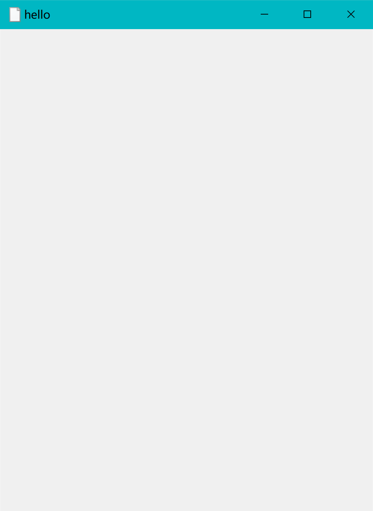<br />第一个窗口就这样应运而生了，另外它还有许多其它功能，比如：
```python
root.quit()    #退出
root.destroy() #销毁
root.update() #刷新 可以接收用户改变程序进程
root.update_idletasks()  #刷新 不能接收用户改变程序进程
root.wm_title('i love you')  #最小化显示字样
root.configure(background='blue') #背景颜色
```
下面再给它添加点别的部件和功能。
<a name="Rdh33"></a>
## 3、基本部件
tkinter里面有很多丰富的部件，有标签，文本框，列表框，下拉列表框，多选框，单选框等等。
<a name="r8aYD"></a>
### 一、标签
它是tkinter里面的标签部件，主要用于提示。那么它有哪些有趣的功能呢？一起看一下：
```python
label=tk.Label(root,  
               text='Hello', #标签内文本
               bg='red',      #背景颜色
               font=('Arial',20), #字体和字体大小
               width=10,  #文本宽度
               height=5   #文本高度
              )
```
不过光这样标签还不会添加到主界面中，还得给它进行下一步操作：
```python
label.pack() #添加部件到主界面
```
下面看下效果：<br />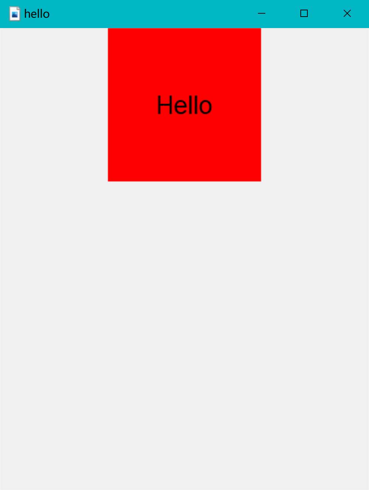<br />这样就成功将它添加进来了，有点丑，等会再做修改。可以看到现在的标签里的值是静态无法修改的，那要是想让它动态变更了，可以这样做：
```python
import tkinter as tk

root = tk.Tk()  # 主窗口
root.title('hello')  # 窗口标题
root.geometry('400x500')  # 窗口尺寸
root.wm_minsize(140, 170)  # 设置窗口最小化大小
root.wm_maxsize(1440, 2800)  # 设置窗口最大化大小
root.iconbitmap('favicon.ico')  # 窗口图标 必须是ico格式的图片
root.resizable(width=False, height=True)  # 设置窗口宽度不可变，高度可变
var = tk.StringVar()
label = tk.Label(root,
                 textvariable=var,  # 标签内文本
                 bg='red',  # 背景颜色
                 font=('Arial', 20),  # 字体和字体大小
                 width=10,  # 文本宽度
                 height=5  # 文本高度
                 )
var.set('Hello World')
label.pack()  # 添加部件到主界面
root.mainloop()  # 主窗口循环显示


```
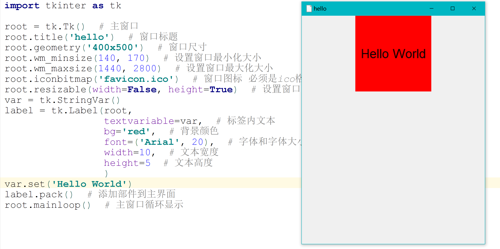<br />这样就达到了修改标签的值的功能。<br />关于标签还有许多优秀的方法，比如说：
```python
label.configure(text) #重新设置标签文本 得是text的时候设置才生效
label.configure(background='blue')  #重新设置标签背景
```
标签的属性总共有下面几种：
```python
anchor         　　   文本位置；
background(bg)　　　　 背景色；
    foreground(fg)　　    前景色；
    borderwidth(bd)　　   边框宽度；
    width        　　　　 标签宽度；
    height        　　　　标签高度；
    bitmap        　　　  标签中的位图；
    font            　　　字体；
    image        　　 　　标签中的图片；
    justify        　　　 多行文本的对齐方式；
    text    　　　　　　   标签中的文本，可以使用'\n'表示换行
    textvariable  　　　  显示文本自动更新，与StringVar等配合着用
```
<a name="uPGtj"></a>
### 二、按钮
按钮的功能主要是实现点击功能，比如说确认，提交操作。那么它有哪些操作呢？
```python
import tkinter as tk

root = tk.Tk()  # 主窗口
root.title('hello')  # 窗口标题
root.geometry('400x500')  # 窗口尺寸


def com():
    print('点击一次')


button = tk.Button(
    root,
    text='按钮',  # 按钮上的文本
    width=15,  # 按钮的宽度
    heigh=2,  # 按钮的高度
    command=com  # 按钮执行的命令
)
button.pack()
root.mainloop()  # 主窗口循环显示
```
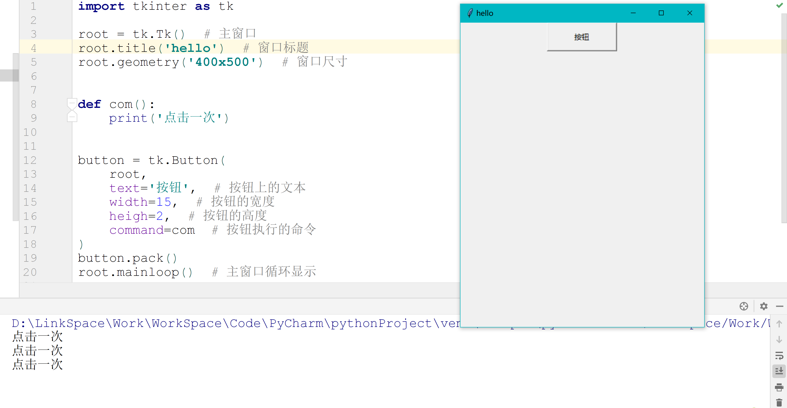<br />可以看出，成功实现了点击事件，而且可以通过点击按钮来改变标签的值，下面来看看：
```python
import tkinter as tk

root = tk.Tk()  # 主窗口
root.title('hello')  # 窗口标题
root.geometry('400x500')  # 窗口尺寸

var = tk.StringVar()
label = tk.Label(root,
                 textvariable=var,  # 标签内文本
                 bg='green',  # 背景颜色
                 font=('Arial', 20),  # 字体和字体大小
                 width=10,  # 文本宽度
                 height=5  # 文本高度
                 )
var.set('Hello')


def com():
    label.configure(background='red')
    var.set('被点击了')


button = tk.Button(
    root,
    text='按钮',  # 按钮上的文本
    width=15,  # 按钮的宽度
    heigh=2,  # 按钮的高度
    command=com  # 按钮执行的命令
)
label.pack(side='left')
button.pack(side='right')
root.mainloop()  # 主窗口循环显示
```
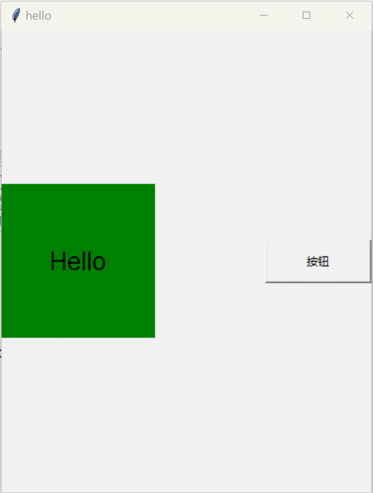<br />可以看出，成功的改变了值和背景颜色。代码中的`side='left'`就是确定组件位置的，一个左一个右。按钮还有一个隐藏和显示的功能也是相当好实现的：
```python
button.pack          #显示
button.pack_forget   #隐藏
```
关于button还有以下方法供大家学习：
```python
anchor         　　文本位置；
background(bg)   　 按钮的背景色；
  bitmap:       　　　　 按钮上显示的位图；
  borderwidth(bd)　　　　按钮边框的宽度；
  command:   　　　　　 按钮消息的回调函数；
  cursor:       　　　　鼠标移动到按钮上的指针样式；
  font:           　　 按钮上文本的字体；
  foreground(fg)　　　　 按钮的前景色；
  height:       　　　　按钮的高度；
  image:       　　　　 按钮上显示的图片；
  state:         　　　 按钮的状态（disabled）；
  text:           　　　 按钮上显示的文本；
  width:       　　　　 按钮的宽度
  padx         　　　　 设置文本与按钮边框x的距离，还有pady;
  activeforeground　　　 按下时前景色
  textvariable   　　   可变文本，与StringVar等配合着用
```
<a name="TnHGQ"></a>
### 三、文本框，多行文本框
之所以拿来一起讲，是因为它们很多参数都是一样的，所以没必要分开讲，先来说说文本框：
<a name="VhQPK"></a>
#### 1、文本框
用来接受用户输入，常用来登陆账号和密码。<br />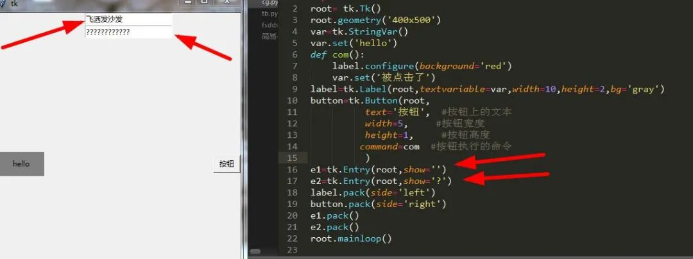<br />可以看到一个显示为汉字，另一个则是？，这就是它的明文和密文设置了。还可以获取到它里面的值用来校验数据库中的信息以便登陆，不过这里只把它打印出来即可。<br />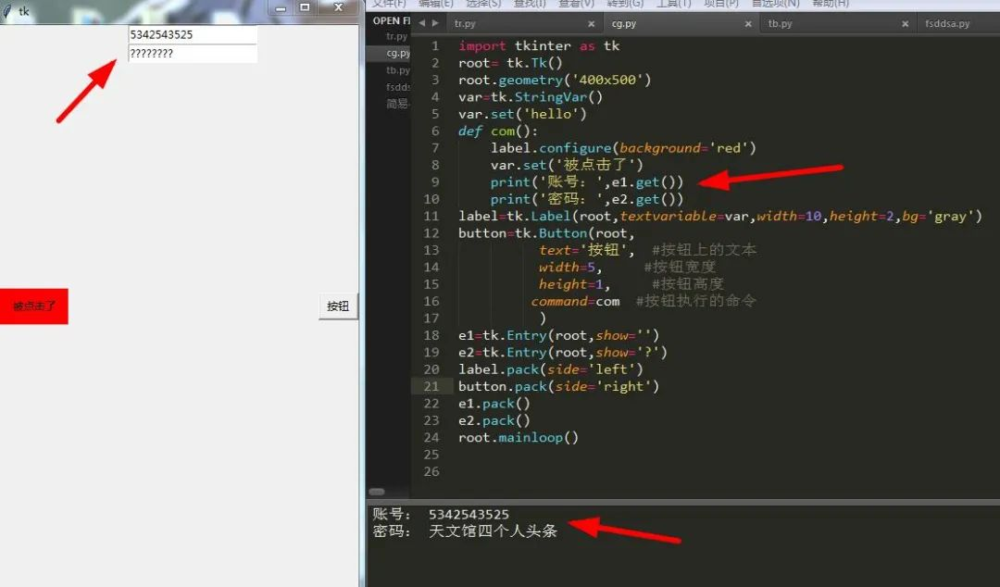<br />完美将它打印了出来。单行文本框自定义插入值：
```python
e1.insert(index,string) #在指定索引位置插入字符串
```
<a name="wv7PN"></a>
#### 2、多行文本框
与文本框不同的是，它可以显示多行信息，一般用来显示某些结果。<br />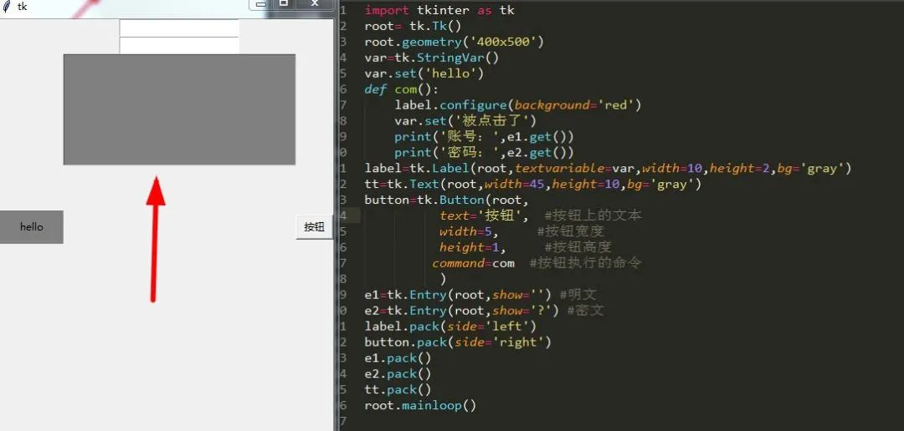<br />可以看到，多行文本就是这样的，可以给它插入文本：<br />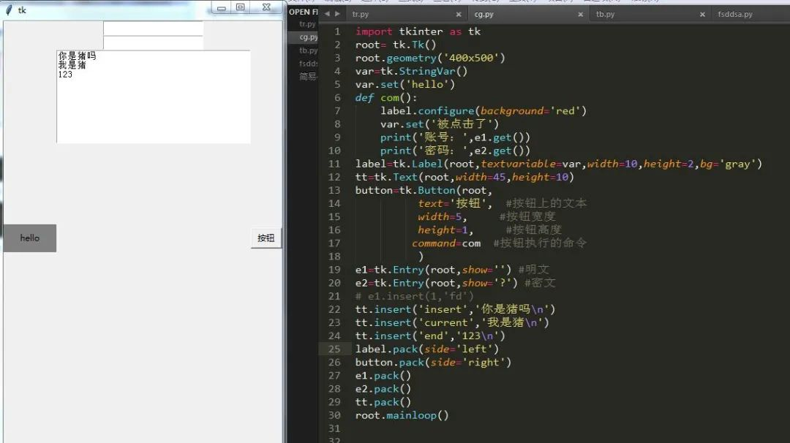<br />除了插入还可以删除：
```python
tt.delete('1.0',tk.END) #删除文本框所有内容
```
另外文本框有时候需要实时更新内容，所以还有一个方法：
```python
tt.update()  #更新多行文本框内容
```
除此之外，还可以在多行文本框中添加其它组件实现一些功能。
<a name="Caljr"></a>
##### 记住密码功能
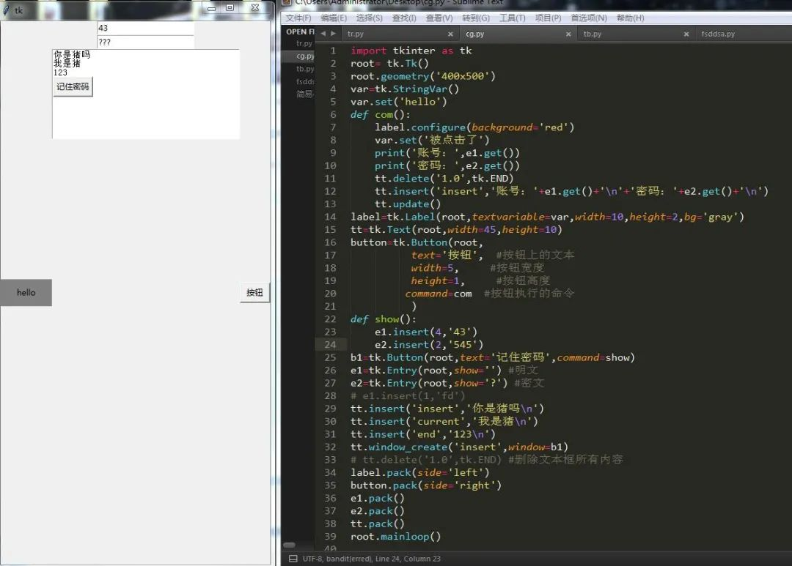
<a name="UjwUq"></a>
##### 照片查看器
需要认识一个新的方法，它叫PhotoImage。它只支持gif图片。<br />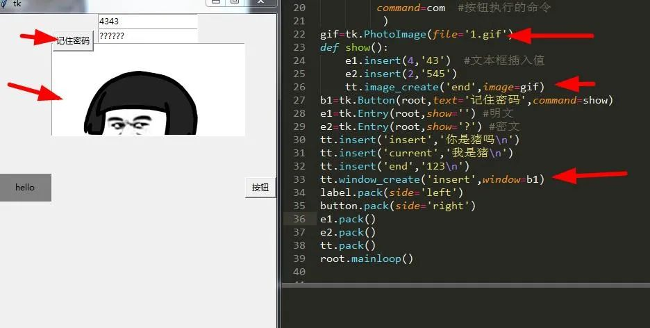<br />通过上面的设置创建了一个window执行函数，在实际应用中可以用它来实现记住密码和查看gif照片的功能。<br />关于文本框和多行文本框就说到这里，它们还有很多其它的方法：
<a name="JYJnZ"></a>
##### 指定位置插入值
```python
tt.mark_set("here","3.2") #建立mark，相当于索引，第三行第二列
tt.insert('here',"hello") #插入hello
tt.mark_unset('here') #删除mark
```
<a name="rcjOF"></a>
##### 高亮显示文本
```python
tt.tag_add('tag1','1.3','2.1','2.2') #设置要设置样式的区域
tt.tag_config("tag1",background="green",foreground="blue")
tt.tag_config("tag2",background="blue",foreground="red")#如设置多个样式则新样式覆盖旧样式
tt.tag_lower("tag1")  #可通过tagraise()和tag_lower()方法来提高和降低某个Tag的优先级
```
<a name="Wky9I"></a>
##### 获取多行文本框的值
```python
tt.get('0.0','end')
```
<a name="Elzv2"></a>
##### 文本绑定鼠标事件
```python
tt.tag_add("link","2.1","2.5")
tt.tag_config("link",foreground="blue",underline=True) #选中的内容添加下划线 蓝色背景颜色
def show_1(event):
     tt.config(cursor="arrow") #鼠标箭头型
def show_2(event):
     tt.config(cursor="xterm")  #鼠标I型
def click(event):
     print('我被单击了')
tt.tag_bind("link","<Enter>",show_1)
tt.tag_bind("link","<Leave>",show_2)
tt.tag_bind("link","<Button-1>",click)
```
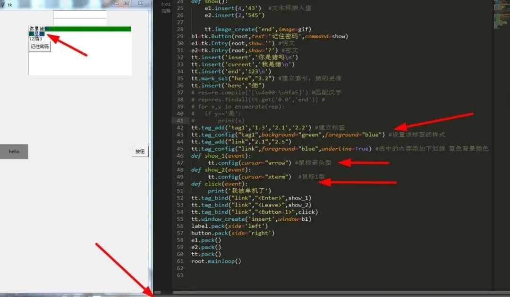
<a name="Ns66x"></a>
##### 恢复，撤销
```python
tt.edit_undo() #撤销
tt.editredo()  #恢复
```
<a name="vJtng"></a>
##### 更多精彩内容
```python
background(bg)   　　 文本框背景色；
foreground(fg)        前景色；
selectbackground　　  选定文本背景色；
selectforeground　　  选定文本前景色；
borderwidth(bd)    　 文本框边框宽度；
font                　字体；
show          　　    文本框显示的字符，若为*，表示文本框为密码框；
state            　　 状态；
width        　　　　  文本框宽度
textvariable    　　  可变文本，与StringVar等配合着用
```
<a name="b82Ib"></a>
### 四、单选框，复选框
这个平时勾选答案是单选还是多选时很常见。下面来看看：
<a name="LWeJV"></a>
#### 1、单选框Radiobutton
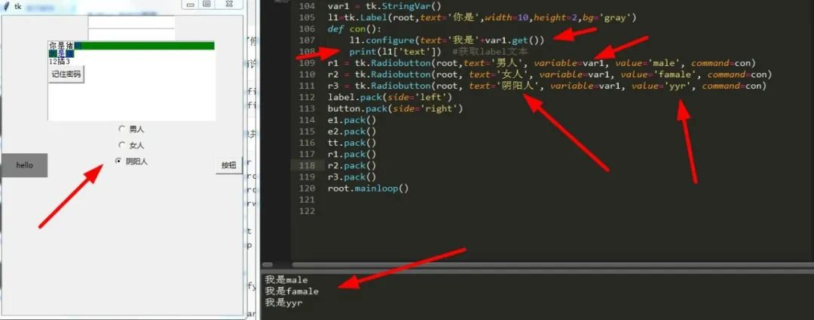
<a name="aXdfQ"></a>
#### 2、复选框Checkbutton
可以看出，做出来了，不过有点复杂，因为没有善用循环，下面给出一种简单的写法：<br />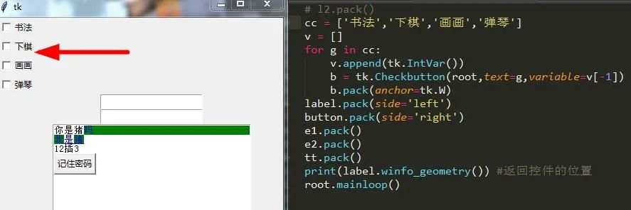<br />可以看到，几行代码就把四个控件列出来了。关于单选框多选框还有很多有趣的方法：
```python
anchor         　　文本位置；
background(bg) 　　背景色；
foreground(fg)    前景色；
borderwidth       边框宽度；
width        　　  组件的宽度；
height     　　    组件高度；
bitmap    　　     组件中的位图；
image    　　      组件中的图片；
font       　　    字体；
justify       　　 组件中多行文本的对齐方式；
text         　　  指定组件的文本；
value      　　    指定组件被选中中关联变量的值；
variable     　    指定组件所关联的变量；
indicatoron        特殊控制参数，当为0时，组件会被绘制成按钮形式;
textvariable       可变文本显示，与StringVar等配合着用
```
<a name="cAfKo"></a>
### 五、listbox列表
列表常用于选择选项。<br />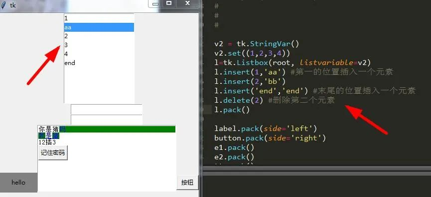<br />这个比较简单，没什么好说的。
<a name="xywFK"></a>
### 六、滑块条，滚动条
<a name="f18DN"></a>
#### 1、滑块条
一行代码就能搞定了，也是非常简单：<br />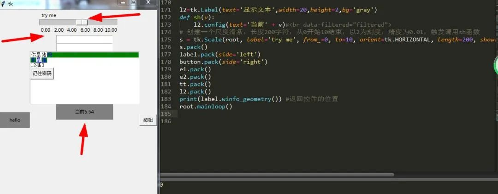<br />默认方向为垂直，只需将`orient`属性设为`horizontal(tk.HORIZONTAL)`即可，也可设为垂直：`orient="vertical"`
<a name="cZneP"></a>
#### 2、滚动条
常和其它组件配套使用，比如列表框，多行文本框。安装滚动条之前需要做两件事情。

1. 指定该组件的yscrollbarcommand参数为Scrollbar的`set()`方法
2. 指定Scrollbar 的 command 参数为该组件的 `yview()` 方法

由于滚动条一般都是垂直方向，所以不改动它的方向。<br />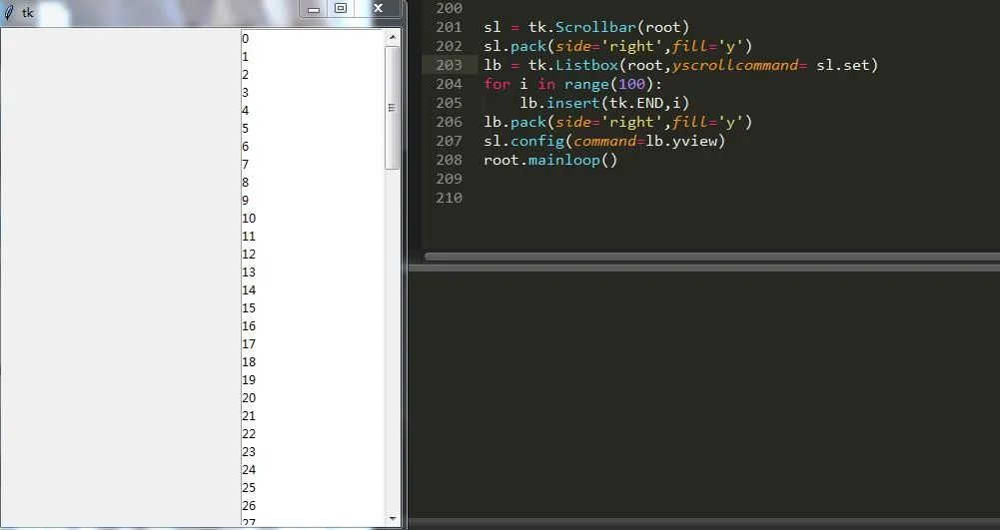<br />可以看到，滚动条和列表组件产生了联系，滚动条滚动列表内容相应往下翻，如果要想设置滚动条的位置，只需：
```python
sl.set(0.5,1) #使滚动条始终保持在中间位置
```
滚动条和滑块条一样，都比较简单，项目中用的也不是蛮多，总体来说比较简单的组件。
<a name="t9D4p"></a>
### 七、画布
平时会用于绘制各种曲线和位图，canvas可以很轻松创建各种有趣的图形图像。下面来了解下
```python
#初始化一个200x100的背景颜色为蓝色的形状
canvas = tk.Canvas(root, bg='blue', height=100, width=200) 

#创建一个矩形，背景色为绿色，边框线颜色为红色,线宽为2，虚线长度为3，画刷为gray12，
jx=canvas.create_rectangle(100,100,50,50,fill='green',outline='red',width=2,dash=3,stipple = 'gray12')

#绘制弧形 风格为pieslice(chord扇形，抛物线arc) 起始角度0 角度偏移量180
hx=canvas.create_arc(50, 100,140, 200,style='pieslice',start=0, extent=180)

#创建直线 坐标为100,100的长度为200x200的直线,一头有箭头(none无，last尾部，both两端,箭头形状)
zx=canvas.create_line(100, 100, 200, 200,arrow='first',arrowshape='30 20 10') 

#创建椭圆，背景色为red
y=canvas.create_oval(50, 100,140, 200, fill='red')

#创建多边形 直角三角形
dbx=canvas.create_polygon((150,150,150,200,70,200),fill = 'red')

#创建文字  居中显示
wz=canvas.create_text((10,10),text = 'Hello Text',anchor ='w')
canvas.select_from(wz,3)  # 设置文本的选中开始位置
canvas.select_to(wz,7)# 设置文本的选中结束位置

#创建位图,类型为error(info信息,question问题,hourglass沙漏)
canvas.create_bitmap((40,40),bitmap = 'error')

#创建gif
img= tk.PhotoImage(file='1.gif')
canvas.create_image(10, 10, anchor='nw', image=img)

#创建组件
bt =tk.Button(canvas,text='hello',command)
canvas.create_window((100,100),window=bt,anchor='w')

#将jx移动到另一区域
cv.coords(jx,(10,10,20,20))

#移动图形右移20个px,再返回
canvas.move(jx,20,0)

#删除图形
canvas.delete(jx)

#添加绑定事件,只有点击到矩形边框才有效
canvas.tag_bind('jx','<Button-1>',command) #左键为1，右键为3，滚轮2
```
canvas绘图还是比较强大的，以上的知识点差不多够平时用了，可以看到：<br />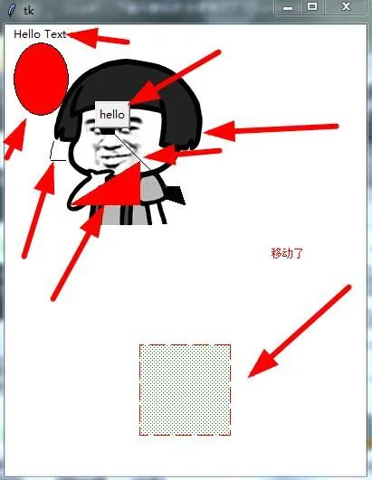
<a name="HTWYj"></a>
### 八、下拉列表框
一般用于某个功能的配套选择，这个部件在tkinter中的ttk模块下，和其它的不同，所以导入ttk：
```python
#打印下拉列表框的值
from tkinter import  ttk
def function(*arg):
    print(cb.get()) #获取下拉列表框的值
cb=ttk.Combobox(root, width=12,state='readonly')#下拉列表框宽度为12 只读
cb['values'] = ('请选择-----','1','2','3','4') #设置下拉列表框的内容   
cb.current(0)    #将当前选择状态置为0,也就是第一项
cb.bind("<<ComboboxSelected>>",function)  #绑定function函数，然后触发事件
cb.pack()
```
注：下拉列表没有`command`参数，但是它可以设置`textvariable`进行参数传递。<br />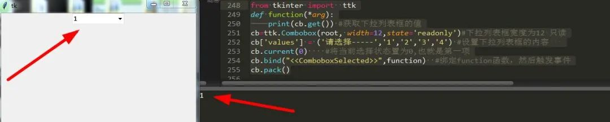
<a name="IgXe9"></a>
### 九、菜单栏，菜单按钮，选项菜单
先说说熟知的菜单(Menu)，它主要为了简化软件的使用而建立的，避免添加过多的控件。那么它是如何建立的了，请看：
<a name="EzEdJ"></a>
#### 1、下拉菜单
```python
#创建菜单栏
m=tk.Menu(root)

#定义一个父菜单
file=tk.Menu(m,tearoff=False)

#将上面定义的父菜单命名为File，放在菜单栏中
m.add_cascade(label='文件', menu=file)

#在File中加入下拉菜单，并添加对应命令操作。
#如果点击这些选项, 就会触发相应的功能
file.add_command(label='新建',accelerator='Ctrl+N')
file.add_command(label='打开', accelerator='Ctrl+O')
file.add_command(label='保存', accelerator='Ctrl+S')

#添加一条分割线
file.add_separator()
file.add_command(label='退出',command=root.quit,accelerator='Ctrl+Q')
 
 
edit= tk.Menu(m,tearoff=False)
m.add_cascade(label='编辑', menu=edit)
edit.add_command(label='剪切',accelerator='Ctrl+X')
edit.add_command(label='复制',accelerator='Ctrl+C')
edit.add_command(label='粘贴',accelerator='Ctrl+V')
 
#二级菜单
s= tk.Menu(file,tearoff=False)
file.add_cascade(label='导入', menu=s)
s.add_command(label="模块")
s.add_command(label="文本文件")

#三级菜单
z=tk.Menu(s,tearoff=False)
s.add_cascade(label='图片',menu=z)
z.add_command(label="gif")
z.add_command(label="jpg")
z.add_command(label="png")
z.add_command(label="bmp")
root.configure(menu=m)
```
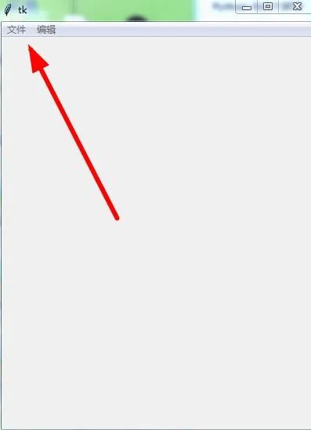
<a name="aXvmd"></a>
#### 2、右键弹出菜单
在做这个之前要了解鼠标绑定事件，因为右键弹出需要击键，所以需要了解它。<br />既然是右键当然得绑定右键了：
```python
root.bind("<Button-3>",function)
```
然后书写绑定函数并把它绑定到当前对象中：
```python
def function(event):
    m.post(event.x_root, event.y_root)  #可以替换菜单，变为其它菜单，比如说s,z
```
这样就实现了右键弹出菜单的功能，是不是很简单了。关于菜单的操作还有许多，不一一演示，下面请看：
```python
#添加一个子菜单 coption为配置选项
add_cascade(option)

#添加一个切换按钮 coption为配置选项
add_checkbutton(option)

#添加一个功能按钮 coption为配置选项
add_command(option)

#添加一个单选按钮 coption为配置选项
add_radiobutton(option)

#添加一个分割线
add_separator()

#删除index1 到 index2之间的选项
delete(index1,index2)

#获取菜单某一项的属性值
entrycget(index,coption)

#重新配置菜单中某项的属性
entryconfigure(index,option)

#返回参数位置对应的选项索引
index(i)

#在指定位置插入一个子菜单
insert_cascade(index,option)

#在指定位置插入一个切换按钮
insert_checkbutton(index,option)

#在指定位置插入一个功能按钮
insert_command(index,option)

#在指定位置插入一个单选按钮
insert_radiobutton(index,option)

#在指定位置插入一个分割线
insert_separator(index)

#代码手动调用一次某个选项
invoke(index)

#在窗口指定位置弹出菜单
post(x,y)

#获取某个选项的类型
type(index)

#获取某个选项距离菜单顶部的偏移量
yposition(n)

#添加一个选项 可以是功能按钮，切换按钮，单选按钮或子菜单，由类型确认
#类型可选 cascade checkbutton command radiobutton separator
add(kind,option)
```
<a name="TRy5b"></a>
#### 3、菜单按钮
它是与菜单相关联的按钮，可放在任意位置，下面来创建一个看看：
```python
def show(): #触发事件
    print("hello")
mb = tk.Menubutton(root,text="python",relief=tk.RAISED) #菜单按钮配置
mb.pack()
file = tk.Menu(mb,tearoff=0)  #添加菜单
file.add_checkbutton(label="打开",command=show) #添加确认按钮到菜单中
file.add_command(label="保存",command=show) #添加保存命令
file.add_separator() #添加分隔线
file.add_command(label="退出",command=root.quit) #添加退出命令
mb.configure(menu=file)  #将菜单按钮配置添加到主菜单中
```
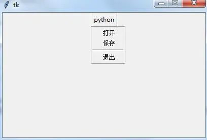
<a name="Dd2Kp"></a>
#### 4、选项菜单
这个组件在一定程度上好比下拉菜单，又如listbox,下面来看下吧：
```python
var =tk.StringVar()
var.set("编程语言") #设置菜单初始值
o = tk.OptionMenu(root,var,"python","php","c#","c++") #将菜单选项加入到菜单中去
o.pack()
```
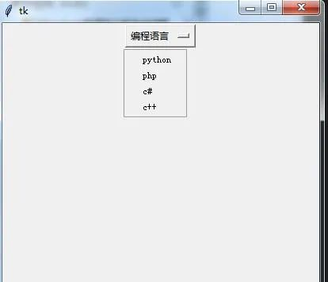<br />是不是觉得菜单比较有趣，通过对菜单的认识也可以做一个记事本或者其它小工具，其它方法如下：
```python
tearoff     　   分窗，0为在原窗，1为点击分为两个窗口，也可以是 True，False
bg,fg       　　  背景，前景
borderwidth    　 边框宽度
font              字体
activebackgound  点击时背景，有activeforeground，activeborderwidth，disabledforeground
cursor            选中菜单选项时的光标形状
post               右键菜单
selectcolor    　 选中时背景
takefocus         使用 Tab 键获取按钮的焦点 
title              标题
type                类型
relief              样式"sunken"，"raised"，"groove"，"ridge" "flat"

方法：
m.add_cascade      添加子选项
m.add_command      添加命令（label参数为显示内容）
m.add_separator    添加分隔线
m.add_checkbutton  添加确认按钮
delete                删除
```
