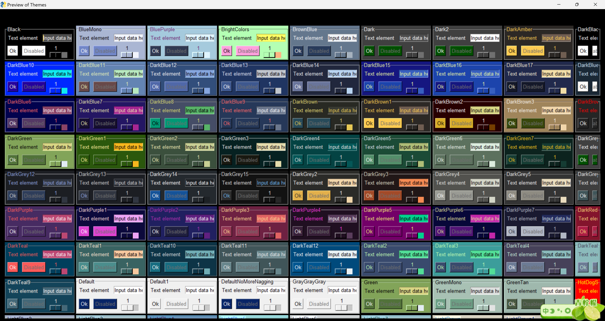

Python GUI<br />Python在运维和办公自动化中扮演着重要的角色，PySimpleGUI是一款很棒的自动化辅助模块，可以更轻松的实现日常任务的自动化。<br />Github开源地址：[https://github.com/PySimpleGUI/PySimpleGUI](https://github.com/PySimpleGUI/PySimpleGUI)
<a name="acRU4"></a>
## 1、PySimpleGUI安装
在命令行/终端输入：`pip install pysimplegui`，等待安装完成后，进入Python环境，输入`import PySimpleGUI`回车无误后，确认安装成功。
<a name="lbbm9"></a>
## 2、PySimpleGUI制作简易弹窗界面
<a name="tcnNC"></a>
### 2.1 两种界面设计模式
（1） 单次显示界面（one-shot window）

- 类似于弹窗，出现一次
- 常用于提示信息，收集信息

（2）持续显示界面（Persistent window）

- 持续不断显示，除非用户手动关闭
- 常作为软件的主界面
<a name="To6JA"></a>
### 2.2 制作弹窗
官网默认的库的缩写为sg，使用时建议保持统一，也是使用sg<br /><br />弹窗类型：(第一种和第二种是一致的)

- `sg.popup('注意！')`
- `sg.popup_ok('默认弹窗')`
- `sg.popup_yes_no('带Yes和No按钮的弹窗')`
- `sg.popup_cancel('带cancel按钮的弹窗')`
- `sg.popup_ok_cancel('带OK和cancel按钮的弹窗')`
- `sg.popup_error('带红色error按钮的弹窗')`
- `sg.popup_auto_close('几秒后自动关闭的弹窗')`

最后一个执行后程序会在2s左右自动退出，除了以上的简单的默认函数外，还可以手动设置参数，相关的参数如下<br /><br />比如设置一个定制化的小窗口，进行相关参数的添加
```python
sg.popup(
  '这是弹窗',
  title='Hello',
  button_color=('#A81B0C', '#FFFFFF'),
  background_color='#F47264',
  line_width=2,
  custom_text=' 好的 '
)
```
输出结果：（第一个参数就是要显示的信息，可以是单个，也可多个字符串，多个字符串时候，默认换行，如果是单个字符串可以通过line_with指定每行的宽度）<br /><br />当第一个参数是多个字符串时，自动换行显示（由于自动的窗体长宽很小，所以标题就没有看到，但不是代表不显示，下面的示例中就可以看到）<br />
<a name="aJlpv"></a>
### 2.3 文字内容弹窗
采用`popup_scrolled()`方法，括号中添加要显示的内容即可
```python
text = '''大家好，
我们一起来学习PySimpleGUI制作简单的图形用户界面。'''
sg.popup_scrolled(text,title='Hello')
```
输出结果为：（这里的标题就正常的显示出来了）<br /><br />这个文字内容弹窗里面也有相关的设置参数，可以根据自己的需要进行设置，参数如下：（注意之前的弹窗的参数也可以在这类弹窗中使用，比如刚刚用的title）<br />
<a name="J37W3"></a>
### 2.4 获取用户输入的弹窗
采用`popup_get_text()`方法，括号内容有点类似`input()`语句中的提示语，提醒用户输入
```python
text1 = sg.popup_get_text('请输入文字1')
print(text1)
text2 = sg.popup_get_text('请输入文字2')
print(text2)
```
输出结果为：（当点击Ok时候控制台输出端就会获取到用户输入的文字，如果是点击Cancel，输出端为None，这里执行了两次用户输入弹出的指令，当第一次输入后点击Ok会自动弹出第二个窗口）<br /><br />该类弹窗也有自己特定的参数供选择，比如既然进行输入的操作，有时输入密码时候就不希望别人看到，就可以采用输入的显示方式，如下<br /><br />测试进行密码隐藏输入，可以直接顺势将用户输入的密码也以弹窗的形式<br />
<a name="qEVu0"></a>
### 2.5 文件选择弹出窗口
直接采用`sg.popup_get_file()`方法，括号里面的内容也是输入的提示语<br /><br />选择后就会把详细的地址直接显示在输入框中，如下<br /><br />那么同样该类弹出也有自己的特有属性参数设置，具体如下。里面的每个参数几乎都是超级常用的参数，可以自行测试一下。<br /><br />默认后缀，这个参数也是常用的，比如在sublime中点击另存为时候，本身是py文件，在给文件命名的时候只需要输出文件名，后缀自动给添加上去了。<br />
<a name="qXSrE"></a>
### 2.6 文件夹选择窗口
采用`sg.popup_get_folder()`方法，括号里面的内容也是输入的提示语。执行程序后会弹出选择文件的窗口，鼠标选择后就会把文件夹的路径添加到输入<br />
<a name="U1Vmc"></a>
### 2.7 进度条弹窗
采用`sg.one_line_progress_meter()`方法，括号中输入相关的参数设置内容
```python
for i in range(1000):
    sg.one_line_progress_meter(
        '进度条',
        i + 1,
        1000,
        '该进度条key',
        '这是一个进度条'
    )
```
输出结果为：（会进行动态加载，直到达到100%）<br /><br />当然此类弹窗也有自己特有的参数设置，如下。比如常见的设置竖直的还横向的，滚动条的上下限等。<br /><br />比如尝试一下不同参数的组合输出
```python
for i in range(1, 1000):
    sg.one_line_progress_meter(
        '进度条',
        i + 1,
        1000,
        '该进度条key',
        '这是一个进度条',
        orientation='h',
        bar_color=('#F47264', '#FFFFFF')
    )
```
输出结果为：<br />
<a name="Lq3ya"></a>
### 2.8 主题设置
<a name="GJH1j"></a>
#### 预览自带的主题
```python
sg.theme_previewer()
```

<a name="AznV6"></a>
#### 设置选择的自带主题
```python
sg.theme('GrayGrayGray')
```
在开发时，可能会测试多个主题来选择中意的一款，但是设置了新的主题却发现未生效，查看源码发现对设置的主题做了缓存，此时可以删除缓存的配置文件或者直接修改缓存配置的主题参数值，具体的原理见源码：<br /><br />缓存的配置文件目录如下：<br /><br />缓存的主题信息如下：<br />
<a name="jw45v"></a>
## 3、制作简易压缩软件
<a name="UgWoL"></a>
### 3.1 功能需求

- 软件运行后弹出窗口让用户选择一个文件夹
- 用户选择后再弹出窗口让用户选择压缩包保存的位置和名称
- 用户输入完成后将该文件夹内所有的文件进行压缩打包
- 完成压缩后再弹出一个窗口告诉用户这个压缩包的体积大小
<a name="j0i1G"></a>
### 3.2 功能拆解
<a name="u8NCL"></a>
#### （1）软件运行后弹出窗口让用户选择一个文件夹
```python
popup_get_folder()
```
<a name="z805K"></a>
#### （2）用户选择后再弹出窗口让用户选择压缩包保存的位置和名称
```python
popup_get_file()
save_as=True
default_extension = 'zip'
```
<a name="ifwUx"></a>
#### （3）用户输入完成后将该文件夹内所有的文件进行压缩打包

- zipfile模块
<a name="XrbbQ"></a>
#### （4）完成压缩后再弹出一个窗口告诉用户这个压缩包的体积大小

- `os.stat()`读取文件信息
- `popup()`弹窗显示数据
<a name="qHz9D"></a>
### 3.3 全部代码
参考代码：（主要是细节部分，对于压缩路径的设置，需要进行处理一下，不然最后解压缩的会出现很多层级的不必要文件夹）
```python
import PySimpleGUI as sg
import zipfile
import os


folder = sg.popup_get_folder('请选择要压缩的文件夹')
zip_path = sg.popup_get_file(
    '请选择要保存的压缩包位置',
    save_as=True,
    default_extension='zip',
    file_types=(('压缩包', '.zip'), )
)

with zipfile.ZipFile(zip_path, 'w') as zipobj:
    for file in os.scandir(folder):
        zipobj.write(file.path, file.path.replace(folder, '.'))

zip_size = os.stat(zip_path).st_size // 1024
sg.popup(f'压缩包体积大小为：{zip_size} KB')
```
输出结果演示如下：<br />
<a name="JbRxu"></a>
## 4、应用打包
安装PyInstaller库：可以使用pip命令在终端或命令提示符中安装PyInstaller，如下所示：
```bash
pip install pyinstaller
```
打包命令如下：
```bash
.\venv\Scripts\pyinstaller.exe -F .\main.py -w
```
`-F`参数指定打包的入口文件<br />`-w`参数可以避免在执行exe时打开cmd窗口<br />打包完成后，可以在工程目录下看到生成dist文件夹里有可执行的exe文件<br />
