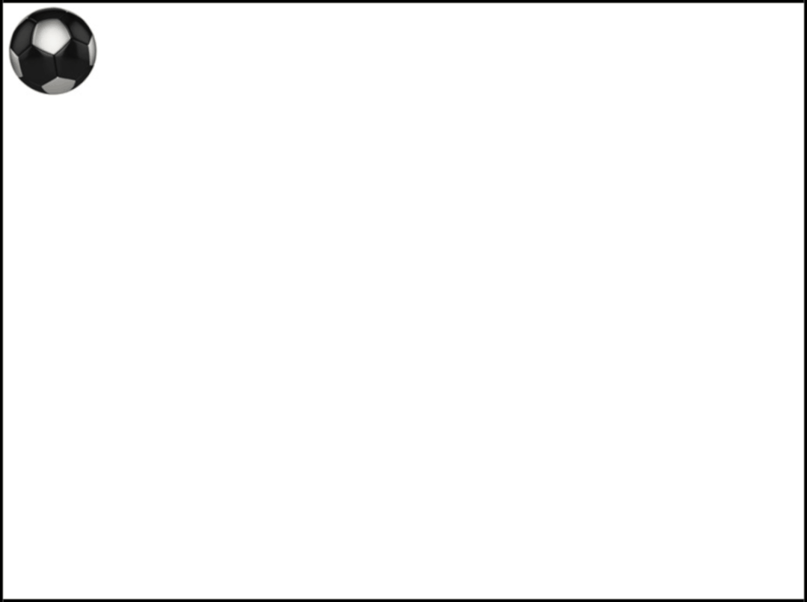
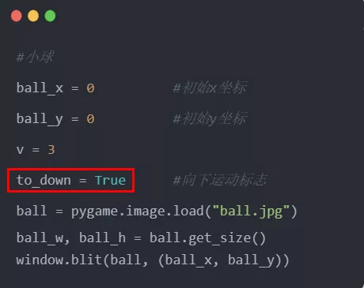
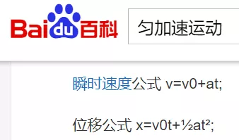
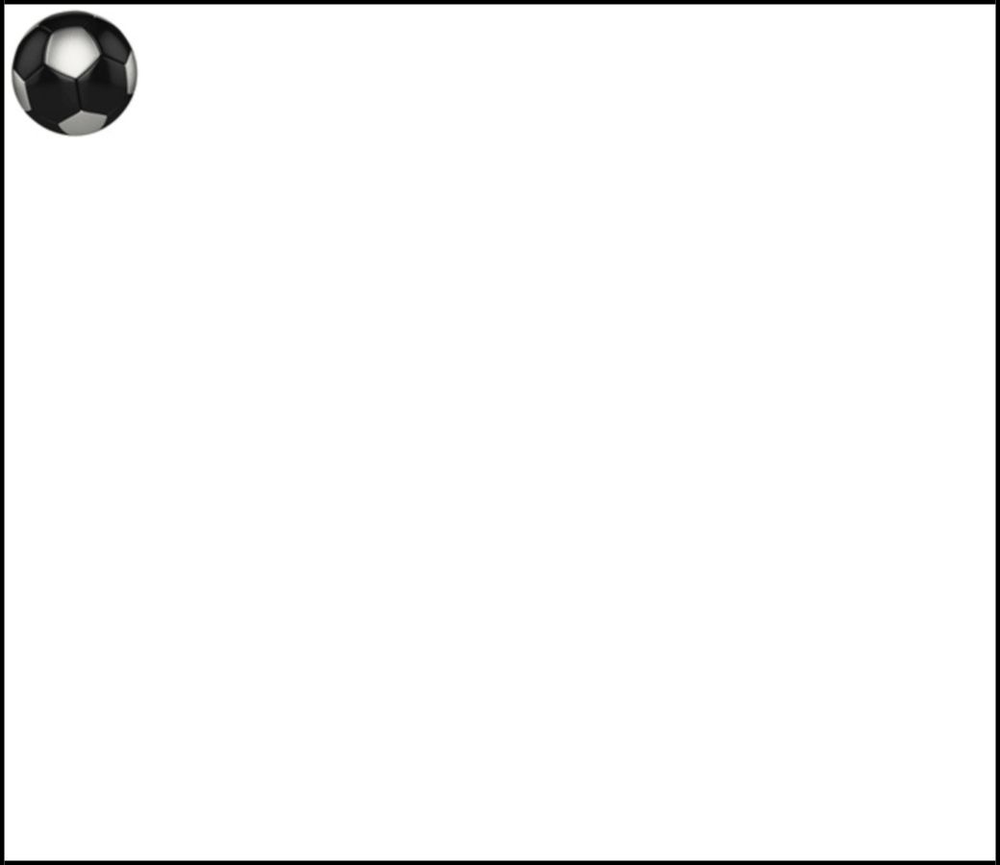

Python
<a name="HE3ya"></a>
## 前言
最终效果<br />
<a name="KvNZ9"></a>
## 一、素材
因为是个模拟实验，重在功能的实现，所以素材方面就没搞得太复杂，只有一个小球图片和一个撞击音效。<br />[弹力球.zip](https://www.yuque.com/attachments/yuque/0/2021/zip/396745/1636524403261-4ea9d938-d968-4fb2-a2ae-c9db0a0f2490.zip?_lake_card=%7B%22src%22%3A%22https%3A%2F%2Fwww.yuque.com%2Fattachments%2Fyuque%2F0%2F2021%2Fzip%2F396745%2F1636524403261-4ea9d938-d968-4fb2-a2ae-c9db0a0f2490.zip%22%2C%22name%22%3A%22%E5%BC%B9%E5%8A%9B%E7%90%83.zip%22%2C%22size%22%3A12678%2C%22type%22%3A%22application%2Fx-zip-compressed%22%2C%22ext%22%3A%22zip%22%2C%22status%22%3A%22done%22%2C%22taskId%22%3A%22u0076f8b2-588e-4e16-8d05-02677d943ca%22%2C%22taskType%22%3A%22upload%22%2C%22id%22%3A%22uce8ccc63%22%2C%22card%22%3A%22file%22%7D)
<a name="Cb5G9"></a>
## 二、程序部分
<a name="eoGpi"></a>
### 2.1 pygame最小系统
```python
import pygame, sys

# 初始化
pygame.init()

# 创建游戏窗口
WIN_SIZE = WIN_W, WIN_H = 800, 600
window = pygame.display.set_mode(WIN_SIZE)
# 设置标题
pygame.display.set_caption("弹力球")
# 设置背景颜色
window.fill((255, 255, 255))  # 白色

#主循环
while True:
    for event in pygame.event.get():
        if event.type == pygame.QUIT:
            sys.exit()

    # 屏幕刷新
    pygame.display.update()
```
<a name="qKjkp"></a>
### 2.2 加入小球
将以下代码添加到主循环的上方（注：图片文件和后面的音频文件要放在与.py文件同一目录下）
```python
#小球
ball_x = 0          #初始x坐标
ball_y = 0          #初始y坐标
ball = pygame.image.load("ball.jpg")
ball_w, ball_h = ball.get_size()
window.blit(ball, (ball_x, ball_y))
```
<a name="SIIkD"></a>
### 2.3 让小球动起来
```python
#小球
ball_x = 0          #初始x坐标
ball_y = 0          #初始y坐标
v = 3               #小球速度
ball = pygame.image.load("ball.jpg")
ball_w, ball_h = ball.get_size()
window.blit(ball, (ball_x, ball_y))

#主循环
t = 0                #时间
while True:
    t += 0.1
    s_down = v * t
    ball_y = s_down
    for event in pygame.event.get():
        if event.type == pygame.QUIT:
            sys.exit()

    window.fill((255, 255, 255))
    window.blit(ball, (ball_x, ball_y))

    # 屏幕刷新
    pygame.display.update()
```
在加入此段代码后可以发现小球会向下做匀速直线运动了，接下来让小球在到达边界时反弹回来。
<a name="AB85Y"></a>
### 2.4 边界检测
为了便于后续扩展，先将小球的运动分为向下和向上两部分，并给小球添加一个运动方向的标志。<br />下面是主循环部分的代码调整，其中加入了边界检测功能。
```python
while True:
    t += 0.1
    #向下运动
    if to_down:
        s_down = v * t
        ball_y = s_down
        #边界检测
        if ball_y >= WIN_H - ball_h:
            t = 0
            to_down = False
    #向上运动
    else:
        s_up = v * t
        ball_y = (WIN_H - ball_h) - s_up
        #边界检测
        if ball_y <= 0:
            t = 0
            to_down = True
```
好了，到此为止小球就可以做往返匀速直线运动了，接下来进入到关键部分。
<a name="UVToS"></a>
### 2.5 加入重力
下面让小球受到重力影响下落（忽略空气阻力）。小球在重力影响下不再做匀速运动，固在小球的初始设置部分删除代码`v = 3`，并添加重力加速度：`g = 10`。先回顾一下匀加速运动的速度和位移公式： <br /><br />下面是主循环部分的代码调整。
```python
#主循环
t = 0
while True:
    t += 0.01
    #向下运动
    if to_down:
        v_down = g * t
        s_down = 1/2 * g * t * t
        ball_y = s_down
        #边界检测
        if ball_y >= WIN_H - ball_h:
            t = 0
            to_down = False
    #向上运动
    else:
        v_up = v_down - g * t
        s_up = v_down * t - 1/2 * g * t * t
        ball_y = (WIN_H - ball_h) - s_up
        #边界检测
        if ball_y <= 0:
            t = 0
            to_down = True
```
看看加入重力之后的效果：<br />
<a name="f99W8"></a>
### 2.6 能量损耗
事实上，尽管没有空气阻力，小球也不会进行完美的动势能转化，因为撞击地面必然会导致能量损耗。假设小球每次撞击地面再反弹时会损失固定的速度。先在小球参数设置的地方添加两行代码，代表撞击地面速度损耗和最高点。<br />然后再对主循环部分进行修正。
```python
    #向下运动
    if to_down:
        v_down = g * t
        s_down = 1/2 * g * t * t
        ball_y = highest + s_down
        #边界检测
        if ball_y >= WIN_H - ball_h:
            t = 0
            to_down = False
            v_down -= v_
    #向上运动
    else:
        v_up = v_down - g * t
        s_up = v_down * t - 1/2 * g * t * t
        ball_y = (WIN_H - ball_h) - s_up
        #到达最高点
        if v_up <= 0:
            t = 0
            to_down = True
            highest = ball_y
```
再来看看效果：<br />
<a name="OaTad"></a>
### 2.7 给水平方向加点初速度
自由落体模拟实验已经完成了，接下来进行平抛模拟实验。给小球一个水平方向的初速度，由于小球在水平方向上不受力，所以会在水平方向上做匀速直线运动。先为小球的初始设置加入一行代码：`v0_x = 0.2`，表示水平方向初始速度。再将`ball_x += v0_x`分别添加到向下运动部分的`ball_y = highest + s_down`和向上运动部分的`ball_y = (WIN_H - ball_h) - s_up`之前。这样，小球就会按抛物线的轨迹运动了。当然还要加入左右的边界检测：
```python
    # 左右边界检测
    if ball_x >= WIN_W-ball_w or ball_x <=0:
        v0_x = -v0_x

    for event in pygame.event.get():
        if event.type == pygame.QUIT:
            sys.exit()
```
运行程序之后，会发现一个明显的问题，就是小球最终会在地面上一直移动，这是因为还没有写让小球停止的程序。
<a name="nhV5e"></a>
### 2.8 让小球停下来
为了让小球停下里，不得不再引入一个标志变量，把stop = False加入到小球的初始设置里吧。然后把主循环中事件检测之前的所有代码都放到分支结构中去。
```python
while True:
    if not stop:
        t += 0.01
        #向下运动
        if to_down:
```
在每次小球到达最高点时判断是否停止运动。
```python
#到达最高点
if v_up <= 0:
    t = 0
    to_down = True
    highest = ball_y
    # 停止运动
        if highest >= WIN_H - ball_h:
            stop = True
```
看看效果如何：<br />
<a name="fYUno"></a>
### 2.9 加入音效
为了更加仿真，不妨给小球添加撞击地面的音效。把这面一段代码加入到小球的初始设置中吧。
```python
#撞击地面音效
hit_sound = pygame.mixer.Sound("Tennis Hit.wav")
hit_volume = 0.5    #音量
hit_sound.set_volume(hit_volume)
```
在程序中小球撞击地面部分添加一行代码`hit_sound.play()`就可以播放音效了。
<a name="ipFpn"></a>
## 三、整点新花样
<a name="rVxEI"></a>
### 参数调整
可以通过改变某些参数来观测小球不同的运动状态，例如：修改水平方向初始速度，把小球用更大的力气抛出去；改变重力加速度，把小球放到月球表面；改变撞击地面损耗速度，观测小球在不同材料地面上的运动变化情况……
<a name="BnYP6"></a>
### 音量递减
现在的小球每次撞击地面的音效声量是不变的，实际生活中随着小球速度的减小，每次撞击地面时发出的声音是越来越小的，让`hit_volume`值在每次小球撞击地面时递减很容易就可以实现这个功能。
<a name="dZV9Y"></a>
### 水平方向速度的变化
现在的小球在水平方向上是做匀速运动，可以在水平方向上加入空气阻力让小球的水平速度逐渐减少，也可以在小球和左右两侧的墙壁相撞时减小水平速度。
