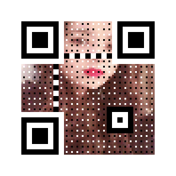

Python
<a name="eCtEU"></a>
### 一、生成二维码
二维码又称二维条码，常见的二维码为QR Code，QR全称Quick Response，是一个近几年来移动设备上超流行的一种编码方式，而生成一个二维码也非常简单，在Python中可以通过MyQR模块了生成二维码，而生成一个二维码只需要2行代码，先安装MyQR模块，这里选用国内的源下载：
```bash
pip install qrcode 
```
安装完成后就可以开始写代码了：
```python
import qrcode

text = input(输入文字或URL：)  
# 设置URL必须添加http://
img =qrcode.make(text)
img.save()                            
#保存图片至本地目录，可以设定路径
img.show()
```
执行代码后会在项目下生成一张二维码。当然还可以丰富二维码：<br />先安装MyQR模块
```bash
pip install  myqr
```
```python
def gakki_code():
    version, level, qr_name = myqr.run(
        words=https://520mg.com/it/#/main/2,  
        # 可以是字符串，也可以是网址(前面要加http(s)://)
        version=1,  # 设置容错率为最高
        level='H',  
        # 控制纠错水平，范围是L、M、Q、H，从左到右依次升高
        picture=gakki.gif,  
        # 将二维码和图片合成
        colorized=True,  # 彩色二维码
        contrast=1.0, 
         # 用以调节图片的对比度，1.0 表示原始图片，更小的值表示更低对比度，更大反之。默认为1.0
        brightness=1.0,  
        # 用来调节图片的亮度，其余用法和取值同上
        save_name=gakki_code.gif,  
        # 保存文件的名字，格式可以是jpg,png,bmp,gif
        save_dir=os.getcwd()  # 控制位置

    )
gakki_code()
```
效果图如下：<br /><br />另外MyQR还支持动态图片。
<a name="mEEBE"></a>
### 二、生成词云
词云又叫文字云，是对文本数据中出现频率较高的“关键词”在视觉上的突出呈现，形成关键词的渲染形成类似云一样的彩色图片，从而一眼就可以领略文本数据的主要表达意思。<br />但是作为一个老码农，还是喜欢自己用代码生成自己的词云，复杂么？需要很长时间么？很多文字都介绍过各种的方法，但实际上只需要10行python代码即可。<br />先安装必要库
```bash
pip install wordcloud
pip install jieba
pip install matplotlib
```
```python
import matplotlib.pyplot as plt
from wordcloud import WordCloud
import jieba

text_from_file_with_apath = open('/Users/hecom/23tips.txt').read()

wordlist_after_jieba = jieba.cut(text_from_file_with_apath, cut_all = True)
wl_space_split =  .join(wordlist_after_jieba)

my_wordcloud = WordCloud().generate(wl_space_split)

plt.imshow(my_wordcloud)
plt.axis(off)
plt.show()
```
如此而已。<br />读一下这10行代码：<br />1～3 行，分别导入了画图的库matplotlib，词云生成库wordcloud 和 jieba的分词库；<br />4 行，是读取本地的文件。<br />5～6 行，使用jieba进行分词，并对分词的结果以空格隔开；<br />7行，对分词后的文本生成词云；<br />8～10行，用pyplot展示词云图。
<a name="m63O6"></a>
### 三、批量抠图
抠图的实现需要借助百度飞桨的深度学习工具paddlepaddle，需要安装两个模块就可以很快的实现批量抠图了，第一个是PaddlePaddle：
```bash
python -m pip install paddlepaddle -i https://mirror.baidu.com/pypi/simple
```
还有一个是paddlehub模型库：
```bash
pip install -i https://mirror.baidu.com/pypi/simple paddlehub
```
更详细的安装事项可以参见飞桨官网：[https://www.paddlepaddle.org.cn/](https://www.paddlepaddle.org.cn/)<br />接下来只需要5行代码就能实现批量抠图：
```python
import os, paddlehub as hub
humanseg = hub.Module(name='deeplabv3p_xception65_humanseg')        # 加载模型
path = 'D:/CodeField/Workplace/PythonWorkplace/GrapImage/'    # 文件目录
files = [path + i for i in os.listdir(path)]    # 获取文件列表
results = humanseg.segmentation(data={'image':files})    # 抠图
```
<a name="X7yGg"></a>
### 四、文字情绪识别
在paddlepaddle面前，自然语言处理也变得非常简单。实现文字情绪识别同样需要安装PaddlePaddle和Paddlehub，具体安装参见三中内容。然后就是代码部分了：
```python
import paddlehub as hub        
senta = hub.Module(name='senta_lstm')        # 加载模型
sentence = [    # 准备要识别的语句
    '你真美', '你真丑', '我好难过', '我不开心', '这个游戏好好玩', '什么垃圾游戏',
]
results = senta.sentiment_classify(data={text:sentence})    # 情绪识别
# 输出识别结果
for result in results:
    print(result)
```
识别的结果是一个字典列表：
```python
{'text': '你真美', 'sentiment_label': 1, 'sentiment_key': 'positive', 'positive_probs': 0.9602, 'negative_probs': 0.0398}
{'text': '你真丑', 'sentiment_label': 0, 'sentiment_key': 'negative', 'positive_probs': 0.0033, 'negative_probs': 0.9967}
{'text': '我好难过', 'sentiment_label': 1, 'sentiment_key': 'positive', 'positive_probs': 0.5324, 'negative_probs': 0.4676}
{'text': '我不开心', 'sentiment_label': 0, 'sentiment_key': 'negative', 'positive_probs': 0.1936, 'negative_probs': 0.8064}
{'text': '这个游戏好好玩', 'sentiment_label': 1, 'sentiment_key': 'positive', 'positive_probs': 0.9933, 'negative_probs': 0.0067}
{'text': '什么垃圾游戏', 'sentiment_label': 0, 'sentiment_key': 'negative', 'positive_probs': 0.0108, 'negative_probs': 0.9892}
```
其中sentiment_key字段包含了情绪信息，详细分析可以参见Python自然语言处理只需要5行代码。
<a name="ro0C1"></a>
### 五、识别是否带了口罩
这里同样是使用PaddlePaddle的产品，按照上面步骤安装好PaddlePaddle和Paddlehub，然后就开始写代码：
```python
import paddlehub as hub
# 加载模型
module = hub.Module(name='pyramidbox_lite_mobile_mask')
# 图片列表
image_list = ['face.jpg']
# 获取图片字典
input_dict = {'image':image_list}
# 检测是否带了口罩
module.face_detection(data=input_dict)
```
执行上述程序后，项目下会生成detection_result文件夹，识别结果都会在里面。
<a name="O73eX"></a>
### 六、简易信息轰炸
Python控制输入设备的方式有很多种，可以通过win32或者pynput模块。可以通过简单的循环操作来达到信息轰炸的效果，这里以pynput为例，需要先安装模块：
```bash
pip install -i https://pypi.tuna.tsinghua.edu.cn/simple/ pynput
```
在写代码之前需要手动获取输入框的坐标：
```python
from pynput import mouse
# 创建一个鼠标
m_mouse = mouse.Controller()
# 输出鼠标位置
print(m_mouse.position)
```
获取后就可以记录这个坐标，消息窗口不要移动。然后执行下列代码并将窗口切换至消息页面：
```python
import time
from pynput import mouse, keyboard
time.sleep(5)
m_mouse = mouse.Controller()    # 创建一个鼠标
m_keyboard = keyboard.Controller()  # 创建一个键盘
m_mouse.position = (850, 670)       # 将鼠标移动到指定位置
m_mouse.click(mouse.Button.left) # 点击鼠标左键
while(True):
    m_keyboard.type('你好')        # 打字
    m_keyboard.press(keyboard.Key.enter)    # 按下enter
    m_keyboard.release(keyboard.Key.enter)    # 松开enter
    time.sleep(0.5)    # 等待 0.5秒
```
<a name="RmbeI"></a>
### 七、识别图片中的文字
可以通过Tesseract来识别图片中的文字，在Python中实现起来非常简单，但是前期下载文件、配置环境变量等稍微有些繁琐，这里只展示代码：
```python
import pytesseract
from PIL import Image
img = Image.open('text.jpg')
text = pytesseract.image_to_string(img)
print(text)
```
其中text就是识别出来的文本。如果对准确率不满意的话，还可以使用百度的通用文字接口。
