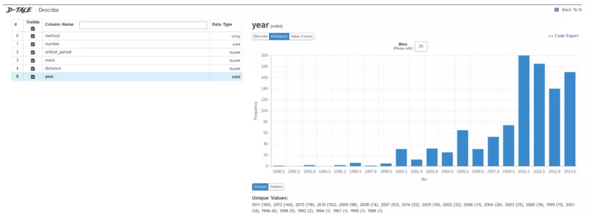
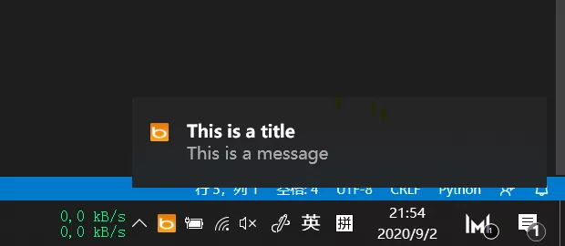

Python
<a name="nV5P7"></a>
## 1、自动化阅读网页新闻
这个脚本能够实现从网页中抓取文本，然后自动化语音朗读，当想听新闻的时候，这是个不错的选择。<br />代码分为两大部分，第一通过爬虫抓取网页文本呢，第二通过阅读工具来朗读文本。<br />需要的第三方库：<br />Beautiful Soup - 经典的HTML/XML文本解析器，用来提取爬下来的网页信息<br />requests - 好用到逆天的HTTP工具，用来向网页发送请求获取数据<br />Pyttsx3 - 将文本转换为语音，并控制速率、频率和语音
```python
import pyttsx3
import requests
from bs4 import BeautifulSoup
engine = pyttsx3.init('sapi5')
voices = engine.getProperty('voices')
newVoiceRate = 130                       ## Reduce The Speech Rate
engine.setProperty('rate',newVoiceRate)
engine.setProperty('voice', voices[1].id)
def speak(audio):
    engine.say(audio)
    engine.runAndWait()
text = str(input("Paste article\n"))
res = requests.get(text)
soup = BeautifulSoup(res.text,'html.parser')

articles = []
for i in range(len(soup.select('.p'))):
    article = soup.select('.p')[i].getText().strip()
    articles.append(article)
text = " ".join(articles)
speak(text)
# engine.save_to_file(text, 'test.mp3') ## If you want to save the speech as a audio file
engine.runAndWait()
```
<a name="fSu7v"></a>
## 2、自动生成素描草图
这个脚本可以把彩色图片转化为铅笔素描草图，对人像、景色都有很好的效果。<br />而且只需几行代码就可以一键生成，适合批量操作，非常的快捷。<br />需要的第三方库：<br />Opencv - 计算机视觉工具，可以实现多元化的图像视频处理，有Python接口
```python
""" Photo Sketching Using Python """
import cv2
img = cv2.imread("elon.jpg")

## Image to Gray Image
gray_image = cv2.cvtColor(img,cv2.COLOR_BGR2GRAY)

## Gray Image to Inverted Gray Image
inverted_gray_image = 255-gray_image

## Blurring The Inverted Gray Image
blurred_inverted_gray_image = cv2.GaussianBlur(inverted_gray_image, (19,19),0)

## Inverting the blurred image
inverted_blurred_image = 255-blurred_inverted_gray_image

### Preparing Photo sketching
sketck = cv2.divide(gray_image, inverted_blurred_image,scale= 256.0)

cv2.imshow("Original Image",img)
cv2.imshow("Pencil Sketch", sketck)
cv2.waitKey(0)
```

<a name="FhDB7"></a>
## 3、自动发送多封邮件
这个脚本可以批量定时发送邮件，邮件内容、附件也可以自定义调整，非常的实用。<br />相比较邮件客户端，Python脚本的优点在于可以智能、批量、高定制化地部署邮件服务。<br />需要的第三方库：<br />Email - 用于管理电子邮件消息<br />Smtlib - 向SMTP服务器发送电子邮件，它定义了一个 SMTP 客户端会话对象，该对象可将邮件发送到互联网上任何带有 SMTP 或 ESMTP 监听程序的计算机<br />Pandas - 用于数据分析清洗地工具
```python
import smtplib 
from email.message import EmailMessage
import pandas as pd

def send_email(remail, rsubject, rcontent):
    email = EmailMessage()                          ## Creating a object for EmailMessage
    email['from'] = 'The Pythoneer Here'            ## Person who is sending
    email['to'] = remail                            ## Whom we are sending
    email['subject'] = rsubject                     ## Subject of email
    email.set_content(rcontent)                     ## content of email
    with smtplib.SMTP(host='smtp.gmail.com',port=587)as smtp:     
        smtp.ehlo()                                 ## server object
        smtp.starttls()                             ## used to send data between server and client
        smtp.login("deltadelta371@gmail.com","delta@371") ## login id and password of gmail
        smtp.send_message(email)                    ## Sending email
        print("email send to ",remail)              ## Printing success message

if __name__ == '__main__':
    df = pd.read_excel('list.xlsx')
    length = len(df)+1

    for index, item in df.iterrows():
        email = item[0]
        subject = item[1]
        content = item[2]

        send_email(email,subject,content)
```
<a name="qLkkG"></a>
## 4、自动化数据探索
数据探索是数据科学项目的第一步，需要了解数据的基本信息才能进一步分析更深的价值。<br />一般会用pandas、matplotlib等工具来探索数据，但需要自己编写大量代码，如果想提高效率，Dtale是个不错的选择。<br />Dtale特点是用一行代码生成自动化分析报告，它结合了Flask后端和React前端，提供了一种查看和分析Pandas数据结构的简便方法。可以在Jupyter上实用Dtale。<br />需要的第三方库：<br />Dtale - 自动生成分析报告
```python
### Importing Seaborn Library For Some Datasets
import seaborn as sns

### Printing Inbuilt Datasets of Seaborn Library
print(sns.get_dataset_names())


### Loading Titanic Dataset
df=sns.load_dataset('titanic')

### Importing The Library
import dtale

#### Generating Quick Summary
dtale.show(df)
```

<a name="mSnBj"></a>
## 5、自动桌面提示
这个脚本会自动触发windows桌面通知，提示重要事项，比如说：您已工作两小时，该休息了<br />可以设定固定时间提示，比如隔10分钟、1小时等<br />用到的第三方库：<br />win10toast - 用于发送桌面通知的工具
```python
from win10toast import ToastNotifier
import time
toaster = ToastNotifier()

header = input("What You Want Me To Remember\n")
text = input("Releated Message\n")
time_min=float(input("In how many minutes?\n"))

time_min = time_min * 60
print("Setting up reminder..")
time.sleep(2)
print("all set!")
time.sleep(time_min)
toaster.show_toast(f"{header}", f"{text}", duration=10, threaded=True)
while toaster.notification_active(): time.sleep(0.005)    
```

