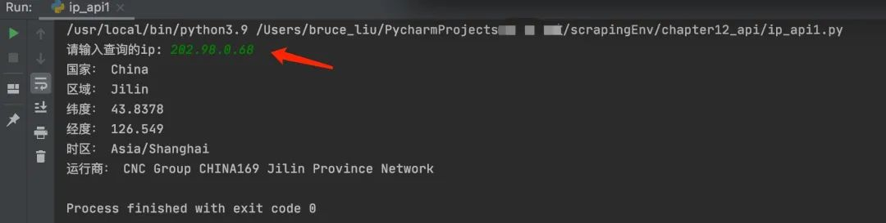
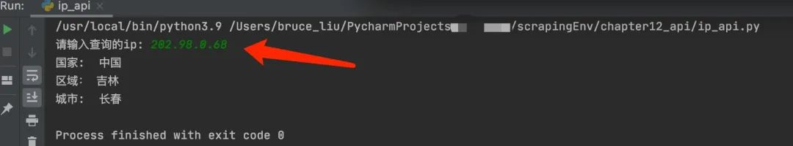

Python<br />Web API经常被那些使用成熟的公开服务（public service）的开发者所使用。例如， ESPN提供了获取运动员信息，比赛分数等信息的API。Google的开发者社区也提供了几十个API，用于语言翻译、分析、地理位置等信息。下面利用ip-api的api和淘宝ip地址库提供的api,编写根据ip地址进行查询实际的物理地址。
<a name="D2omr"></a>
### 示例代码
ip-api.com和淘宝IP地址库提供了一个简单易用的API， 它能将IP地址翻译成实际的物理地址。代码如下：<br />ip-api.com提供的API
```python
import requests
import re
headers = {'User-Agent': 'Mozilla/5.0 (Linux; Android 6.0; Nexus 5 Build/MRA58N) AppleWebKit/537.36 (KHTML, like Gecko) Chrome/107.0.0.0 Mobile Safari/537.36'}
# 匹配 0.0.0.0-255.255.255.255的表达式
pattern = re.compile(r'(([1-9]?\d|1\d\d|2[0-4]\d|25[0-5])\.){3}([1-9]?\d|1\d\d|2[0-4]\d|25[0-5])')
try:    
    myip = input('请输入查询的ip: ')    
    if pattern.fullmatch(myip):        
        url = f'http://ip-api.com/json/{myip}'        
        resp = requests.get(url, headers=headers)        
        print('国家：', dict(resp.json())['country'])        
        print('区域：', dict(resp.json())['regionName'])        
        print('纬度：', dict(resp.json())['lat'])        
        print('经度：', dict(resp.json())['lon'])        
        print('时区：', dict(resp.json())['timezone'])        
        print('运行商：', dict(resp.json())['isp'])    
    else:        
        print('格式不正确！')
except:    
    print('内网IP')
```
运行结果如下图：<br /><br />淘宝IP地址库提供的API，代码如下：
```python
import requests
import ssl
import re
ssl._create_default_https_context = ssl._create_unverified_context
url = 'https://ip.taobao.com/outGetIpInfo'  
# 匹配 0.0.0.0-255.255.255.255的表达式
pattern = re.compile(r'(([1-9]?\d|1\d\d|2[0-4]\d|25[0-5])\.){3}([1-9]?\d|1\d\d|2[0-4]\d|25[0-5])')
try:    
    myip = input('请输入查询的ip: ')    
    if pattern.fullmatch(myip):        
        data = {            
            'ip': myip,            
            'accessKey': 'alibaba-inc'       
        }        
        resp = requests.post(url=url, params=data)        
        print('国家: ', re.search('"country":"(.*?)"', resp.text).group(1))        
        print('区域：', re.search('"region":"(.*?)"', resp.text).group(1))        
        print('城市: ', re.search('"city":"(.*?)"', resp.text).group(1))    
    else:        
        print('输入格式不正确')
except Exception as error:
    print(error)
```
运行结果如下图：<br />

