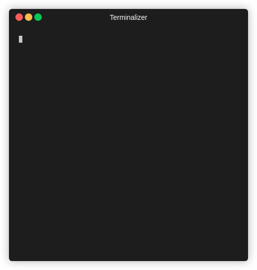

Python Ciphey<br /><br />Ciphey 是一个使用自然语言处理和人工智能的全自动解密/解码/破解工具。<br />简单地来讲，只需要输入加密文本，它就能返回解密文本。就是这么牛逼。<br />有了Ciphey，根本不需要知道密文是哪种类型的加密，只知道它是加密的，那么Ciphey就能在3秒甚至更短的时间内解密，返回大部分密文的答案。


## 1、准备
请选择以下任一种方式输入命令安装依赖：

1. Windows 环境 打开 Cmd (开始-运行-CMD)。
2. MacOS 环境 打开 Terminal (command+空格输入Terminal)。
3. 如果用的是 VSCode编辑器 或 Pycharm，可以直接使用界面下方的Terminal。
```bash
pip install -U ciphey
```

## 2、Ciphey 基本使用
有3种方法可以运行 Ciphey：

### 1. 文件输入
```bash
ciphey -f encrypted.txt
# 或
python -m ciphey -f encrypted.txt
```

### 2. 不规范的方法
```bash
ciphey -- "Encrypted input"
# 或
python -m ciphey -- "Encrypted input"
```

### 3. 正常方式
```bash
ciphey -t "Encrypted input"
# 或
python -m ciphey -t "Encrypted input"
```
如下图所示：

<br />要去除进度条、概率表和所有噪音，请使用安静模式：

```bash
ciphey -t "encrypted text here" -q
```

## 3、在Python中调用Ciphey
如果需要在Python中使用Ciphey，请这样使用：
```python
from ciphey.__main__ import main, main_decrypt, make_default_config
main_decrypt(make_default_config("SGVsbG8gbXkgbmFtZSBpcyBiZWUgYW5kIEkgbGlrZSBkb2cgYW5kIGFwcGxlIGFuZCB0cmVl"))
# >> Hello my name is bee and I like dog and apple and tree
```
运行后会输出如下的结果：<br /><br />效果还是相当不错的，如果不想输出概率表，只想要解密内容，代码需要这么写：
```python
from ciphey.__main__ import main, main_decrypt, make_default_config
config = make_default_config("SGVsbG8gbXkgbmFtZSBpcyBiZWUgYW5kIEkgbGlrZSBkb2cgYW5kIGFwcGxlIGFuZCB0cmVl")
config["grep"] = True
main_decrypt(config)
# >> Hello my name is bee and I like dog and apple and tree
```
<br />非常Nice，根本无需知道这是什么密文/编码。<br />Ciphey 支持解密的密文和编码多达51种，下面列出一些基本的选项<br />基本密码：

- Caesar Cipher
- ROT47 (up to ROT94 with the ROT47 alphabet)
- ASCII shift (up to ROT127 with the full ASCII alphabet)
- Vigenère Cipher
- Affine Cipher
- Binary Substitution Cipher (XY-Cipher)
- Baconian Cipher (both variants)
- Soundex
- Transposition Cipher
- Pig Latin

现代密码学：

- Repeating-key XOR
- Single XOR

编码：

- Base32
- Base64
- Z85 (release candidate stage)
- Base65536 (release candidate stage)
- ASCII
- Reversed text
- Morse Code
- DNA codons (release candidate stage)
- Atbash
- Standard Galactic Alphabet (aka Minecraft Enchanting Language)
- Leetspeak
- Baudot ITA2
- URL encoding
- SMS Multi-tap
- DMTF (release candidate stage)
- UUencode
- Braille (Grade 1)
- ......

Ciphey 的功能不仅介绍的这些，这里介绍的只是冰山一角，它还可以添加属于自己的解码器：<br />[https://github.com/Ciphey/Ciphey/wiki/Adding-your-own-ciphers](https://github.com/Ciphey/Ciphey/wiki/Adding-your-own-ciphers)<br />如果要进一步的学习，可以在上述 Ciphey 的 Github Wiki 介绍中，查阅到更多的资料，进行更深层次的学习。
