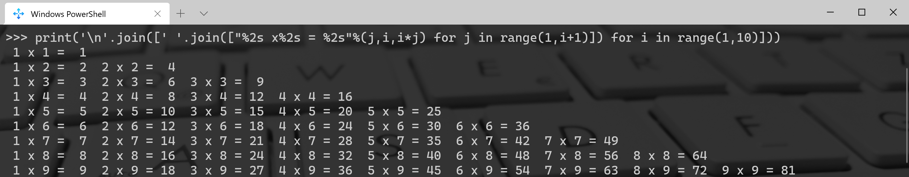
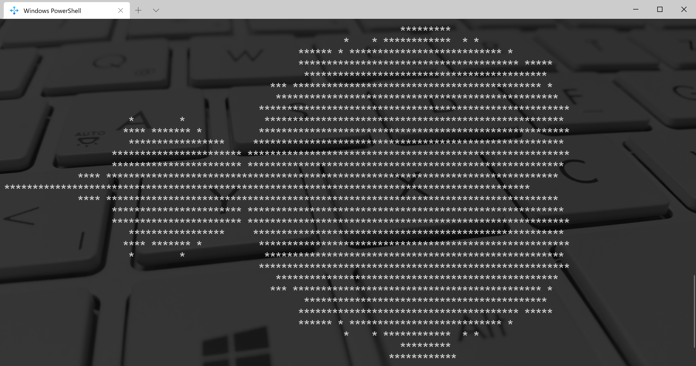
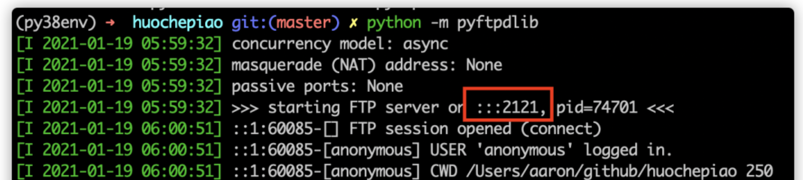

Python
<a name="njU9S"></a>
### 1. 一行代码打印乘法口诀
```python
print('\n'.join([' '.join(["%2s x%2s = %2s"%(j,i,i*j) for j in range(1,i+1)]) for i in range(1,10)]))
```

<a name="FemS0"></a>
### 2. 一行代码打印迷宫
```python
print(''.join(__import__('random').choice('\u2571\u2572') for i in range(50*24)))
```

<a name="UTfLL"></a>
### 3. 一行代码表白爱情
```python
print('\n'.join([''.join([('Love'[(x-y) % len('Love')] if ((x*0.05)**2+(y*0.1)**2-1)**3-(x*0.05)**2*(y*0.1)**3 <= 0else' ') for x in range(-30, 30)]) for y in range(30, -30, -1)]))
```

<a name="yzeWS"></a>
### 4. 一行代码打印小龟龟
```python
print('\n'.join([''.join(['*' if abs((lambda a:lambda z,c,n:a(a,z,c,n))(lambda s,z,c,n:z if n==0 else s(s,z*z+c,c,n-1))(0,0.02*x+0.05j*y,40))<2 else ' ' for x in range(-80,20)]) for y in range(-20,20)]))
```

<a name="IpjTa"></a>
### 5、一行代码实现 ftp 服务
假如需要临时起个 ftp 服务或者临时搭建个 ftp 用来传输文件，都能用 python 一行命令搞定：<br />比如说 ftp 服务，需要先要安装 pyftpdlib, 然后通过下面的一条命令就完成了当前目录 ftp 服务的搭建：
```bash
python3 -m pyftpdlib
```
结果如下图所示，注意该 ftp 服务服务器使用的端口号。<br /><br />一般情况下默认的端口号是 21，这里是 2121，那么浏览器访问该 ftp 地址的话就是ftp://localhost:2121/。<br />可以基于这个库来定义自己的 ftp 服务器，比如说设置匿名用户只读，登录用户可写，不同的用户访问不同的目录等权限控制。
<a name="yByBe"></a>
### 6、一行代码实现 http 服务器
开启 http 服务，不需要安装什么包，直接执行下面命令就可以了：
```bash
python3 -m http.server 8080
```
这样就启动了本机 8080 端口的 http 服务，根路径就是执行该命令所在的路径。关于 http.server，它定义了实现 HTTP 服务器（ Web 服务器）的类，官方文档不推荐在生产环境中使用 http.server，因为它只实现了基本的安全检查功能。
<a name="oVdPX"></a>
### 7、一行代码下载任意视频
You-Get 是一个基于 Python3 的下载工具。使用 You-Get 可以很轻松的下载到网络上的视频、图片及音乐。使用前先安装：
```bash
 pip3 install you-get
```
然后就可以下载视频了：
```bash
you-get [视频 url]
```
比如说下载图片
```bash
you-get https://stallman.org/rms.jpg
```
下载视频
```bash
you-get 'https://www.youtube.com/watch?v=jNQXAC9IVRw'
```
官方仓库还有更多用法：[https://github.com/soimort/you-get](https://github.com/soimort/you-get)
<a name="CYBrk"></a>
### 8、一行代码打开自带的 web 文档
当使用 Python 的标准库或者已安装的三方库时，可能想去网上搜索。如果服务器不联网，那就尴尬了，以下命令可以自动打开一个浏览器，显示已安装的库的文档，非常方便查询 api。
```bash
python3 -m pydoc -b
```
不使用 web 看的话，可以这样：
```bash
python3 -m pydoc datetime
```
就可以在命令行查看 datetime 模块的文档和接口。
<a name="GXY1a"></a>
### 9、一行代码实现图片文字识别
Google 开源的 OCR 库，其实代码不止一行，只要安装好了轮子，一切都是那么的简单：
```python
try:
    from PIL import Image
except ImportError:
    import Image
import pytesseract

# If you don't have tesseract executable in your PATH, include the following:
pytesseract.pytesseract.tesseract_cmd = r'<full_path_to_your_tesseract_executable>'
# Example tesseract_cmd = r'C:\Program Files (x86)\Tesseract-OCR\tesseract'

# Simple image to string
print(pytesseract.image_to_string(Image.open('test.png')))
```
具体安装，请参考官网文档：[https://github.com/madmaze/pytesseract](https://github.com/madmaze/pytesseract) 不再赘述。
<a name="bdTiL"></a>
### 10、一行代码玩游戏
先安装轮子
```bash
pip install feegames
```
查看有哪些游戏
```bash
python -m freegames list
```
比如说玩贪吃蛇<br />
