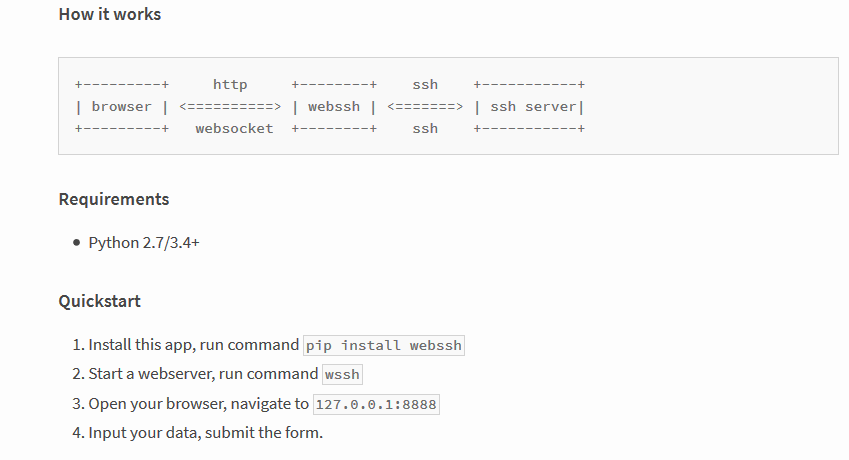
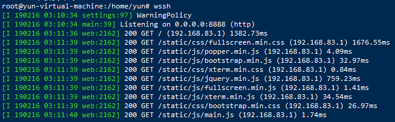
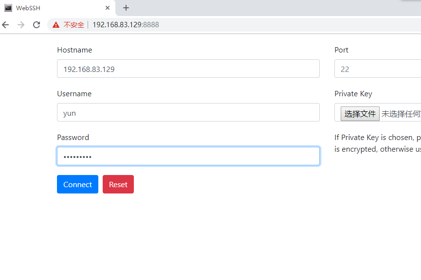
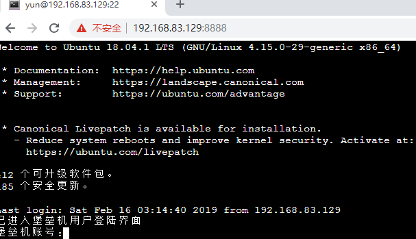

Python ssh
<a name="Utn58"></a>
## webssh简介
这个工具是使用Python开发，可以从下面地址了解详情。<br />官网：[https://pypi.org/project/webssh/](https://pypi.org/project/webssh/)<br />webssh这个工具可以做什么？<br />在Linux机器上安装Python环境，并且使用命令`pip3 install webssh`，装上这个模块<br />就可以在浏览器web页面登录Linux机器！
<a name="qDi5X"></a>
## 功能

- 支持SSH密码验证，包括空密码。
- 支持SSH公钥认证，包括DSA RSA ECDSA Ed25519密钥。
- 支持加密密钥。
- 支持两要素身份验证（基于时间的一次性密码）
- 支持全屏终端。
- 终端窗口可调整大小。
- 自动检测ssh服务器的默认编码。
- 现代浏览器支持Chrome，Firefox，Safari，Edge，Opera。


<a name="l4n4S"></a>
## 安装
```bash
pip3 install webssh
```
<a name="inMIJ"></a>
## 运行服务
```bash
# 直接运行wssh，使用默认8888端口
wssh

# 通过绑定IP地址和端口启动
wssh --address='192.168.83.129' --port=8888
wssh --address='0.0.0.0' --port=8888

# 通过绑定IP地址和端口启动，只允许本地地址访问
wssh --address='127.0.0.1' --port=8888
```
<a name="WhnOH"></a>
## 启动服务效果

<a name="WzgA6"></a>
## 使用
打开浏览器，输入 [http://192.168.83.129:8888](http://192.168.83.129:8888)<br /><br />点击Connect<br /><br />**注意：**<br />服务启动后，可以通过 [http://192.168.83.129:8888/](http://192.168.83.129:8888/) 或 [http://localhost:8888](http://localhost:8888) 来访问。<br />页面会要求输入要登录的机器名，端口，用户和密码，然后就可以SSH到指定机器了。<br />若要使用root用户登录Webssh，必须修改配置文件 `vim /etc/ssh/sshd_config`<br />注释掉 `#PermitRootLogin without-password` 添加`PermitRootLogin yes`
```bash
# Authentication:
LoginGraceTime 120

#PermitRootLogin prohibit-password
PermitRootLogin yes
StrictModes yes
```
然后重启服务即可。
