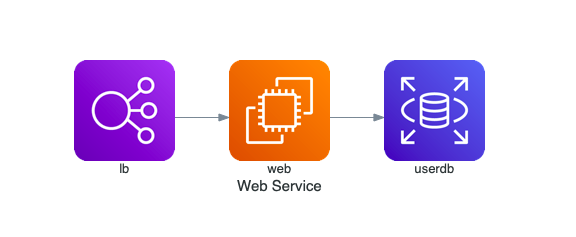
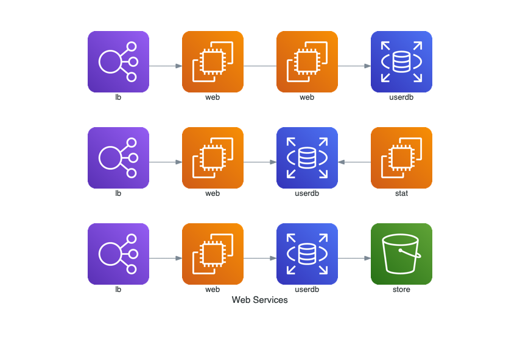
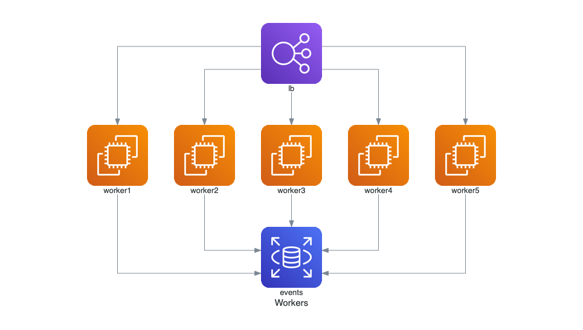
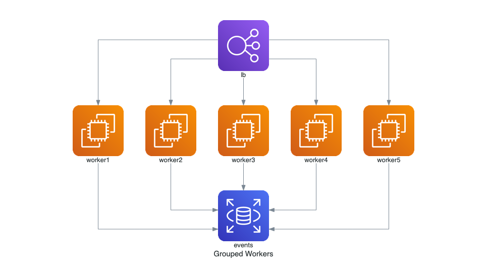
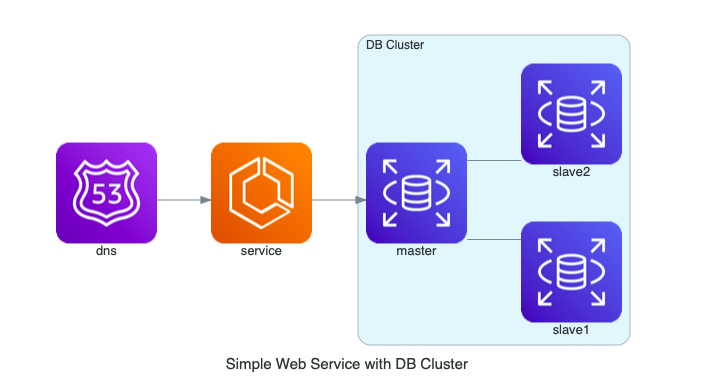
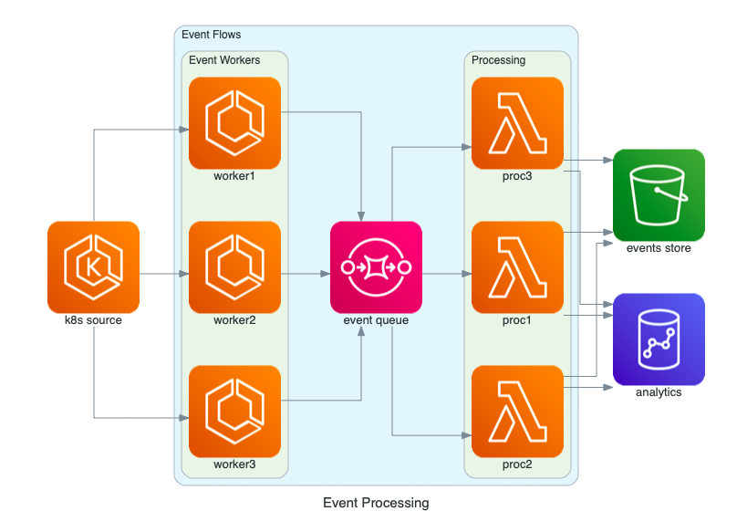
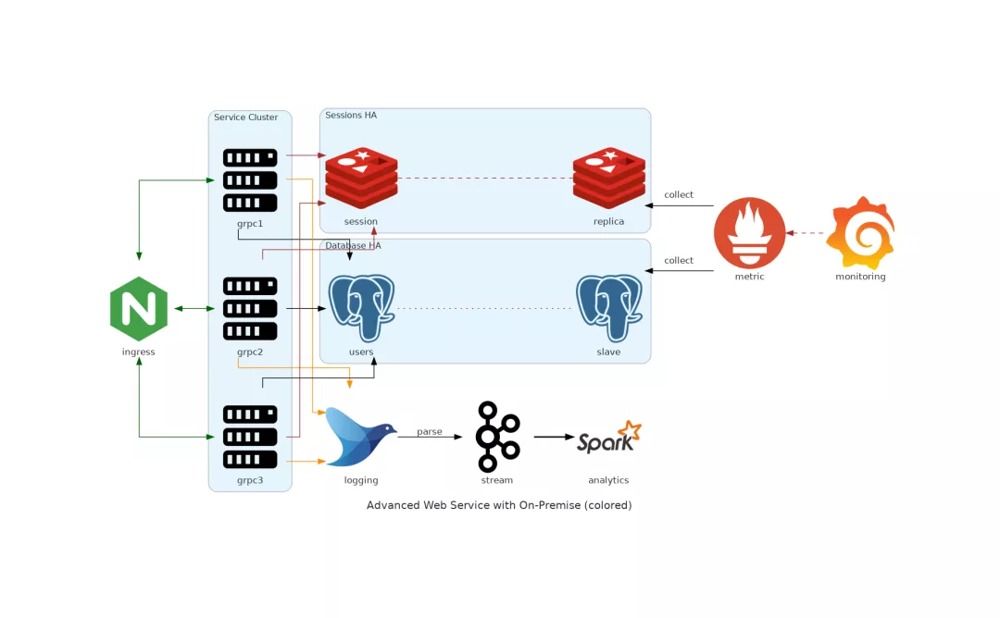

Python
<a name="Y7zpF"></a>
## 简介
Diagrams 可以用 Python 代码绘制云系统架构。无需使用任何其他工具（比如 visio），就可以用它来为一个全新的系统架构进行原型设计。当然它也可以用来绘制现有的系统架构。<br />Diagrams 目前支持的主要提供商包括：AWS、Azure、GCP、Kubernetes、阿里云、Oracle云等。同时它也支持本地节点、SaaS和主流的编程框架和语言。<br />Diagram as Code 还能跟踪各种版本控制系统中的体系结构图变化。
:::danger
它不能控制任何实际的云资源也不能生成云信息或地形代码。它只能绘制云系统架构图。
:::
开源地址：[https://github.com/mingrammer/diagrams](https://github.com/mingrammer/diagrams)
<a name="btyJr"></a>
## 安装使用
需要 `Python 3.6` 版本及以上，使用前请先检测Python版本。<br />绘制时需要使用 Graphviz，所以需要先安装 Graphviz。
:::info
macOS 用户可以使用 `brew install graphviz` 命令来下载 Graphviz。<br />Window用户可以自行到Graphviz官网进行下载[http://www.graphviz.org/](http://www.graphviz.org/)，或者使用Window包管理器winget或者[Chocolatey](https://chocolatey.org/packages/Graphviz)进行下载
:::
```bash
# Linux用户安装Graphviz的几种方式
# Ubuntu packages*
$ sudo apt install graphviz
# Fedora project*
$ sudo yum install graphviz
# Debian packages*
$ sudo apt install graphviz
# Stable and development rpms for Redhat Enterprise, or CentOS systems* available but are out of date.
$ sudo yum install graphviz

# Window用户安装Graphviz的两种方式
# Chocolatey packages Graphviz for Windows.
> choco install graphviz
# Windows Package Manager provides Graphviz Windows packages.
> winget install graphviz

# Mac用户安装Graphviz的方式
$ sudo port install graphviz
# Homebrew* has a Graphviz port.
$ brew install graphviz
```
<a name="azT9i"></a>
### 安装 diagrams
```bash
# using pip (pip3)
$ pip install diagrams
# using pipenv
$ pipenv install diagrams
# using poetry
$ poetry add diagrams
```
<a name="c1b18ad6"></a>
## 快速上手
```python
# diagram.py
from diagrams import Diagram
from diagrams.aws.compute import EC2
from diagrams.aws.database import RDS
from diagrams.aws.network import ELB
with Diagram("Web Service", show=False):
    ELB("lb") >> EC2("web") >> RDS("userdb")
```
运行此代码，将会生成一个如下的图：<br /><br />在工作目录会生成一个web_service.png。<br />接下来主要分四块看一下 diagrams 的构成，分别是：图、节点、集群和边。
<a name="Do9Sw"></a>
### 一、图
Diagram是展现关系图最关键的部分。
<a name="RDrqF"></a>
#### 基础使用
可以使用 Diagram 类来创建一个关系图的上下文。Diagram 构造函数的第一个参数是输出的文件名。来看一个例子：
```python
from diagrams import Diagram
from diagrams.aws.compute import EC2
with Diagram("Simple Diagram"):
    EC2("web")
```
在 cmd 输入 `python diagram.py` 来执行下，代码会在代码目录生成一个 simple_diagram.png 文件，可以看到里面只有一个 EC2 节点。
<a name="MeNvD"></a>
#### Jupyter Notebooks
Diagrams也可以直接在Jupyter的notebook里使用，示例如下：
```python
from diagrams import Diagram
from diagrams.aws.compute import EC2
with Diagram("Simple Diagram") as diag:
    EC2("web")
diag
```
<a name="zCK4S"></a>
#### 可选项
可以指定输出文件的格式，默认格式是.png，比如将默认的png格式改为jpg格式：
:::success
(png, jpg, svg, and pdf) 都是允许的格式
:::
```python
from diagrams import Diagram
from diagrams.aws.compute import EC2
with Diagram("Simple Diagram", outformat="jpg"):
    EC2("web")
```
也可以使用 filename 参数来指定输出的文件名，但此时不能再指定扩展名，因为扩展名是由 outformat 指定的，下面将文件名指定为 my_diagram：
```python
from diagrams import Diagram
from diagrams.aws.compute import EC2
with Diagram("Simple Diagram", filename="my_diagram"):
    EC2("web")
```
也使用 show 参数来禁用文件自动打开，默认是True：
```python
from diagrams import Diagram
from diagrams.aws.compute import EC2
with Diagram("Simple Diagram", show=False):
    EC2("web")
```
它还允许自定义Graphviz点属性选项，比如：
```python
from diagrams import Diagram
from diagrams.aws.compute import EC2
graph_attr = {
    "fontsize": "45",
    "bgcolor": "transparent"
}
with Diagram("Simple Diagram", show=False, graph_attr=graph_attr):
    EC2("web")
```
graph_attr, node_attr 和 edge_attr 都是支持的。具体可查看链接：[https://www.graphviz.org/doc/info/attrs.html.](https://www.graphviz.org/doc/info/attrs.html.)
<a name="KCtYe"></a>
### 二、节点
Node是展现节点或系统组成的第二个对象。
<a name="52CuE"></a>
#### 基础使用
节点是表示单个系统组件对象的抽象概念。节点对象由三部分组成：提供者、资源类型和名称。
```python
from diagrams import Diagram
from diagrams.aws.compute import EC2
with Diagram("Simple Diagram"):
    EC2("web")
```
在上面的例子中，EC2 是由 aws 提供者提供的计算资源类型的节点。<br />可以以类似的方式使用其他节点对象，例如：
```python
# aws 资源
from diagrams.aws.compute import ECS, Lambda
from diagrams.aws.database import RDS, ElastiCache
from diagrams.aws.network import ELB, Route53, VPC
...
# azure 资源
from diagrams.azure.compute import FunctionApps
from diagrams.azure.storage import BlobStorage
...
# 阿里云 资源
from diagrams.alibabacloud.compute import ECS
from diagrams.alibabacloud.storage import ObjectTableStore
...
# gcp 资源
from diagrams.gcp.compute import AppEngine, GKE
from diagrams.gcp.ml import AutoML 
...
# k8s 资源
from diagrams.k8s.compute import Pod, StatefulSet
from diagrams.k8s.network import Service
from diagrams.k8s.storage import PV, PVC, StorageClass
...
# oracle 资源
from diagrams.oci.compute import VirtualMachine, Container
from diagrams.oci.network import Firewall
from diagrams.oci.storage import Filestorage, Storagegateway
```
<a name="DiSLN"></a>
#### 数据流
可以通过使用以下运算符：`>>、<< 和 -` 连接节点来表示数据流。

- >>：从左到右连接节点。
- <<：从右向左连接节点。
- -：无方向连接节点。无方向的。
```python
from diagrams import Diagram
from diagrams.aws.compute import EC2
from diagrams.aws.database import RDS
from diagrams.aws.network import ELB
from diagrams.aws.storage import S3
with Diagram("Web Services", show=False):
    ELB("lb") >> EC2("web") >> RDS("userdb") >> S3("store")
    ELB("lb") >> EC2("web") >> RDS("userdb") << EC2("stat")
    (ELB("lb") >> EC2("web")) - EC2("web") >> RDS("userdb")
```
:::info
使用 `-` 和任何 `shift` 运算符时要注意，可能会因为运算优先级导致非预期的结果。
:::
<br />图展现的顺序跟代码声明的顺序相反。<br />可以使用direction参数来改变数据流方向，默认是LR。
:::info
TB、BT、LR 和 RL 都是可选的。
:::
```python
from diagrams import Diagram
from diagrams.aws.compute import EC2
from diagrams.aws.database import RDS
from diagrams.aws.network import ELB
with Diagram("Workers", show=False, direction="TB"):
    lb = ELB("lb")
    db = RDS("events")
    lb >> EC2("worker1") >> db
    lb >> EC2("worker2") >> db
    lb >> EC2("worker3") >> db
    lb >> EC2("worker4") >> db
    lb >> EC2("worker5") >> db
```

<a name="NObJo"></a>
#### 组数据流
上面的worker示例有很多冗余流。这种情况下，可以使用组数据流将节点分组到一个列表中，以便所有节点同时连接到其他节点。
```python
from diagrams import Diagram
from diagrams.aws.compute import EC2
from diagrams.aws.database import RDS
from diagrams.aws.network import ELB
with Diagram("Grouped Workers", show=False, direction="TB"):
    ELB("lb") >> [EC2("worker1"),
                  EC2("worker2"),
                  EC2("worker3"),
                  EC2("worker4"),
                  EC2("worker5")] >> RDS("events")
```
<br />
:::warning
不能直接连接两个列表，因为在Python中不允许在列表之间进行移位/算术操作
:::
<a name="T9WpO"></a>
### 三、集群
集群允许将节点分组放在一个独立的组中。
<a name="u7S50"></a>
#### 基础使用
Cluster表示本地群集上下文。<br />可以使用cluster类创建集群上下文。还可以将集群中的节点连接到集群外的其他节点。
```python
from diagrams import Cluster, Diagram
from diagrams.aws.compute import ECS
from diagrams.aws.database import RDS
from diagrams.aws.network import Route53
with Diagram("Simple Web Service with DB Cluster", show=False):
    dns = Route53("dns")
    web = ECS("service")
    with Cluster("DB Cluster"):
        db_master = RDS("master")
        db_master - [RDS("slave1"),
                     RDS("slave2")]
dns >> web >> db_master
```

<a name="0Zk1E"></a>
#### 嵌套集群
嵌套集群也是可以使用的。
```python
from diagrams import Cluster, Diagram
from diagrams.aws.compute import ECS, EKS, Lambda
from diagrams.aws.database import Redshift
from diagrams.aws.integration import SQS
from diagrams.aws.storage import S3
with Diagram("Event Processing", show=False):
    source = EKS("k8s source")
    with Cluster("Event Flows"):
        with Cluster("Event Workers"):
            workers = [ECS("worker1"),
                       ECS("worker2"),
                       ECS("worker3")]
        queue = SQS("event queue")
        with Cluster("Processing"):
            handlers = [Lambda("proc1"),
                        Lambda("proc2"),
                        Lambda("proc3")]
    store = S3("events store")
    dw = Redshift("analytics")
    source >> workers >> queue >> handlers
    handlers >> store
    handlers >> dw
```
<br />嵌套没有深度限制，可以随意创建任意深度的嵌套集群。
<a name="XGqN7"></a>
### 四、边
边表示节点之间的边。
<a name="QGftZ"></a>
#### 基础使用
Edge是一个对象，表示具有某些附加属性的节点之间的连接。<br />一个edge对象包含三个属性：label、color和style，它们对应相应的graphviz的边属性。
```python
from diagrams import Cluster, Diagram, Edge
from diagrams.onprem.analytics import Spark
from diagrams.onprem.compute import Server
from diagrams.onprem.database import PostgreSQL
from diagrams.onprem.inmemory import Redis
from diagrams.onprem.logging import Fluentd
from diagrams.onprem.monitoring import Grafana, Prometheus
from diagrams.onprem.network import Nginx
from diagrams.onprem.queue import Kafka
with Diagram(name="Advanced Web Service with On-Premise (colored)", show=False):
    ingress = Nginx("ingress")
    metrics = Prometheus("metric")
    metrics << Edge(color="firebrick", style="dashed") << Grafana("monitoring")
    with Cluster("Service Cluster"):
        grpcsvc = [
            Server("grpc1"),
            Server("grpc2"),
            Server("grpc3")]
        with Cluster("Sessions HA"):
            master = Redis("session")
            master - Edge(color="brown", style="dashed") - Redis("replica") << Edge(label="collect") << metrics
            grpcsvc >> Edge(color="brown") >> master
            with Cluster("Database HA"):
                master = PostgreSQL("users")
                master - Edge(color="brown", style="dotted") - PostgreSQL("slave") << Edge(label="collect") << metrics
                grpcsvc >> Edge(color="black") >> master
                aggregator = Fluentd("logging")
                aggregator >> Edge(label="parse") >> Kafka("stream") >> Edge(color="black", style="bold") >> Spark("analytics")
                ingress >> Edge(color="darkgreen") << grpcsvc >> Edge(color="darkorange") >> aggregator
```

<a name="WTave"></a>
## 扩展
如果想了解更多，可以观看更多的官方示例：[https://diagrams.mingrammer.com/docs/getting-started/examples](https://diagrams.mingrammer.com/docs/getting-started/examples)
