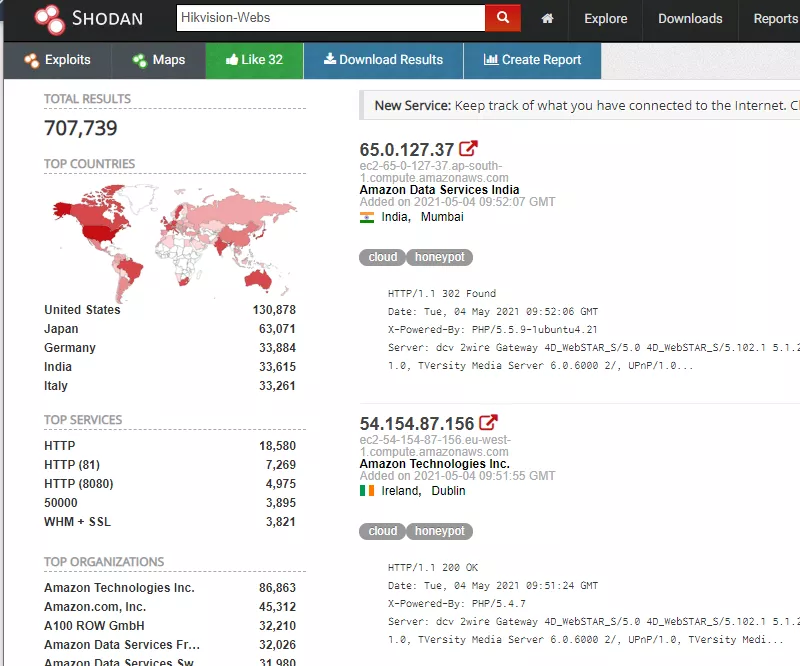
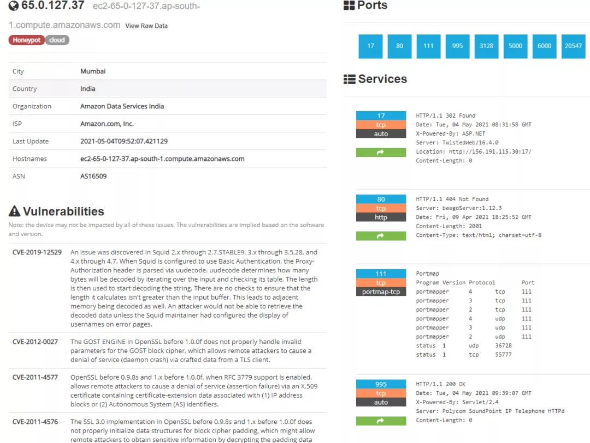
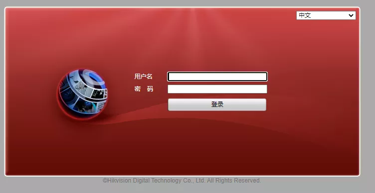
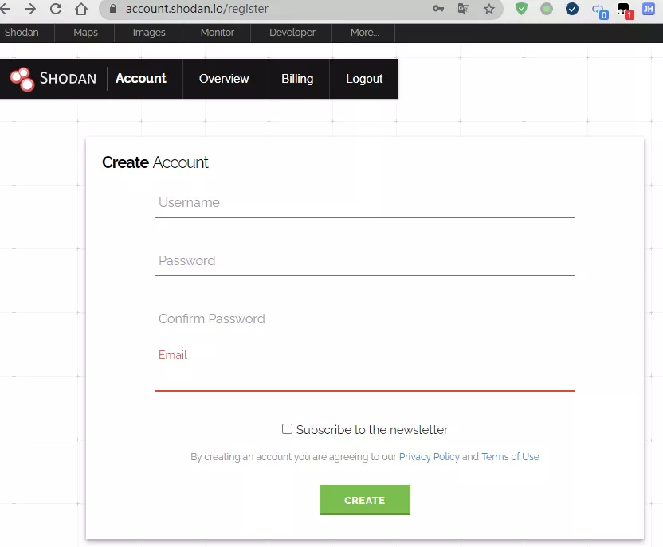
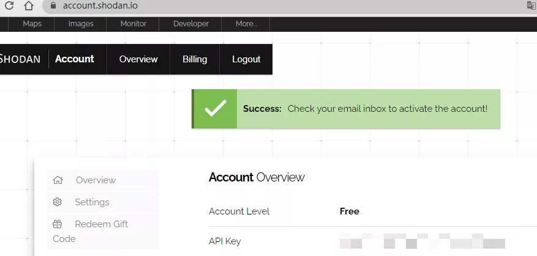
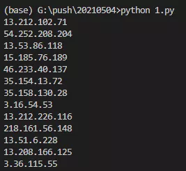
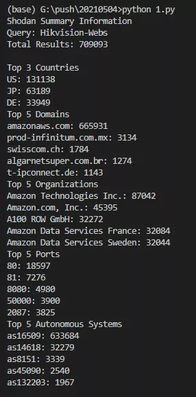

搜索引擎<br />Shodan 在百度百科里被给出了这么一句话介绍：Shodan是互联网上最可怕的搜索引擎。<br />为什么呢？与谷歌、百度等搜索引擎爬取网页信息不同，Shodan爬取的是互联网上所有设备的IP地址及其端口号。<br />而随着智能家电的普及，家家户户都有许多电器连接到互联网，这些设备存在被入侵的可能性，这是十分危险的。<br />体验下shodan，有更切身的理解。打开 shodan.io，在搜索框输入 Hikvision-Webs :<br /><br />可以搜索到这个品牌的摄像头设备遍及全球的IP及其暴露的端口号：<br /><br />可以看到，这台机器暴露了17、80、111、995、3128、5000、6000、20547端口，黑客可以根据这些端口进行针对性的攻击。<br />不过也不需要过于担心，如果服务不存在漏洞，一般是无法攻入的。但有些端口号会暴露摄像头的web管理端，如下：<br /><br />那么黑客可能可以用暴力破解的方式，强行进入摄像头后台管理端，获取到实时的录像。<br />谨记这会侵犯别人的隐私权，是违法的行为，遵纪守法的好公民所以知道它的原理和危害就足够。目的是运用技术保护好个人隐私，如非必要不将摄像头接入互联网，一定要接入的话，不能使用容易被破解的弱口令。<br />Shodan Web端非常好用，但如果有从 Python 搜索的需求怎么办？<br />没关系，Shodan 官方也提供了 Python SDK 包，下面就来讲讲这个 SDK 包的使用。
<a name="C7n48"></a>
## 1、准备
开始之前，要确保Python和pip已经成功安装在电脑上。<br />请选择以下任一种方式输入命令安装依赖：

1. Windows 环境 打开 Cmd (开始-运行-CMD)。
2. MacOS 环境 打开 Terminal (command+空格输入Terminal)。
3. 如果用的是 VSCode编辑器 或 Pycharm，可以直接使用界面下方的Terminal.
```bash
pip install shodan
```
<a name="PkbZo"></a>
## 2、注册账号获取API
使用 Shodan 必须注册账号，注册网址：[https://account.shodan.io/register](https://account.shodan.io/register)<br /><br />输入完相关信息，点击 CREATE 会跳转到个人账户页：<br /><br />此时 API Key 会显示API秘钥，请记录这个秘钥，后续会使用到这个秘钥去请求接口。
<a name="VFQnw"></a>
## 3、Shodan 基本调用
Shodan 本质上就是一个搜索引擎，只需要输入搜索的关键词：
```python
from shodan import Shodan

api = Shodan('你的API KEY')

def search_shodan(keyword):
    # 调用搜索接口
    result = api.search(keyword)

    # 显示所有IP
    for service in result['matches']:
            print(service['ip_str'])

search_shodan("Hikvision-Webs")
```
结果如下：<br /><br />可惜的是，普通API只能像这样搜索关键字，无法使用过滤条件如： Hikvision-Webs country:"US" 搜索美国境内的所有 Hikvision 网站管理端。<br />如果要使用过滤条件，Shodan 需要升级API权限：<br /><br />挺贵的，不过还好是一次性支付，永久使用。
<a name="AqOm7"></a>
## 4、Shodan 高级使用
Shodan 的用处当然不仅仅是在黑客攻防中，它还能用于统计。如果想要了解哪些国家的使用这款摄像头的数量最多，可以使用 Facets 特性。
```python
from shodan import Shodan

api = Shodan('你的API KEY')
def try_facets(query):
    FACETS = [
        'org',
        'domain',
        'port',
        'asn',
        ('country', 3),
    ]

    FACET_TITLES = {
        'org': 'Top 5 Organizations',
        'domain': 'Top 5 Domains',
        'port': 'Top 5 Ports',
        'asn': 'Top 5 Autonomous Systems',
        'country': 'Top 3 Countries',
    }

    try:
        # 使用 count() 方法可以不需要升级API，且比 search 方法更快。
        result = api.count(query, facets=FACETS)

        print('Shodan Summary Information')
        print('Query: %s' % query)
        print('Total Results: %s\n' % result['total'])

        # 显示每个要素的摘要
        for facet in result['facets']:
            print(FACET_TITLES[facet])

            for term in result['facets'][facet]:
                print('%s: %s' % (term['value'], term['count']))

    except Exception as e:
        print('Error: %s' % e)

try_facets("Hikvision-Webs")
```
得到结果如下：

<br />从 Top 3 Countries 中可以看到，这款摄像头使用数量排名前三的国家分别是：美国、日本和德国。<br />没想到吧，Shodan 居然还能用于产品分析。同样地原理，如果把关键词改为 apache ，可以知道目前哪些国家使用apache服务器数量最多，最普遍被使用的版本号是什么。<br />简而言之，Shodan 是一个非常强大的搜索引擎，它在好人手里，能被发挥出巨大的潜能。如果 Shodan 落入坏人之手的话，那真是一个可怕的东西。<br />为了避免受到不必要的攻击，请大家及时检查所有联网设备的管理端的密码，如果有使用默认密码及弱口令，立即进行密码的更改，以保证服务的安全。
