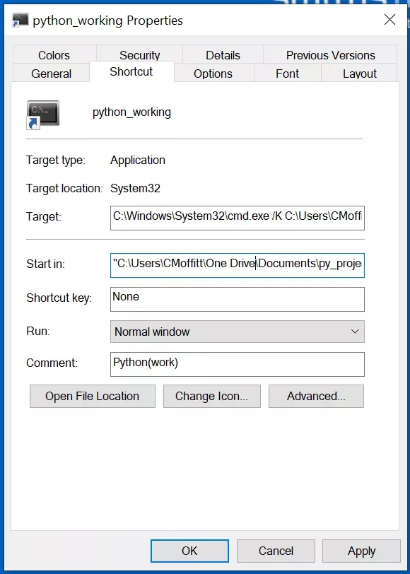
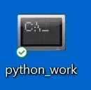

Python<br />miniconda 是一款非常棒的工具，它可以快速的开启虚拟环境，并在独立的环境中使用特有的第三方库，从而达到不同环境之间的隔离效果。<br />默认情况下，miniconda 会尽量减少对系统的影响。例如，默认安装不会将任何 python 信息添加到操作系统的默认路径，也不需要管理员权限就可以进行安装。这些看起来都非常棒，但这同样意味着需要执行一些额外的步骤才能让 Python 环境在标准的 Windows 提示符下工作，对于新手来说，并不是特别友好。<br />幸运的是，Anaconda (fka Continuum) 提供了启动 powershell 或命令提示符的所有基础功能，默认安装会创建一些快捷方式来做到这一点，但是，很难修改这些快捷方式来自定义工作目录。<br />为了达到快速从某个目录启动 conda 的目的，自己创建一个快捷方式。
<a name="QFgKG"></a>
## 整体思路
一旦安装了 miniconda，启动 python shell 的首选方法就是使用 miniconda 的 activate.bat 文件来配置 shell 环境。在系统上（默认安装 miniconda），文件存储在这里：C:/Users/luobo/AppData/Local/Continuum/miniconda3/Scripts/activate.bat 。<br />一般情况下，都不会直接在 conda 下面进行编码，而是会创建一个工作环境。<br />当 conda 在 Windows 上创建新环境时，该环境的默认目录位置如下所示：C:/Users/luobo/AppData/Local/Continuum/miniconda3/envs/work 。可以将此完整路径传递给 activate.bat 文件，它会启动并自动启动并激活工作环境。<br />启动难题的最后一部分是使用 cmd.exe /K 来执行一个 shell 命令，并返回激活环境成功的提示。<br />完整的命令看起来像这样：
```powershell
cmd.exe /K C:/Users/luobo/AppData/Local/Continuum/miniconda3/Scripts/activate.bat C:/Users/luobo/AppData/Local/Continuum/miniconda3/envs/work
```
好了，上面就是一个整体编码思路了，还是比较清晰的，下面就开始吧。
<a name="HHi40"></a>
## 特殊文件夹
从上面的描述看一看到，miniconda 文件的路径隐藏得很深，并且这个目录还取决于登录用户的个人资料。所以为了制作的快捷方式具有通用性，显然是不能进行硬编码的。<br />这里可以使用 winshell 这个第三方库，它提供了访问 Windows 上特殊目录的快捷操作方式。这样，脚本应该可以在其他人的机器上无缝运行，并且可以跨不同版本的 Windows 运行。
```python
import winshell
from pathlib import Path
```
如果想获取用户的配置文件目录，可以使用文件夹功能。
```python
profile = winshell.folder('profile')
```
Output:
```python
'C:\\用户\\luobo`
```
Winshell 提供对许多不同文件夹的访问，这些文件夹可以通过其 CSIDL（常量特殊 ID 列表）进行访问。<br />那么通过上面的例子，也可以推导出， minicodan 的目录。
```python
miniconda_base = Path(winshell.folder('CSIDL_LOCAL_APPDATA')) / 'Continuum' / 'miniconda3')
miniconda_base.is_dir()
```
Output:
```python
True
```
可以看到，通过测试，拿到的路径是正确的。<br />需要的另一个位置是 cmd.exe，可以通过 CSIDL_SYSTEM 获得它。
```python
win32_cmd = str(Path(winshell.folder('CSIDL_SYSTEM')) / 'cmd.exe')
```
注意到这里使用 str 将 Path 转换为字符串，这样做是因为 winshell 期望它的所有输入都是字符串，它不知道如何直接处理 pathlib 对象。
<a name="dJwQ4"></a>
## 生成快捷方式
在 Windows 上使用快捷方式时，可以右键单击快捷方式图标并查看属性。大多数人可能见过这样的事情：<br /><br />Winshell 提供了一个转储功能，使实际的快捷方式属性更容易查看。<br />例如，如果想查看开始菜单中现有的快捷方式，需要获取 .lnk 文件的完整路径，然后创建一个快捷方式对象并使用 dump 显示值。
```python
lnk = Path(winshell.programs()) / "Anaconda3 (64-bit)" / "Anaconda Prompt (miniconda3).lnk"
shortcut = winshell.shortcut(str(lnk))
shortcut.dump()
```
Output:
```python
{
C:\Users\luobo\AppData\Roaming\Microsoft\Windows\Start Menu\Programs\Anaconda3 (64-bit)\Anaconda Prompt (miniconda3).lnk -> C:\Windows\System32\cmd.exe

arguments: "/K" C:\Users\luobo\AppData\Local\Continuum\miniconda3\Scripts\activate.bat C:\Users\luobo\AppData\Local\Continuum\miniconda3
description: Anaconda Prompt (miniconda3)
hotkey: 0
icon_location: ('C:\\Users\\luobo\\AppData\\Local\\Continuum\\miniconda3\\Menu\\Iconleak-Atrous-Console.ico', 0)
path: C:\Windows\System32\cmd.exe
show_cmd: normal
working_directory: %HOMEPATH%
}
```
这是需要用来创建新快捷链接的所有信息的简单展示。<br />现在知道了需要的信息，就可以创建自己的快捷方式了。
```python
arg_str = "/K " + str(miniconda_base / "Scripts" / "activate.bat") + " " + str(miniconda_base / "envs" / "work")
```
还可以选择传入一个需要包含完整路径和图标索引的图标。<br />在这个例子中，使用的是 miniconda 使用的默认图标。
```python
icon = str(miniconda_base / "Menu" / "Iconleak-Atrous-Console.ico")
```
最后需要做的就是在指定的工作目录中启动 conda 环境。<br />假设有一个 My Documents/py_work 目录，其中包含所有的 python 代码。可以使用 CSIDL_PERSONAL 访问文档并构建 py_work 的完整路径。
```python
my_working = str(Path(winshell.folder('CSIDL_PERSONAL')) / "py_work")
```
现在所有变量都已定义了，在桌面上创建一个快捷链接：
```python
link_filepath = str(desktop / "python_working.lnk")
with winshell.shortcut(link_filepath) as link:
    link.path = win32_cmd
    link.description = "Python(work)"
    link.arguments = arg_str
    link.icon_location = (icon, 0)
    link.working_directory = my_working
```
如果一切不出现意外，就可以在桌面上看到一个快捷方式了。<br /><br />完整代码
```python
import winshell
from pathlib import Path

# Define all the file paths needed for the shortcut
# Assumes default miniconda install
desktop = Path(winshell.desktop())
miniconda_base = Path(
    winshell.folder('CSIDL_LOCAL_APPDATA')) / 'Continuum' / 'miniconda3'
win32_cmd = str(Path(winshell.folder('CSIDL_SYSTEM')) / 'cmd.exe')
icon = str(miniconda_base / "Menu" / "Iconleak-Atrous-Console.ico")

# This will point to My Documents/py_work. Adjust to your preferences
my_working = str(Path(winshell.folder('CSIDL_PERSONAL')) / "py_work")
link_filepath = str(desktop / "python_working.lnk")

# Build up all the arguments to cmd.exe
# Use /K so that the command prompt will stay open
arg_str = "/K " + str(miniconda_base / "Scripts" / "activate.bat") + " " + str(
    miniconda_base / "envs" / "work")

# Create the shortcut on the desktop
with winshell.shortcut(link_filepath) as link:
    link.path = win32_cmd
    link.description = "Python(work)"
    link.arguments = arg_str
    link.icon_location = (icon, 0)
    link.working_directory = my_working
```
