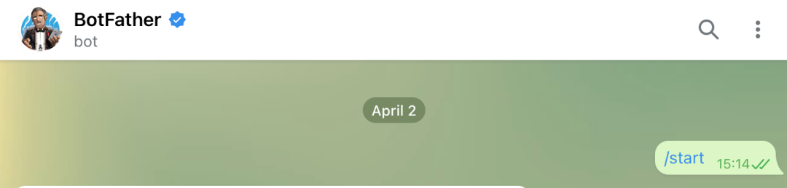

Python<br />不需要去写太复杂的机器人，因为需求就是将资源链接发送到指定的群组即可。当然除了这种功能，还可以去发送群管理机器人来对群组进行管理。那么第一步该怎么做呢？首先搜索 @BotFather<br /><br />然后在对话框里输入 /start<br />再输入 /newbot<br /><br />自己写一个名字：<br /><br />大家注意一定要以bot结尾哦~如果创建成功的话，会提示如下：<br /><br />创建完毕后，就会有一个HTTP API，就是在打码的地方。<br />这个东西非常有用！<br />新建一个群后，把创建的机器人拉进群中。<br />然后打开浏览器，访问：https://api.telegram.org/bot< YourBOTToken >/getUpdates<br />其中< YourBOTToken >这个填写的就是上面所给的HTTP API。<br />打开网页之后，会发现有个chat.id，这个就是需要的群组的id值，这个得看清楚是不是自己的群组。<br /><br />拿到了群组id就好办了。<br />这里开始，就得写代码了，这里把所有代码粘出来：
```python
import json
from urllib import request
import ssl
ssl._create_default_https_context = ssl._create_unverified_context
def sendmsg(sendtext):
    data = {
        "chat_id": "你的群组id",
        "parse_mode": "HTML",
        "disable_web_page_preview": "true",
        "text": str(sendtext)
    }
    data1 = json.dumps(data).encode(encoding='utf-8')
    url = 'https://api.telegram.org/bot你的API密钥/sendMessage'

    headers = {"Content-Type": "application/json"}
    proxies = {
        'https': 'https://127.0.0.1:1087', 
        'http': 'http://127.0.0.1:1087'
    }

    opener = request.build_opener(request.ProxyHandler(proxies))
    request.install_opener(opener)
    req = request.Request(url=url, headers=headers, data=data1)
    response = request.urlopen(req)

    print(response.read().decode())
```
其实可以发现这就是一个requests中的post请求。只需要向该api中发送相应字段就可以发送消息至群组中了。但是这里也有很多注意的点。大家可以看到请求参数中有`"parse_mode": "HTML"`，这也就是说电报是支持多种形式的信息的。也支持MD格式的。这个大家自由发挥。<br />除此之外，大家可能注意到这里使用了代理。挂上本地代理就行。<br />最终一个自动发资源的机器人就诞生了，直接运行项目就能够实施完美的执行了。<br />
