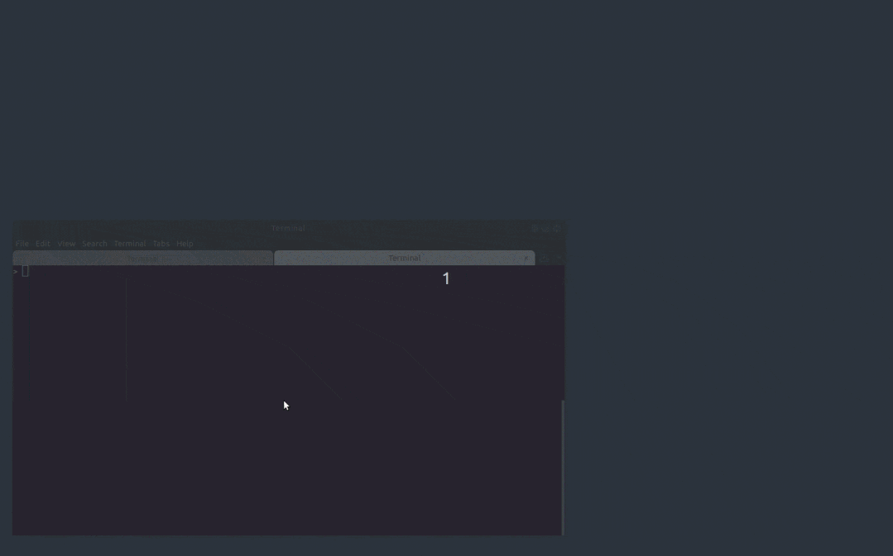
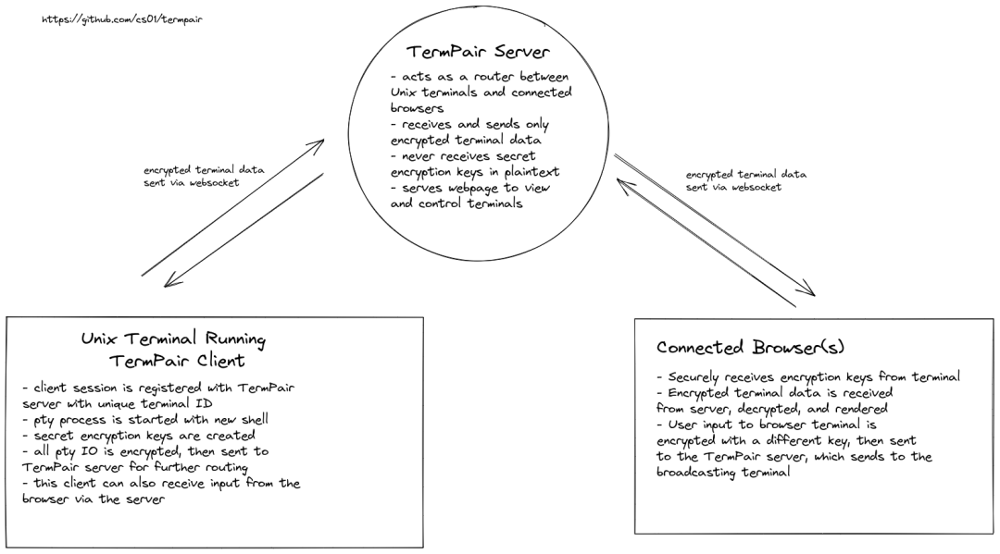

Python<br />分享一款高端命令行工具项目 termpair。<br />这是一款浏览器+实时命令行的工具。开发者可以安全实时地共享终端，远程操作命令行。<br />Github地址：[https://github.com/cs01/termpair](https://github.com/cs01/termpair)<br />
<a name="kKlLD"></a>
## 介绍
TermPair 允许开发者安全地实时共享和控制终端。通过端到端加密从浏览器查看和控制远程终端。<br />该工具有以下**特性**：

- 可以实时共享 unix 终端
- 从终端或浏览器中键入；两者保持同步
- 多个浏览器可以同时连接
- 浏览器权限可以是读/写或只读
- 服务器即使想读取终端数据也无法读取，因为它是用 AES 128 位加密进行加密的
- 需要安全的web环境（https）
- 可选的静态网站托管--自己构建web应用程序以确保web应用程序的完整性
- 广播终端的尺寸实时发送到浏览器
<a name="njLYI"></a>
## 如何使用
首先启动 TermPair 服务，输入如下指令，该服务器用于在终端和连接的浏览器之间路由加密数据。
```bash
> termpair serve
```
现在服务器已经运行，可以通过运行 `termpair share` 来共享终端。这将终端连接到服务器，并允许浏览器通过服务器访问终端。
```bash
> termpair share
--------------------------------------------------------------------------------
Connection established with end-to-end encryption 🔒

Shareable link: http://localhost:8000/?terminal_id=d58ff4eed5aa9425e944abe63214382e#g8hSgHnDaBtiWKTeH4I0Ow==

Terminal ID: d58ff4eed5aa9425e944abe63214382e
Secret encryption key: g8hSgHnDaBtiWKTeH4I0Ow==
TermPair Server URL: http://localhost:8000/

Type 'exit' or close terminal to stop sharing.
--------------------------------------------------------------------------------
```
打印的 URL 包含唯一的终端 ID 和 加密密钥。其他人可以通过这个网址访问命令终端，因此请确保信任与共享链接的人。<br />默认情况下，共享的进程是运行当前shell的新进程。服务器将终端输出多播到连接到会话的所有浏览器。
<a name="uNdFp"></a>
## 系统要求

- Python: 3.6+
- 操作系统：Linux，macOS
<a name="tm1t0"></a>
## 工作原理
TermPair 由三部分组成：

- 服务器
- 终端客户端
- 在浏览器客户端中运行的JavaScript web App


<a name="JndIg"></a>
### 1. 服务器
服务器充当路由器，在 TermPair 终端客户端和连接的浏览器之间盲目转发加密数据。服务器侦听来自 unix终端客户端的 termpair websocket 连接，并维护到任何已连接浏览器的映射。
<a name="SGoYR"></a>
### 2. 终端客户端
用户运行termpair share来启动客户端。TermPair 客户端向服务器注册该会话，然后用所需的进程（通常是类似于 bash 或 zsh 的 shell）分叉并启动一个伪终端（pty）。当 pty 的文件描述符可用时，TermPair 从中读取数据，然后将其写入真实终端的 stdout，在那里像正常情况一样打印。不过，它也会对该输出进行加密，并通过 websocket 将其发送到服务器。
<a name="cD9g8"></a>
### 3. Web App
TermPair 客户端在共享会话期间为用户提供唯一的 URL。该 URL 指向 TermPair web 应用程序（TypeScript/React），该应用程序设置 websocket 连接以接收和发送加密的终端数据。当接收到数据时，数据被解密并写入基于浏览器的终端。
<a name="XFRIs"></a>
## 安装
<a name="Qmsn2"></a>
### 安装方式-1
在[https://github.com/cs01/termpair/releases](https://github.com/cs01/termpair/releases)下载可执行文件包，运行发行脚本文件。
<a name="vYARM"></a>
### 安装方式-2
可以通过 pipx 或者 pip 安装。
```bash
> pipx install termpair
# 或pip
> pip install termpair
```
更多详细内容，可以参看项目使用说明。
