Python Q：Web 框架到底是什么？ A：Web 框架主要用于网站开发。开发者在基于 Web 框架实现自己的业务逻辑。Web 框架实现了很多功能，为实现业务逻辑提供了一套通用方法。 Q：Web 框架有什么作用？ A：使用 Web 框架，很多的业务逻辑外的功能不需要自己再去完善，而是使用框架已有的功能就可以。Web 框架使得在进行 网站开发的时候，减少了工作量。 Q：为什么要使用 Web 框架？ A：Web 框架主要用于网站开发，可以实现数据的交互和业务功能的完善。使用 Web 框架进行 网站开发的时候，在进行数据缓存、数据库访问、数据安全校验等方面，不需要自己再重新实现，而是将业务逻辑相关的代码写入框架就可以。 库排序是**按照使用人数和文档的活跃度**为参考进行的，**建议大家使用排名靠前的框架，因为它们的文档更齐全，技术积累要更多，社区更繁盛，能得到更好的支持，**这样在遇到自己无法解决的问题，可以更快更高效的找到解答的方案。

## 1、Django 框架
官 网：[https://github.com/django/django.git](https://github.com/django/django.git) 优 点：是一个高层次 Python Web 开发框架，特点是开发快速、代码较少、可扩展性强。Django 采用 MTV（Model、Template、View）模型组织资源，框架功能丰富，模板扩展选择最多。对于专业人员来说，Django 是当之无愧的 Python 排名第一的 Web 开发框架。 缺 点：包括一些轻量级应用不需要的功能模块，不如 Flask 轻便。过度封装很多类和方法，直接使用比较简单，但改动起来比较困难。相比于 C,C++ 性能，Djang 性能偏低。模板实现了代码和样式完全分离，不允许模板里出现 Python 代码，灵活度不够。另外学习曲线也相对陡峭。 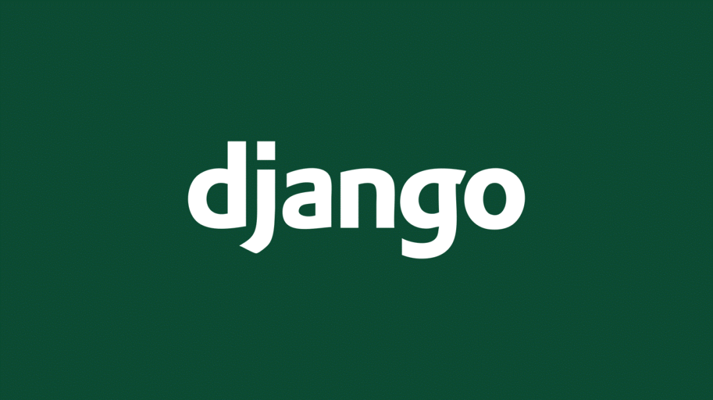

## 2、Flask 框架
官 网：[https://flask.palletsprojects.com/en/2.0.x/](https://flask.palletsprojects.com/en/2.0.x/) 优 点：Flask 是一个 Python Web 开发的微框架，严格来说，它仅提供 Web 服务器支持，不提供全栈开发支持。然而，Flask 非常轻量、非常简单，基于它搭建 Web 系统都以分钟来计时，特别适合小微原型系统的开发。花少时间、产生可用系统，是非常划算的选择。 缺 点：对于大型网站开发，需要设计路由映射的规则，否则导致代码混乱。对新手来说，容易使用低质量的代码创建 “不良的 web 应用程序”。 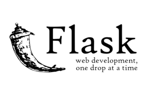

## 3、Pyramid 框架
官 网： [https://trypyramid.com/](https://trypyramid.com/) 优 点：是一个扩展性很强且灵活的 Python Web 开发框架。上手十分容易，比较适合中等规模且边开发边设计的场景。Pyramid 不提供绝对严格的框架定义，根据需求可以扩展开发，对高阶程序员十分友好。 缺 点：国内知名度不高，高级用法需要通过阅读源代码获取灵感。默认使用 Chameleon 模板，灵活度没有成为一个要素。 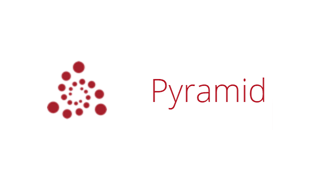

## 4、web.py 框架
官 网：[https://webpy.org/](https://webpy.org/) 优 点：正如其名，web.py 是一个采用 Python 作为开发语言的 Web 框架，简单且强大。俄罗斯排名第一的 Yandex 搜索引擎基于这个框架开发，Guido van Rossum 认为这是最好的 Python Web 框架，还需要说别的吗？有事实作证、有大牛认可，用起来吧！ 缺 点：Web.py 并未像其他框架一样保持与 Python 3 兼容性的最新状态。这不仅意味着缺乏对异步语法的支持，还意味着缺少对已弃用的函数的错误。此外，目前尚不清楚维护者是否有计划在 Python 2 到达其支持生命周期结束后保持 Web.py 的最新状态。 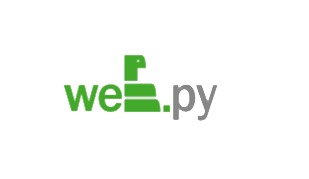

## 5、Tornado 框架
官 网：[https://www.tornadoweb.org/en/stable/](https://www.tornadoweb.org/en/stable/) 优 点：Tornado 是一个基于异步网络功能库的 Web 开发框架，因此，它能支持几万个开放连接，Web 服务高效稳定。可见，Tornado 适合高并发场景下的 Web 系统，开发过程需要采用 Tornado 提供的框架，灵活性较差，确定场景后再考虑使用不迟。 缺 点：Tornado 5.0 改进了与 Python 的本机异步功能的集成。因此不再支持 Python 3.3，并且 Python 3.5 用户必须使用 Python 3.5.2 或更高版本。Tornado 6.0 将需要 Python 3.5 及更高版本，并将完全放弃 Python 2 支持。 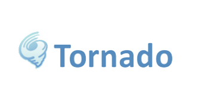

## 6、TurboGears 框架
官 网：[https://www.turbogears.org/](https://www.turbogears.org/) 优 点：TurboGears 最新版本 试图解决 TurboGears 最初版本、Django、Rails 等框架缺陷，它支持多数据库、JavaScript 工具集、多种数据交换格式等，当然，它开发非常高效，扩展性很强。试问它与 Django 哪个更好？还真不好说，Django 社区更为活跃或许更重要。 缺 点：TurboGears 的一些缺点包括管理功能较为基础，较少的第三方应用程序以及只有初级的文档。TurboGears 的一个重大挑战是它的压倒性。因为它混搭的其他组件都提供无限的灵活性， 当试图决定何种路径来完成一个任务时它是过于复杂的。 

## 7、CherryPy 框架
官 网：[https://cherrypy.org/](https://cherrypy.org/) 优 点：CherryPy 能够让开发者按照其他面向对象程序相似的设计方法开发 Web 系统，进而采用最少的代码、最简洁的方式。CherryPy 已经开发了 10 年之久，稳定性较好，非常适合小规模 Web 系统和纯粹的 Python 程序员。感受到了什么？Python 大有一统江湖之势！拭目以待。 缺 点：只包含为 web 页面提供服务所需的少量内容外，它应该尽可能地让人感觉它不像 “web 框架”，而是像任何其他类型的 Python 应用程序一样。CherryPy 包含的位用作低级构建块。包括会话标识符和 cookie 处理，但不包括 HTML 模板。像 Bottle 一样，CherryPy 提供了一种将路由映射到磁盘上的目录以供静态文件服务的方法。 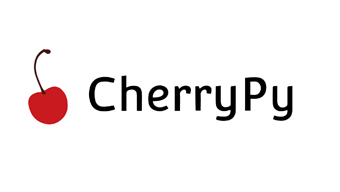

## 8、Falcon 框架
官 网：[http://falconframework.org/](http://falconframework.org/) 优 点：Falcon 是一个支持大规模微服务 API 或移动 App 后端响应的 Web 开发框架，它完全基于 Python 并提供了非常高的性能、可靠性和可扩展性。Falcon 定位独特且特色鲜明，对于 App 开发者，后端系统构建不妨考虑 Falcon，十之八九是不会后悔的。 缺 点：Falcon 缺点是其打包模块有点太少，有路由，中间件，钩子，除此之外就不提供其他功能了（裸壳）。额外其他功能，比如验证等都需要开发人员来开发扩展。因为其设计中就假设用于构建 REST API。 

## 9、Asgineer 框架
官 网：[https://asgineer.readthedocs.io/](https://asgineer.readthedocs.io/) 优 点：Asgineer 是一种编写异步 Web 应用程序的工具，使用尽可能少的抽象，同时仍然提供友好的 API。只需几分钟即可阅读指南和参考资料！在 Uvicorn 上运行 Asgineer 时，它是可用的最快的 Web 框架之一。它支持 http 长轮询、服务器端事件 (SSE) 和 websockets。并且具有以正确（且快速）的方式为资产提供服务的实用程序。 缺 点：中文文档匮乏。

## 10、Bottle 框架
官 网：[https://bottlepy.org/docs/dev/](https://bottlepy.org/docs/dev/) 优 点：Bottle 是一个用于 Python 的快速、简单和轻量级的 WSGI 微型网络框架。它作为单个文件模块分发，除了 Python 标准库之外没有任何依赖项。支持干净和动态的 URL。快速和 Pythonic 内置模板引擎，支持 mako、jinja2 和 cheetah 模板。方便地访问表单数据、文件上传、cookie、标题和其他与 HTTP 相关的元数据。 缺 点：Bottle 极简主义的一个后果是有些功能根本就不存在。不支持表单验证，包括 CSRF 保护等功能。如果要构建支持高度用户交互的 Web 应用程序，则需要自己添加它们。 

## 11、Emmett 框架
官 网：[https://emmett.sh/](https://emmett.sh/) 优 点：编写优雅的代码，专注于产品，应该把更多的时间花在产品而不是底层框架上。Emmett 是发明家的框架，因为它旨在简化开发过程，其语法简单、易于学习和理解。不要在路由器和不舒服的模式之间浪费时间：每次为应用程序写下路由时，一切都清楚地呈现。 缺 点：中文文档匮乏。 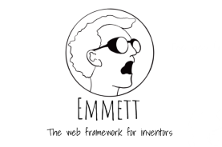

## 12、apidaora 框架
官 网：[https://github.com/dutradda/apidaora](https://github.com/dutradda/apidaora) 优 点：使用类型注释将请求 / 响应声明为数据类和字典，使用 jsondaora 验证输入数据，最快的 python api 框架之一，可以在任何 asgi 服务器上运行。 缺 点：中文文档匮乏。 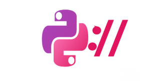

## 13、Quixote 框架
官 网：[http://www.quixote.ca/](http://www.quixote.ca/) 优 点：Quixote 是一个使用 Python 编写基于 Web 的应用程序的框架。它的目标是按此顺序实现灵活性和高性能。Quixote 应用程序的结构往往类似于传统应用程序。格式化网页的逻辑由 Python 类和函数组成。Quixote 不强制分离表示逻辑和 “后端” 逻辑。相反，鼓励使用传统技术。例如，一种解决方案是将表示逻辑放在其自己的子包中。 缺 点：虽然 Quixote 得到积极维护，但发布频率较低。最近开发的重点是修复错误、提高标准合规性和增加 Quixote 的灵活性。 

## 14、reahl 框架
官 网：[https://www.reahl.org/](https://www.reahl.org/) 优 点：reahl 是一个可以让开发者完全用 Python 语言编写 Web 应用的开放框架，采用 Python 作为唯一开发语言是其最大特色。此外，reahl 提供了相当清晰且简明的开发组建，对于开发一般功能性 Web 系统足够清晰且可行。 缺 点：提供抽象词汇时，无法掌握一些更高级的用户界面效果，目前不允许使用 Sass 构建 Bootstrap 的修改版本，并支持更高级的用户界面模式 

## 15、hug 框架
官 网：[https://hug.rest/](https://hug.rest/) 优 点：Hug 是一个 Python 3 API 开发框架。它的设计使软件工程师可以一次开发 API，然后在需要时再使用它。Hug 框架通过提供各种接口来简化 API 开发。这就是为什么该框架被称为 Python 3 中最快的框架之一的主要原因。 缺 点：它使用以前的 WSGI 标准，这是一个同步框架，所以它不能处理像 WebSockets 和其他异步请求，不管怎么说，它仍然有非常好的性能表现。 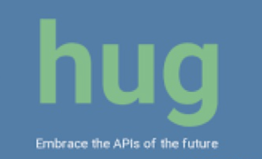

## 16、BlackSheep 框架
官 网：[https://github.com/Neoteroi/BlackSheep](https://github.com/Neoteroi/BlackSheep) 优 点：BlackSheep 是一个异步 Web 框架，用于使用 Python 构建基于事件的 Web 应用程序。它的灵感来自 Flask、ASP.NET Core 和 Yury Selivanov 的工作。 缺 点：中文文档匮乏。 

## 17、Index.py 框架
官 网：[https://index-py.aber.sh/stable/](https://index-py.aber.sh/stable/) 优 点：实现了 ASGI3 接口并使用 Radix Tree 进行路由查找。是最快的 Python web 框架之一。一切特性都服务于快速开发高性能的 Web 服务。大量正确的类型注释，灵活且高效的路由系统，可视化 API 接口与在线调试，支持 Server-sent events 与 WebSocket，自带一键部署命令 (基于 uvicorn 与 gunicorn)，可使用任何可用的 ASGI 生态。 缺 点：Index.py 不内置数据库、缓存等其他功能。选择困难者请直接使用 Django。 

## 18、Sanic 框架
官 网：[https://github.com/sanic-org/sanic](https://github.com/sanic-org/sanic) 优 点：Sanic 是一个 Python 3.7+ web 服务器和 web 框架，它的编写速度很快。它允许使用 Python 3.5 中添加的 async/await 语法，这使代码无阻塞且快速。该项目的目标是提供一种简单的方法来启动和运行一个高性能的 HTTP 服务器，该服务器易于构建、扩展和最终扩展。 缺 点：就功能方面 Sanic 模仿 Flask，比如通过共享 Blueprints 的概念，微小的子应用程序，允许开发人员在更大的应用程序中拆分和组织其代码。对于光光是数据增删改查 CRUD 应用，Sanic 也不是一个好的选择。 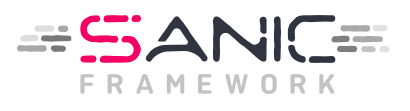

## 19、Starlette 框架
官 网：[https://pypi.org/project/starlette/](https://pypi.org/project/starlette/) 优 点：Starlette 是一个轻量级的 ASGI 框架 / 工具包，非常适合构建性能异步服务，它是生产就绪的，并提供以下内容：令人印象深刻的表现。WwbSocket 支持。GraphQL 支持。进程内后台任务。启动和关闭事件。基于请求构建的测试客户端。CORS、GZip、静态文件、流响应。会话和 Cookie 支持。100% 的测试覆盖率。100% 类型注释代码库。零硬依赖。 缺 点：Starlette 提供了所有基本的 Web 微框架功能。但是它不提供自动数据验证，序列化或 API 文档。 

## 20、Fastapi 框架
官 网：[https://fastapi.tiangolo.com/](https://fastapi.tiangolo.com/) 优 点：FastAPI 是一个现代、快速（高性能）的 Web 框架，用于基于标准 Python 类型提示使用 Python 3.6+ 构建 API。非常高的性能，与 NodeJS 和 Go 相当（感谢 Starlette 和 Pydantic）。可用的最快的 Python 框架之一。减少大约 40% 的人为（开发人员）引发的错误。简短，简单，直观，健壮。 缺 点：本身不带模板语法，需要安装模板语法 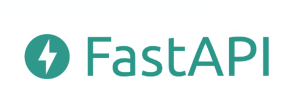

## 21、Responder 框架
官 网：[https://python-responder.org/](https://python-responder.org/) 优 点：是 kennethreitz 新开发的一个项目，是一个基于 Python 的 HTTP 服务框架。底层用了 Starlette 的框架，Starlette 是一款轻量级的 ASGI 框架 / 工具包， 可以用 Starlette 构建高性能的异步 IO 服务。相对于 Starlette , responder 对开发者更加友好一点。kennethreitz 写了 requests 号称 "HTTP for Humans" 更加清楚这一点。事实上比较下来，responder 也比 Starlette 优雅很多。 缺 点：可能是新项目， 打包还不太完善。就目前版本而言，少许代码还不能正常工作。但接口形式已经定义完毕，期待后面版本会加上去。

## 22、Molten 框架
官 网：[https://moltenframework.com/](https://moltenframework.com/) 优 点：Molten 是一个最小的、可扩展的、快速的和高效的框架，用于使用 Python 构建 HTTP API。计划自动验证请求，代码更容易维护。实例可自动序列化，包含 API 在现实世界中通常要求的各种功能，广泛使用 PEP484 类型提示和 mypy。 缺 点：它没有使用像第三方库（如 Pydantic）提供数据验证，序列化和文档，它有自己的库。因此，这些数据类型定义将不太容易重用。依赖注入系统需要对依赖项进行预注册，并且将基于已声明的类型解决依赖问题。因此，不可能声明多个组件来提供一个特定的类型。 

## 23、Clastic 框架
官 网：[https://github.com/mahmoud/clastic](https://github.com/mahmoud/clastic) 优 点：一个功能强大的 Python Web 框架，可简化显式开发实践，同时消除全局状态。Clastic 是完全用 Python 语言编写的，增强可重用性和可测试性，主动 URL 路由检查，更好地控制应用程序初始化，改进的中间件范例，没有全局状态，ORM 用法，更容易的 WSGI 集成。 缺 点：Clastic 没有构建全局状态；URL 路由规则参数和视图函数签名不匹配，在 Clastic 中，这种不匹配会在构建应用程序时引发异常。

## 24、Aiohttp 框架
官 网：[https://docs.aiohttp.org/en/stable/](https://docs.aiohttp.org/en/stable/) 优 点：用于 asyncio 和 Python 的异步 HTTP 客户端 / 服务器。支持客户端和 HTTP 服务器，支持开箱即用的服务器 WebSockets 和客户端 WebSockets，没有回调地狱。Web 服务器具有中间件、信号和可插入路由。 缺 点：根据 RFC 7231 aiohttp 2.0 版本后做了接受 HEAD 请求的调整，使用之前版本并且用 add_ get () 添加的请 求，如果使用 HEAD 方法访问会返回 405。如果处理器会写入很多响应体内容，可以在执行 HEAD 方法时跳过处理响应体内容以提高执行效率。 

## 25、Masonite 框架
官 网：[https://docs.masoniteproject.com/](https://docs.masoniteproject.com/) 优 点：现代和以开发人员为中心的 Python Web 框架致力于实现实际的 batteries，包括具有许多开箱即用功能的开发人员工具，具有极其可扩展的架构。Masonite 非常适合初学者开发人员进入他们的第一个 Web 应用程序，以及需要充分利用 Masonite 的全部潜力来完成他们的应用程序的经验丰富的开发人员。Masonite 努力实现从安装到部署的快速简便，因此开发人员可以尽可能快速有效地从概念到创建。将其用于下一个 SaaS！尝试一次，就会坠入爱河。 缺 点：对于 Masonite 来说，最大的” 竞争对手” 是 Django, 因为社区正在竭尽全力将框架推向容易，令人愉悦的下一件大事。与 Django 相比，Masonite 仍然是婴儿，期待它未来的表现。 

## 26、Quart 框架
官 网：[https://pgjones.gitlab.io/quart/](https://pgjones.gitlab.io/quart/) 优 点：Quart 是一个 Python 网络微框架。使用 Quart，可以呈现和提供 HTML 模板，编写（RESTful）JSON API，服务 WebSockets，流请求和响应数据，几乎可以通过 HTTP 或 WebSocket 协议做任何事情。 缺 点：它仅支持 Python 3.7+。 

## 27、Tonberry 框架
官 网：[https://github.com/Ayehavgunne/Tonberry](https://github.com/Ayehavgunne/Tonberry) 优 点：一个符合 ASGI 的 Web 微框架，采用基于类的路由方法。受 CherryPy 的影响但与 asyncio 兼容。一个名为 Qactuar 的配套 ASGI 服务器是从这个目前正在进行的项目中产生的。 缺 点：在使用拉取请求，请使用自动格式化程序 iSort 和 Black 并使用 MyPy 验证代码。这是在不消除某些类型错误的情况下，并不总是可以使 MyPy 完全满意，但是至少尽所能并谨慎使用注释 ``# type: ignore``。最后，尝试，尽可能提供最准确的类型提示。 

## 28、cyclone 框架
官 网：[https://cyclone.io/](https://cyclone.io/) 优 点：Cyclone 是 Python 的 Web 服务器框架，它将 Tornado API 实现为 Twisted 协议。Twisted 是一个事件驱动的 Python 网络编程框架。它是最成熟的非阻塞 I/O 库之一，可供公众使用。Tornado 是 FriendFeed 网络服务器的开源版本，它是最流行和最快速的 Python 网络服务器之一，具有用于构建网络应用程序的非常不错的 API。除了丰富的功能集之外，Cyclone 还解决了 C10K 问题。 缺 点：Cyclone 不再支持 python 2.x 。

## 29、Klein 框架
官 网：[https://github.com/twisted/klein](https://github.com/twisted/klein) 优 点：Klein 是一个微框架，用于使用 Python 开发可用于生产的 Web 服务。它是 “微” 的，因为它具有类似于 Bottle 和 Flask 的非常小的 API。它不是 “微”，因为它依赖于标准库之外的东西。这主要是因为它建立在广泛使用和经过良好测试的组件上，如 Werkzeug 和 Twisted。 缺 点：也许有点过时了。 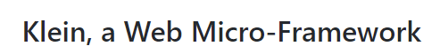

## 30、nameko 框架
官 网：[https://github.com/nameko/nameko](https://github.com/nameko/nameko) 优 点：AMQP RPC 和事件（发布 - 订阅），HTTPGET、POST 和 websockets，CLI 实现简单快速的开发，用于单元和集成测试的实用程序。 缺 点：nameko 微服务出错不会自动打印错误日志，需要加上监控相关的依赖，计算密集型任务导致任务重试。 

## 31、CubicWeb 框架
官 网：[https://www.cubicweb.org/](https://www.cubicweb.org/) 优 点：CubicWeb 是一种语义 Web 应用程序框架，在 LGPL 下获得许可，它使开发人员能够通过重用组件（称为立方体）并遵循众所周知的面向对象设计原则来有效地构建 Web 应用程序。满足常见需求的可重用组件（数据模型和视图）库，Python 编程语言的强大功能和灵活性，用于存储后端的 SQL 数据库、LDAP 目录、Subversion 和 Mercurial 的可靠性。 缺 点：要在 CubicWeb 应用程序中获取或操作持久数据，可以使用关系查询语言（RQL），RQL 提供了一种高度分离的路径来相互关联各种数据源。但是，随着它的实现，通过手动构建查询作为字符串，它可能会让习惯于 ORM 的开发人员感到过时。使用 CubicWeb 还有其他障碍。首先，设置可能很麻烦。另一个潜在的问题是缺少本机模板引擎；生成 HTML 留给开发人员。CubicWeb 支持 Python 3，但 Twisted 等模块本身并未完全移植。 

## 32、Zope2 框架
官 网：[https://zope.readthedocs.io/en/latest/](https://zope.readthedocs.io/en/latest/) 优 点：Zope 2 是一款基于 Python 的 Web 应用框架，是所有 Python Web 应用程序、工具的鼻祖，是 Python 家族一个强有力的分支。Zope 2 的 “对象发布” 系统非常适合面向对象开发方法，并且可以减轻开发者的学习曲线，还可以发现应用程序里一些不好的功能。 缺 点：Zope 不适用于简单的 RESTful API（每 Bottle 或 Flask），甚至不适用于具有交互性的基本网站（à la Django），由于 Zope 的尺寸和复杂性，安装需要一些工作；这不是简单地将源解压缩到项目子文件夹中的问题。

## 33、Web2py 框架
官 网：[http://web2py.com/](http://web2py.com/) 优 点：Web2py 是一个用 Python 语言编写的免费的开源 Web 框架，旨在敏捷快速的开发 Web 应用，具有快速、可扩展、安全以及可移植的数据库驱动的应用，遵循 LGPLv3 开源协议。Web2py 提供一站式的解决方案，整个开发过程都可以在浏览器上进行，提供了 Web 版的在线开发，HTML 模版编写，静态文件的上传，数据库的编写的功能。其它的还有日志功能，以及一个自动化的 admin 接口。 缺 点：Web2py 的一个重要限制是它仅与 Python 2.x 兼容。首先，这意味着 Web2py 无法使用 Python 3 的异步语法。如果依赖于 Python 3 独有的外部库，那么就不走运了。但是，正在开展使 Web2py Python 3 兼容的工作，并且在撰写本文时它已接近完成 

## 34、Pylons 框架
官 网：[https://docs.pylonsproject.org/projects/pylons-webframework/en/latest/](https://docs.pylonsproject.org/projects/pylons-webframework/en/latest/) 优 点：Pylons 是一个开放源代码的 Web 应用框架，使用 python 语言编写。它对 WSGI 标准进行了扩展应用，提升了重用性且将功能分割到独立的模块中。Pylons 是最新的 Web 应用框架中的典型，类似于 Django 和 TurboGears。Pylons 受 Ruby on Rails 影响很深：它的两个组件，Routes 和 WebHelpers 是 Rails 特性的 Python 实现。 缺 点：Pylons 已与 repoze.bfg 合并，现在处于仅维护模式。强烈建议新项目从新合并的 Web 框架金字塔开始。 

## 35、Cubes 框架
官 网：[https://pythonhosted.org/cubes/](https://pythonhosted.org/cubes/) 优 点：Cubes 是一个轻量级的 Python 框架和工具集，用于开发报告和分析应用程序、在线分析处理 (OLAP)、多维分析和浏览聚合数据。它是 Data Brewery 的一部分。 缺点：不再为每个多维数据集提供隐式聚合 record_count。它必须明确定义为聚合：旧的后端架构是有限制的。它只允许使用一个商店，必须在服务器启动之前知道模型，不可能从远程来源获取模型。

## 36、Dpark 框架
官 网：[https://github.com/Liangchengdeye/Dpark](https://github.com/Liangchengdeye/Dpark) 优 点：DPark 是 Spark 的 Python 克隆版本，是一个 Python 实现的分布式计算框架，可以非常方便地实现大规模数据处理和低延时的迭代计算。该计算框架类似于 MapReduce，但是比其更灵活，可以用 Python 非常方便地进行分布式计算，并且提供了更多的功能，以便更好地进行迭代式计算。DPark 由国内的豆瓣公司开发实现和负责维护，据豆瓣公司的描述，目前豆瓣公司内部的绝大多数数据分析都使用 DPark 完成，整个项目也正趋于完善。 缺 点：Dpark 使用的是进程，在 Python 中，由于 GIL (Global Interpreter Lock) 的存在，即使在多核机器上使用多个线程，这些线程之间也没有办法真正地实现并发执行。

## 37、Buildbot 框架
官 网：[https://buildbot.python.org/all/#/](https://buildbot.python.org/all/#/) 优 点：Buildbot 是 python 实现的开源持续构建和持续交付工具，为 Python, Mozilla, Chromium, WebKit 等知名项目使用。Buildbot 可以直接使用 python 包，轻松拥有上万库，具备强大的扩展能力。如果觉得 Jenkins 已经轻松地满足需求，不需要 Buildbot。如果在 Jenkins 时觉得效率低下、扩展困难、一些用 python 等脚本可以实现的动作在 Jenkins 困难重重，那么可以看看 Buildbot。 缺 点：buildbot 对多项目支持并不好。 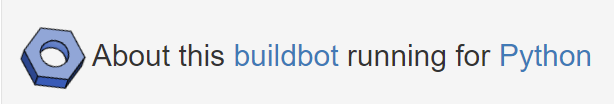
