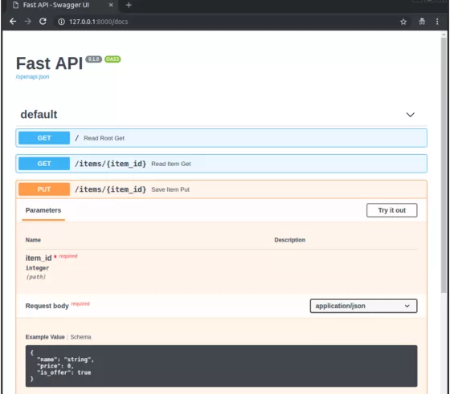

Python<br />Python在3.4引入了 asyncio 库，3.6新增了关键字 `async`和`await`，此后，异步框架迅速发展了起来，性能上能和Node.js比肩，除非是CPU密集型任务，否则没有理由不使用异步框架。<br />如果是Web开发者，现在异步Web框架上有了更多选择！
<a name="RItkO"></a>
### 1、Tornado
Tornado 根本不是什么新框架，它最初是由FriendFeed（后被Facebook收购）在2009年发布。从一开始就提供有异步编程的功能。<br /><br />Tornado 不仅仅是Web框架，同时它内置了很多异步模块，可用于自己构建异步应用。这些模块包括：

- 协同程序和其他原语（tornado.gen，tornado.locks，tornado.queues等）
- 网络模块（tornado.ioloop，tornado.iostream）
- 异步服务器和客户端（tornado.httpserver，httpclient，等）

通过这些模块，Tornado 构建了自己的异步Web框架模块。
```python
import tornado.ioloop
import tornado.web

class MainHandler(tornado.web.RequestHandler):
    def get(self):
        self.write("Hello, world")

def make_app():
    return tornado.web.Application([
        (r"/", MainHandler),
    ])

if __name__ == "__main__":
    app = make_app()
    app.listen(8888)
    tornado.ioloop.IOLoop.current().start()
```
Tornado在Python社区中拥有很多追随者，并且经验丰富的架构师使用它们来构建功能强大的系统。这个框架长期以来一直在解决并发问题，但是由于它不支持WSGI标准（大部分Python库仍在同步中），因此尚未成为主流。<br />国内据说知乎是基于Torando构建的。
<a name="OcuLu"></a>
### 2、 Snaic
Sanic是一个诞生有3年的框架：它只支持3.6以上Python版本，支持通用的async/await语法，开箱即用，因此无需阅读大量文档就可以写出一个HTTP 处理器。<br /><br />除了`async`关键字之外，语法上和 flask 基于没差别。
```python
from sanic import Sanic
from sanic.response import json

app = Sanic()

@app.route("/")
async def test(request):
    return json({"hello": "world"})

if __name__ == "__main__":
    app.run(host="0.0.0.0", port=8000)
```
Sanic可以说是Python世界中最流行和最受欢迎的异步框架。它具有项目中需要的所有功能：路由，中间件，Cookie，版本控制，蓝图，基于类的视图，静态文件，流，sockets，此外还可以集成模板，数据库驱动，文件I / O，队列等等。
<a name="pA5zu"></a>
### 3、Vibora
Vibora和Sanic非常像，致力于成为最快的Python Web服务器。他们网站首页有一个框架比较图：<br />

Vibora声称比其它框架快几倍，比竞争对手Sanic还快两倍多。当然，这个基准测试要持怀疑态度。<br />尽管在语法和功能上，Vibora可以与Sanic媲美但Sanic更加成熟，因为它已经存在了很长一段时间并且具有更大的社区。
```python
from vibora import Vibora, JsonResponse

app = Vibora()

@app.route('/')
async def home():
    return JsonResponse({'hello': 'world'})

if __name__ == '__main__':
    app.run(host="0.0.0.0", port=8000)
```
<a name="iC8eM"></a>
### 4、Quart
如果喜欢Flask，但又要支持异步， 那么Quart一定会喜欢<br /><br />Quart符合ASGI标准，该标准是WSGI标准的后继产品，并提供异步支持。Quart不仅与Flask相似，而且与Flask API兼容！该框架的作者希望保留了Flask的风格，只是向其中添加异步、WebSocket和HTTP 2支持。因此，可以从Flask文档中学习Quart的用法，只需要记住Quart中的函数是异步的就行。
```python
from quart import Quart

app = Quart(__name__)

@app.route('/')
async def hello():
    return 'hello'

app.run()
```
几乎完全像Flask<br />由于Quart是从Flask中演进过来的，因此Flask的所有功能均可用：路由，中间件，会话，模板，蓝图等。实际上，甚至可以直接在Quart内部使用Flask的扩展插件。不过，有一个问题是它仅支持Python 3.7+。
<a name="E0dZC"></a>
### 5、FastAPI
FastAPI似乎是异步 Python 框架里功能、文档最丰富的框架。<br /><br />该框架的作者深入研究了其他几个框架，从诸如Django到Sanic之类的现代框架，以及NestJS（Node.js，Typescript Web框架）。<br />语法甚至可以说它比目前遇到的其他框架更有趣：
```python
rom fastapi import FastAPI

app = FastAPI()

@app.get("/users/me")
async def read_user_me():
    return {"user_id": "the current user"}

@app.get("/users/{user_id}")
async def read_user(user_id: str):
    return {"user_id": user_id}
```
FastAPI胜过其他框架的杀手锏，自动生成API文档：<br />编写API接口后，就可以使用符合标准的UI如SwaggerUI，ReDoc等来使用API。<br /><br />那性能呢？FastAPI是基于Starlette库构建的，其性能可与Node相匹配，在某些情况下甚至可以与Go相匹配。总而言之，有一种FastAPI将成为Python的顶级异步框架的感觉。
<a name="zcmpK"></a>
### 总结
如今，Python异步生态正在发生很多事情。出现了新的框架，旧的框架正在重写，很多库开始支持异步行为。对于Web框架，Python已准备就绪，可提供出色的性能。如果很长一段时间在考虑迁移到Node或者go，那现在不需要了。
