Python Web<br />在 2022 年 PyCon 大会期间，作为主题发言人之一的 Peter Wang 公布了 PyScript——一种在 HTML 中直接编写 Python 脚本的方法。或许你不知道 Peter，但你可能听说过 Anaconda，这是最流行的 Python 和 R 分发版之一，主要应用于数据科学。Peter 是 Anaconda 的 CEO 和联合创始人。<br />换言之，PyScript 是由一家著名的科技公司开发的，这可能有利于保证它在不久的将来成为可行的方案。它在 Python 和 Web 开发者中受到了极大的关注，GitHub上已有超过 10k 颗星。然而，它是否能成为一个成功的、有竞争力的产品，取决于长期的时间和开发投入。目前，它还有一些已知的缺陷（将在最后讨论）。<br />闲话少说，快速了解一下这个令人振奋的产品吧！
<a name="FhwT3"></a>
## py-script 标签
HTML 文件是大多数网站最常见的元素。在创建网站时，我们的工作就是直接或间接地通过一些框架来编制 HTML 文件。在典型的 HTML 文件中，会看到各种类型的标签。例如，<head>定义了 HTML 页面的元数据和关键信息，<title>是整个文档的标题，而<h1>、<h2>等定义了不同级别的内容标题。<br />如前所述，PyScript 允许在 HTML 中编写 Python 脚本，它使用一个特殊的标签py-script。在这个标签中，可以嵌入 Python 脚本。要了解它是如何工作的，可以创建一个 HTML 文件，在其中添加以下代码，并使用 Chrome 浏览器打开该文件。在 Chrome 浏览器中，应该能够看到类似下面这样的内容：<br />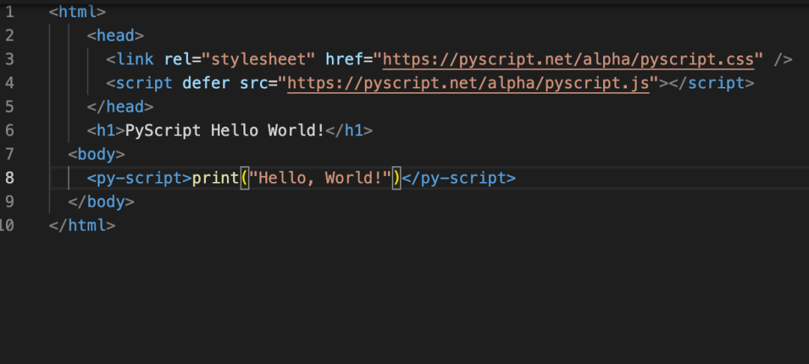<br />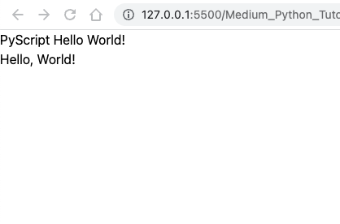<br />在上面的代码片段中，可能已经注意到以下三个关键点。

- link标签定义了一个外部样式表。在这个例子中，使用了 PyScript 提供的css文件。
- 使用script标签来嵌入一个由src定义、由 PyScript 托管的外部脚本。还使用了`defer`，这样脚本会在下载和页面解析完成后执行——本质上是一种延迟执行，而不是实时执行。
- 最有趣的部分是py-script标签。`print("Hello, World!")`是 Python 代码。当执行 HTML 文件时，就可以看到代码求值结果。

这很酷，不是吗？如果不熟悉 Web 开发，但了解 Python，就可以使用 PyScript 嵌入任何有效的 Python 代码。再看一个例子。<br />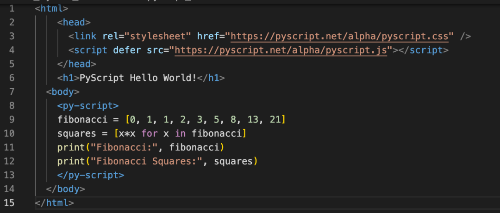<br />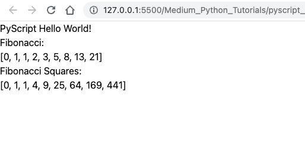<br />另一个 PyScript 示例<br />在这里，写了一些需要计算的代码，可以看到，脚本得到了正确执行。
<a name="BTITZ"></a>
## py-env 标签
在编写更复杂的代码时，就需要使用第三方库。在这种情况下，可以利用py-env标签。你可能已经猜到，env 是 environment 的缩写。py-env标签中列出了运行代码所需的 Python 包。<br />许多数据科学家都使用 pandas 进行数据处理工作。看看下面的例子。<br />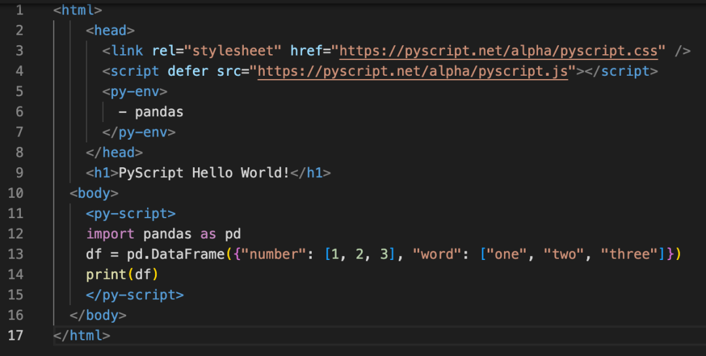<br />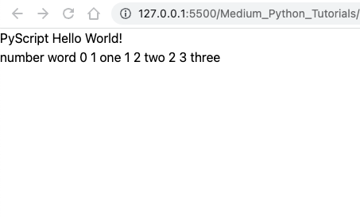<br />使用包的 PyScript<br />在py-env标签中指定了依赖项（即 pandas），该标签包含在head标签中。如果页面需要多个依赖项，可以在这里把它们全部列出：
```html
<py-env>
  - pandas
  - matplotlib
  - numpy
</py-env>
```
如你所见，在py-script标签中，确实可以使用 pandas 库来创建一个DataFrame对象。然而，当把打印出来时就会发现，它是一行，而不是一个结构化的数据表。没有一个适当的结构，就无法理解这些数据。幸运的是，可以使用`write`函数（下文会讨论）。
<a name="gjFvn"></a>
## 将内容写入指定标签
除了 Python 中的标准打印函数`print`，作为脚本的一部分，PyScript 有自己的`write`函数，可以将数据发送到页面上指定的 Web 元素中。请看下面的例子：<br />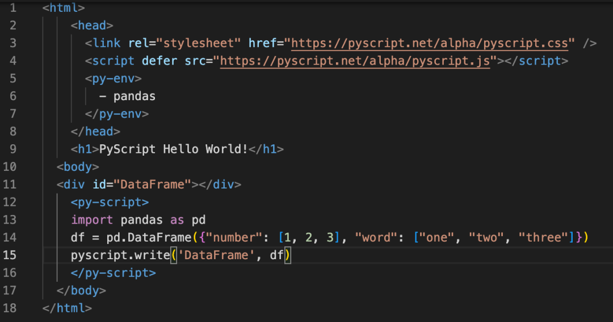<br />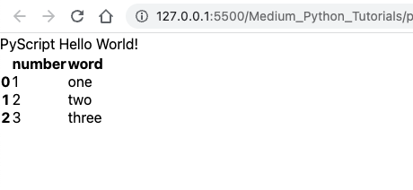
<a name="HiOvY"></a>
### PyScript 写函数 write
与之前的例子相比，上述代码片段有两个重大变化：

- 现在定义了一个 id 为"DataFrame"的div，这样稍后就可以引用。
- 在py-script标签中，创建一个与之前相同的DataFrame对象。但现在，不是调用print，而是调用`pyscript.write`函数，请求 PyScript 处理并在"DataFrame"中显示DataFrame对象。从输出可以看到，现在有一个结构化的表格了。

`write`函数不仅能够打印表格，还能够打印数字。下面的例子展示了如何使用matplotlib（一个流行的 Python 包，用于数据可视化）来显示由 Python 创建的图。<br />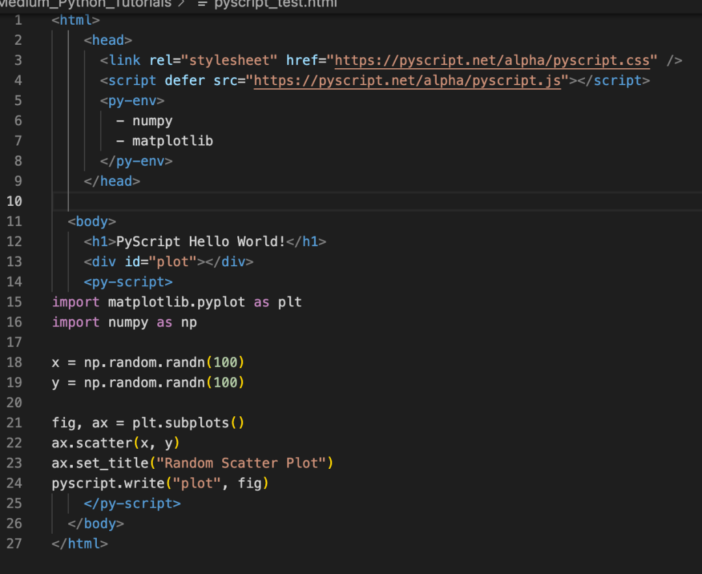<br />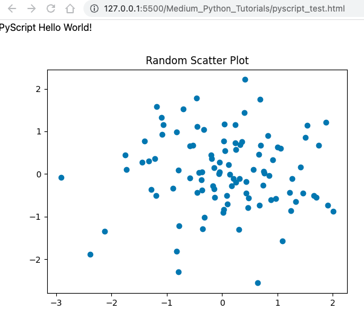<br />write 函数以期望的方式显示了图。
<a name="lK9lN"></a>
## py-repl 标签
Python 学习的最好方法之一是使用 REPL：读取（Read）、求值（Evaluate）、打印（Print）和循环（Loop）。也就是说，使用一个交互式的 Python 控制台，输入一些代码，Python 对其进行求值并打印适当的输出，然后重复这个过程。Web 页面也可以提供这样的 REPL 环境，比如 Jupyter Notebook。<br />PyScript 可以使用py-repl标签提供与此类似的东西。在这个元素中，可以让用户自己编写代码，也可以以编程方式输入代码。请看下面的例子：<br />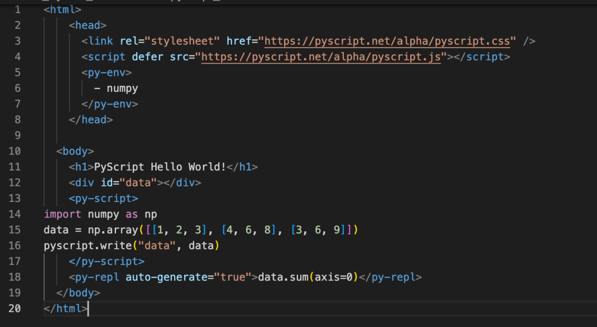<br />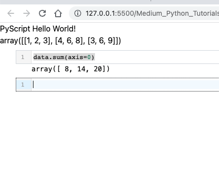<br />上图中有一个单元格，其中包括在py-repl标签中指定的代码。值得注意的是，单元格中的代码可以引用之前在py-script标签中定义的变量。一切看起来都很协调。
<a name="WHzZk"></a>
## 感想
本文介绍的内容是现阶段 PyScript 所能提供的主要亮点。它似乎是一个很有前途的产品，因为它提供了一个灵活的框架，让 Python 程序员可以在没有太多 Web 开发知识的情况下创建 Web 应用。然而，也有其他类似的成功的产品，因此，竞争会很激烈。<br />例如，如果需要为自己的数据科学项目创建一个 Web 应用，一般会直接使用 Streamlit。它的功能已经相对成熟。请注意，虽然都与 Web 开发有关，但 PyScript 和 Streamlit 属于不同的产品系。PyScript 应该更通用，因为它的目标是可以在任何网页上嵌入任何 Python 代码，Streamlit 做不到这一点。<br />在 PyScript 为更多的人所接受之前，它有几个问题必须解决。例如，Web 页面的加载速度非常慢。如果尝试跟着本教程运行代码，可能就会注意到，在 Web 页面的显示会有一个明显的滞后。<br />尽管如此，这个产品会继续发展，我的信心主要来自于它的开发者——给我们带来极好的 Anaconda 工具的 Anaconda 团队。<br />原文链接：[https://betterprogramming.pub/running-python-script-on-the-web-using-pyscript-the-next-big-thing-8ace9543d75](https://betterprogramming.pub/running-python-script-on-the-web-using-pyscript-the-next-big-thing-8ace9543d75)
