Python
<a name="iNzpR"></a>
## 1、前言
在数据可视化中，仪表板是出色的图形用户界面，以高度交互和信息丰富的方式显示信息，它有助于可视化数据的关键指标和趋势。<br /><br />各种图表，例如条形图、饼图、折线图等，有助于探索数据集并提供一些非常有价值的信息。仪表板对于有效显示关键绩效指标非常有用。然而，对于开发人员来说，创建一个复杂的仪表板可谓是一项乏味的任务。尤其对于对前端技术不熟悉的数据工作者来说，更是一件棘手的事情。<br />有一些库，如 Python 中的 Plotly、Bokeh，可以用来创建仪表板。但是发现这些工具难以创建一个完美的仪表板。最后，找到了一些方法，不仅可以创建一个非常有效且信息丰富的仪表板，而且非常简单方便。
<a name="tJaQH"></a>
## 2、初识 Streamlit
Streamlit 是一个免费的开源框架，用于快速构建和共享漂亮的机器学习和数据科学 Web 应用程序。它是**一个专门为机器学习工程师设计的基于 Python 的库**。数据科学家或机器学习工程师不是 Web 开发人员，对于他们中的大部分人并不太愿意花费数周时间学习使用这些框架来构建 Web 应用程序。相反，他们想要一个更易于学习和使用的工具，只要它可以显示数据并收集建模所需的参数。Streamlit 只需几行代码即可创建外观精美的应用程序。<br />**Streamlit 最好的一点是，甚至不需要了解 Web 开发的基础知识即可开始或创建一个 Web 应用程序。** 因此，如果是数据科学领域的专家，并且想要轻松、快速地部署模型，并且只需要几行代码，那么 Streamlit 非常适合。<br />使应用程序成功的重要方面之一是他提供了有效且直观的用户界面，无需采取复杂的步骤，特别是对于没有前端知识的人将他们的代码放入 Web 应用程序，构建惊艳的交互式可视化大屏：

- **无需前端（html、js、css）经验或知识。**
- **不需要花费数天或数月的时间来创建一个 Web 应用程序，可以在几个小时甚至几分钟内创建一个非常漂亮的机器学习或数据科学应用程序。**
- **它与大多数 Python 库（例如 pandas、matplotlib、seaborn、plotly、Keras、PyTorch、SymPy(latex)）兼容。**
- **只需要几行代码即能创建惊艳的 Web 应用程序**
- **简化数据缓存并加快了计算管道。**

如果对此非常感兴趣，推荐阅读官方文档，非常细致详细！
<a name="xogG6"></a>
## 3、设置 Streamlit
<a name="EN595"></a>
### **Win 用户安装和使用**
首先将 Streamlit 安装到系统并运行 hello 命令并验证其工作状态。可以使用 Ctrl+c 退出正在运行的应用程序。对于windows用户，直至在 anaconda prompt 中运行：
```bash
$ pip install streamlit
$ streamlit hello
```
下面是命令提示符，可以看到应用程序正常运行。<br />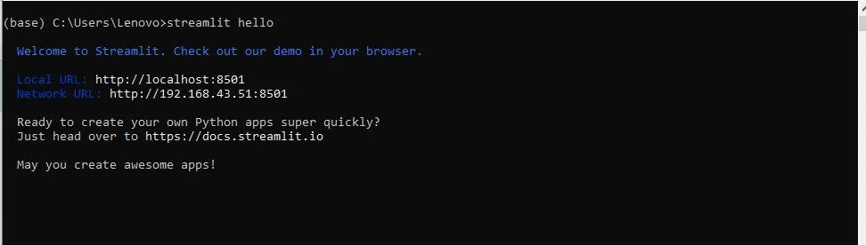<br />当运行该应用程序时，本地主机服务器将自动在默认浏览器中打开。这是 Streamlit 应用程序开源框架的主页。<br />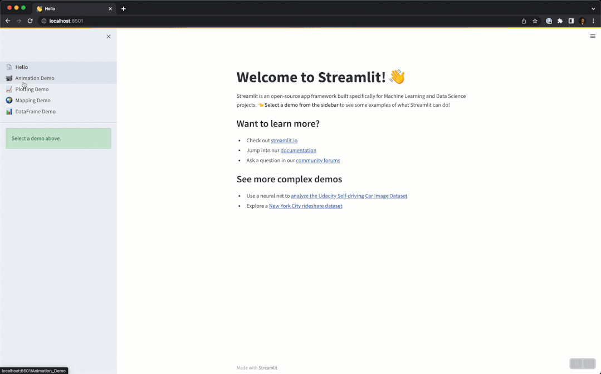
<a name="NLr0n"></a>
### **在macOS和linux上安装**
<a name="ec0Hi"></a>
#### **在 macOS 上**
```bash
#安装pip：
sudo easy_install pip
#安装pipenv：
pip3 install pipenv
#创建环境，打开项目文件夹：
cd project_folder_name
#创建一个 pipenv 环境：
pipenv shell
#键入此命令以安装 Streamlit：
pip install streamlit
#测试安装是否有效：
streamlit hello
```
<a name="yInJs"></a>
#### **在 Linux 上**
```bash
#安装pip：
sudo apt-get install python3-pip
#安装pipenv：
pip3 install pipenv
#创建环境，打开项目文件夹：
cd project_folder_name
#创建一个 pipenv 环境：
pipenv shell
#键入此命令以安装 Streamlit：
pip install streamlit
#测试安装是否有效：
streamlit hello
```
<a name="QjTkg"></a>
## **4、使用 streamlit**
<a name="Z1Rdy"></a>
### **导入库**
导入用于绘图和显示信息的必要库。
```python
import streamlit as st
import pandas as pd
import numpy as np
import plotly.express as px
from plotly.subplots import make_subplots
import plotly.graph_objects as go
import matplotlib.pyplot as plt
```
可以用不同的方式显示文本。Streamlit 可以编写标题、标题，并且还支持各种功能。接下来将和大家一起一一学习如何使用。
<a name="YKnsA"></a>
### **使用 Streamlit 显示文本**
了解如何将文本添加到 Streamlit 应用程序，以及添加文本的不同命令。<br />`st.write()`：此函数用于向 Web 应用程序添加任何内容，从格式化字符串到 matplotlib 图表、Altair 图表、绘图图表、数据框、Keras 模型等中的图表。
```python
import streamlit as st
st.write("Hello ,let's learn how to build a streamlit app together")
```
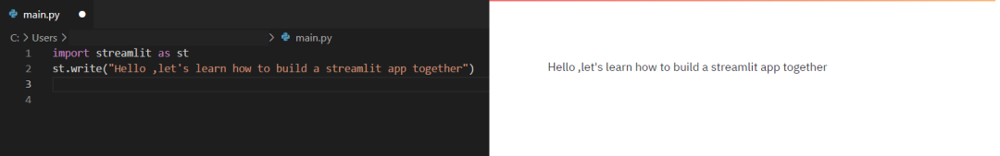

- `**st.title()**`**：用于添加应用程序的标题**
- `**st.header()**`**：用于设置节的标题**
- `**st.subheader()**`**：用于设置节的子标题**
- `**st.text()**`**：用于编写特定图形的描述**
- `**st.markdown()**`**：用于将文本显示为 Markdown**
- `**st.latex()**`**：用于在仪表板中显示数学表达式**
- `**st.write()**`**：用于显示所有内容，例如绘图、数据框、函数、模型等**
- `**st.sidebar()**`**：用于在侧边栏上显示数据**
- `**st.dataframe()**`**：用于显示数据框**
- `**st.map()**`**：用于以单行代码等显示地图**
- `**st.caption()**`**：用于写字幕**
- `**st.code()**`**：用于设置密码**
```python
st.title ("this is the app title")
st.header("this is the markdown")
st.markdown("this is the header")
st.subheader("this is the subheader")
st.caption("this is the caption")
st.code("x=2021")
st.latex(r''' a+a r^1+a r^2+a r^3 ''')
```
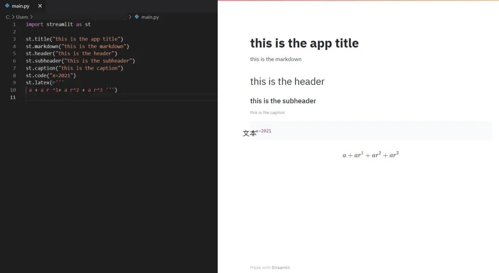
<a name="kJvAL"></a>
### **使用 Streamlit 显示图像、视频或音频文件**
Streamlit 显示图像、视频和音频文件功能简单实用。那它是如何使用 Streamlit 显示媒体的呢？使用 Streamlit 显示图像、视频或音频文件

- `**st.image()**`**：用于显示图像**
- `**st.audio()**`**：用于显示音频**
- `**st.video()**`**：用于显示视频**
```python
st.image("kid.jpg")
st.audio("Audio.mp3")
st.video("video.mp4")
```
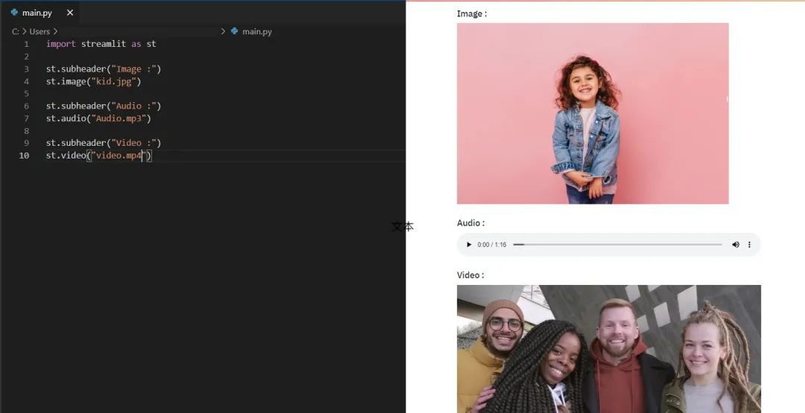
<a name="xhuaj"></a>
### **输入小部件**
小部件是最重要的用户界面组件。Streamlit有各种各样的小部件，允许通过按钮、滑动条、文本输入等直接将交互性嵌入到应用程序中。

- `**st.checkbox()**`**：此函数返回一个布尔值。选中该框时，它返回 True 值，否则返回 False 值。**
- `**st.button()**`**：用于显示按钮小部件。**
- `**st.radio()**`**：用于显示单选按钮小部件。**
- `**st.selectbox()**`**：用于显示选择小部件。**
- `**st.multiselect()**`**：用于显示多选小部件。**
- `**st.select_slider()**`**：用于显示选择滑块小部件。**
- `**st.slider()**`**：用于显示滑块小部件。**
```python
st.checkbox('yes')
st.button('Click')
st.radio('Pick your gender',['Male','Female'])
st.selectbox('Pick your gender',['Male','Female'])
st.multiselect('choose a planet',['Jupiter', 'Mars', 'neptune'])
st.select_slider('Pick a mark', ['Bad', 'Good', 'Excellent'])
st.slider('Pick a number', 0,50)
```
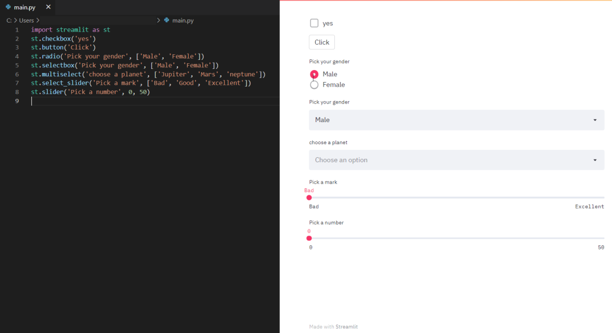

- `**st.number_input()**`**：用于显示数字输入小部件**
- `**st.text_input()**`**：用于显示文本输入小部件**
- `**st.date_input()**`**：用于显示日期输入小部件以选择日期**
- `**st.time_input()**`**：用于显示时间输入小部件以选择时间**
- `**st.text_area()**`**：用于显示具有多行文本的文本输入小部件**
- `**st.file_uploader()**`**：用于显示文件上传器小部件**
- `**st.color_picker()**`**：用于显示颜色选择器小部件以选择颜色**
```python
st.number_input('Pick a number', 0,10)
st.text_input('Email address')
st.date_input('Travelling date')
st.time_input('School time')
st.text_area('Description')
st.file_uploader('Upload a photo')
st.color_picker('Choose your favorite color')
```
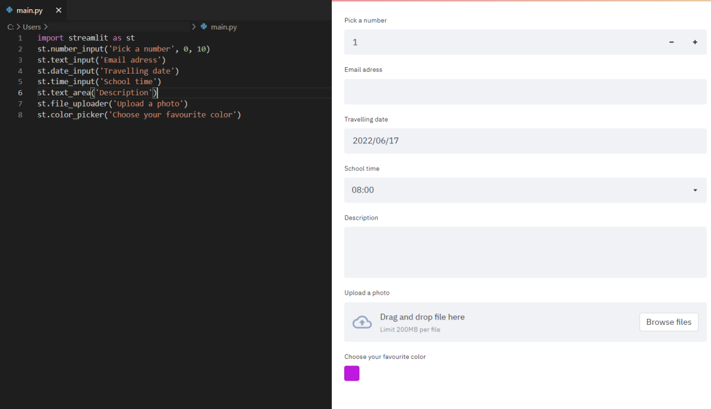
<a name="rtCu5"></a>
### **使用 Streamlit 显示进度和状态**
看到如何向应用程序添加进度条和状态消息，例如错误和成功。

- `**st.balloons()**`**：用于显示气球庆祝**
- `**st.progress()**`**：用于显示进度条**
- `**st.spinner()**`**：用于在执行期间显示临时等待消息**
```python
st.balloons()
st.progress(10)
with st.spinner('Wait for it...'):
    time.sleep(10)
```
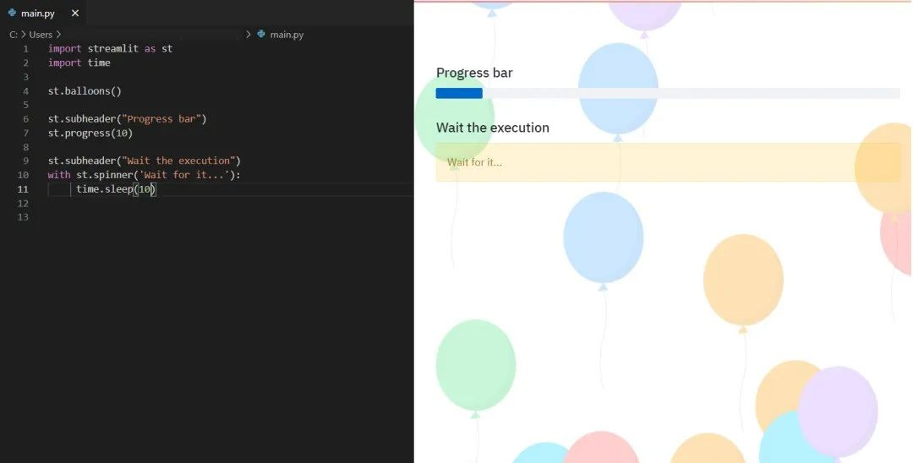

- `**st.success()**`**：用于显示成功消息**
- `**st.error()**`**：用于显示错误消息**
- `**st.warnig()**`**：用于显示警告信息**
- `**st.info()**`**：用于显示信息性消息**
- `**st.exception()**`**：用于显示异常消息。**
```python
st.success("You did it !")
st.error("Error")
st.warnig("Warning")
st.info("It's easy to build a streamlit app")
st.exception(RuntimeError("RuntimeError exception"))
```
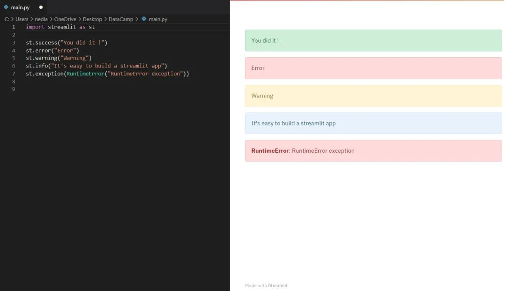
<a name="b8eqc"></a>
### **侧边栏和容器**
还可以在页面上创建侧边栏或容器来组织应用程序。应用上页面的层次结构和排列可能会对用户体验产生很大影响。通过组织内容，可以让访问者了解和浏览网站，这有助于他们找到他们正在寻找的内容并增加他们将来返回的可能性。
<a name="kRuJf"></a>
#### **侧边栏**
传递一个元素`st.sidebar()`会使这个元素固定在左边，让用户专注于应用中的内容。<br />但是`st.spinner()` 和`st.echo()` 不支持 `st.sidebar`。<br />可以在应用程序界面中创建一个侧边栏并在其中放置元素，这将的应用程序更有条理且更易于理解。<br />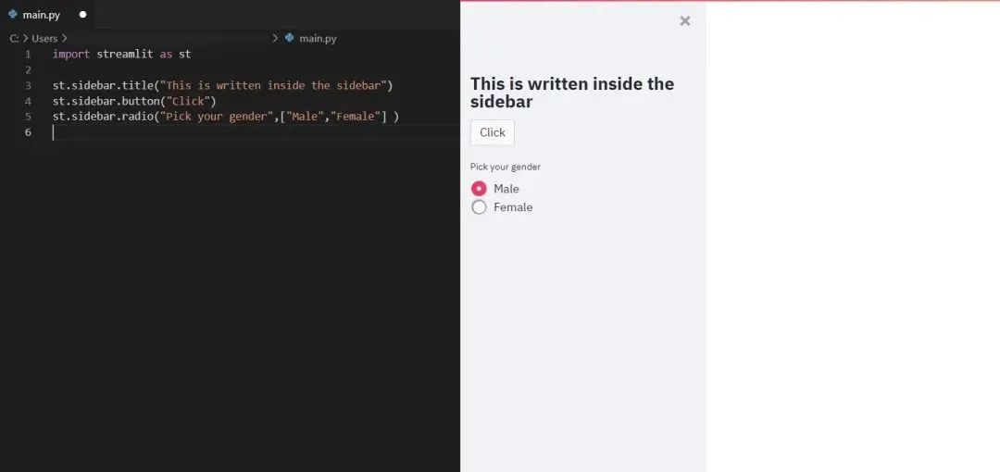
<a name="sEyU7"></a>
#### **容器**
`st.container()`用于创建一个不可见的容器，可以在其中放置元素以创建有用的排列和层次结构。<br />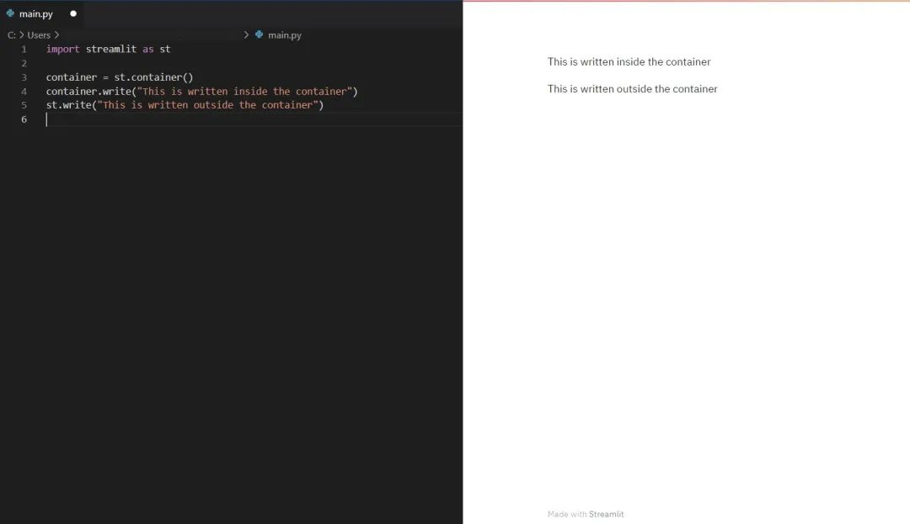
<a name="TUhbl"></a>
### **显示图表 Streamlit**

- `**st.pyplot()**`**：用于显示 **`**matplotlib.pyplot**`** 图。**
```python
import streamlit as st
import matplotlib.pyplot as plt
import numpy as np

rand=np.random.normal(1, 2, size=20)
fig, ax = plt.subplots()
ax.hist(rand, bins=15)
st.pyplot(fig)
```
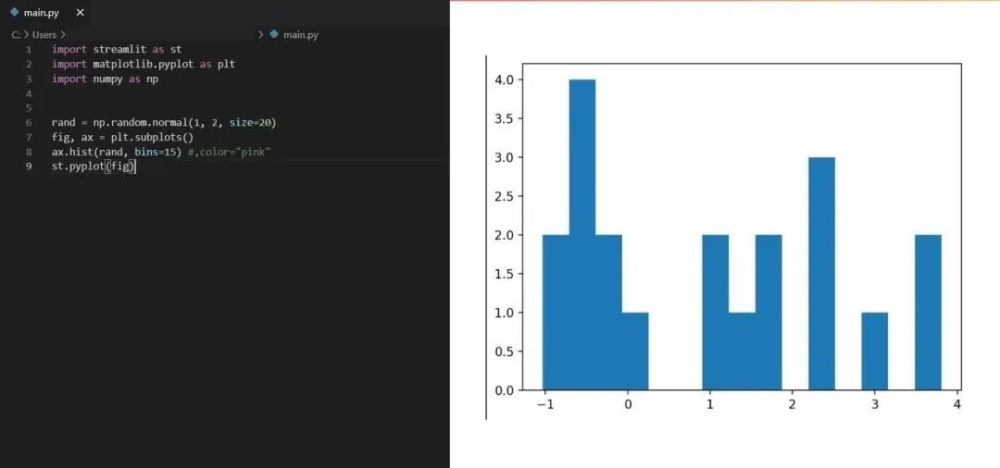

- `**st.line_chart()**`**：用于显示折线图**
```python
df= pd.DataFrame(
    np.random.randn(10, 2),
    columns=['x', 'y'])
st.line_chart(df)
```
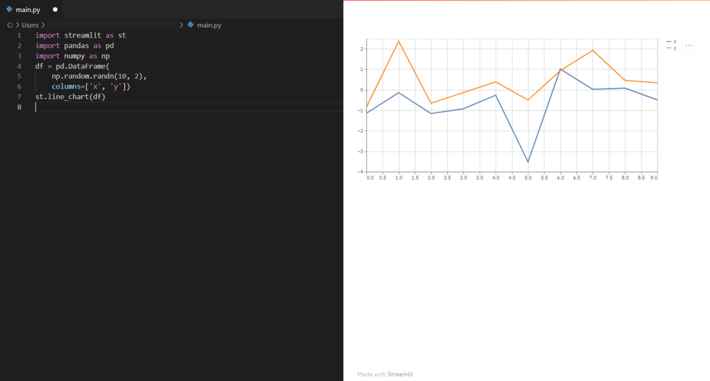

- `**st.bar_chart()**`**：用于显示条形图**
- `**st.area_chart()**`**：用于显示面积图**
- `**st.altair_chart()**`**：用于显示海拔高度图**
```python
df = pd.DataFrame(
   np.random.randn(500, 3),
   columns=['x','y','z'])

c = alt.Chart(df).mark_circle().encode(
   x='x' , 'y'=y , size='z', color='z', tooltip=['x', 'y', 'z'])
st.altair_chart(c, use_container_width=True)
```
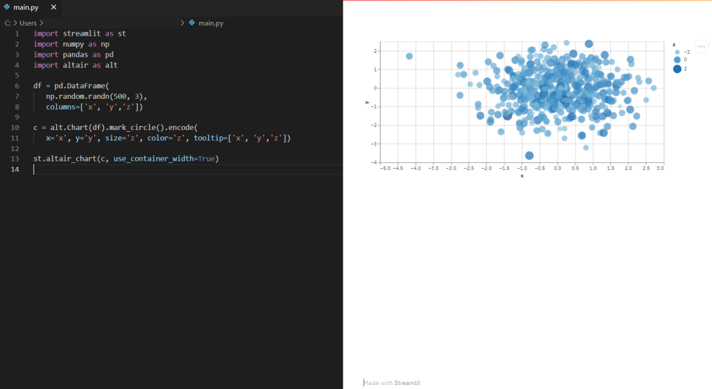

- `**st.graphviz_chart()**`**：用于显示图形对象，可以使用不同的节点和边来完成。**
```python
import streamlit as st
import graphviz as graphviz
st.graphviz_chart('''
    digraph {
        Big_shark -> Tuna
        Tuna -> Mackerel
        Mackerel -> Small_fishes
        Small_fishes -> Shrimp
    }
''')
```
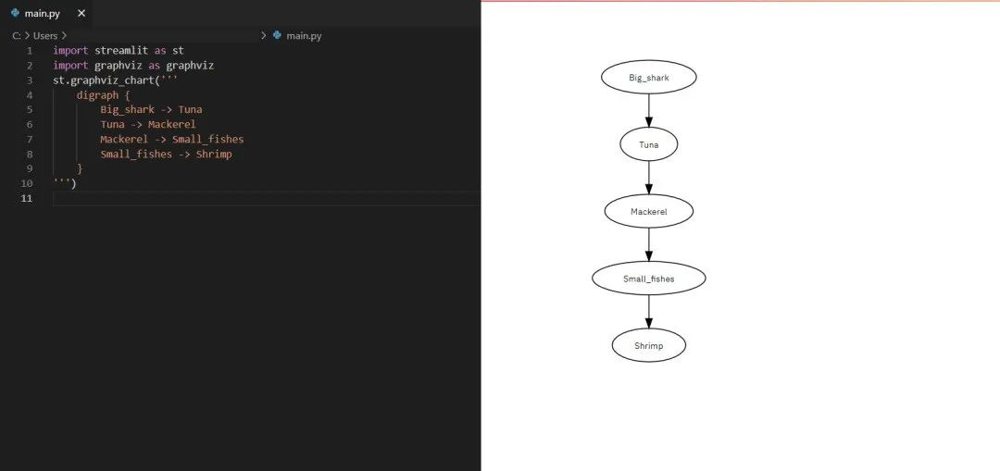
<a name="fd86B"></a>
### **使用 Streamlit 显示地图**

- `**st.map()**`**：用于在应用程序中显示地图。但是，它需要纬度和经度的值，并且这些值不能为空值。**
```python
import pandas as pd
import numpy as np
import streamlit as st
df = pd.DataFrame(np.random.randn(500, 2) / [50, 50] + [37.76, -122.4],
columns=['lat', 'lon'])
st.map(df)
```
<a name="jJ5e5"></a>
## **5、应用案例**
<a name="QpUzK"></a>
### **加载数据集**
在这里，将使用 COVID-19 数据集进行仪表板可视化。
```python
@st.cache(suppress_st_warning=True)
def load_data():
    data = pd.read_csv('COVID-19-global-data.csv')
    return data
covid_data = load_data()
```
<a name="R8NXt"></a>
### **案例数据可视化**
```python
st.sidebar.checkbox("世卫组织冠状病毒 (COVID-19) 仪表板", True, key=1)
df = covid_data.groupby(by=['Country']).sum().reset_index()
select = st.sidebar.selectbox('选择一个国家', df['Country'])

# 获取选择框选中的状态
state_data = df[df['Country'] == select]
select_status = st.sidebar.radio("世卫组织冠状病毒 (COVID-19)病例",
                                 ('新增病例', '累计病例', '新增死亡病例', '累计死亡病例'))
```
使用复选框来选择按状态进行的分析。选择框将显示受 COVID-19 影响的状态列表。用于选择活动、已确认、死亡或已恢复案例的单选按钮。
<a name="f0Ts2"></a>
### **绘制图形**
```python
def get_total_dataframe(dataset):
    total_dataframe = pd.DataFrame({
        '病例分类': ['新增病例', '累计病例', '新增死亡病例', '累计死亡病例'],
        '病例数': (dataset.iloc[0]['New_cases'],
                dataset.iloc[0]['Cumulative_cases'],
                dataset.iloc[0]['New_deaths'], dataset.iloc[0]['Cumulative_deaths'])})
    return total_dataframe

state_total = get_total_dataframe(state_data)

if st.sidebar.checkbox("世卫组织冠状病毒 (COVID-19) 仪表板", True, key=2):
    st.markdown("## **世卫组织冠状病毒 (COVID-19) 仪表板**")
    st.markdown("### %s 国家总新增病例、累计病例、新增死亡病例和累计死亡病例" % (select))
    if not st.checkbox('Hide Graph', False, key=1):
        state_total_graph = px.bar(
            state_total,
            x='病例分类',
            y='病例数',
            labels={'病例数': '%s 国家的总病例数' % (select)},
            color='病例分类')
        st.plotly_chart(state_total_graph)
```
执行此代码后，可以根据需要的状态选择案例。`get_total_dataframe` 方法用于获取数据集以绘制所选状态的图形。<br />为了绘制图形，使用了 `plotly.express` 库方法。最后，使用 `st.plotly_chart()` 显示图形。<br />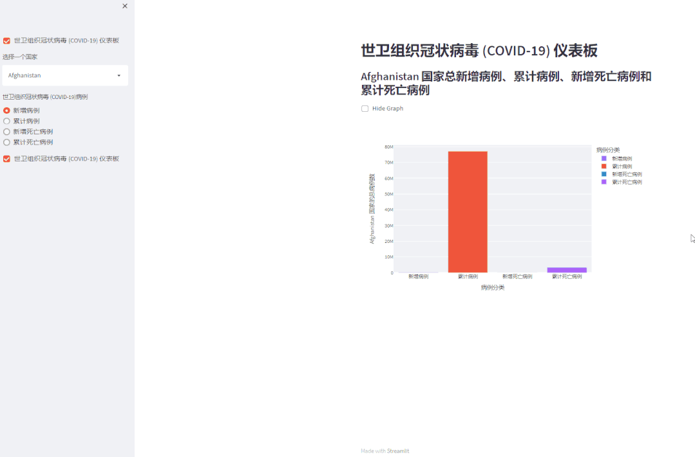
<a name="Jzgo7"></a>
## **6、显示数据框或表格**
还可以使用 `st.dataframe()` 和 `st.table()` 在表格视图中查看数据框。
```python
def get_table():
    datatable = df.sort_values(by=['Cumulative_cases'], ascending=False)
    return datatable

datatable = get_table()
st.markdown("### 世界各国家的Covid-19病例分析")
st.markdown("下表为您提供了 %s 国家Covid-19总新增病例、累计病例、新增死亡病例和累计死亡病例的实时分析。"% (select))
st.dataframe(datatable) # will display the dataframe
st.table(state_total)# will display the table
```
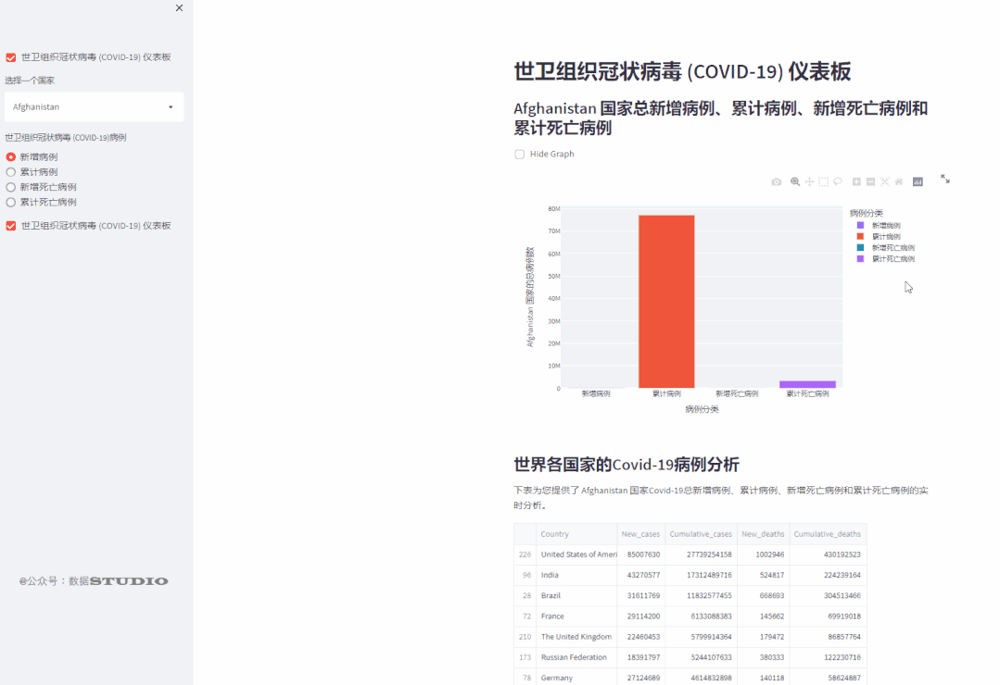<br />Streamlit 是近年来增长最快的机器学习和数据科学仪表板构建平台，它也是最好的仪表板库之一。可以尝试使用不同的数据集来创建交互式仪表板。
