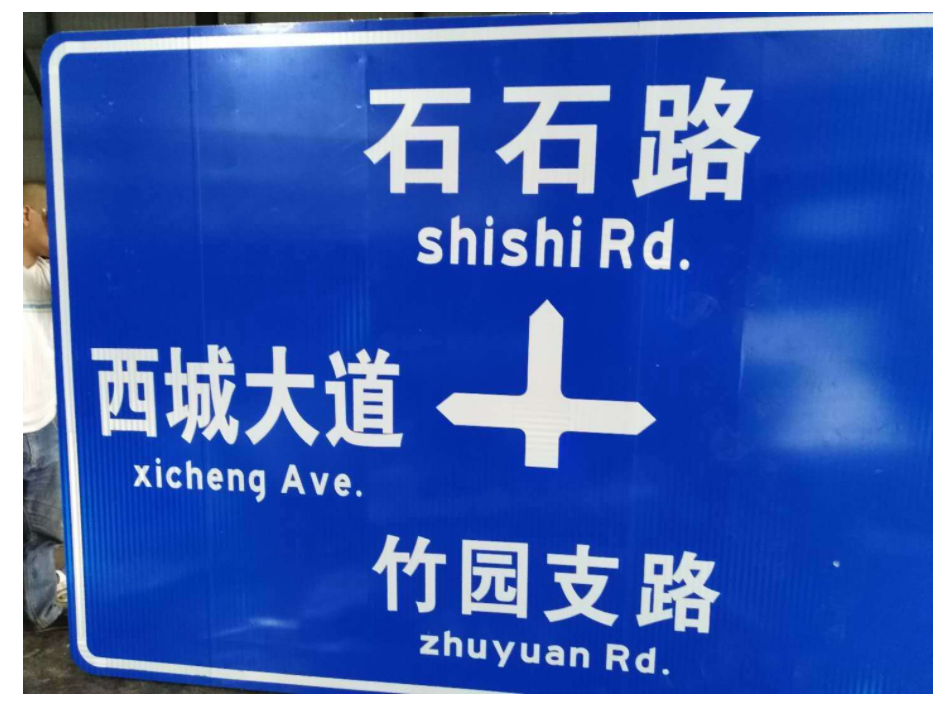

Python EasyOCR
<a name="LZtm7"></a>
## OCR简介
OCR是对文本资料的图像文件进行分析识别处理，获取文字及版面信息。OCR的全称叫作“Optical Character Recognition”，即光学字符识别。这算是生活里最常见、最有用的AI应用技术之一。<br /><br />细心观察便可发现，身边到处都是OCR的身影，文档扫描、车牌识别、证件识别、银行卡识别、票据识别等等。<br />OCR本质是图像识别，其包含两大关键技术：文本检测和文字识别。<br />先将图像中的特征的提取并检测目标区域，之后对目标区域的的字符进行分割和分类。<br />
<a name="i556v"></a>
## 关于EasyOCR
Python中有一个不错的OCR库-EasyOCR，在GitHub已有9700star。它可以在python中调用，用来识别图像中的文字，并输出为文本。<br />[https://github.com/JaidedAI/EasyOCR](https://github.com/JaidedAI/EasyOCR)<br /><br />EasyOCR支持超过80种语言的识别，包括英语、中文（简繁）、阿拉伯文、日文等，并且该库在不断更新中，未来会支持更多的语言。<br />
<a name="Ivqpc"></a>
## 安装EasyOCR
安装过程比较简单，使用pip或者conda安装。
```bash
pip install easyocr
```
如果用的PyPl源，安装起来可能会耽误些时间，建议使用清华源安装，几十秒就能安装好。
<a name="MRTMr"></a>
## 使用方法
EasyOCR的用法非常简单，分为三步:

- 1.创建识别对象；
- 2.读取并识别图像；
- 3.导出文本。

先来举个简单的例子。<br />找一张路标图片，保存到电脑：<br />看代码：
```python
# 导入easyocr
import easyocr
# 创建reader对象
reader = easyocr.Reader(['ch_sim','en']) 
# 读取图像
result = reader.readtext('test.jpg')
# 结果
result
```
输出结果：<br />可以看到路标上的三个路名以及拼音都识别出来了！<br />识别的结果包含在元组里，元组由三部分组成：边框坐标、文本、识别概率。
<a name="9gjfg"></a>
### 「关于语言」
这段代码有一段参数['ch_sim','en']，这是要识别的语言列表，因为路牌里有中文和英文，所以列表里添加了ch_sim（简体中文）、en（英文）。可以一次传递多种语言，但并非所有语言都可以一起使用。英语与每种语言兼容，共享公共字符的语言通常相互兼容。<br />前面给出了EasyOCR支持的语言列表，并附有参数代号。
<a name="Mgvs0"></a>
### 「关于图像文件」
上面传入了相对路径'test.jpg'，还可以传递OpenCV图像对象（numpy数组）、图像字节文件、图像URL。<br />再读取一张文字较多的新闻稿图片：
```python
# 导入easyocr
import easyocr
# 创建reader对象
reader = easyocr.Reader(['ch_sim','en']) 
# 读取图像
result = reader.readtext('test1.jpg')
# 结果
result
```
<br />识别文字的准确率还是很高的，接下来对文字部分进行抽取。
```python
for i in result:
    word = i[1]
    print(word)
```
输出：
<a name="l4jZ7"></a>
## 小结
该开源库是作者研究了几篇论文，复现出来的成果。<br />检测部分使用了CRAFT算法，识别模型为CRNN，它由3个主要组件组成：特征提取，序列标记（LSTM）和解码（CTC）。整个深度学习过程基于Pytorch实现。<br />作者一直在完善EasyOCR，后续计划一方面扩展支持更多的语言，争取覆盖全球80%~90%的人口；另一方面支持手写识别，并提高处理速度。
