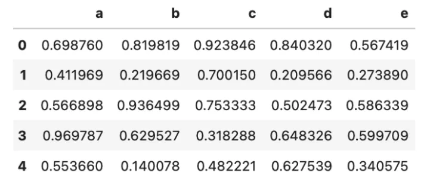
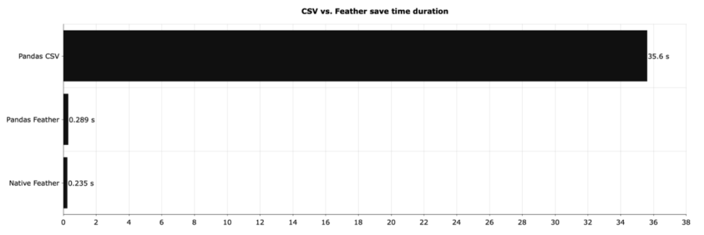
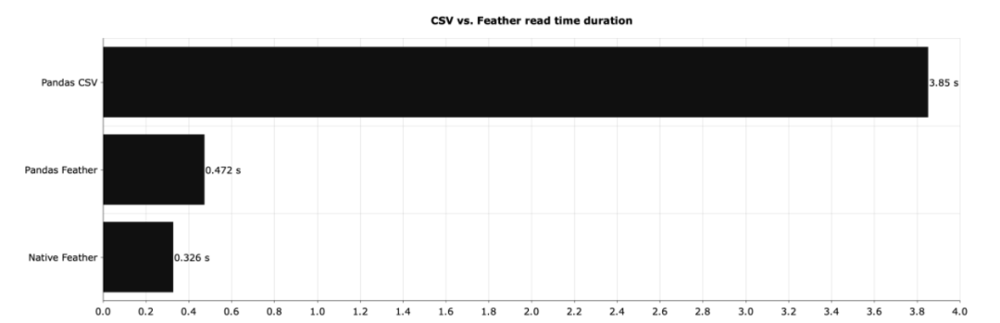
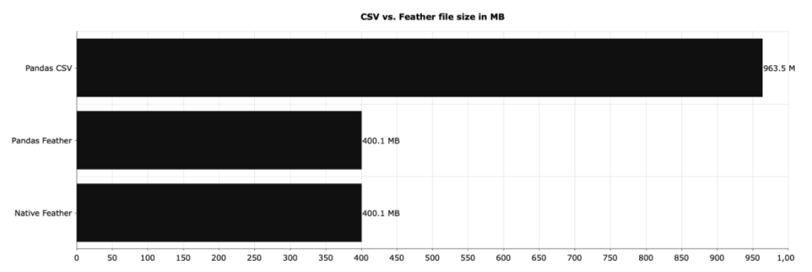

Python
<a name="UzAoS"></a>
## 为什么要和CSV再见？
用Python处理数据时保存和加载文件属于日常操作了，尤其面对大数据量时一般都会保存成CSV格式，而不是Excel。一是因为Excel有最大行数1048576的限制，二是文件占用空间更大，保存和加载速度很慢。<br />虽然用CSV没有行数限制，相对轻便，但是面对大数据量时还是略显拉夸，百万数据量储存加载时也要等好久。<br />其实，CSV 并不是唯一的数据存储格式。介绍一个速度超快、更加轻量级的二进制格式保存格式：feather。
<a name="wNnot"></a>
## Feather是什么？
Feather 是一种用于存储数据帧的数据格式。它最初是为了 Python 和 R 之间快速交互而设计的，初衷很简单，就是尽可能高效地完成数据在内存中转换的效率。<br />现在 Feather 也不仅限于 Python 和 R 了，基本每种主流的编程语言中都可以用 Feather 文件。不过，要说明下，它的数据格式并不是为长期存储而设计的，一般的短期存储。
<a name="fRDDs"></a>
## 如何在Python中操作Feather？
在 Python 中，可以通过 pandas 或 Feather 两种方式操作。首先需要安装feather-format。
```bash
# pip 
pip install feather-format 

# Anaconda 
conda install -c conda-forgefeather-format
```
只需要上面一行安装即可，很简单。<br />通过一个较大的数据集举例，需要 Feather、Numpy 和 pandas 来一起配合。数据集有 5 列和 1000 万行随机数。
```python
import feather
import numpy as np
import pandas as pd

np.random.seed = 42
df_size = 10000000

df = pd.DataFrame({
    'a': np.random.rand(df_size),
    'b': np.random.rand(df_size),
    'c': np.random.rand(df_size),
    'd': np.random.rand(df_size),
    'e': np.random.rand(df_size)
})
df.head()
```
<br />它的用法和之前csv的操作难度一个水平线，非常简单。
<a name="OvCiK"></a>
### 保存
两种方式，一是 `DataFrame` 直接`to_feather` 的 `Feather` 格式：
```python
df.to_feather('1M.feather')
```
二是用 Feather 库执行相同操作的方法：
```python
feather.write_dataframe(df, '1M.feather')
```
<a name="Rhpqp"></a>
### 加载
加载也是一样的，同样还是两种方式。一是通过pandas加载：
```python
df = pd.read_feather('1M.feather')
```
二是用 Feather 加载：
```python
df =feather.read_dataframe('1M.feather')
```
操作习惯一样，难度完全没有。
<a name="nVeaG"></a>
## 和CSV的区别
对比产生美。下面来看下`feather`和`csv`的差距有多大。下图显示了上面本地保存 DataFrame 所需的时间：<br /><br />差距巨大，有木有！原生 Feather(图中的Native Feather)比 CSV 快了将近 150 倍左右。如果使用 pandas 处理 Feather 文件并没有太大关系，但与 CSV 相比，速度的提高是非常显著的。<br />然后再看下读取不同格式的相同数据集需要多长时间。<br /><br />同样，差异也很明显。CSV 的读取速度要慢得多。并且CSV占用的磁盘空间也更大。<br /><br />CSV 文件占用的空间是 Feather 文件占用的空间的两倍多。假如每天存储千兆字节的数据，那么选择正确的文件格式至关重要。Feather 在这方面完全碾压了 CSV。<br />当然，如果追求更多的压缩空间，也可以试试Parquet，也是一个可以替代CSV 的格式。
