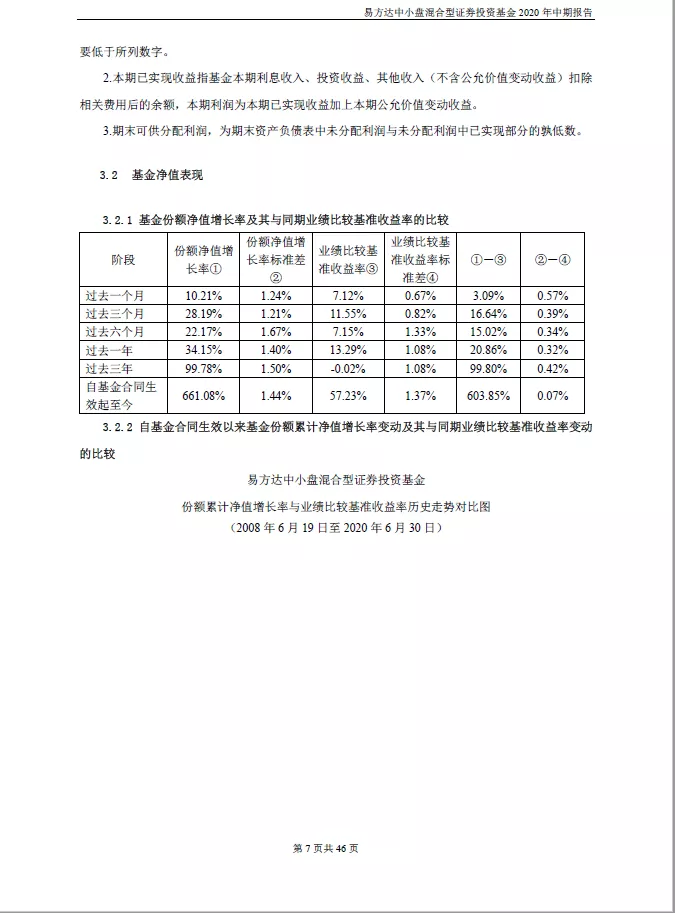

Python PDF
<a name="VWp9B"></a>
## 1、相关介绍
Python 操作 PDF 会用到两个库，分别是：PyPDF2 和 pdfplumber<br />其中 PyPDF2 可以更好的读取、写入、分割、合并PDF文件，而 pdfplumber 可以更好的读取 PDF 文件中内容和提取 PDF 中的表格<br />对应的官网分别是：<br />PyPDF2：[https://pythonhosted.org/PyPDF2/](https://pythonhosted.org/PyPDF2/)<br />pdfplumber：[https://github.com/jsvine/pdfplumber](https://github.com/jsvine/pdfplumber)<br />由于这两个库都不是 Python 的标准库，所以在使用之前都需要单独安装<br />win+r 后输入 cmd 打开 command 窗口，依次输入如下命令进行安装：
```bash
pip install PyPDF2
pip install pdfplumber
```
安装完成后显示 success 则表示安装成功<br />
<a name="vigMN"></a>
## 2、批量拆分
将一个完整的 PDF 拆分成几个小的 PDF，因为主要涉及到 PDF 整体的操作，所以本小节需要用到 PyPDF2 这个库<br />拆分的大概思路如下：

- 读取 PDF 的整体信息、总页数等
- 遍历每一页内容，以每个 step 为间隔将 PDF 存成每一个小的文件块
- 将小的文件块重新保存为新的 PDF 文件

需要注意的是，在拆分的过程中，可以手动设置间隔，例如：每5页保存成一个小的 PDF 文件<br />拆分的代码如下：
```python
import os
from PyPDF2 import PdfFileWriter, PdfFileReader

def split_pdf(filename, filepath, save_dirpath, step=5):
    """
    拆分PDF为多个小的PDF文件，
    @param filename:文件名
    @param filepath:文件路径
    @param save_dirpath:保存小的PDF的文件路径
    @param step: 每step间隔的页面生成一个文件，例如step=5，表示0-4页、5-9页...为一个文件
    @return:
    """
    if not os.path.exists(save_dirpath):
        os.mkdir(save_dirpath)
    pdf_reader = PdfFileReader(filepath)
    # 读取每一页的数据
    pages = pdf_reader.getNumPages()
    for page in range(0, pages, step):
        pdf_writer = PdfFileWriter()
        # 拆分pdf，每 step 页的拆分为一个文件
        for index in range(page, page+step):
            if index < pages:
                pdf_writer.addPage(pdf_reader.getPage(index))
        # 保存拆分后的小文件
        save_path = os.path.join(save_dirpath, filename+str(int(page/step)+1)+'.pdf')
        print(save_path)
        with open(save_path, "wb") as out:
            pdf_writer.write(out)

    print("文件已成功拆分，保存路径为："+save_dirpath)
    
split_pdf(filename, filepath, save_dirpath, step=5)
```
以“易方达中小盘混合型证券投资基金2020年中期报告”为例，整个 PDF 文件一共 46 页，每5页为间隔，最终生成了10个小的 PDF 文件<br />
<a name="k8MzS"></a>
## 3、批量合并
比起拆分来，合并的思路更加简单：

- 确定要合并的 文件顺序
- 循环追加到一个文件块中
- 保存成一个新的文件

对应的代码比较简单：
```python
import os
from PyPDF2 import PdfFileReader, PdfFileWriter

def concat_pdf(filename, read_dirpath, save_filepath):
    """
    合并多个PDF文件
    @param filename:文件名
    @param read_dirpath:要合并的PDF目录
    @param save_filepath:合并后的PDF文件路径
    @return:
    """
    pdf_writer = PdfFileWriter()
    # 对文件名进行排序
    list_filename = os.listdir(read_dirpath)
    list_filename.sort(key=lambda x: int(x[:-4].replace(filename, "")))
    for filename in list_filename:
        print(filename)
        filepath = os.path.join(read_dirpath, filename)
        # 读取文件并获取文件的页数
        pdf_reader = PdfFileReader(filepath)
        pages = pdf_reader.getNumPages()
        # 逐页添加
        for page in range(pages):
            pdf_writer.addPage(pdf_reader.getPage(page))
    # 保存合并后的文件
    with open(save_filepath, "wb") as out:
        pdf_writer.write(out)
    print("文件已成功合并，保存路径为："+save_filepath)
    
concat_pdf(filename, read_dirpath, save_filepath)
```
<a name="SHsng"></a>
## 4、提取文字内容
涉及到具体的 PDF 内容 操作，本小节需要用到 pdfplumber 这个库<br />在进行文字提取的时候，主要用到 `extract_text` 这个函数<br />具体代码如下：
```python
import os
import pdfplumber

def extract_text_info(filepath):
    """
    提取PDF中的文字
    @param filepath:文件路径
    @return:
    """
    with pdfplumber.open(filepath) as pdf:
        # 获取第2页数据
        page = pdf.pages[1]
        print(page.extract_text())
        
# 提取文字内容
extract_text_info(filepath)
```
可以看到，直接通过下标即可定位到相应的页码，从而通过 extract_text 函数提取该也的所有文字<br />而如果想要提取所有页的文字，只需要改成：
```python
with pdfplumber.open(filepath) as pdf:
 # 获取全部数据
 for page in pdf.pages
     print(page.extract_text())
```
例如，提取“易方达中小盘混合型证券投资基金2020年中期报告” 第一页的内容时，源文件是这样的：<br /><br />运行代码后提取出来是这样的：<br />
<a name="knAUL"></a>
## 5、提取表格内容
同样的，本节是对具体内容的操作，所以也需要用到 pdfplumber 这个库<br />和提取文字十分类似的是，提取表格内容只是将 `extract_text` 函数换成了 `extract_table` 函数<br />对应的代码如下：
```python
import os
import pandas as pd
import pdfplumber

def extract_table_info(filepath):
    """
    提取PDF中的图表数据
    @param filepath:
    @return:
    """
    with pdfplumber.open(filepath) as pdf:
        # 获取第18页数据
        page = pdf.pages[17]
        # 如果一页有一个表格，设置表格的第一行为表头，其余为数据
        table_info = page.extract_table()
        df_table = pd.DataFrame(table_info[1:], columns=table_info[0])
        df_table.to_csv('dmeo.csv', index=False, encoding='gbk')
        
# 提取表格内容
extract_table_info(filepath)
```
上面代码可以获取到第 18 页的第一个表格内容，并且将其保存为 csv 文件存在本地<br />但是，如果说第 18 页有多个表格内容呢？<br />因为读取的表格会被存成二维数组，而多个二维数组就组成一个三维数组<br />遍历这个三位数组，就可以得到该页的每一个表格数据，对应的将 `extract_table` 函数 改成 `extract_tables` 即可<br />具体代码如下：
```python
# 如果一页有多个表格，对应的数据是一个三维数组
tables_info = page.extract_tables()
for index in range(len(tables_info)):
    # 设置表格的第一行为表头，其余为数据
    df_table = pd.DataFrame(tables_info[index][1:], columns=tables_info[index][0])
    print(df_table)
    # df_table.to_csv('dmeo.csv', index=False, encoding='gbk')
```
以“易方达中小盘混合型证券投资基金2020年中期报告” 第 xx 页的第一个表格为例：<br />源文件中的表格是这样的：<br /><br />提取并存入 excel 之后的表格是这样的：<br />
<a name="XpU3M"></a>
## 6、提取图片内容
提取 PDF 中的图片和将 PDF 转存为图片是不一样的（下一小节），需要区分开。<br />提取图片：顾名思义，就是将内容中的图片都提取出来；<br />转存为图片：则是将每一页的 PDF 内容存成一页一页的图片，下一小节会详细说明<br />转存为图片中，需要用到一个模块叫 fitz，fitz 的最新版 1.18.13，非最新版的在部分函数名称上存在差异，代码中会标记出来<br />使用 fitz 需要先安装 PyMuPDF 模块，安装方式如下：
```bash
pip install PyMuPDF
```
提取图片的整体逻辑如下：

- 使用 fitz 打开文档，获取文档详细数据
- 遍历每一个元素，通过正则找到图片的索引位置
- 使用 Pixmap 将索引对应的元素生成图片
- 通过 size 函数过滤较小的图片

实现的具体代码如下：
```python
import os
import re
import fitz

def extract_pic_info(filepath, pic_dirpath):
    """
    提取PDF中的图片
    @param filepath:pdf文件路径
    @param pic_dirpath:要保存的图片目录路径
    @return:
    """
    if not os.path.exists(pic_dirpath):
        os.makedirs(pic_dirpath)
    # 使用正则表达式来查找图片
    check_XObject = r"/Type(?= */XObject)"
    check_Image = r"/Subtype(?= */Image)"
    img_count = 0

    """1. 打开pdf，打印相关信息"""
    pdf_info = fitz.open(filepath)
    # 1.16.8版本用法 xref_len = doc._getXrefLength()
    # 最新版本
    xref_len = pdf_info.xref_length()
    # 打印PDF的信息
    print("文件名：{}, 页数: {}, 对象: {}".format(filepath, len(pdf_info), xref_len-1))

    """2. 遍历PDF中的对象，遇到是图像才进行下一步，不然就continue"""
    for index in range(1, xref_len):
        # 1.16.8版本用法 text = doc._getXrefString(index)
        # 最新版本
        text = pdf_info.xref_object(index)

        is_XObject = re.search(check_XObject, text)
        is_Image = re.search(check_Image, text)
        # 如果不是对象也不是图片，则不操作
        if is_XObject or is_Image:
            img_count += 1
            # 根据索引生成图像
            pix = fitz.Pixmap(pdf_info, index)
            pic_filepath = os.path.join(pic_dirpath, 'img_' + str(img_count) + '.png')
            """pix.size 可以反映像素多少，简单的色素块该值较低，可以通过设置一个阈值过滤。以阈值 10000 为例过滤"""
            # if pix.size < 10000:
            #     continue

            """三、 将图像存为png格式"""
            if pix.n >= 5:
                # 先转换CMYK
                pix = fitz.Pixmap(fitz.csRGB, pix)
            # 存为PNG
            pix.writePNG(pic_filepath)
            
# 提取图片内容
extract_pic_info(filepath, pic_dirpath)
```
以本节示例的“易方达中小盘混合型证券投资基金2020年中期报告” 中的图片为例，代码运行后提取的图片如下：<br /><br />这个结果和文档中的共 1 张图片的 结果符合
<a name="Ky7JZ"></a>
## 7、转换为图片
转换为照片比较简单，就是将一页页的 PDF 转换为一张张的图片。大致过程如下：
<a name="E26wP"></a>
##### 安装 pdf2image
首先需要安装对应的库，最新的 pdf2image 库版本应该是 1.14.0<br />它的 github地址 为：[https://github.com/Belval/pdf2image](https://github.com/Belval/pdf2image) ，感兴趣的可以自行了解<br />安装方式如下：
```bash
pip install pdf2image
```
<a name="s4zOz"></a>
### 安装组件
对于不同的平台，需要安装相应的组件，这里以 windows 平台和 mac 平台为例：
<a name="HQ0mJ"></a>
#### Windows 平台
对于 windows 用户需要安装 poppler for Windows，安装链接是：[http://blog.alivate.com.au/poppler-windows/](http://blog.alivate.com.au/poppler-windows/)<br />另外，还需要添加环境变量， 将 bin 文件夹的路径添加到环境变量 PATH 中<br />注意这里配置之后需要重启一下电脑才会生效，不然会报错
<a name="EaJPv"></a>
#### Mac
对于 mac 用户，需要安装 poppler for Mac，具体可以参考这个链接：[http://macappstore.org/poppler/](http://macappstore.org/poppler/)<br />详细代码如下：
```python
import os
from pdf2image import convert_from_path, convert_from_bytes

def convert_to_pic(filepath, pic_dirpath):
    """
    每一页的PDF转换成图片
    @param filepath:pdf文件路径
    @param pic_dirpath:图片目录路径
    @return:
    """
    print(filepath)
    if not os.path.exists(pic_dirpath):
        os.makedirs(pic_dirpath)

    images = convert_from_bytes(open(filepath, 'rb').read())
    # images = convert_from_path(filepath, dpi=200)
    for image in images:
        # 保存图片
        pic_filepath = os.path.join(pic_dirpath, 'img_'+str(images.index(image))+'.png')
        image.save(pic_filepath, 'PNG')
        
# PDF转换为图片
convert_to_pic(filepath, pic_dirpath)
```
以本节示例的“易方达中小盘混合型证券投资基金2020年中期报告” 中的图片为例，该文档共 46 页，保存后的 PDF 照片如下：<br /><br />一共 46 张图片
<a name="r9AJ4"></a>
## 8、添加水印
添加水印后的效果如下：<br /><br />在制作水印的时候，可以自定义水印内容、透明度、斜度、字间宽度等等，可操作性比较好。
<a name="ltji4"></a>
## 9、文档加密与解密
可能在打开部分 PDF 文件的时候，会弹出下面这个界面：<br /><br />这种就是 PDF 文件被加密了，在打开的时候需要相应的密码才行<br />本节所提到的也只是基于 PDF 文档的加密解密，而不是所谓的 PDF 密码破解。<br />在对 PDF 文件加密需要使用 `encrypt` 函数，对应的加密代码也比较简单：
```python
import os
from PyPDF2 import PdfFileReader, PdfFileWriter

def encrypt_pdf(filepath, save_filepath, passwd='xiaoyi'):
    """
    PDF文档加密
    @param filepath:PDF文件路径
    @param save_filepath:加密后的文件保存路径
    @param passwd:密码
    @return:
    """
    pdf_reader = PdfFileReader(filepath)
    pdf_writer = PdfFileWriter()

    for page_index in range(pdf_reader.getNumPages()):
        pdf_writer.addPage(pdf_reader.getPage(page_index))

    # 添加密码
    pdf_writer.encrypt(passwd)
    with open(save_filepath, "wb") as out:
        pdf_writer.write(out)
        
# 文档加密
encrypt_pdf(filepath, save_filepath, passwd='fcant')
```
代码执行成功后再次打开 PDF 文件则需要输入密码才行<br />根据这个思路，破解 PDF 也可以通过暴力求解实现，例如：通过本地密码本一个个去尝试，或者根据数字+字母的密码形式循环尝试，最终成功打开的密码就是破解密码<br />上述破解方法耗时耗力，不建议尝试<br />另外，针对已经加密的 PDF 文件，也可以使用 `decrypt` 函数进行解密操作<br />解密代码如下：
```python
def decrypt_pdf(filepath, save_filepath, passwd='xiaoyi'):
    """
    解密 PDF 文档并且保存为未加密的 PDF
    @param filepath:PDF文件路径
    @param save_filepath:解密后的文件保存路径
    @param passwd:密码
    @return:
    """
    pdf_reader = PdfFileReader(filepath)
    # PDF文档解密
    pdf_reader.decrypt('xiaoyi')

    pdf_writer = PdfFileWriter()
    for page_index in range(pdf_reader.getNumPages()):
        pdf_writer.addPage(pdf_reader.getPage(page_index))

    with open(save_filepath, "wb") as out:
        pdf_writer.write(out)
        
# 文档解密
decrypt_pdf(filepath, save_filepath, passwd='fcant')
```
解密完成后的 PDF 文档打开后不再需要输入密码，如需加密可再次执行加密代码。

 
