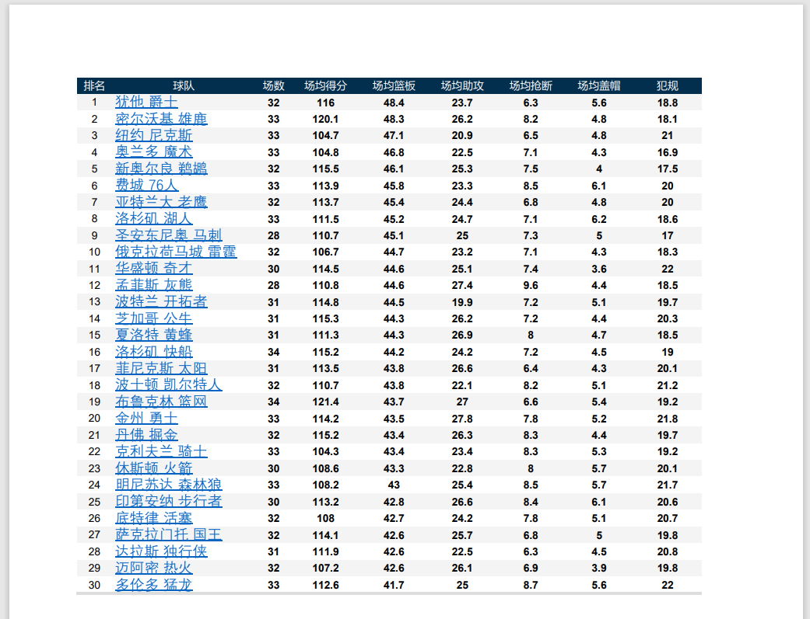
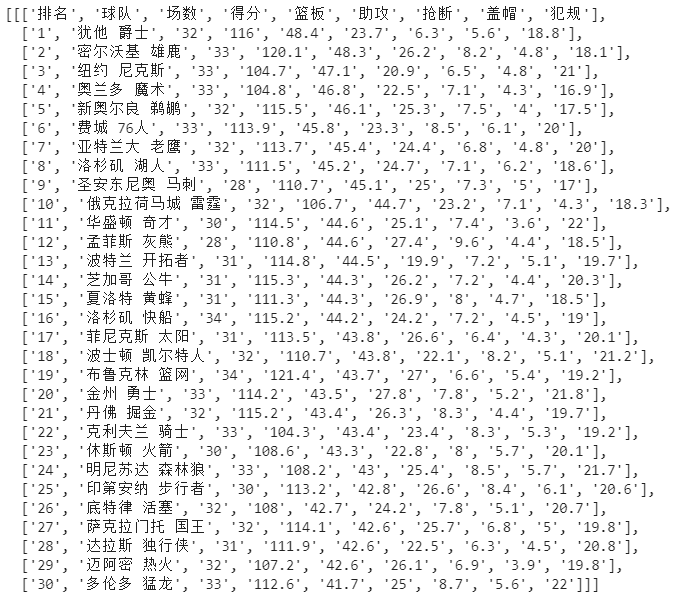
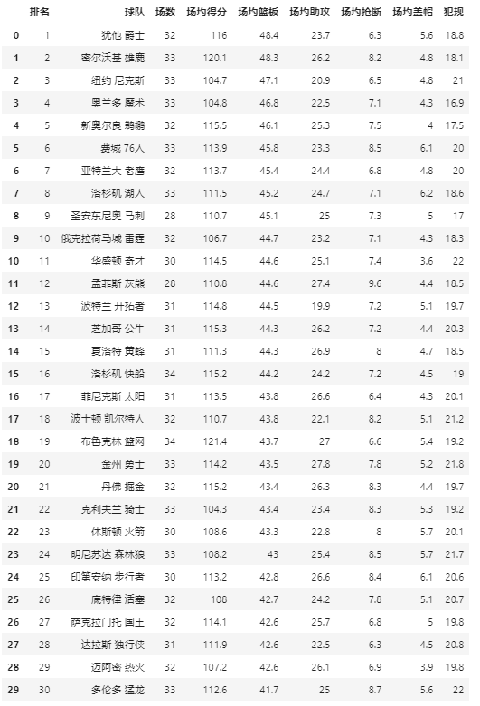
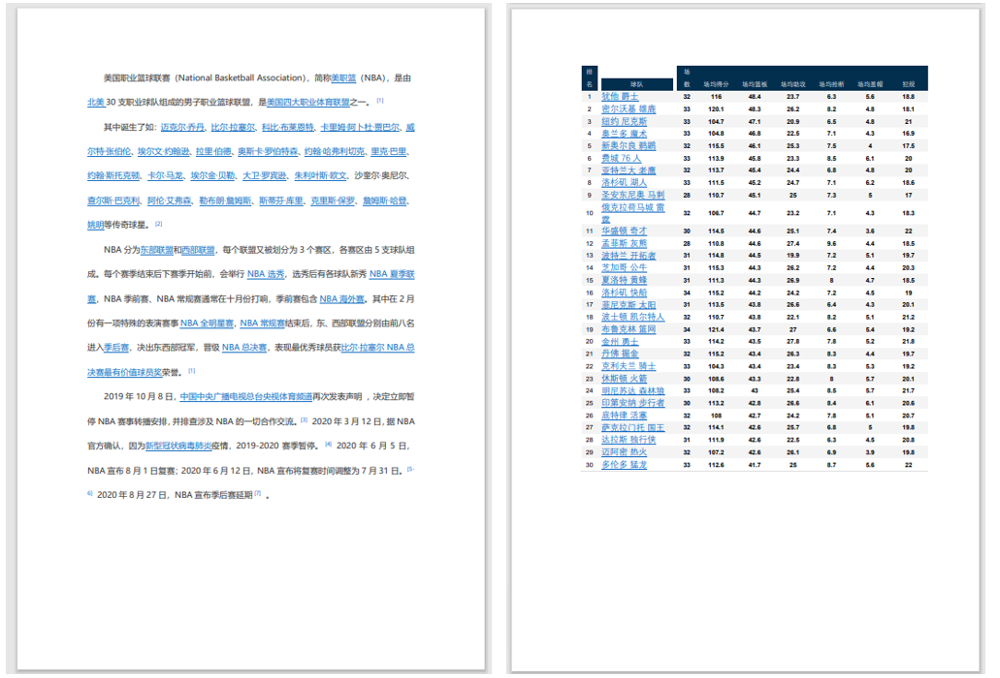
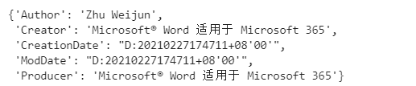
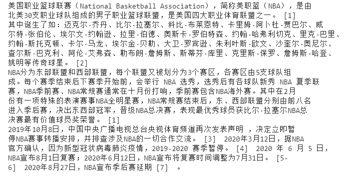
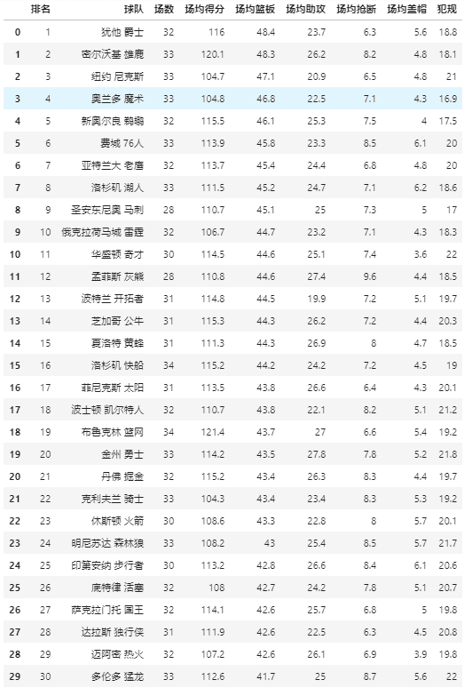
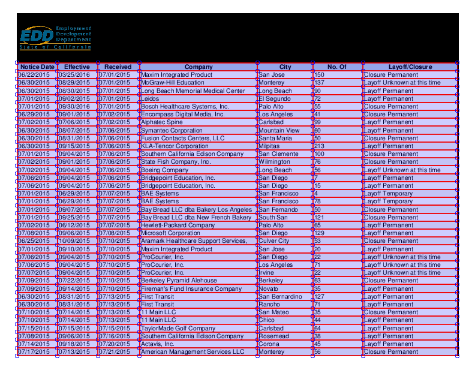

Python PDF<br />PDF是一种便携式文档格式，由Adobe公司设计。因为不受平台限制，且方便保存和传输，所以PDF非常受欢迎。<br />目前市场上有很多PDF工具，大部分是阅读类，也有支持对PDF的修改、转换等功能，但这部分工具不少是收费的。但是如果要批量对PDF修改的话还是用代码实现会比较好！<br />这次介绍一个开源Python工具库-pdfplumber，可以方便地获取PDF的各种信息，包括文本、表格、图表、尺寸等。<br />pdfplumber在github上有英文官方文档，先看下如何用pdfplumber提取pdf表格？<br />以NBA 2020-2021 常规赛数据作为范例，pdf表格如下：<br />第一步：使用pdfplumber提取表格文本
```python
# 导入pdfplumber
import pdfplumber

# 读取pdf文件，保存为pdf实例
pdf = pdfplumber.open("E:\\nba.pdf")
# 访问第二页
first_page = pdf.pages[1]
# 自动读取表格信息，返回列表
table = first_page.extract_table()
table
```
输出：<br /><br />第二步：整理成dataframe格式，保存为excel
```python
import pandas as pd
# 将列表转为df
table_df = pd.DataFrame(table_2[1:],columns=table_2[0])
# 保存excel
table_df.to_excel('test.xlsx')
table_df
```
输出：<br /><br />一个小小的脚本，不到十行代码，便将PDF表格提取并转化为dataframe格式，最终保存到excel。<br />有个初步认知后，接下来详细讲讲pdfplumber的安装、导入、api接口等信息。
<a name="VU71H"></a>
## pdfplumber简介
前面已经介绍过pdfplumber的用途，也用一个小案例展示了如何提取表格，对于pdfplumber只需要了解三点就可以。<br />1、它是一个纯python第三方库，适合Python3.x版本<br />2、它用来查看PDF各类信息，能有效提取文本、表格<br />3、它不支持修改或生成PDF，也不支持对PDF扫描件的处理
<a name="rztKg"></a>
## pdfplumber的GIthub仓库地址
Github地址[https://github.com/jsvine/pdfplumber](https://github.com/jsvine/pdfplumber)
<a name="64GsV"></a>
## pdfplumber安装和导入
同其他python库一样，pdfplumber支持使用pip安装，在命令行输入：
```bash
pip install pdfplumber
```
如果遇到安装慢的问题，可以替换镜像源，会快很多。<br />pdfplumber安装后，用import导入即可使用：
```python
import pdfplumber
....
```
<a name="LEy5h"></a>
## pdfplumber简单使用
pdfplumber中有两个基础类，PDF和Page。看字面意思能猜出，前者是处理整个文档，后者是处理页面。
<a name="1e6c06e0"></a>
### 「pdfplumber.PDF类」
| 属性 | 描述 |
| --- | --- |
| `.metadata` | 获取pdf基础信息，返回字典 |
| `.pages` | 一个包含`pdfplumber.Page`实例的列表，每一个实例代表pdf每一页的信息。 |

<a name="uvu94"></a>
### 「pdfplumber.Page类」
这是pdfplumber的核心功能，对pdf的大部分操作都是基于这个类，包括提取文本、表格、尺寸等。<br />这里暂不一一列举它的属性和方法。<br />通过一个简单的案例，就可以明白它们的作用。示例pdf文档，共两页：
<a name="q25yi"></a>
#### 读取pdf
```python
# 导入pdfplumber
import pdfplumber
# 读取pdf文件，返回pdfplumber.PDF类的实例
pdf = pdfplumber.open("e:\\nba2.pdf")
```
<a name="lBhJ8"></a>
#### 获取该pdf文档的信息
```python
# 通过pdfplumber.PDF类的metadata属性获取pdf信息
pdf.metadata
```
输出：<br /><br />这些是pdf的基础信息，包括作者、来源、日期等。
<a name="FCs6f"></a>
#### 总页数
```python
# 通过pdfplumber.PDF类的metadata属性获取pdf页数
len(pdf.pages)
```
<a name="zFqXf"></a>
#### 读取第一页的页宽、页高等信息
```python
# 第一页pdfplumber.Page实例
first_page = pdf.pages[0]
# 查看页码
print('页码：',first_page.page_number)
# 查看页宽
print('页宽：'first_page.width)
# 查看页高
print('页高：'first_page.height)
```
输出：<br />
<a name="tcAL7"></a>
#### 读取第一页的文本
```python
# 读取文本
text = first_page.extract_text()
print(text)
```
输出：
<a name="Yoj8u"></a>
#### 读取第二页的表格
```python
import pandas as pd
# 第二页pdfplumber.Page实例
first_page = pdf.pages[1]
# 自动读取表格信息，返回列表
table = first_page.extract_tables()
# 将列表转为df
table_df = pd.DataFrame(table_2[1:],columns=table_2[0])
table_df
```
<br />pdfplumber提取表格有很多的细节需要处理，这里给到的范例表格线框比较规范，所以能很简单的提取，但对于线框不完全（包含无线框）的表格，其效果就差了不少。<br />在实际项目所需处理的pdf文档中，线框完全及不完全的表格都比较多，为了能够理解pdfplumber实现表格抽取的原理和方法，需要去细究相关参数的设置。<br />正如案例所示，`pdfplumber.Page`对象的`.extract_table()`方法可以提取表格，返回从页面上最大的表中提取的文本，以列表列表的形式显示，结构为row -> cell。
<a name="gEFeO"></a>
### 「表格抽取参数设置」
默认情况下，`extract_table`使用页面的垂直和水平线（或矩形边缘）作为单元格分隔符。该方法可以通过table_settings参数进行高度自定义。可能的设置及其默认值：
```json
{
    "vertical_strategy": "lines", 
    "horizontal_strategy": "lines",
    "explicit_vertical_lines": [],
    "explicit_horizontal_lines": [],
    "snap_tolerance": 3,
    "join_tolerance": 3,
    "edge_min_length": 3,
    "min_words_vertical": 3,
    "min_words_horizontal": 1,
    "keep_blank_chars": False,
    "text_tolerance": 3,
    "text_x_tolerance": None,
    "text_y_tolerance": None,
    "intersection_tolerance": 3,
    "intersection_x_tolerance": None,
    "intersection_y_tolerance": None,
}
```
| Setting | Description |
| --- | --- |
| `"vertical_strategy"` | `"lines"`, `"lines_strict"`, `"text"`, 或 `"explicit"` |
| `"horizontal_strategy"` | `"lines"`, `"lines_strict"`, `"text"`, 或 `"explicit"` |
| `"explicit_vertical_lines"` | 垂直线列表，用于明确划分表格中的单元格。可以与以上任何策略结合使用。列表中的项目应为数字(表示页面的整个高度的线条的 `x` 坐标)或 `line`/`rect`/`curve` 对象。 |
| `"explicit_horizontal_lines"` | 明确划分表中单元格的水平线列表。可以与以上任何策略结合使用。列表中的项目应为数字(表示页面的整个高度的线条的 `y`坐标)或`line`/`rect`/`curve` 对象。 |
| `"snap_tolerance"` | `snap_tolerance` 像素内的平行线将被"捕捉"到相同的水平或垂直位置。 |
| `"join_tolerance"` | 同—条直线上的线段(其末端在彼此的 `join_tolerance` 之内）将被"拼接"为单个线段 |
| `"edge_min_length"` | 短于 `edge_min_length` 的边将在尝试重建表之前被丢弃。 |
| `"min_words_vertical"` | When using `"vertical_strategy": "text"`, at least `min_words_vertical` words must share the same alignment. |
| `"min_words_horizontal"` | 使用min_words_horizontal `"horizontal_strategy": "text"`,<br />时，至少 `min_words_horizontal` 个单词必须共享相同的对齐方式。 |
| `"keep_blank_chars"` | 使用 `text` 策略时, 将 `" "` 字符作为单词的一部分而不是单词分隔符。 |
| `"text_tolerance"`, `"text_x_tolerance"`, `"text_y_tolerance"` | 当`text` 策略搜索单词时，它将期望每个单词中的各个字母相差不超过 `text_tolerance` 像素。 |
| `"intersection_tolerance"`, `"intersection_x_tolerance"`, `"intersection_y_tolerance"` | 将边缘合并为单元格时，正交边缘必须在 `intersection_tolerance` 像素内才能被视为相交。 |

pdfplumber支持对图表进行可视化调试，能输出图像，显示如何提取表。
<a name="1SAFq"></a>
## pdfplumber的独特之处
python中有很多库可以处理pdf，比如PyPDF2、pdfminer等，那pdfplumber的优势在哪呢？<br />首先，pdfplumber能轻松访问有关PDF对象的所有详细信息，且用于提取文本和表格的方法高级可定制，使用者可根据表格的具体形式来调整参数。<br />最关键的是pdfplumber作者持续在维护该库，而同样受欢迎的PyPDF2已经不再维护了。
