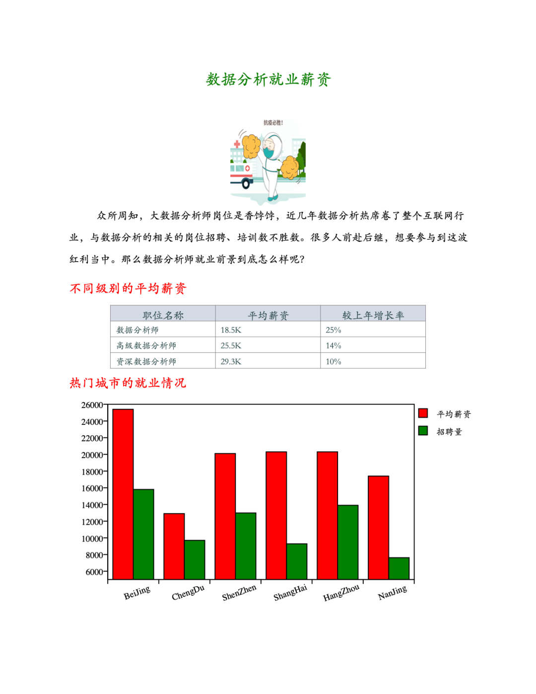

Python<br />reportlab是Python的一个标准库，可以画图、画表格、编辑文字，最后可以输出PDF格式。它的逻辑和编辑一个word文档或者PPT很像。有两种方法：<br />1）建立一个空白文档，然后在上面写文字、画图等；<br />2）建立一个空白list，以填充表格的形式插入各种文本框、图片等，最后生成PDF文档。<br />因为需要产生一份给用户看的报告，里面需要插入图片、表格等，所以采用的是第二种方法。
<a name="lLihJ"></a>
### **安装第三方库**
reportlab输入Python的第三方库，使用前需要先安装：`pip install reportlab`
<a name="OA3qY"></a>
### **模块导入**
提前导入相关内容，并且注册字体。（注册字体前需要先准备好字体文件）
```python
from reportlab.pdfbase import pdfmetrics   # 注册字体
from reportlab.pdfbase.ttfonts import TTFont # 字体类
from reportlab.platypus import Table, SimpleDocTemplate, Paragraph, Image  # 报告内容相关类
from reportlab.lib.pagesizes import letter  # 页面的标志尺寸(8.5*inch, 11*inch)
from reportlab.lib.styles import getSampleStyleSheet  # 文本样式
from reportlab.lib import colors  # 颜色模块
from reportlab.graphics.charts.barcharts import VerticalBarChart  # 图表类
from reportlab.graphics.charts.legends import Legend  # 图例类
from reportlab.graphics.shapes import Drawing  # 绘图工具
from reportlab.lib.units import cm  # 单位：cm

# 注册字体(提前准备好字体文件, 如果同一个文件需要多种字体可以注册多个)
pdfmetrics.registerFont(TTFont('SimSun', 'SimSun.ttf'))
```
<a name="iNyYP"></a>
### **封装不同内容对应的函数**
创建一个Graphs类，通过不同的静态方法提供不同的报告内容，包括：标题、普通段落、图片、表格和图表。函数中的相关数据目前绝大多数都是固定值，可以根据情况自行设置成相关参数。
```python
class Graphs:
    # 绘制标题
    @staticmethod
    def draw_title(title: str):
        # 获取所有样式表
        style = getSampleStyleSheet()
        # 拿到标题样式
        ct = style['Heading1']
        # 单独设置样式相关属性
        ct.fontName = 'SimSun'      # 字体名
        ct.fontSize = 18            # 字体大小
        ct.leading = 50             # 行间距
        ct.textColor = colors.green     # 字体颜色
        ct.alignment = 1    # 居中
        ct.bold = True
        # 创建标题对应的段落，并且返回
        return Paragraph(title, ct)
      
  # 绘制小标题
    @staticmethod
    def draw_little_title(title: str):
        # 获取所有样式表
        style = getSampleStyleSheet()
        # 拿到标题样式
        ct = style['Normal']
        # 单独设置样式相关属性
        ct.fontName = 'SimSun'  # 字体名
        ct.fontSize = 15  # 字体大小
        ct.leading = 30  # 行间距
        ct.textColor = colors.red  # 字体颜色
        # 创建标题对应的段落，并且返回
        return Paragraph(title, ct)

    # 绘制普通段落内容
    @staticmethod
    def draw_text(text: str):
        # 获取所有样式表
        style = getSampleStyleSheet()
        # 获取普通样式
        ct = style['Normal']
        ct.fontName = 'SimSun'
        ct.fontSize = 12
        ct.wordWrap = 'CJK'     # 设置自动换行
        ct.alignment = 0        # 左对齐
        ct.firstLineIndent = 32     # 第一行开头空格
        ct.leading = 25
        return Paragraph(text, ct)

    # 绘制表格
    @staticmethod
    def draw_table(*args):
        # 列宽度
        col_width = 120
        style = [
            ('FONTNAME', (0, 0), (-1, -1), 'SimSun'),  # 字体
            ('FONTSIZE', (0, 0), (-1, 0), 12),  # 第一行的字体大小
            ('FONTSIZE', (0, 1), (-1, -1), 10),  # 第二行到最后一行的字体大小
            ('BACKGROUND', (0, 0), (-1, 0), '#d5dae6'),  # 设置第一行背景颜色
            ('ALIGN', (0, 0), (-1, -1), 'CENTER'),  # 第一行水平居中
            ('ALIGN', (0, 1), (-1, -1), 'LEFT'),  # 第二行到最后一行左右左对齐
            ('VALIGN', (0, 0), (-1, -1), 'MIDDLE'),  # 所有表格上下居中对齐
            ('TEXTCOLOR', (0, 0), (-1, -1), colors.darkslategray),  # 设置表格内文字颜色
            ('GRID', (0, 0), (-1, -1), 0.5, colors.grey),  # 设置表格框线为grey色，线宽为0.5
            # ('SPAN', (0, 1), (0, 2)),  # 合并第一列二三行
            # ('SPAN', (0, 3), (0, 4)),  # 合并第一列三四行
            # ('SPAN', (0, 5), (0, 6)),  # 合并第一列五六行
            # ('SPAN', (0, 7), (0, 8)),  # 合并第一列五六行
        ]
        table = Table(args, colWidths=col_width, style=style)
        return table

    # 创建图表
    @staticmethod
    def draw_bar(bar_data: list, ax: list, items: list):
        drawing = Drawing(500, 250)
        bc = VerticalBarChart()
        bc.x = 45       # 整个图表的x坐标
        bc.y = 45      # 整个图表的y坐标
        bc.height = 200     # 图表的高度
        bc.width = 350      # 图表的宽度
        bc.data = bar_data
        bc.strokeColor = colors.black       # 顶部和右边轴线的颜色
        bc.valueAxis.valueMin = 5000           # 设置y坐标的最小值
        bc.valueAxis.valueMax = 26000         # 设置y坐标的最大值
        bc.valueAxis.valueStep = 2000         # 设置y坐标的步长
        bc.categoryAxis.labels.dx = 2
        bc.categoryAxis.labels.dy = -8
        bc.categoryAxis.labels.angle = 20
        bc.categoryAxis.categoryNames = ax

        # 图示
        leg = Legend()
        leg.fontName = 'SimSun'
        leg.alignment = 'right'
        leg.boxAnchor = 'ne'
        leg.x = 475         # 图例的x坐标
        leg.y = 240
        leg.dxTextSpace = 10
        leg.columnMaximum = 3
        leg.colorNamePairs = items
        drawing.add(leg)
        drawing.add(bc)
        return drawing

    # 绘制图片
    @staticmethod
    def draw_img(path):
        img = Image(path)       # 读取指定路径下的图片
        img.drawWidth = 5*cm        # 设置图片的宽度
        img.drawHeight = 8*cm       # 设置图片的高度
        return img
```
<a name="SITgW"></a>
### 生成报告
```python
if __name__ == '__main__':
	# 创建内容对应的空列表
	content = list()
	
	# 添加标题
	content.append(Graphs.draw_title('数据分析就业薪资'))
	
	# 添加图片
	content.append(Graphs.draw_img('抗疫必胜.png'))
	
	# 添加段落文字
	content.append(Graphs.draw_text('众所周知，大数据分析师岗位是香饽饽，近几年数据分析热席卷了整个互联网行业，与数据分析的相关的岗位招聘、培训数不胜数。很多人前赴后继，想要参与到这波红利当中。那么数据分析师就业前景到底怎么样呢？'))
	# 添加小标题
	content.append(Graphs.draw_title(''))
	content.append(Graphs.draw_little_title('不同级别的平均薪资'))
	# 添加表格
	data = [
		('职位名称', '平均薪资', '较上年增长率'),
		('数据分析师', '18.5K', '25%'),
		('高级数据分析师', '25.5K', '14%'),
		('资深数据分析师', '29.3K', '10%')
	]
	content.append(Graphs.draw_table(*data))
	
	# 生成图表
	content.append(Graphs.draw_title(''))
	content.append(Graphs.draw_little_title('热门城市的就业情况'))
	b_data = [(25400, 12900, 20100, 20300, 20300, 17400), (15800, 9700, 12982, 9283, 13900, 7623)]
	ax_data = ['BeiJing', 'ChengDu', 'ShenZhen', 'ShangHai', 'HangZhou', 'NanJing']
	leg_items = [(colors.red, '平均薪资'), (colors.green, '招聘量')]
	content.append(Graphs.draw_bar(b_data, ax_data, leg_items))
	
	# 生成pdf文件
	doc = SimpleDocTemplate('report.pdf', pagesize=letter)
    doc.build(content)
```
生成报告的结果如下：<br />
