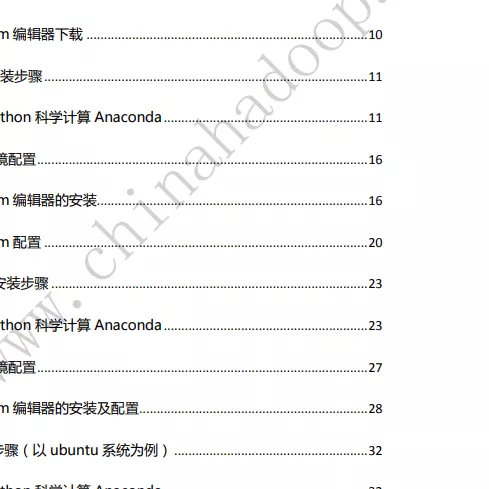
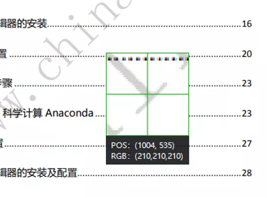
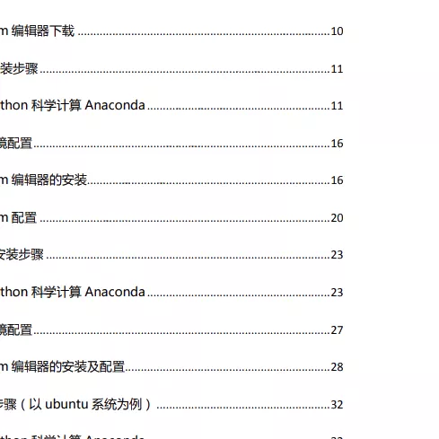
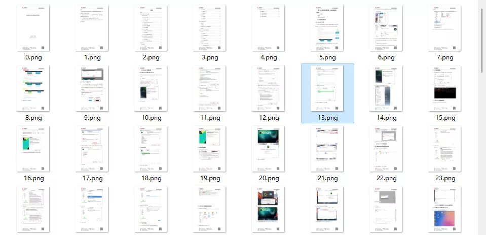

Python<br />网上下载的 pdf 学习资料有一些会带有水印，非常影响阅读。比如下面的图片就是在 pdf 文件上截取出来的。<br />
<a name="mpZ8D"></a>
### 安装模块
PIL：Python Imaging Library 是 python 上非常强大的图像处理标准库，但是只能支持 python 2.7，于是就有志愿者在 PIL 的基础上创建了支持 python 3的 pillow，并加入了一些新的特性。
```bash
pip install pillow
```
pymupdf 可以用 python 访问扩展名为*.pdf、.xps、.oxps、.epub、.cbz或*.fb2的文件。还支持了许多流行的图像格式，包括多页TIFF图像。
```bash
pip install PyMuPDF
```
导入需要用到的模块
```python
from PIL import Image
from itertools import product
import fitz
import os
```
<a name="PsDWw"></a>
### 获取图片的 RGB
pdf 去水印的原理和图片去水印的原理差不多，先从去除上面那张图片的水印开始。<br />计算机中用 RGB 代表红绿蓝，用 (255, 0, 0) 表示红色，(0, 255, 0) 表示绿色，(0, 0, 255) 表示蓝色，(255, 255, 255) 表示白色，(0, 0, 0) 表示黑色，去水印的原理就是将水印的颜色变成白色(255, 255, 255)。<br />首先获取图片宽和高，用 itertools 模块获取宽和高的笛卡尔积作为像素点。每个像素点的颜色都由 前三位的 RGB 和 第四位的 Alpha 通道构成。Alpha 通道不需要，只要 RGB 数据。
```python
def remove_img():
    image_file = input("请输入图片地址：")

    img = Image.open(image_file)
    width, height = img.size

    for pos in product(range(width), range(height)):
        rgb = img.getpixel(pos)[:3]
        print(rgb)
```
<a name="Zw1VD"></a>
### 图片去水印
用微信截图的方式查看水印像素点的 RGB。<br /><br />可以看到水印的 RGB 是 (210, 210, 210)，这里用 RGB 的和超过 620 就判定是水印点，此时将像素颜色替换为白色。最后保存图片。
```python
rgb = img.getpixel(pos)[:3]
if(sum(rgb) >= 620):
    img.putpixel(pos, (255, 255, 255))

img.save('d:/qsy.png')
```
示例结果：<br />
<a name="xNfEr"></a>
### PDF 去水印
PDF 去水印的原理和图片去水印的原理大致相同，用 PyMuPDF 打开 pdf 文件后，将 pdf 的每一页都转换为图片 pixmap，pixmap 有它自己的 RGB，只需要将 pdf 水印中的 RGB 改为(255, 255, 255) 最后保存为图片。
```python
def remove_pdf():
    page_num = 0
    pdf_file = input("请输入 pdf 地址：")
    pdf = fitz.open(pdf_file);
    for page in pdf:
        pixmap = page.get_pixmap()
        for pos in product(range(pixmap.width), range(pixmap.height)):
            rgb = pixmap.pixel(pos[0], pos[1])
            if(sum(rgb) >= 620):
                pixmap.set_pixel(pos[0], pos[1], (255, 255, 255))
        pixmap.pil_save(f"d:/pdf_images/{page_num}.png")
        print(f"第{page_num}水印去除完成")
        page_num = page_num + 1
```
示例结果：<br />
<a name="kF5C1"></a>
### 图片转为 pdf
图片转 pdf 需要注意的是图片的排序，数字文件名必须先转换为 int 类型后排序。用 PyMuPDF 模块打开图片后将图片用 `convertToPDF()` 函数转成单页的 pdf。插入到新的 pdf 文件中。
```python
def pic2pdf():
    pic_dir = input("请输入图片文件夹路径：")
    
    pdf = fitz.open()
    img_files = sorted(os.listdir(pic_dir),key=lambda x:int(str(x).split('.')[0]))
    for img in img_files:
        print(img)
        imgdoc = fitz.open(pic_dir + '/' + img)  
        pdfbytes = imgdoc.convertToPDF()   
        imgpdf = fitz.open("pdf", pdfbytes)
        pdf.insertPDF(imgpdf)       
    pdf.save("d:/demo.pdf")         
    pdf.close()
```
<a name="y5Ec4"></a>
### 总结
pdf 和图片上的水印终于可以在强大的 python 面前消失了。
