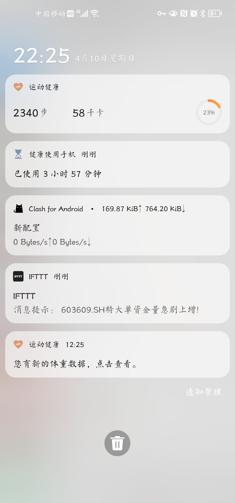

Python<br />是否曾想尝试在服务器端或电脑上向手机发送通知吗？<br />是否曾烦恼过企业邮箱的群发通知会触发防骚扰机制吗？<br />现在，可以用一种简单轻松的方法来代替企业邮箱进行通知了！<br />进行以下的实验，需要做好以下准备<br />**1）注册并在手机上下载IFTTT**<br />**2）Python3**<br />下面是具体的操作步骤：
<a name="Pplet"></a>
## 1、注册配置 IFTTT
首先注册一个IFTTT账号 ([https://ifttt.com](https://ifttt.com))。<br />登录进入页面后点击右上角create，准备新建一个applet. <br /><br />进去后点击 + this, 如图。<br /><br />搜索 webhooks<br /><br />进去后选择Receive a web request，这个trigger能够使得这个webhooks收到一个http请求后触发一个事件。<br /><br />编写该 trigger 的名称：<br /><br />然后点击 that<br /><br />搜索 notification<br /><br />选择 send a notification from the ifttt app。这个action能够使得ifttt发出一个通知。<br /><br />里面可以设置消息的格式<br />其中：`{{EventName}}`是前面设定的事件名称，而Add ingredient里面的value1、value2、value3则是服务器端发送http请求时带的参数。<br /><br />可以设置成如下的格式：<br /><br />Finish！<br /><br /><br />准备完毕，可以开始编写Python脚本了！
<a name="rbqFF"></a>
## 2、编写 Python 通知脚本
进入 [https://ifttt.com/maker_webhooks](https://ifttt.com/maker_webhooks) 页面，可以看见刚新建的webhooks。<br /><br />点击右上角的Documentation.<br /><br />就可以看见应用的Key，这个Key很重要，将用来发送请求<br />webhooks的调用方式就是通过发送POST或GET请求到下面这个网址：<br />https://maker.ifttt.com/trigger/你的event_name/with/key/你的Key<br />其中，还可以带三个参数，以json格式放在body中，如 {"value1": "这是一个测试"}，最终通知里的Value1会被这个value1替代。<br /><br />制作通知脚本，例如新建一个文件叫 notice.py 如下，text可以放想发送的文字。<br />可以把这个文件放在本机上，也可以放在服务器上结合某种功能。<br />**记得先在手机上先下载好IFTTT并登陆**。
```python
import requests
import json


def send_notice(event_name, key, text):
    """
    通过IFTTT发送手机通知
    Args:
        event_name (str):事件名称
        key (str): IFTTT上的Key
        text (str):通知文本信息
    """
    url = f"https://maker.ifttt.com/trigger/{event_name}/with/key/{key}"
    payload = {"value1": text}
    headers = {"content-Type": "application/json"}
    response = requests.request("POST", url, data=json.dumps(payload), headers=headers)
    print(response.text)


text = "603609.SH特大单资金量急剧上增!"
send_notice('你的 Event Name', '你的Key', text)
```
效果如图：<br />
<a name="tR6KE"></a>
## 3、注意
IFTTT注册以及手机APP接受通知时都需要外网才能正常接受到通知，国内可以尝试使用[喵提醒](https://miaotixing.com/)：[https://miaotixing.com/](https://miaotixing.com/)
