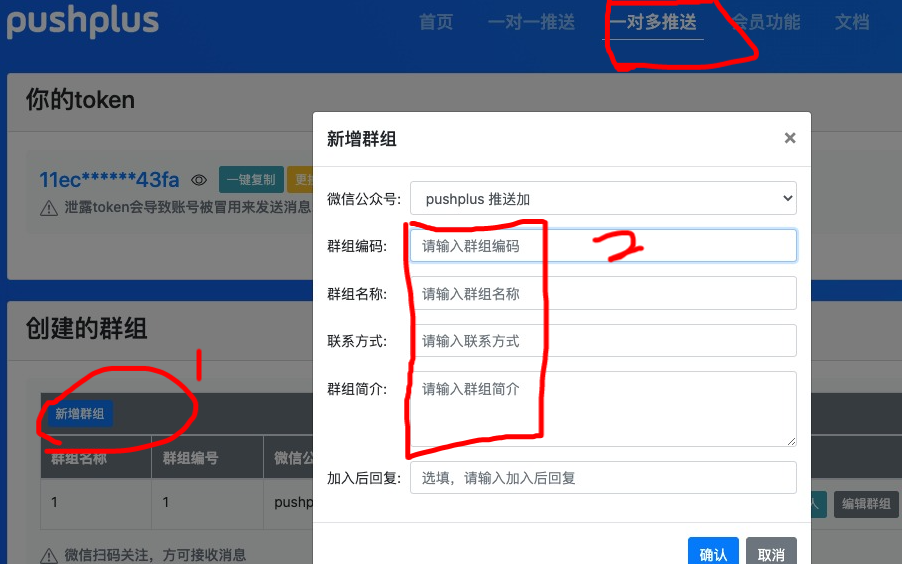

Python<br />Python可以实现给QQ邮箱、企业微信、微信等等软件推送消息，实现一下Python直接给微信推送消息。<br />这里使用了一个第三方工具pushplus
<a name="Zgpxb"></a>

## 单人推送
实现步骤：<br />1、用微信注册一个此网站的账号<br />2、将token复制出来，记录到小本本上。<br /><br />代码展示
```python
import requests

def send_wechat(msg):
    token = 'XXXXXXXXXXXX'#前边复制到那个token
    title = 'title1'
    content = msg
    template = 'html'
    url = f"https://www.pushplus.plus/send?token={token}&title={title}&content={content}&template={template}"
    print(url)
    r = requests.get(url=url)
    print(r.text)

if __name__ == '__main__':
    msg = 'Life is short I use python'
    send_wechat(msg)
```
3、扫码后，看看订阅人，扫码之后的人，会显示在这里。给这个群组发送的消息，这里的人都会接收到。<br />在手机上看一下结果<br /><br />局限性：这个只能给自己推送，别人推送不了。那怎么给别人推送呢？
<a name="m4nIf"></a>
## 一对多推送
实现步骤<br />1、在一对多推送的tab页面里，新建群组，并记录下群组编码。<br /><br />2、点击生成二维码，将二维码发给要接受消息的人。让他们用微信扫码。<br /><br /><br />4、写代码发送消息到微信
```python
import requests

def send_wechat(msg):
    token = ' XXXXXXXXXXXXXXXXXX' #前边复制到那个token
    title = 'test notice title'
    content = msg
    template = 'html'
    topic = '1'
    url = f"http://www.pushplus.plus/send?token={token}&title={title}&content={content}&template={template}&topic={topic}"
    print(url)
    r = requests.get(url=url)
    print(r.text)

if __name__ == '__main__':
    msg = 'this is a one to more lizi'
    send_wechat(msg)
```
效果展示<br /><br />至此到这里就完成啦！<br />另注：pushplus 分普通用户和会员，他们最大的区别就是：普通用户一天仅可请求200次，会员扩大到1000次。所以普通用户基本上也够用了。真想支持网站作者，就买个会员，一个月也就10块钱。
