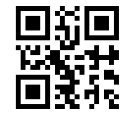

Python
<a name="uk2fm"></a>
## 什么是二维码？
QR码是机器可读的二维像素化条形码，可用于存储各种信息。<br />二维码是由日本汽车制造商Denso Wave 的工程师Masahiro Hara在 1994 年发明的，用于跟踪汽车零件的运动。二维码在 2010 年代后期随着手机光学功能的改进及其广泛采用而越来越受欢迎。<br />如今，二维码被广泛用于各种应用，例如在线支付、查看酒店菜单、共享 wifi 密码、获取产品的价格和其他详细信息等。二维码变得如此流行，以至于现在每部新智能手机都内置了二维码阅读器。
<a name="bAE9P"></a>
## 生成二维码

- 安装二维码模块;
- 使用 qrcode 包来生成二维码;
- 第一步是使用 pip 命令安装包。
```bash
pip install qrcode
```
<a name="Dekmi"></a>
### pip安装二维码
可以在包的PYPI 主页中访问包的完整文档。
<a name="jgQBH"></a>
### 简单的二维码：
通过使用qrcode的make函数并将数据作为参数传递，可以生成一个简单的二维码。下面的代码生成一个 QR 码，上面写着“Hello World”。
```python
#Import Library
import qrcode
#Generate QR Code
img=qrcode.make('Hello World')
img.save('hello.png')
```
<br />可以用智能手机阅读上面的代码。<br />注意：请勿使用手机读取随机二维码，因为其中可能包含恶意代码/链接。
<a name="NOuGL"></a>
### 高级二维码：
可以使用具有以下参数的QRCode对象自定义二维码：<br />`version`：有 40 个版本的 QR 码，用于控制代码的大小。1 是最小的，40 是最大的。版本 1 将创建一个 21X21 矩阵二维码。<br />`error_correction`：此参数控制用于二维码的纠错。这从 7% 到 30% 的错误纠正不等，如下所示：

- `ERROR_CORRECT_L`：高达 7%
- `ERROR_CORRECT_M`：高达 15%
- `ERROR_CORRECT_Q`：高达 25%
- `ERROR_CORRECT_H`：高达 30%

`box_size`：该参数控制二维码每个框内的像素数<br />`border`：此参数控制边框的粗细。默认边框为 4 像素厚。
<a name="GmrFV"></a>
### QRCode 对象有以下功能可用于创建 QR 码

1. `add_data`：二维码的内容可以作为参数传递给这个函数。
2. 制作：如果不知道哪个版本的QR码的使用，该版本可以自动设置
3. `make_image`：此函数生成二维码。它还可以用于使用`fill_color`和`back_color`参数设置二维码的填充颜色和背景颜色。

以下代码生成一个高级二维码。
```python
qr = qrcode.QRCode(
    version=1,
    error_correction=qrcode.constants.ERROR_CORRECT_L,
    box_size=10,
    border=4,
)
qr.add_data("https://www.yuque.com/fcant/python")
qr.make(fit=True)
img = qr.make_image(fill_color="red", back_color="black")
img.save("medium.png")
```
<a name="LynGd"></a>
## 读取二维码
使用 OpenCV 来读取二维码。如果没有安装包，可以如下安装：
```bash
pip install cv2
```
二维码可以使用：<br />OpenCV的 `QRCodeDetector` 对象的 `detectAndDecode` 函数进行解码。
```python
import cv2
img=cv2.imread("medium.png")
det=cv2.QRCodeDetector()
val, pts, st_code=det.detectAndDecode(img)
print(val)

# Output:
# https://www.yuque.com/fcant/python
```
`detectAndDecode` 函数返回二维码的内容、框角坐标和二值化二维码。
