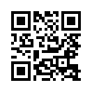
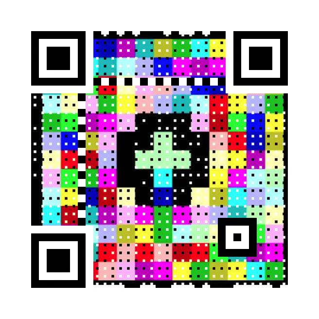
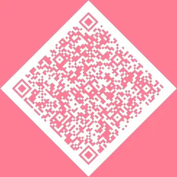
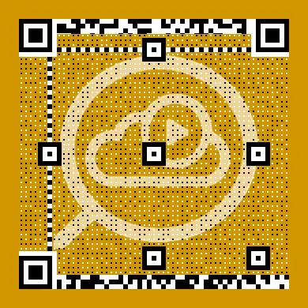

Python<br />当你提到二维码时，大多数人想到的是仓库管理或产品标签等 "工业 "应用，但这篇文章在很大程度上是关于二维码的个人和社会用途。
<a name="gTVaI"></a>
## 有趣的事实
二维（QR）码是在1994年发明的，最近几年由于新冠肺炎的出现，它的"非接触 "特性使其应用广泛。<br />二维码具备良好的解决方案。它可以被几乎所有的手机使用默认的照片应用程序扫描，同样，扫描它们也会根据它们的背景触发某种动作。<br />例如，一个含有URL的QR码允许你在浏览器中打开它。含有Wifi登录信息的二维码允许你立即连接。含有联系人详细信息的二维码允许您在地址簿中创建一个新的联系人。带有地理坐标的二维码允许你在地图上找到一个位置。这使扫描者的生活变得非常容易，并使信息提供者完全脱离......他们不再需要为了发生互动而在场。
<a name="HnCeO"></a>
## 开始
在开始之前，做了一些研究，并选择了Python中的segno模块，因为它有全面的功能列表和漂亮的文档。在谷歌搜索Python中的QR码时，它并没有出现在最前面，甚至在模块名称中也没有 "QR"，但不要因此而放弃--它是一个很棒的工具。<br />先用 `.make()`方法创建一个最简单的QR码。它只包含可以复制或传输的原始数据，由于内容很短， segno默认创建一个有趣的 "微型QR "码。
```bash
pip install segno
```
```python
import segno

price_tag = segno.make("£9.99")

price_tag.save("Price Tag.png")
```
<br />也可以使用方便的 `.show`方法，而不是用 `.save`来创建一个文件，然后导航到它，显示它，使用后再删除它。这将创建一个临时图像文件，并在默认图像查看器中自动打开。这对调试或测试很有帮助，特别是当开始试验不同的颜色和背景图像，并想确认QR码仍能正常扫描时。
<a name="LRop3"></a>
## 用于分享URL的QR码
使用同样的方法和稍大的有效载荷，第一个任务（分享视频信息）的Python代码是微不足道的。
```python
import segno

video = segno.make('https://youtu.be/px6FeOKD3Zc')

video.save('Video.png', scale=4)
```
<br />只需多写一行代码，就能创建一个更加丰富多彩的QR码，在这种情况下，最喜欢的一张图片实际上是一个用Piet编程语言编写的 "Hello World "脚本。
```bash
pip install qrcode-artistic
```
```python
import segno

piet = segno.make('https://esolangs.org/wiki/Piet', error='h')

piet.to_artistic(background="background.png", target='Piet.png', scale=16)
```

<a name="a1Beg"></a>
## 携带WIFI详细信息的QR码
第二个任务（WIFI登录细节）的Python代码也同样简单，定制了颜色并使输出更大。
```python
import segno

wifi_settings = {
    ssid='(Wifi Name)',
    password='(Wifi Password)',
    security='WPA',
}

wifi = segno.helpers.make_wifi(**wifi_settings)
wifi.save("Wifi.png", dark="yellow", light="#323524", scale=8)
```

<a name="TNz0q"></a>
## 联系信息的二维码
为一个朋友的艺术和手工艺业务创建一个二维码。
```python
import segno

vcard = segno.helpers.make_vcard(
    name='Pxxx;Jxxx',
    displayname='Times Tables Furniture',
    email=('jxxxpxxx@timestables.furniture'),
    url=[
        'https://www.etsy.com/uk/shop/TimesTablesFurniture',
        'https://www.facebook.com/profile.php?id=100083448533180'
    ],
    phone="+44xxxxxxxxxx",
)
img = vcard.to_pil(scale=6, dark="#FF7D92").rotate(45, expand=True)
img.save('Etsy.png')
```
<br />对于自己的VCard，选择添加公司的标志作为背景。
```python
import segno

awsom = segno.helpers.make_vcard(
    name='Fison;Pete',
    displayname='AWSOM Solutions Ltd.',
    email=('pxxxfxxx@awsom.solutions'),
    url=[
        'https://twitter.com/awsom_solutions',
        'https://medium.com/@petefison',
        'https://github.com/pfython'
    ],
    phone="+44xxxxxxxxxx",
)

awsom.to_artistic(
    background="logo.png",
    target='AWSOM.png',
    scale=6,
    quiet_zone="#D29500"
)
```

<a name="wyHFH"></a>
## 用于其他目的的二维码
segno API还允许做以下事情。<br />`segno.helpers.make_email`：发送一封预先准备好主题和内容的电子邮件。对于订阅新闻简报，或者从邮件服务器上触发任何可能的行动，都是非常好的。<br />`segno.helpers.make_epc_qr`：发起一个电子支付。<br />`segno.helpers.make_geo`：在一个特定的经度和纬度打开默认的地图应用。<br />`segno.make_sequence`：使用 "结构化附加 "模式创建一个QR码序列。
<a name="SE4Rn"></a>
## 把所有东西都保存在内存中
如果喜欢把所有的处理保持在 "内存中"，而不是在硬盘或服务器上创建文件，可以创建一个PIL图像对象，或者使用BytesIO保存一个类似文件的对象：
```python
import segno

beatle = segno.make('Paul McCartney')
beatle = qrcode.to_pil()
```
```python
import segno
import io

beatle = segno.make('Paul McCartney')
buff = io.BytesIO()
beatle.save(buff, kind='svg')
```
同样，如果喜欢直接从URL中加载背景图片到内存中，而不是先在硬盘或服务器上创建一个文件，可以使用`urlopen`方法。
```python
from urllib.request import urlopen
import segno

beatle = segno.make('Ringo Starr', error='h')
url = 'https://media.giphy.com/media/HNo1tVKdFaoco/giphy.gif'
bg_file = urlopen(url)
beatle.to_artistic(background=bg_file, target='ringo.gif', scale=10)
```
<a name="SFQUW"></a>
## 二维码的创造性、家用式的想法
希望这篇短文能让您对使用二维码有兴趣，不仅仅是用于 "工业 "项目，而且还用于个人和社会项目。网上有很多文章，建议将二维码创造性地用于商业和营销，因此，在本文的最后，我想分享一些我自己的 "家用式 "想法，可能会吸引你。

- 在你的垃圾桶边上有关于回收规则的信息
- 触发一封电子邮件给亲人，说你已经安全到家。
- 触发一个更新，说你已经离开了家。
- 在你所在的城镇或乡村道路上寻宝；链接到你自己的网站，包括当地信息、社会媒体团体、当前的地理位置等。
- 在你的房子周围为年幼的孩子寻宝，或举行晚宴。
- 在明信片上贴上二维码，让家人和朋友直接进入你的旅行日记、照片日记或博客中的最新条目。
- 洗衣机、微波炉、烤箱、打印机、锅炉、3D打印机、激光切割器、甚至汽车等电器的说明书。
- 你的家谱或历史，或财产信息保存起来供后人参考。
- 一个在线留言簿，游客可以记录他们的逗留，并留下个人的信息。
- 冰箱上的贴纸，链接到最新的家庭购物清单。
- 每个家庭成员的每周家务事清单。
- 笔记本电脑、电话、相机、无人机等的 "如果丢失，请归还...... "贴纸。
- 诚信箱--让人们在使用/消费/购买东西时付款，例如，从共享冰箱中的食物和饮料，在农场外出售的鸡蛋。
- 预约管理电视/互联网/游戏的特权。
- 婴儿保姆或宠物保姆的紧急联系信息。
- 在停电的情况下为你提供紧急联络方式--水、电、煤气。
- 为你看家护院的人提供当地的食品配送公司。
- 个人视频信息/提醒。
- 关于你最喜欢的装饰品或房子周围的艺术品的信息。
- 你的酒架/酒窖的品酒说明。
- 花园植物和树木的标签--物种、浇水、年龄等细节。
