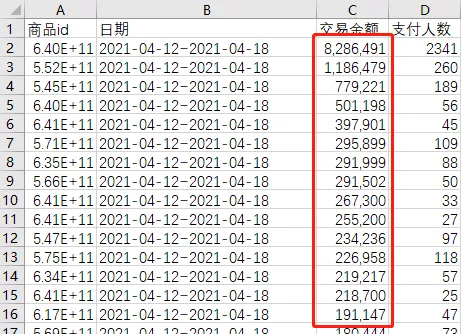
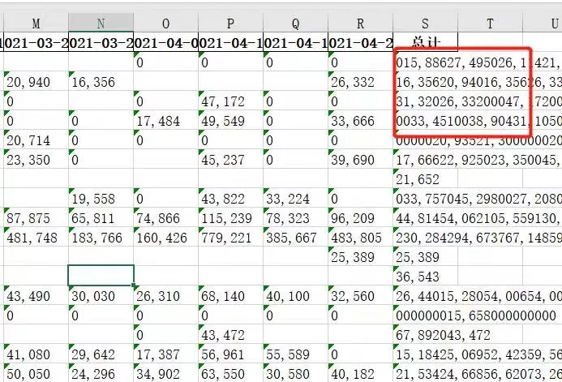
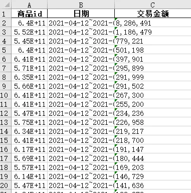
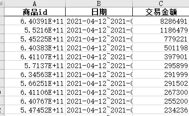

Python <br />数据源如下图所示：<br />注：交易金额 ，在Excel中是货币类型。<br /><br />当导入Python数据处理后，如果不进行类型转换，导出的结果如下，这就尴尬啦！<br /><br />接下来试着解决这个问题，刚遇到这个问题，可能很快想到Python类型转换函数。
```python
import pandas as pd
root=r"C:\Users\chenquan\Desktop\T\商品榜\数据源"
df = pd.read_csv(open(root+"\{0}".format(mylist[i]), encoding='utf-8'))
df['交易金额'] = df['交易金额'].astype(int)
```
果然报错，这里货币类型是不能直接强制转换成数值的<br /><br />不过可以转换成字符，不过结果不是期望的
```python
df['交易金额'] = df['交易金额'].astype(str)
```
<br />接下来开始百度，实在没找到好用的办法，于是自己写了一个转换函数！<br />批量转换，问题解决！
```python
import pandas as pd
import numpy as np
import os

def Currency_to_int(str):
    lst_1=list(str)[0:]
    lst = [x for x in lst_1 if x != ',']
    new_lst = [eval(''.join([str(i) for i in lst]))]
    print(new_lst)
    return  int(new_lst[0])

root=r"C:\Users\chenquan\Desktop\T\商品榜\数据源"
mylist=[]

for dirpath,dirnames,filenames in os.walk(root):
    for filepath in filenames:
        mylist.append(os.path.join(filepath))

for i in range(len(mylist)):
    df = pd.read_csv(open(root+"\{0}".format(mylist[i]), encoding='utf-8'))

    df['交易金额'] = df['交易金额'].map(lambda x: Currency_to_int(x))

    print(df)

    df.to_excel(r"C:\Users\chenquan\Desktop\T\商品榜\结果\{0}.xlsx".format(mylist[i][:-3]),index=False)
```

