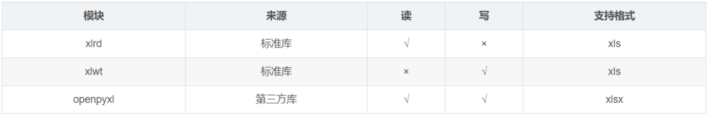
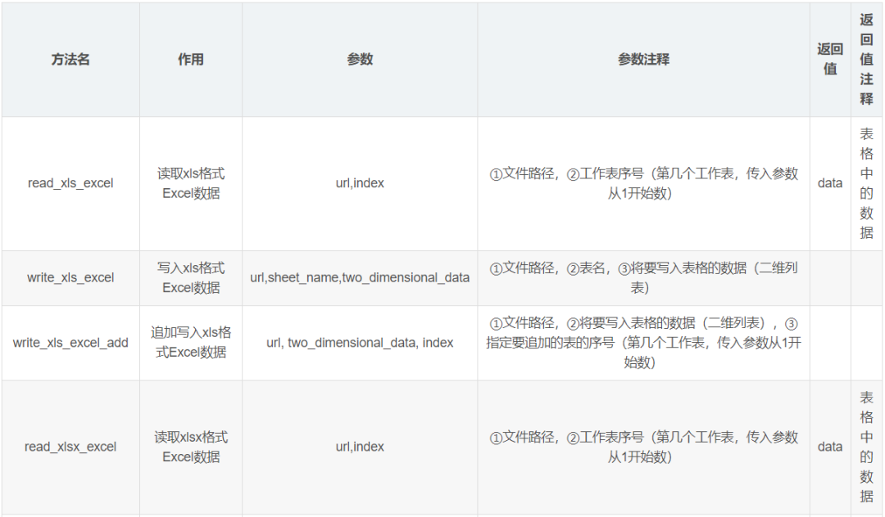
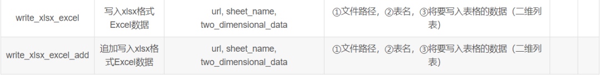

PythonExcel
<a name="jp6aM"></a>
## 1、入门
<a name="NALtM"></a>
### 1.1. 初识Excel
Microsoft Excel是Microsoft为使用Windows和Apple Macintosh操作系统的电脑编写的一款电子表格软件。
<a name="PB7K2"></a>
### 1.2. 格式区别
Excel中有xls和xlsx两种格式，它们之间的区别是：

- 文件格式不同。xls是一个特有的二进制格式，其核心结构是复合文档类型的结构，而xlsx的核心结构是XML类型的结构，采用的是基于 XML的压缩方式，使其占用的空间更小。xlsx 中最后一个 x 的意义就在于此。
- 版本不同。xls是Excel2003及以前版本生成的文件格式，而xlsx是Excel2007及以后版本生成的文件格式。
- 兼容性不同。xlsx格式是向下兼容的，可兼容xls格式。
<a name="W1eZO"></a>
### 1.3. 库的使用
Python自带的模块中有针对xls格式的xlrd和xlwt模块，但这两个库仅仅是针对xls的操作，要操作xlsx格式文件时，则需要使用到openpyxl第三方库。<br />
<a name="oodpa"></a>
### 1.4. 整体思路
当使用以上几个模块的时候，从理论上就可以完全操作不同格式的Excel的读和写，很多人就疑惑，那这篇文章的作用是什么？直接学习对应的这三个模块不就好了吗？<br />答案就是：虽然这几个库已经把Excel的文件、表、行、列的概念完全转换为Python中的对象，但每次操作都需要遍历每一个单元格，甚至很多时候要花费大量的时间在思考循环单元格的边界上，这本身就是在重复造轮子，因此花了半天时间整理了以下六个函数。<br /><br />
<a name="lDjg2"></a>
## 2、上手操作
<a name="k486j"></a>
### 2.1. xlz格式
<a name="C3TDp"></a>
#### **2.1.1. 读取xls格式文件**
```python
def read_xls_excel(url,index):
    '''
    读取xls格式文件
    参数：
        url:文件路径
        index：工作表序号（第几个工作表，传入参数从1开始数）
    返回：
        data:表格中的数据
    '''
    # 打开指定的工作簿
    workbook = xlrd.open_workbook(url)
    # 获取工作簿中的所有表格
    sheets = workbook.sheet_names()
    # 获取工作簿中所有表格中的的第 index 个表格
    worksheet = workbook.sheet_by_name(sheets[index-1])
    # 定义列表存储表格数据
    data = []
    # 遍历每一行数据
    for i in range(0, worksheet.nrows):
        # 定义表格存储每一行数据
        da = []
        # 遍历每一列数据
        for j in range(0, worksheet.ncols):
            # 将行数据存储到da列表
            da.append(worksheet.cell_value(i, j))
        # 存储每一行数据
        data.append(da)
    # 返回数据
    return data
```
<a name="D7sK2"></a>
#### **2.1.2. 写入xls格式文件**
```python
def write_xls_excel(url,sheet_name,two_dimensional_data):
  '''
    写入xls格式文件
    参数：
        url:文件路径
        sheet_name:表名
        two_dimensional_data：将要写入表格的数据（二维列表）
    '''
    # 创建工作簿对象
    workbook = xlwt.Workbook()
    # 创建工作表对象
    sheet = workbook.add_sheet(sheet_name)
    # 遍历每一行数据
    for i in range(0,len(two_dimensional_data)):
        # 遍历每一列数据
        for j in range(0,len(two_dimensional_data[i])):
            # 写入数据
            sheet.write(i,j,two_dimensional_data[i][j])
    # 保存
    workbook.save(url)
    print("写入成功")
```
<a name="edGea"></a>
#### **2.1.3. 追加写入xls格式文件**
```python
def write_xls_excel_add(url, two_dimensional_data, index):
    '''
    追加写入xls格式文件
    参数：
        url:文件路径
        two_dimensional_data：将要写入表格的数据（二维列表）
        index：指定要追加的表的序号（第几个工作表，传入参数从1开始数）
    '''
    # 打开指定的工作簿
    workbook = xlrd.open_workbook(url)
    # 获取工作簿中的所有表格
    sheets = workbook.sheet_names()
    # 获取指定的表
    worksheet = workbook.sheet_by_name(sheets[index-1])
    # 获取表格中已存在的数据的行数
    rows_old = worksheet.nrows
    # 将xlrd对象拷贝转化为xlwt对象
    new_workbook = copy(workbook)
    # 获取转化后工作簿中的第index个表格
    new_worksheet = new_workbook.get_sheet(index-1)
    # 遍历每一行数据
    for i in range(0, len(two_dimensional_data)):
        # 遍历每一列数据
        for j in range(0, len(two_dimensional_data[i])):
            # 追加写入数据，注意是从i+rows_old行开始写入
            new_worksheet.write(i+rows_old, j, two_dimensional_data[i][j])
    # 保存工作簿
    new_workbook.save(url)
    print("追加写入成功")
```
<a name="RDF34"></a>
### 2.2. xlsx格式
<a name="CtEgu"></a>
#### **2.2.1. 读取xlsx格式文件**
```python
def read_xlsx_excel(url, sheet_name):
    '''
    读取xlsx格式文件
    参数：
        url:文件路径
        sheet_name:表名
    返回：
        data:表格中的数据
    '''
    # 使用openpyxl加载指定路径的Excel文件并得到对应的workbook对象
    workbook = openpyxl.load_workbook(url)
    # 根据指定表名获取表格并得到对应的sheet对象
    sheet = workbook[sheet_name]
    # 定义列表存储表格数据
    data = []
    # 遍历表格的每一行
    for row in sheet.rows:
        # 定义表格存储每一行数据
        da = []
        # 从每一行中遍历每一个单元格
        for cell in row:
            # 将行数据存储到da列表
            da.append(cell.value)
        # 存储每一行数据
        data.append(da)
    # 返回数据
    return data
```
<a name="NH65P"></a>
#### **2.2.2. 写入xlsx格式文件**
```python
def write_xlsx_excel(url, sheet_name, two_dimensional_data):
    '''
    写入xlsx格式文件
    参数：
        url:文件路径
        sheet_name:表名
        two_dimensional_data：将要写入表格的数据（二维列表）
    '''
    # 创建工作簿对象
    workbook = openpyxl.Workbook()
    # 创建工作表对象
    sheet = workbook.active
    # 设置该工作表的名字
    sheet.title = sheet_name
    # 遍历表格的每一行
    for i in range(0, len(two_dimensional_data)):
        # 遍历表格的每一列
        for j in range(0, len(two_dimensional_data[i])):
            # 写入数据（注意openpyxl的行和列是从1开始的，和我们平时的认知是一样的）
            sheet.cell(row=i + 1, column=j + 1, value=str(two_dimensional_data[i][j]))
    # 保存到指定位置
    workbook.save(url)
    print("写入成功")
```
<a name="F4puO"></a>
#### **2.2.3. 追加写入xlsx格式文件**
```python
def write_xlsx_excel_add(url, sheet_name, two_dimensional_data):
    '''
    追加写入xlsx格式文件
    参数：
        url:文件路径
        sheet_name:表名
        two_dimensional_data：将要写入表格的数据（二维列表）
    '''
    # 使用openpyxl加载指定路径的Excel文件并得到对应的workbook对象
    workbook = openpyxl.load_workbook(url)
    # 根据指定表名获取表格并得到对应的sheet对象
    sheet = workbook[sheet_name]
    for tdd in two_dimensional_data:
        sheet.append(tdd)
    # 保存到指定位置
    workbook.save(url)
    print("追加写入成功")
```
