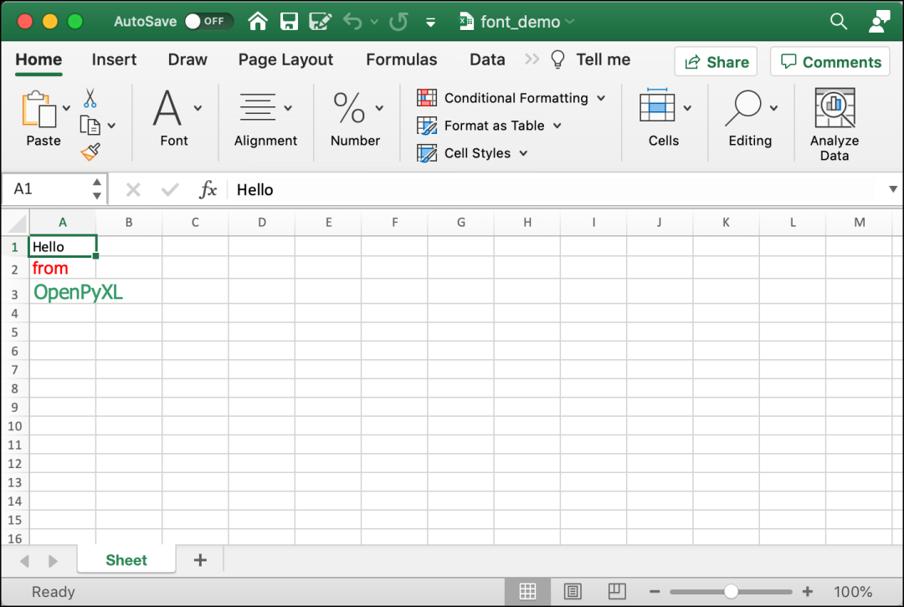
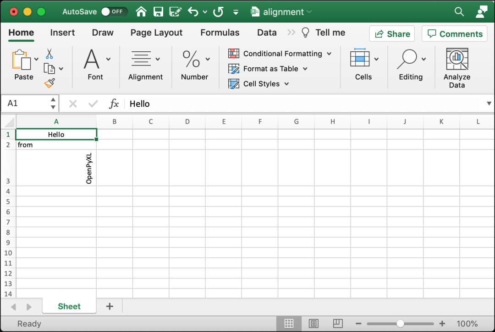
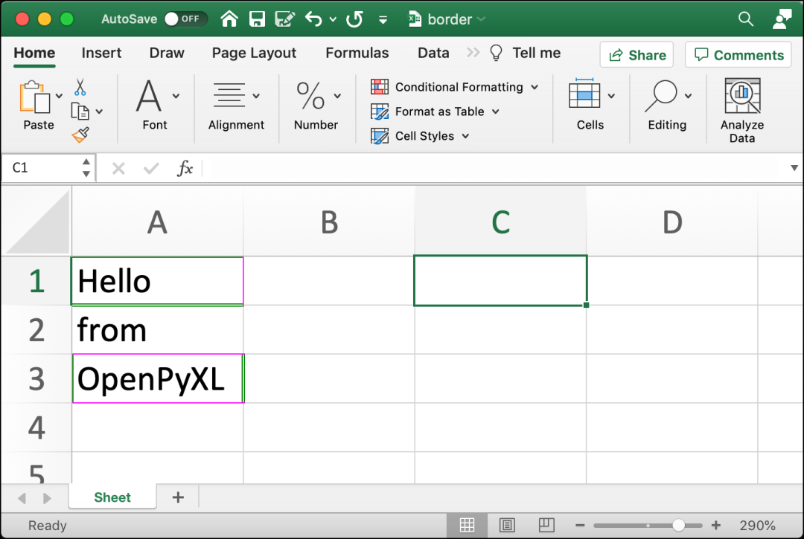
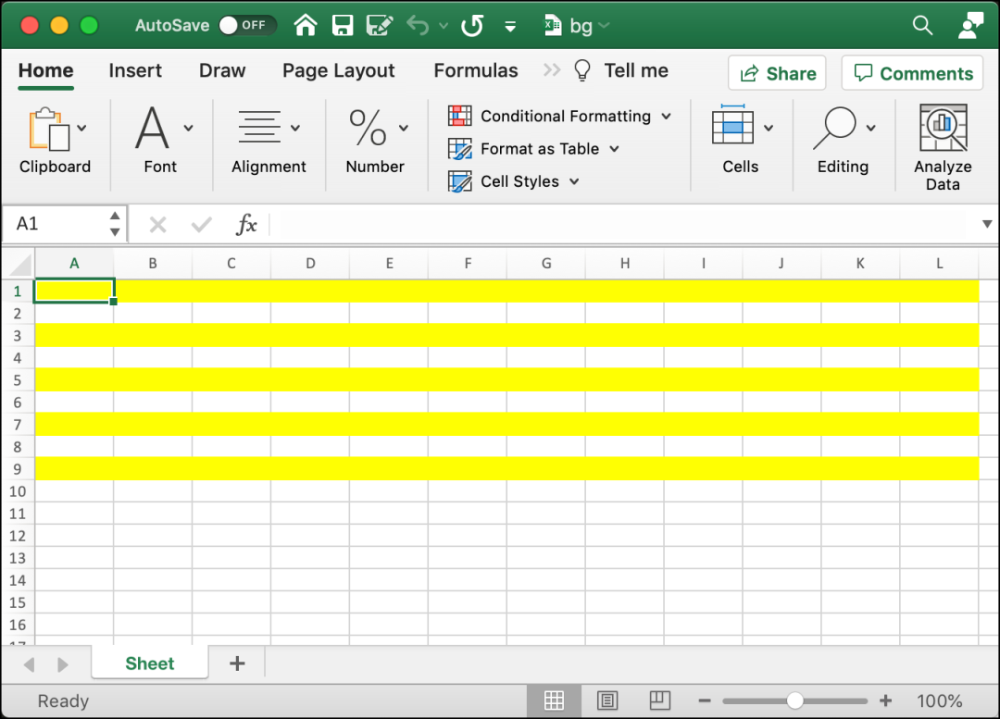
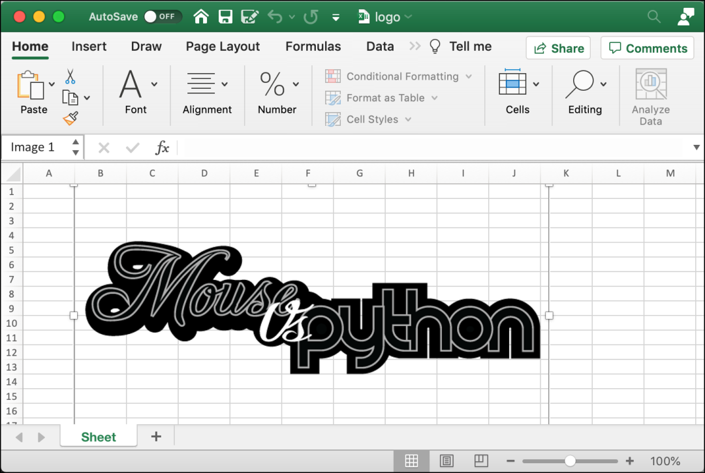
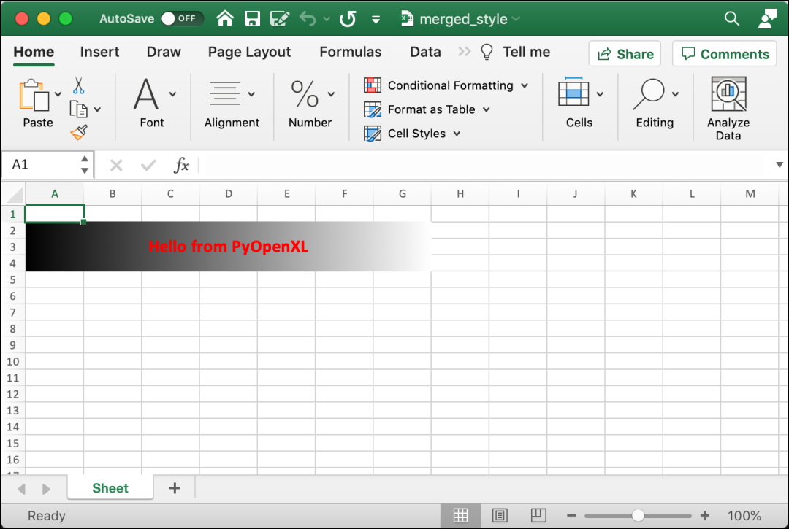
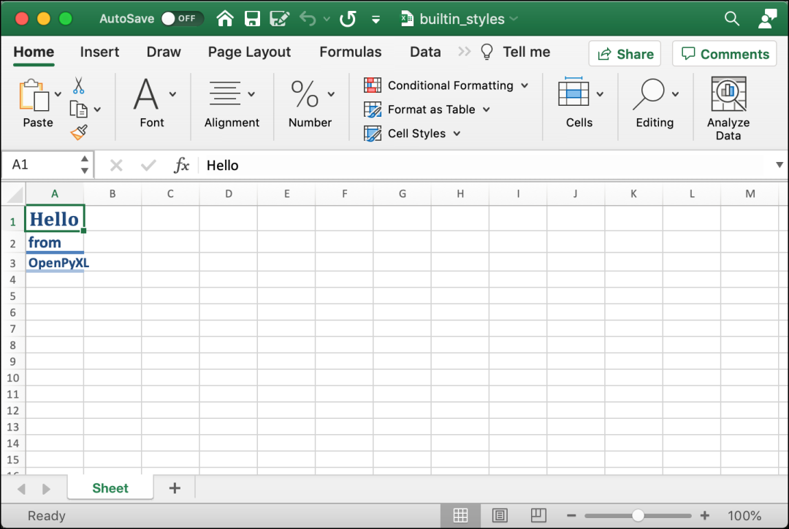
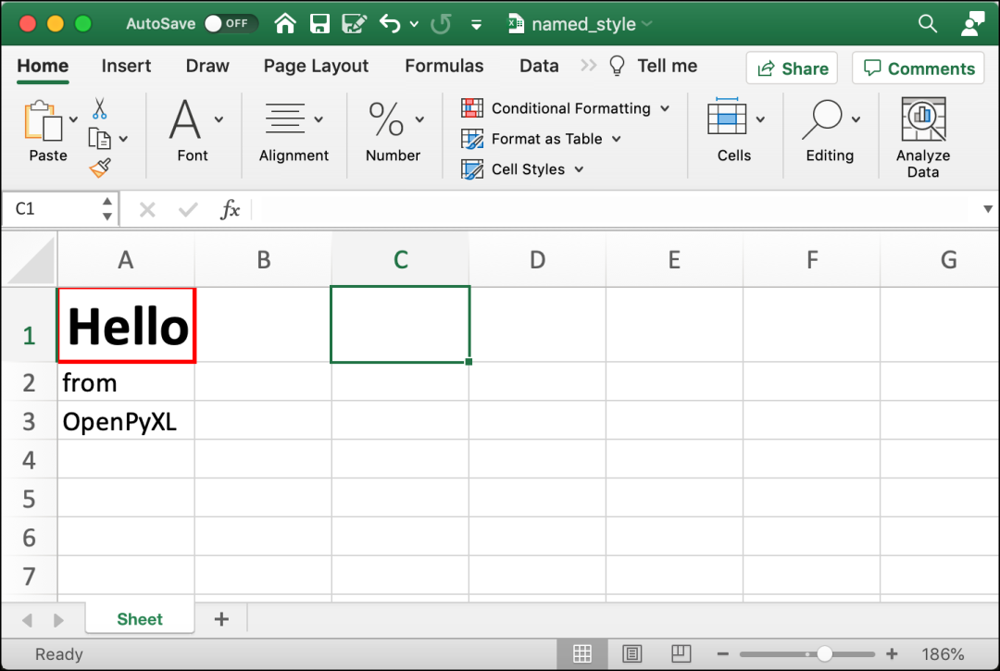

PythonOpenPyXL<br />OpenPyXL 能够以多种不同的方式设置单元格的样式。样式化单元格会让电子表格充满魅力！这将有助于将它们与其他电子表格区分开来。但是请不要过度使用， 如果每个单元格都有不同的字体和颜色，电子表格就会看起来一团糟。<br />应该谨慎使用在本文中学到的技能。如果想了解有关 OpenPyXL 支持样式的更多信息，可以查看他们的文档。<br />[https://openpyxl.readthedocs.io/en/stable/styles.html](https://openpyxl.readthedocs.io/en/stable/styles.html)<br />将了解以下内容：

- 设置字体
- 设置对齐方式
- 添加边框
- 更改单元格背景颜色
- 将图像插入单元格
- 样式合并单元格
- 使用内置样式
- 创建自定义命名样式

现在是时候开始探索如何使用 OpenPyXL 处理字体了！
<a name="l9avh"></a>
## 设置字体
可以用字体在计算机上设置文本样式。字体控制在屏幕上或打印中看到的文本的大小、粗细、颜色和样式。计算机可以使用数千种字体。Microsoft 在其 Office 产品中包含了许多字体。<br />当使用 OpenPyXL 设置字体时，需要从 `openpyxl.styles` 导入 Font 类。以下演示将如何进行导入：
```python
from openpyxl.styles import Font
```
Font 类采用许多参数。根据 OpenPyXL 的文档，这是 Font 类的完整参数列表：
```python
class openpyxl.styles.fonts.Font(name=None, sz=None, b=None, i=None, charset=None, u=None, 
    strike=None, color=None, scheme=None, family=None, size=None, bold=None, italic=None, 
    strikethrough=None, underline=None, vertAlign=None, outline=None, shadow=None, 
    condense=None, extend=None)
```
以下列表显示了最有可能使用的参数及其默认值：

- `name='Calibri'`
- `size=11`
- `bold=False`
- `italic=False`
- `vertAlign=None`
- `underline='none'`
- `strike=False`
- `color='FF000000'`

这些参数允许设置使文本看起来漂亮所需的大部分内容。请注意，OpenPyXL 中的颜色名称使用十六进制值来表示 RGB（红、绿、蓝）颜色值。可以设置文本是否应为粗体、斜体、下划线或删除线。<br />要了解如何在 OpenPyXL 中使用字体，请创建一个名为 font_sizes.py 的新文件，并向其中添加以下代码：
```python
# font_sizes.py
import openpyxl
from openpyxl.styles import Font
def font_demo(path):
    workbook = openpyxl.Workbook()
    sheet = workbook.active
    cell = sheet["A1"]
    cell.font = Font(size=12)
    cell.value = "Hello"
    cell2 = sheet["A2"]
    cell2.font = Font(name="Arial", size=14, color="00FF0000")
    sheet["A2"] = "from"
    cell2 = sheet["A3"]
    cell2.font = Font(name="Tahoma", size=16, color="00339966")
    sheet["A3"] = "OpenPyXL"
    workbook.save(path)
if __name__ == "__main__":
    font_demo("font_demo.xlsx")
```
此代码在三个不同的单元格中使用了三种不同的字体。在 A1 中，使用默认值，即 Calibri。然后在 A2 中，将字体大小设置为 Arial 并将大小增加到 14 磅。最后，在 A3 中，将字体更改为 Tahoma，将字体大小更改为 16 磅。<br />对于第二种和第三种字体，还可以更改文本颜色。在 A2 中，将颜色设置为红色，在 A3 中，将颜色设置为绿色。<br />当运行此代码时，输出将如下所示：<br /><br />尝试更改代码以使用其他字体或颜色。如果想冒险，应该尝试将文字加粗或斜体。<br />现在已准备好学习文本对齐。
<a name="Y1GvI"></a>
## 设置对齐
可以使用 `openpyxl.styles.Alignment` 在 OpenPyXL 中设置对齐方式。可以使用此类来旋转文本、设置文本换行和缩进。<br />以下是 `Alignment`类使用的默认值：

- `horizontal='general'`
- `vertical='bottom'`
- `text_rotation=0`
- `wrap_text=False`
- `shrink_to_fit=False`
- `indent=0`

打开 Python 编辑器并创建一个名为 alignment.py 的新文件。然后在其中添加以下代码：
```python
# alignment.py
from openpyxl import Workbook
from openpyxl.styles import Alignment
def center_text(path, horizontal="center", vertical="center"):
    workbook = Workbook()
    sheet = workbook.active
    sheet["A1"] = "Hello"
    sheet["A1"].alignment = Alignment(horizontal=horizontal,
                                      vertical=vertical)
    sheet["A2"] = "from"
    sheet["A3"] = "OpenPyXL"
    sheet["A3"].alignment = Alignment(text_rotation=90)
    workbook.save(path)
if __name__ == "__main__":
    center_text("alignment.xlsx")
```
运行此代码时，将在 A1 中水平和垂直居中字符串。然后使用 A2 的默认值。最后，对于 A3，将文本旋转 90 度。<br />尝试运行此代码，将看到如下内容：<br /><br />最好花时间尝试不同的 text_rotation 值。然后尝试使用不同的值更改水平和垂直参数。很快就可以像专业人士一样对齐文本了！<br />现在已准备好了解如何为单元格添加边框！
<a name="y5CGm"></a>
## 添加边框
OpenPyXL 能够设置单元格边框的样式。可以为单元格的四个边中的每一个指定不同的边框样式。<br />可以使用以下任何一种边框样式：

- 'dashDot'
- 'dashDotDot'
- 'dashed'
- 'dotted'
- 'double'
- 'hair'
- 'medium'
- 'mediumDashDot'
- 'mediumDashDotDot'
- 'mediumDashed'
- 'slantDashDot'
- 'thick'
- 'thin'

打开 Python 编辑器并创建一个名为 border.py 的新文件。然后在文件中输入以下代码：
```python
# border.py
from openpyxl import Workbook
from openpyxl.styles import Border, Side
def border(path):
    pink = "00FF00FF"
    green = "00008000"
    thin = Side(border_style="thin", color=pink)
    double = Side(border_style="double", color=green)
    workbook = Workbook()
    sheet = workbook.active
    sheet["A1"] = "Hello"
    sheet["A1"].border = Border(top=double, left=thin, right=thin, bottom=double)
    sheet["A2"] = "from"
    sheet["A3"] = "OpenPyXL"
    sheet["A3"].border = Border(top=thin, left=double, right=double, bottom=thin)
    workbook.save(path)
if __name__ == "__main__":
    border("border.xlsx")
```
此代码将为单元格 A1 和 A3 添加边框。A1的顶部和底部使用“双”边框样式并为绿色，而单元格侧面使用“细”边框样式并为粉红色。<br />单元格 A3 使用相同的边框，但交换了它们，现在边为绿色，顶部和底部为粉红色。<br />可以通过在 border_style 和要使用的颜色中创建 Side 对象来获得此效果。然后将这些 Side 对象传递给 Border 类，该类允许单独设置单元格的四个边中的每一个。要将边框应用于单元格，必须设置单元格的边框属性。<br />运行此代码时，将看到以下结果：<br /><br />此图像被放大了很多，以便可以轻松看到单元格的边框。如果尝试使用本节开头提到的其他一些边框样式来修改此代码，可以了解还可以做什么。
<a name="Dy9wj"></a>
## 更改单元格背景颜色
可以通过更改背景颜色来突出显示一个单元格或一系列单元格。在大多数情况下，突出显示单元格比更改文本的字体或颜色更引人注目。OpenPyXL 提供了一个名为 PatternFill 的类，可以使用它来更改单元格的背景颜色。<br />PatternFill 类接受以下参数（默认值包括在下面）：

- `patternType=None`
- `fgColor=Color()`
- `bgColor=Color()`
- `fill_type=None`
- `start_color=None`
- `end_color=None`

可以使用多种不同的填充类型。以下是当前支持的填充类型列表：

- 'none'
- 'solid'
- 'darkDown'
- 'darkGray'
- 'darkGrid'
- 'darkHorizontal'
- 'darkTrellis'
- 'darkUp'
- 'darkVertical'
- 'gray0625'
- 'gray125'
- 'lightDown'
- 'lightGray'
- 'lightGrid'
- 'lightHorizontal'
- 'lightTrellis'
- 'lightUp'
- 'lightVertical'
- 'mediumGray'

现在有足够的信息来尝试使用 OpenPyXL 设置单元格的背景颜色。在 Python 编辑器中打开一个新文件并将其命名为 background_colors.py。然后将此代码添加到新文件中：
```python
# background_colors.py
from openpyxl import Workbook
from openpyxl.styles import PatternFill
def background_colors(path):
    workbook = Workbook()
    sheet = workbook.active
    yellow = "00FFFF00"
    for rows in sheet.iter_rows(min_row=1, max_row=10, min_col=1, max_col=12):
        for cell in rows:
            if cell.row % 2:
                cell.fill = PatternFill(start_color=yellow, end_color=yellow,
                                        fill_type = "solid")
    workbook.save(path)
if __name__ == "__main__":
    background_colors("bg.xlsx")
```
此示例将迭代 9 行 12 列。如果该单元格在奇数行中，它会将每个单元格的背景颜色设置为黄色。背景颜色发生变化的单元格将从 A 列到 L 列。<br />当想设置单元格的背景颜色时，可以将单元格的填充属性设置为 PatternFill 的实例。在此示例中，指定 start_color 和 end_color。还将 fill_type 设置为"solid"。OpenPyXL 还支持使用 GradientFill 作为背景。<br />尝试运行此代码。运行后，将拥有一个新的 Excel 文档，如下所示：<br /><br />以下是可以使用此代码尝试的一些想法：

- 更改受影响的行数或列数
- 更改要更改的颜色
- 更新代码以使用不同颜色为偶数行着色
- 尝试其他填充类型

完成对背景颜色的试验后，可以了解如何在单元格中插入图像！
<a name="w8Joz"></a>
## 将图像插入单元格
OpenPyXL 使图像插入 Excel 电子表格变得简单。为了实现这个魔法，可以使用 Worksheet 对象的 `add_image()` 方法。该方法接受两个参数：

- img – 要插入的图像文件的路径
- anchor – 提供一个单元格作为图像的左上角锚点（可选）

对于此示例，将使用Mouse vs. Python图片：<br /><br />下载图像后，创建一个新的 Python 文件并将其命名为 insert_image.py。然后添加以下内容：
```python
# insert_image.py
from openpyxl import Workbook
from openpyxl.drawing.image import Image
def insert_image(path, image_path):
    workbook = Workbook()
    sheet = workbook.active
    img = Image("logo.png")
    sheet.add_image(img, "B1")
    workbook.save(path)
if __name__ == "__main__":
    insert_image("logo.xlsx", "logo.png")
```
在这里，传入要插入的图像的路径。要插入图像，请调用 `add_image()`。在此示例中，正在硬编码以使用单元格 B1 作为锚定单元格。然后保存 Excel 电子表格。<br />如果打开了电子表格，会看到它看起来像这样：<br /><br />可能不需要经常在 Excel 电子表格中插入图像，但这是一项极好的技能。
<a name="Xjxkk"></a>
## 样式合并单元格
合并单元格是将两个或多个相邻单元格合并为一个单元格。如果要使用 OpenPyXL 设置合并单元格的值，则必须使用合并单元格的最左上角的单元格。<br />还必须使用此特定单元格为整个合并单元格设置样式。可以将在单个单元格上使用的所有样式和字体设置与合并单元格一起使用。但是，必须将样式应用于左上角的单元格，才能将其应用于整个合并单元格。<br />如果看到一些代码，就会明白这是如何工作的。继续创建一个名为 style_merged_cell.py 的新文件。现在在文件中输入以下代码：
```python
# style_merged_cell.py
from openpyxl import Workbook
from openpyxl.styles import Font, Border, Side, GradientFill, Alignment
def merge_style(path):
    workbook = Workbook()
    sheet = workbook.active
    sheet.merge_cells("A2:G4")
    top_left_cell = sheet["A2"]
    light_purple = "00CC99FF"
    green = "00008000"
    thin = Side(border_style="thin", color=light_purple)
    double = Side(border_style="double", color=green)
    top_left_cell.value = "Hello from PyOpenXL"
    top_left_cell.border = Border(top=double, left=thin, right=thin,
                                  bottom=double)
    top_left_cell.fill = GradientFill(stop=("000000", "FFFFFF"))
    top_left_cell.font = Font(b=True, color="FF0000", size=16)
    top_left_cell.alignment = Alignment(horizontal="center",
                                        vertical="center")
    workbook.save(path)
if __name__ == "__main__":
    merge_style("merged_style.xlsx")
```
在这里，创建一个从 A2（左上角的单元格）开始到 G4 的合并单元格。然后设置单元格的值、边框、填充、字体和对齐方式。<br />当运行此代码时，新电子表格将如下所示：<br /><br />应该花一些时间在合并的单元格上尝试一些不同的样式。例如，也许会想出比这里使用的灰色更好的渐变。<br />现在已准备好了解 OpenPyXL 的内置样式！
<a name="cnSYw"></a>
## 使用内置样式
OpenPyXL 带有多种内置样式也可以使用。与其在本书中复制完整的内置样式列表，不如查看官方文档，因为它将是样式名称的最新来源。<br />但是，值得注意的是其中一些样式。例如，以下是可以使用的数字格式样式：

- 'Comma'
- 'Comma [0]'
- 'Currency'
- 'Currency [0]'
- 'Percent'

还可以应用文本样式。以下是这些样式的列表：

- 'Title'
- 'Headline 1'
- 'Headline 2'
- 'Headline 3'
- 'Headline 4'
- 'Hyperlink'
- 'Followed Hyperlink'
- 'Linked Cell'

OpenPyXL 有几个其他的内置样式组。应该查看文档以了解支持的所有不同样式。<br />现在了解了一些可以使用的内置样式，是时候编写一些代码了！创建一个新文件并将其命名为 builtin_styls.py。然后输入以下代码：
```python
# builtin_styles.py
from openpyxl import Workbook
def builtin_styles(path):
    workbook = Workbook()
    sheet = workbook.active
    sheet["A1"].value = "Hello"
    sheet["A1"].style = "Title"

    sheet["A2"].value = "from"
    sheet["A2"].style = "Headline 1"

    sheet["A3"].value = "OpenPyXL"
    sheet["A3"].style = "Headline 2"

    workbook.save(path)
if __name__ == "__main__":
    builtin_styles("builtin_styles.xlsx")
```
在这里，将三种不同的样式应用于三个不同的单元格。可以使用"Title","Headline 1"和 "Headline 2"。<br />当运行此代码时，最终将拥有一个如下所示的电子表格：<br /><br />与往常一样，应该尝试其他一些内置样式。尝试它们是确定它们做什么以及它们是否是适合的唯一方法。<br />如果想创造风格怎么办？
<a name="fe3k1"></a>
## 创建自定义命名样式
也可以使用 OpenPyXL 创建设计的自定义样式。要创建样式，必须使用 NamedStyle 类。<br />NamedStyle 类采用以下参数（也包括默认值）：

- `name="Normal"`
- `font=Font()`
- `fill=PatternFill()`
- `border=Border()`
- `alignment=Alignment()`
- `number_format=None`
- `protection=Protection()`
- `builtinId=None`
- `hidden=False`
- `xfId=None`

应该始终为 NamedStyle 提供自己的名称以保持其唯一性。继续创建一个新文件并将其命名为named_style.py。然后在其中添加以下代码：
```python
# named_style.py
from openpyxl import Workbook
from openpyxl.styles import Font, Border, Side, NamedStyle
def named_style(path):
    workbook = Workbook()
    sheet = workbook.active
    red = "00FF0000"
    font = Font(bold=True, size=22)
    thick = Side(style="thick", color=red)
    border = Border(left=thick, right=thick, top=thick, bottom=thick)
    named_style = NamedStyle(name="highlight", font=font, border=border)
    sheet["A1"].value = "Hello"
    sheet["A1"].style = named_style
    sheet["A2"].value = "from"
    sheet["A3"].value = "OpenPyXL"
    workbook.save(path)
if __name__ == "__main__":
    named_style("named_style.xlsx")
```
在这里，创建了一个 `Font()`、`Side()` 和 `Border()` 实例以传递给 `NamedStyle()`。创建自定义样式后，可以通过设置单元格的样式属性将其应用于单元格。应用自定义样式的方式与应用内置样式的方式相同！<br />将自定义样式应用到单元格 A1。<br />当运行此代码时，将获得一个如下所示的电子表格：<br /><br />编辑代码以使用 Side 样式，这将更改边框。或者创建多个 Side 实例，以便可以使单元格的每一侧都是唯一的。使用不同的字体或添加自定义背景颜色！
<a name="isNW8"></a>
## 总结
可以使用 OpenPyXL 对单元格做很多不同的事情。了解了以下主题：

- 使用字体
- 设置对齐方式
- 添加边框
- 更改单元格背景颜色
- 将图像插入单元格
- 样式合并单元格
- 使用内置样式
- 创建自定义命名样式

可以利用在本文中学到的内容制作精美的电子表格。可以通过更改单元格的背景颜色或字体来突出特定的数据。还可以使用内置样式更改单元格的格式。OpenPyXL 在处理单元格时非常强大和有价值。
