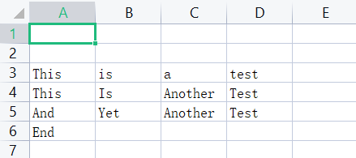

Python<br />介绍一下如何用Python来操作Excel文件，当中需要用到的模块叫做openpyxl，其中会涉及到一些基本常规的操作，例如有

- 插入与查询数据
- 分类统计数据
- 数据的可视化
- 字体颜色的更改
- 等等

用到的数据集：[grades.xlsx](https://www.yuque.com/attachments/yuque/0/2022/xlsx/396745/1659493292040-308aad70-c664-4c16-b2a7-2573b199a40b.xlsx?_lake_card=%7B%22src%22%3A%22https%3A%2F%2Fwww.yuque.com%2Fattachments%2Fyuque%2F0%2F2022%2Fxlsx%2F396745%2F1659493292040-308aad70-c664-4c16-b2a7-2573b199a40b.xlsx%22%2C%22name%22%3A%22grades.xlsx%22%2C%22size%22%3A11245%2C%22type%22%3A%22application%2Fvnd.openxmlformats-officedocument.spreadsheetml.sheet%22%2C%22ext%22%3A%22xlsx%22%2C%22source%22%3A%22%22%2C%22status%22%3A%22done%22%2C%22download%22%3Atrue%2C%22taskId%22%3A%22u96fd5bfc-1aea-4f9f-8192-fcfa4b44183%22%2C%22taskType%22%3A%22upload%22%2C%22__spacing%22%3A%22both%22%2C%22id%22%3A%22u61fa1adc%22%2C%22margin%22%3A%7B%22top%22%3Atrue%2C%22bottom%22%3Atrue%7D%2C%22card%22%3A%22file%22%7D)
<a name="PeqGz"></a>
## 基本操作
默认已经都安装好了openpyxl模块了，要是还没有安装的话，可以通过pip命令行，代码如下
```bash
pip install openpyxl
```
首先来导入Excel数据集，代码如下
```python
# 导入模块
from openpyxl import Workbook, load_workbook

# 导入Excel数据集
wb = load_workbook(r"grades.xlsx")

# 得到正在运行的工作表
sheet = wb.active

# 工作表的名称叫做
print(sheet)
```
output
```python
<Worksheet "Class A">
```
<a name="KeCxK"></a>
### 打印出工作表中的值
通过传入单元格的位置来打印其中的数值，代码如下
```python
print(sheet["A1"].value)
print(sheet["A2"].value)
print(sheet["B3"].value)
```
output
```python
Name
Test
Male
```
<a name="iaSIT"></a>
### 改变某个单元格的数值
还可以尝试来改变某个单元格的数值，代码如下
```python
sheet["A1"] = "Dylan"

# 保存
wb.save(r"grades.xlsx")
```
在保存过之后，来看一下结果如何，如下图所示<br />
<a name="YClBp"></a>
### 添加一个工作表
尝试在现有的Excel当中添加一个工作表，代码如下
```python
# 添加一个新的工作表
wb.create_sheet("Class B")

# 返回以列表形式带有工作表名称
print(wb.sheetnames)
```
output
```python
['Class A', 'Class B']
```
<a name="lYtUO"></a>
### 插入数据
尝试新建一个工作簿，并且插入若干条数据，代码如下
```python
# 创建一个新的工作簿
new_wb = Workbook()
ws = new_wb.active

# 重命名工作表的名称
ws.title = "Test1"

# 插入数据到新建的工作表中
ws.append(["This","is","a","test"])
new_wb.save("test.xlsx")
```
来看一下最后出来的结果，如下图所示<br /><br />尝试来多插入几条数据，代码如下
```python
# 插入更多的数据
ws.append(["This","Is","Another","Test"])
ws.append(["And","Yet","Another","Test"])
ws.append(["End"])

# 保存
new_wb.save("test.xlsx")
```
<a name="UXdBX"></a>
### 插入行与删除行
如果是想插入某一行的话，调用的则是`insert_rows()`方法，具体代码如下
```python
# 前面的步骤一样，导入工作簿和数据
ws.insert_rows(1)
wb.save("test.xlsx")
```
出来的结果如下图所示<br /><br />同理，如果是想要去删除某一行的数据的话，调用的则是`delete_rows()`方法，具体代码如下
```python
ws.delete_rows(1)
# 保存
wb.save("test.xlsx")
```
出来的结果如下图所示<br />
<a name="Lde57"></a>
### 插入列与删除列
来看一下该如何插入列和删除列，插入列用到的方式是`insert_cols()`，代码如下
```python
# 新插入一列
ws.insert_cols(2)
```
结果如下<br /><br />而删除列的方法是`delete_cols()`，
```python
ws.delete_cols(1,2)
```
<a name="ElBuy"></a>
## 数据的分析与可视化
还可以进行一系列的数据统计分析，首先把需要用到的数据放入至Excel当中去，
```python
sales_data = {
           "苹果": {"北京": 5000, "上海": 7000, "深圳": 6000, "香港": 10000},
           "华为": {"北京": 8000, "上海": 4000, "深圳": 3000, "香港": 9000},
           "小米": {"北京": 6000, "上海": 9000, "深圳": 5000, "香港": 6000},
           "vivo": {"北京": 3000, "上海": 5000, "深圳": 4000, "香港": 7000}
            }
```
随意生成了一点数据，并且将其放置到Excel当中去，代码如下
```python
# 创建一个新的工作簿
sales_wb = Workbook()
ws = sales_wb.active

# 重命名工作表的名称
ws.title = "Sales"

# 创建列名
column_names = ["Product Name"] + list(sales_data["苹果"].keys())
ws.append(column_names)

# 将一系列的数值都放置到工作表当中去
for product in sales_data:
    sales = list(sales_data[product].values())
    ws.append([product] + sales)

sales_wb.save("sales_data.xlsx")
```
来看一下出来的结果，如下图所示<br />
<a name="jEeem"></a>
### 平均值的计算
来指定某一列，并且求出其平均值，代码如下
```python
ws['B6'] = '=AVERAGE(B2:B5)'

sales_wb.save("sales_data.xlsx")
```
来看一下出来的结果，如下图所示<br />
<a name="vSQR6"></a>
### 求和的计算
为每一座城市的销售额都来做一个求和的计算，写一个for循环来遍历每一列，将每一列当中的数据做一个求和，代码如下
```python
# 再添加新的一行的名称
ws['A' + str(ws.max_row + 1)] = "Total Sales"

# 遍历再求和
for col in range(2, len(sales_data["苹果"]) + 2):
    char = get_column_letter(col)
    ws[char + '6'] = f"=SUM({char + '2'}:{char + '5'})"
```
来看一下出来的结果，如下图所示<br />
<a name="Ew6uD"></a>
### 字体颜色的更改
也可以来更改字体的颜色，使得更加美观一些，代码如下
```python
for col in range(1,ws.max_column+1):
    ws[get_column_letter(col) + '1'].font = Font('Arial', bold=True, size=13, color='00000080')
    
sales_wb.save("sales_data.xlsx")
```
来看一下美化过之后的结果，如下图所示<br />
<a name="HLZWz"></a>
### 画个柱状图出来
最后的最后，来绘制一张柱状图，来看一下不同的产品在每一个城市的销售数据如何，横坐标对应的产品类目，而纵坐标对应的则是销售数据，另外根据不同的城市会用不用的颜色来标注出来，代码如下
```python
from openpyxl.chart import BarChart, Reference

# 新建一个柱状图实例
barchart = BarChart()

# 确定数据的范围
data = Reference(ws, min_col=ws.min_column+1, max_col=ws.max_column, min_row=ws.min_row, max_row=ws.max_row-1)
categories = Reference(ws, min_col=ws.min_column, max_col=ws.min_column, min_row=ws.min_row+1, max_row=ws.max_row-1)

# 添加数据以及类目
barchart.add_data(data, titles_from_data=True)
barchart.set_categories(categories)

# 绘制的数据放在哪个位置
ws.add_chart(barchart, "G1")

# 添加标题
barchart.title = '每座城市的产品销售数据'

# 图表的类型
barchart.style = 2

sales_wb.save("sales_data.xlsx")
```
来看一下最后出来的结果，如下图所示<br />
