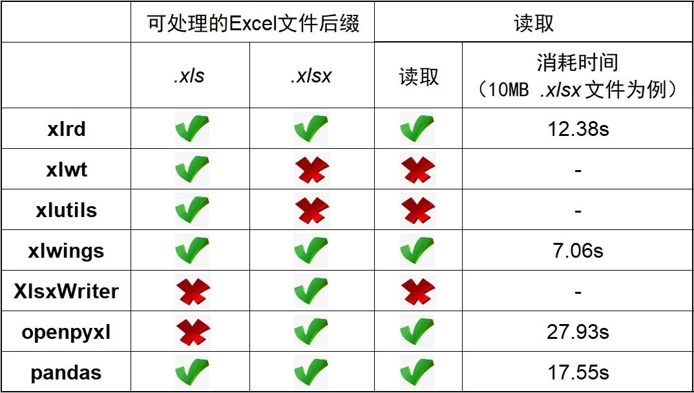

Python Excel

- `xlrd`、`xlwt`、`xlutils` 各自的功能都有局限性，但三者互为补充，覆盖了Excel文件尤其是 `.xls` 文件的操作。`xlwt` 可以生成 `.xls` 文件，`xlrd` 可以读取已经存在的 `.xls` 文件，`xlutils` 连接 `xlrd` 和 `xlwt` 两个模块，使用户可以同时读写一个 `.xls` 文件。简单来说，`xlrd` 负责读、`xlwt` 负责写、`xlutils` 负责提供辅助和衔接
- `xlwings` 能够非常方便的读写 Excel 文件中的数据，并且能够进行单元格格式的修改
- `XlsxWriter` 是一个用来写 `.xlsx` 文件格式的模块。它可以用来写文本、数字、公式并支持单元格格式化、图片、图表、文档配置、自动过滤等特性。但不能用来读取和修改 Excel 文件
- `openpyxl` 通过 工作簿 “workbook - 工作表 sheet - 单元格 cell” 的模式对 `.xlsx` 文件进行读、写、改，并且可以调整样式
- `pandas` 大家都不陌生，是进行数据处理和分析的强大模块，有时也可以用来自动化处理Excel


<a name="v77WO"></a>
## 一、安装
7个模块均为**非标准库**，因此都需要在命令行中 `pip` 进行安装：
```bash
pip install xlrd
pip install xlwt
pip install xlutils
pip install xlwings
pip install XlsxWriter
pip install openpyxl
pip install pandas
```
<a name="FXjvR"></a>
## 二、模块导入
多数模块可以直接通过名字导入，有些模块约定俗称会使用缩写：
```python
import xlrd
import xlwt
import xlwings as xw
import xlsxwriter
import openpyxl
import pandas as pd
```
`xlutils` 模块是 `xlrd` 和 `xlwt` 之间的桥梁，最核心的作用是拷贝一份通过 `xlrd` 读取到内存中的 `.xls` 对象，然后再拷贝对象上通过 `xlwt` 修改 `.xls` 表格的内容。`xlutils` 可以将 `xlrd` 的 Book 对象复制转换为 `xlwt` 的Workbook 对象，具体使用时通常导入的是模块中的 `copy` 子模块：
```python
import xlutils.copy
```
<a name="nT5Km"></a>
## 三、读取 Excel 文件
<a name="aedrJ"></a>
### 3.1 获取文件
并不是所有7个模块都可以读取 Excel 文件，而即使能读取Excel文件也要分不同后缀名进行讨论，具体如下：

- `xlwt`、`xlutils`、`XlsxWriter` 不能读取文件
- `xlrd` 可以读取 `.xls` 和 `.xlsx` 文件
- `xlwings` 可以读取 `.xls` 和 `.xlsx` 文件
- `openpyxl` 可以读取 `.xlsx` 文件
- `pandas` 可以读取 `.xls` 和 `.xlsx` 文件

下面使用两个大小均为 10MB 的 `.xls` 和 `.xlsx` 文件进行测试：
```python
xls_path = r'C:\xxx\Desktop\test.xls'
xlsx_path = r'C:\xxx\Desktop\test.xlsx'
```
<a name="oQsAo"></a>
#### 3.1.1 `xlrd` 读取文件
`xlrd` 可以读取 `.xls` 和 `.xlsx` 文件
```python
xls = xlrd.open_workbook(xls_path)
xlsx = xlrd.open_workbook(xlsx_path)
```
<a name="ONkri"></a>
#### 3.1.2 `xlwings` 读取文件
`xlwings` 直接对接的是 apps，也就是 Excel 应用程序，然后才是工作簿 books 和工作表 sheets，`xlwings` 需要安装有 Excel 应用程序的环境`xlwings` 可以读取 `.xls` 和 `.xlsx` 文件
```python
app = xw.App(visible=True, add_book=False) # 程序可见，只打开不新建工作薄
app.display_alerts = False # 警告关闭
app.screen_updating = False # 屏幕更新关闭
# wb = app.books.open(xls_path)
wb = app.books.open(xlsx_path)
wb.save() # 保存文件
wb.close() # 关闭文件
app.quit() # 关闭程序
```
<a name="4wfDq"></a>
#### 3.1.3 `openpyxl` 读取文件
`openpyxl` 可以读取 `.xlsx` 文件
```python
wb = openpyxl.load_workbook(xlsx_path)
```
如果读取 `.xls` 文件会报错：
```python
wb = openpyxl.load_workbook(xls_path)
```
:::danger
`openpyxl.utils.exceptions.InvalidFileException: openpyxl does not support the old .xls file format, please use xlrd to read this file, or convert it to the more recent .xlsx file format.`
:::
<a name="35wcB"></a>
#### 3.1.4 `pandas` 读取文件
`pandas` 可以读取 `.xls` 和 `.xlsx` 文件
```python
xls = pd.read_excel(xls_path, sheet_name='Sheet1')
xlsx = pd.read_excel(xlsx_path, sheet_name='Sheet1')
```
接下来比较四个模块在同一配置电脑下读取 10MB `.xlsx` 文件的时间（运行3次求平均值），所用代码为：
```python
import time
import xxx
time_start = time.time()
xxx
time_end = time.time()
print('time cost: ', time_end-time_start, 's')
```
最后测试的结果是，`xlwings` 读取 10MB 文件最快，`xlrd` 次之，`openpyxl` 最慢（因电脑而异，结果仅供参考）<br />读入 Excel 文件部分的表格总结如下：
<a name="FJeUF"></a>
### 3.2 获取工作表
针对上述4个可以读取 Excel 文件的模块，进一步讨论其获取工作表 sheet 的方式
<a name="4tgp3"></a>
#### 3.2.1 `xlrd` 获取工作表
可以通过 sheet 名查找：
```python
sheet = xlsx.sheet_by_name("Sheet1")
```
也可通过索引查找：
```python
sheet = xlsx.sheet_by_index(0)
```
<a name="F1GUQ"></a>
#### 3.2.2 `xlwings` 获取工作表
`xlwings` 的工作表分为活动工作表以及指定工作簿下的特定工作表：
```python
sheet = xw.sheets.active  # 在活动工作簿
sheet = wb.sheets.active  # 在特定工作簿
```
<a name="4UX38"></a>
#### 3.2.3 `openpyxl` 获取工作表
`.active` 方法默认获取工作簿的第一张工作表
```python
sheet = wb.active
```
另外也可以通过工作表名指定获取工作表：
```python
sheet = wb['Sheet1']
```
<a name="8NCh0"></a>
#### 3.2.4 `pandas` 获取工作表
单独获取工作表完全没有 `pandas` 什么事情，因为读取文件的同时已经且必须指定工作表才能读取：
```python
xlsx = pd.read_excel(xlsx_path, sheet_name='Sheet1')
```
<a name="Voo3O"></a>
## 四、创建 Excel 文件
简单总结创建 Excel 文件的情况：

- `xlrd`、`xlutils` 不能创建 Excel 文件
- `xlwt` 只能创建 `.xls` 文件，不能创建 `.xlsx` 文件
- `xlwings`可以创建 `.xls` 和 `.xlsx` 文件
- `XlsxWriter` 可以创建 `.xlsx` 文件
- `openpyxl` 可以创建 `.xls` 和 `.xlsx` 文件
- `pandas` 没有创建 Excel 的概念，但可以存储时产生 `.xls` 或 `.xlsx` 文件
<a name="Vx6Id"></a>
### 4.1 `xlwt` 创建文件
`xlwt` 只能创建 `.xls` 文件，不能创建 `.xlsx` 文件
```python
xls = xlwt.Workbook(encoding= 'ascii')
# 创建新的sheet表
worksheet = xls.add_sheet("Sheet1")
```
<a name="7bee9ddd"></a>
### 4.2 `xlwings` 创建文件
`xlwings`可以创建 `.xls` 和 `.xlsx` 文件，只需要最后保存时写清楚后缀即可。使用如下命令：
```python
wb = app.books.add()
```
无论是新建还是打开都需要**保存工作簿、关闭工作簿、关闭程序**，即：
```python
wb.save(path + r'\new_practice.xlsx') 
wb.close() 
app.quit()
```
<a name="EMXiz"></a>
### 4.3. `XlsxWriter` 创建文件
`XlsxWriter` 可以创建 `.xlsx` 文件：
```python
xlsx = xlsxwriter.Workbook()   
# 添加工作表
sheet = xlsx .add_worksheet('Sheet1')
```
<a name="edd872d4"></a>
### 4.4 `openpyxl` 创建文件
`openpyxl`可以创建 `.xls` 和 `.xlsx` 文件，只需要最后保存时写清楚后缀即可。使用如下命令：
```python
wb = Workbook()
# 新工作簿中指定即创建工作表
sheet = wb.active
```
<a name="p6pEh"></a>
### 4.5. `pandas` 创建文件
`pandas` 只需要最后转存时写清楚后缀即可。实际上比较抽象，`pandas` 并不需要一开始先创建一个 Excel 文件，可以围绕数据框做各式操作后用 `.to_excel` 命令再用 `.xls` 或者 `.xlsx` 做文件后缀。如果一定要产生一个空白 Excel 文件可以用如下命令：
```python
df = pd.DataFrame([])
df.to_excel(r'C:\xxx\test1.xlsx')
```
<a name="Hsmml"></a>
## 五、保存文件
简单总结保存 Excel 文件的情况：

- `xlrd` 不能保存 Excel 文件
- `xlwt` 可以保存 `.xls` 文件
- `xlutils` 可以将 `xlrd` 对象复制为 `xlwt` 对象后保存 `.xls` 文件
- `xlwings`可以保存 `.xls` 和 `.xlsx` 文件
- `XlsxWriter` 可以保存 `.xlsx` 文件
- `openpyxl` 可以保存 `.xlsx` 文件
- `pandas` 可以保存 `.xls` 或 `.xlsx` 文件
<a name="f6zKF"></a>
### 5.1 `xlwt` 保存文件
`xlwt` 可以保存 `.xls` 文件
```python
# xls = xlwt.Workbook(encoding= 'ascii')
# worksheet = xls.add_sheet("Sheet1")
xls.save("new_table.xls")
```
<a name="oJlqY"></a>
### 5.2 `xlutils` 保存文件
`xlutils` 可以将 `xlrd` 对象复制为 `xlwt` 对象后保存 `.xls` 文件
```python
# xls_path = r'C:\xxxx\test.xls'
# xls = xlrd.open_workbook(xls_path)
xls_xlutils = xlutils.copy.copy(xls)
xls_xlutils.save('new_text.xls')
```
<a name="141e8837"></a>
### 5.3 `xlwings` 保存文件
`xlwings`可以保存 `.xls` 和 `.xlsx` 文件
```python
# wb = app.books.open(xls_path)
wb = app.books.open(xlsx_path)
wb.save() # 保存文件
wb.close() # 关闭文件
app.quit() # 关闭程序
```
<a name="b03cce95"></a>
### 5.4 `XlsxWriter` 保存文件
`XlsxWriter` 可以保存 `.xlsx` 文件，`.close` 命令执行后文件关闭的同时保存：
```python
# xlsx = xlsxwriter.Workbook()
# sheet = xlsx .add_worksheet('Sheet1')
xlsx.close()
```
<a name="e2115371"></a>
### 5.5 `openoyxl` 保存文件
`openpyxl` 可以保存 `.xlsx` 文件
```python
# wb = openpyxl.load_workbook(xlsx_path)
# wb = Workbook()
# sheet = wb.active
wb.save('new_test.xlsx')
```
<a name="94esj"></a>
### 5.6 `pandas` 保存文件
`pandas` 可以保存 `.xls` 或 `.xlsx` 文件
```python
df1 = pd.DataFrame([1, 2, 3])
df2 = pd.DataFrame([1, 2, 4])
df1.to_excel(r'C:\xxxx\test1.xls')
df2.to_excel(r'C:\xxxx\test2.xlsx')
```
<a name="OXtpg"></a>
## 六、获取单元格的值
获取单元格的值基本前提是能够读取文件，因此基本围绕 `xlrd`、`xlwings`、`openpyxl`、`pandas` 介绍。`xlutils` 由于能够复制一份 `.xls` 因此也可以使用和 `xlrd` 完全一样的读取单元格方法。
<a name="21k2C"></a>
### 6.1. `xlrd`/`xlutils` 获取单元格
`xlutils` 因为是直接拷贝一份 `xlrd` 适用的对象，读取单元格使用的方法和 `xlrd` 完全一样。`xlwt` 没有读取单元格的能力
```python
# xls = xlrd.open_workbook(xls_path)
# sheet = xlsx.sheet_by_name("Sheet1")
value = sheet.cell_value(4, 6) # 第5行第7列的单元格
print(value)
rows = table.row_values(4)
cols = table.col_values(6)
for cell in rows:
    print(cell)
```
<a name="b1789907"></a>
### 6.2. `xlwings` 获取单元格
```python
# app = xw.App(visible=True, add_book=False) 
# app.display_alerts = False 
# app.screen_updating = False 
# wb = app.books.open(xls_path)
# sheet = wb.sheets.active
# 获取单个单元格的值
A1 = sheet.range('A1').value
print(A1)
# 获取横向或纵向多个单元格的值，返回列表
A1_A3 = sheet.range('A1:A3').value
print(A1_A3)
# 获取给定范围内多个单元格的值，返回嵌套列表，按行为列表
A1_C4 = sheet.range('A1:C4').value
print(A1_C4)
# 获取单个单元格的值
A1 = sheet.range('A1').value
print(A1)
# 获取横向或纵向多个单元格的值，返回列表
A1_A3 = sheet.range('A1:A3').value
print(A1_A3)
# 获取给定范围内多个单元格的值，返回嵌套列表，按行为列表
A1_C4 = sheet.range('A1:C4').value
print(A1_C4)
```
<a name="3dfe911d"></a>
### 6.3 `openpyxl` 获取单元格
```python
# wb = openpyxl.load_workbook(xlsx_path)
# wb = Workbook()
# sheet = wb.active
# 一、指定坐标范围的值
cells = sheet['A1:B5']
# 二、指定列的值
cells = sheet['A']
cells = sheet['A:C']
# 三、指定行的值
cells = sheet[5]
cells = sheet[5:7]
# 获取单元格的值
for cell in cells:
    print(cell.value)
```
<a name="099544c4"></a>
### 6.4 `pandas` 获取单元格的值
`pandas` 读取 Excel 文件后即将它转换为数据框对象，解析内容的方法基本是 `pandas` 体系中的知识点，如 `.iloc()` `.loc()` `.ix()` 等：
```python
print(df1.iloc[0:1, [1]])
print(df1.loc['b'])
print(df2.ix['a', 'a']) # 有些版本取消了ix，可以用iat
```
<a name="PqCLF"></a>
## 七、写入数据
先简单总结对 Excel 文件写入数据的情况：

- `xlrd` 不能写入数据
- `xlwt` 可以写入数据
- `xlutils` 可以借用 `xlwt` 方法写入数据
- `xlwings`可以写入数据
- `XlsxWriter` 可以写入数据
- `openpyxl` 可以写入数据
- `pandas` 将 Excel 文件读取为数据框后，是抽象出数据框层面进行操作，没有了对 Excel 进行单元格写入和修改的概念
<a name="tX3yv"></a>
### 7.1. `xlwt`/`xlutils` 写入数据
```python
# xls = xlrd.open_workbook(xls_path)
# xls_xlutils = xlutils.copy.copy(xls)
# sheet = xls_xlutils.sheet_by_name("Sheet1")
# value = sheet.cell_value(4, 6)
# print(value)
sheet.write(4, 6, "新内容")
```
<a name="HxM1H"></a>
### 7.2 `xlwings` 写入数据
```python
# app = xw.App(visible=True, add_book=False) 
# app.display_alerts = False 
# app.screen_updating = False 
# wb = app.books.open(xls_path)
# sheet = wb.sheets.active
# 写入 1 个单元格
sheet.range('A2').value = '大明'
# 一行或一列写入多个单元格
# 横向写入A1:C1
sheet.range('A1').value = [1,2,3]
# 纵向写入A1:A3
sheet.range('A1').options(transpose=True).value = [1,2,3]
# 写入范围内多个单元格
sheet.range('A1').options(expand='table').value = [[1,2,3], [4,5,6]]
```
<a name="e649e58a"></a>
### 7.3 `XlsxWriter` 写入数据
代码中的 `new_format` 是之前预设好的样式，下文会进行介绍
```python
# xlsx = xlsxwriter.Workbook()
# sheet = xlsx .add_worksheet('Sheet1')
# 一、写入单个单元格
sheet.write(row, col, data, new_format)
# A1:从A1单元格开始插入数据，按行插入
sheet.write_row('A1', data, new_format)
# A1:从A1单元格开始插入数据，按列插入
sheet.write_column('A1', data, new_format)
```
<a name="rMU9X"></a>
### 7.4. `openpyxl` 写入数据
```python
# wb = openpyxl.load_workbook(xlsx_path)
# wb = Workbook()
# sheet = wb.active
# 一、写入单元格
cell = sheet['A1']
cell.value = '业务需求'
# 二、写入一行或多行数据
data1 = [1, 2, 3]
sheet.append(data1)
data2 = [[1, 2, 3], [4, 5, 6]]
sheet.append(data2)
```
<a name="iQEMJ"></a>
## 八、样式调整
依旧简单总结对 Excel 文件样式调整的情况：

- `xlrd`、`xlutils` 不能调整样式 （也可以说 `xlutils` 可以，只不过是借用了 `xlwt` 的方法）`xlwt` 可以调整样式
- `xlwings`可以调整样式
- `XlsxWriter` 可以调整样式
- `openpyxl` 可以调整样式
- `pandas` 不能调整样式
<a name="igm3C"></a>
### 8.1 `xlwt` 调整样式
`xlwt` 支持调整字体、边框、颜色等样式
```python
# 字体部分
# 初始化样式
style1 = xlwt.XFStyle()
# 为样式创建字体
font = xlwt.Font()
font.name = 'Times New Roman'   #字体
font.bold = True                #加粗
font.underline = True           #下划线
font.italic = True              #斜体
# 设置样式
style1.font = font
# 使用样式
sheet.write(4, 6, "新内容1", style1)
# 边框部分
borders = xlwt.Borders()
# 设置线型
borders.left = xlwt.Borders.DASHED
borders.right = xlwt.Borders.DASHED
borders.top = xlwt.Borders.DASHED
borders.bottom = xlwt.Borders.DASHED
# 设置样色
borders.left_colour = 0x40
borders.right_colour = 0x40
borders.top_colour = 0x40
borders.bottom_colour = 0x40
# 
style2 = xlwt.XFStyle()
style2.borders = borders
# 使用样式
sheet.write(5, 8, "新内容2", style2)
```
<a name="uxYAs"></a>
### 8.2 `xlwings` 调整样式
简单介绍 `xlwings` 对颜色的调整：
```python
# 获取颜色
print(sheet.range('C1').color)
# 设置颜色
sheet.range('C1').color = (255, 0, 120)
# 清除颜色
sheet.range('C1').color = None
```
<a name="12f600db"></a>
### 8.3 XlsxWriter 调整样式
`XlsxWriter` 包含大量功能，可以创建工作表后对工作表进行高定自定义的样式修改：
```python
new_format = xlsx.add_format({
        'bold':  True,  # 字体加粗
        'border': 1,  # 单元格边框宽度
        'align': 'left',  # 水平对齐方式
        'valign': 'vcenter',  # 垂直对齐方式
        'fg_color': '#F4B084',  # 单元格背景颜色
        'text_wrap': True  # 是否自动换行
    })
sheet.write(row, col, data, new_format)
```
<a name="rAqHI"></a>
### 8.4 openpyxl 调整样式
`openpyxl` 样式主要包括字体、边框、段落对齐样式等
```python
# 字体样式
from openpyxl.styles import Font 
cell = sheet['A1'] 
font = Font(name='Arial', size=12, bold=True, italic=True, color='FF0000') 
cell.font = font
# 段落对齐
from openpyxl.styles import Alignment 
cell = sheet['B2'] 
alignment = Alignment(horizontal='center', vertical='center',                     text_rotation=45, wrap_text=True) 
cell.alignment = alignment 
# 边框样式
from openpyxl.styles import Side, Border 
cell = sheet['B2'] 
side1 = Side(style='thin', color='FF0000') 
side2 = Side(style='dashed') 
border = Border(left=side1, right=side1, top=side2, bottom=side2) 
cell.border = border
```
<a name="1DjGV"></a>
## 九、插入图片
简单总结对 Excel 文件插入图片的情况：

- `xlrd`、`xlutils` 不能调整样式 （也可以说 `xlutils` 可以，只不过是借用了 `xlwt` 的方法）
- `xlwt` 可以插入 `.bmp` 图片
- `xlwings`可以插入 图片
- `XlsxWriter` 可以插入图片
- `openpyxl` 可以插入图片
- `pandas` 不能插入图片
<a name="9V0H5"></a>
### 9.1 `xlwt` 插入图片
`xlwt` 插入图片要求图片格式必须是 `.bmp` 格式才能插入成功
```python
sheet.insert_bitmap("test.bmp", 2, 3, 2, 2, 0.5, 0.5)
```
`insert_bitmap(img, x, y, x1, y1, scale_x, scale_y)``img` 表示要插入的图像地址，`x` 表示行，`y` 表示列`x1 y1` 表示相对原来位置向下向右偏移的像素`scale_x scale_y`表示相对原图宽高的比例，图片可放大缩小
<a name="Lq1Iz"></a>
### 9.2 `xlwings` 插入图片
下面是用`xlwings` 插入图片的代码，可以指定位置
```python
sheet.pictures.add(r'C:\\xxx.jpg')
# 也可以给定位置插入
sheet.pictures.add(r'C:\\xxx.jpg', left=sheet.range('A2').left, top=sheet.range('A2').top, width=100, height=100)
```
<a name="a6b92b6f"></a>
### 9.3 XlsxWriter 插入图片
第一个参数是插入的起始单元格，第二个参数是图片文件的绝对路径
```python
sheet.insert_image('A1', r'C:\\xxx.jpg')
```
<a name="ys1Uz"></a>
### 9.4 openpyxl 插入图片
`openpyxl`也可以给Excel中插入指定图片并修改大小
```python
from openpyxl.drawing.image import Image
img = Image('test.jpg')
newsize = (180, 360) 
img.width, img.height = newsize # 设置图片的宽和高
sheet.add_image(img, 'A2') # 往A2单元格插入图片
```
