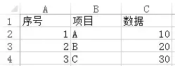

Python Excel xlsxwriter Pandas openpyxl<br />使用 `xlsxwriter`、`pandas`、`openpyxl` 三个库来实现数据写入 Excel，写入后的格式如下图所示：<br /><br />以下为数据用例：
```python
import xlsxwriter as xw
import pandas as pd
import openpyxl as op
"-------------数据用例-------------"
orderIds = [1,2,3]
items = ['A','B','C']
myData = [10,20,30]
testData = [orderIds,items,myData]
filename1 = '测试1.xlsx'
filename2 = '测试2.xlsx'
filename3 = '测试3.xlsx'
"--------------执行----------------"
xw_toexcel(testData,filename1)
pd_toexcel(testData,filename2)
op_toexcel(testData,filename3)
```
下面开始介绍三种方法：
<a name="DvdRK"></a>
## 1、xlsxwriter
```python
def xw_toexcel(data,filename): # xlsxwriter库储存数据到excel
    workbook = xw.Workbook(filename) # 创建工作簿
    worksheet1 = workbook.add_worksheet("sheet1") # 创建子表
    worksheet1.activate() # 激活表
    title = ['序号','项目','数据'] # 设置表头
    worksheet1.write_row('A1',title) # 从A1单元格开始写入表头
    i = 2 # 从第二行开始写入数据
    for j in range(len(data)):
        insertData = [data[0][j],data[1][j],data[2][j]]
        row = 'A' + str(i)
        worksheet1.write_row(row, insertData)
        i += 1
    workbook.close() # 关闭表
```
<a name="0wTSk"></a>
## 2、pandas
```python
def pd_toexcel(data,filename): # pandas库储存数据到excel
    dfData = { # 用字典设置DataFrame所需数据
        '序号':data[0],
        '项目':data[1],
        '数据':data[2]
    }
    df = pd.DataFrame(dfData) # 创建DataFrame
    df.to_excel(filename,index=False) # 存表，去除原始索引列（0,1,2...）
```
<a name="EwRGy"></a>
## 3、openpyxl
```python
def op_toexcel(data,filename): # openpyxl库储存数据到excel
    wb = op.Workbook() # 创建工作簿对象
    ws = wb['Sheet'] # 创建子表
    ws.append(['序号','项目','数据']) # 添加表头
    for i in range(len(data[0])):
        d = data[0][i], data[1][i], data[2][i]
        ws.append(d) # 每次写入一行
    wb.save(filename)
```
<a name="m77TL"></a>
## 小结
openpyxl 与 xlsxwriter 类似，需要逐行写入，如第一行需要得到 [ 1, ‘A’ , 10 ] 的格式，但不同的是使用 `openpyxl.load_workbook(filepath)` 可以对已存在的 .xlsx 进行追加数据，不会覆盖；pandas 则需先按列组合，如 [[ 1,2,3],['A','B','C'],[…]]的格式。<br />方法各有好处，写表时应根据需要选用。
