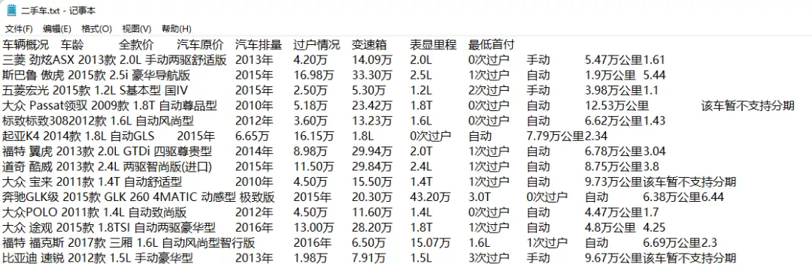
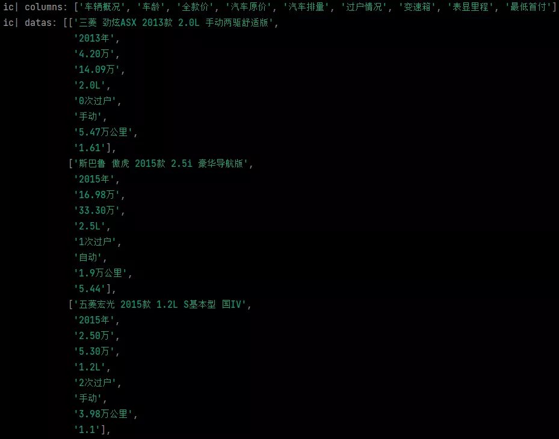
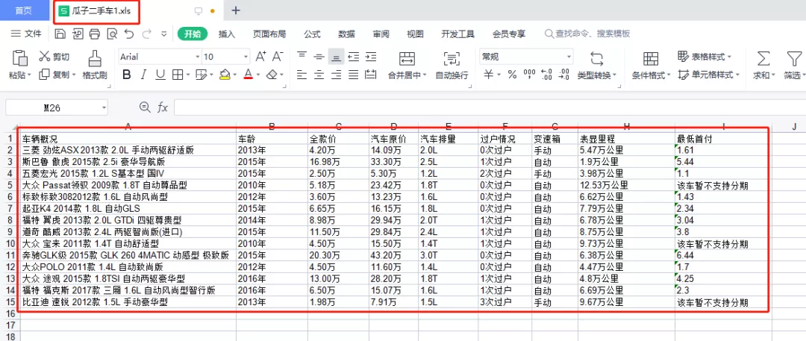
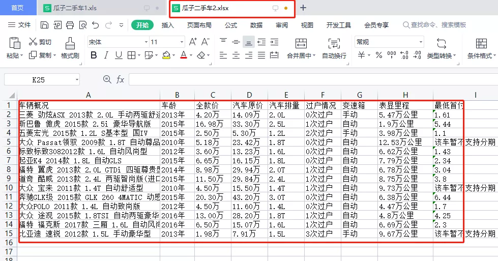
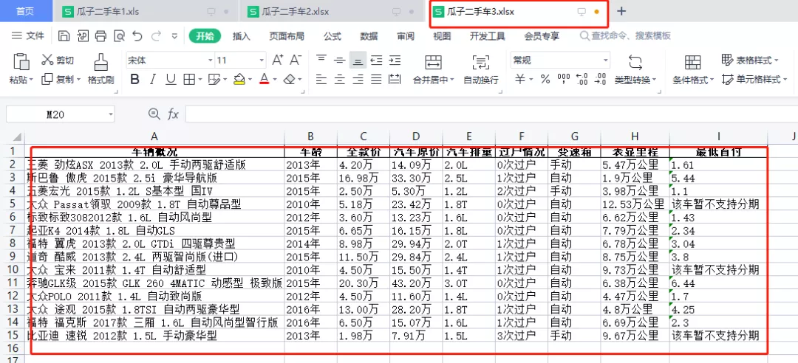

Pyhton Excel<br />Python操作Excel的库有很多，比如pandas，xlwt/xlrd，openpyxl等，每个库都有不同的区别。
<a name="cOOaW"></a>
## xlwt/xlrd
xlrd是对于Excel进行读取，xlrd操作的是xls/xlxs格式的Excel<br />xlwt是对于Excel进行读取，xlwt操作的是xls格式的Excel
<a name="jEM7O"></a>
### 安装xlrd
xlrd是Python的第3方库，需要通过pip进行安装
```bash
pip install xlrd
```
1、导入xlrd模块<br />2、打开Excel完成实例化<br />3、通过下标获取对应的表（可以通过表名获取）<br />4、通过列，行或者坐标获取表格的数据
<a name="Jwzl4"></a>
### 安装xlwt
xlwt属于Python的第3方库，需要通过pip进行安装
```bash
pip install xlwt
```
写入Excel数据<br />1、首先导入xlwt第3方库<br />2、创建一个workbook模块，相当于创建一个xlwt文件<br />3、通过`add_sheet`创建一个表格<br />4、使用write函数进行对表完成写的操作<br />5、把写完的数据导入到Excel中
<a name="NuJuP"></a>
## openpyxl
OpenPyXl是一个Python的模块  可以用来处理excle表格<br />安装：<br />xlrd是Python的第3方库，需要通过pip进行安装
```bash
pip install openpyxl
```
使用时再代码内 `from openpyxl import Workbook`或者`from openpyxl import load_workbook`<br />区别在于前者不需要有excle文件存在  后者需要传入一个excle文件<br />前者可以凭空产生一个  后者不行
<a name="uAF9l"></a>
### 使用openpyxl 写入Excel数据
1、获取workbook<br />2、获取 worksheet<br />3、再然后 获取单元格  进行操作<br />4、保存文件
<a name="OEYPX"></a>
## pandas
写入Excel中数据的除了xlwt和openpyxl之外。Pandas也是可以实现这种功能的。<br />它纳入了大量库和一些标准的数据模型，提供了高效地操作大型数据集所需的工具，能使我们快速便捷地处理数据。接下来就看看如何用pandas读写Excel。
<a name="OcQuV"></a>
### 1. 读取excel
读取Excel主要通过`read_excel`函数实现，除了pandas还需要安装第三方库xlrd。
<a name="aVkyb"></a>
### 2. 写入excel
写入Excel主要通过pandas构造DataFrame，调用`to_excel`方法实现。<br />准备读取的数据是之前爬取瓜子二手车网站的一些数据，部分数据展示如下：<br /><br />展示的就是使用上述介绍的三种方法将txt文档的数据写入到Excel中。
```python
# 标题列表
columns = []
# 数据列表
datas = []

with open('二手车.txt', encoding='utf-8') as fin:
    # 首行判断
    is_first_line = True
    for line in fin:
        line = line[:-1]
        if is_first_line:
            is_first_line = False
            columns = line.split('\t')
            continue
        datas.append(line.split('\t'))

ic(columns)
ic(datas)
```
读取的行列表和数据列表数据展示如下：<br /><br />数据成功读取出来
<a name="JLzaV"></a>
## 接下来使用三种方式写入到Excel中
<a name="zgSUZ"></a>
### 使用xlwt生成xls的Excel文件
```python
# 使用xlwt生成xls的excel文件
import xlwt

workbook = xlwt.Workbook(encoding='utf-8')
sheet = workbook.add_sheet('瓜子二手车')

for col, column in enumerate(columns):
    sheet.write(0, col, column)

for row, data in enumerate(datas):
    for col, column_data in enumerate(data):
        sheet.write(row+1, col, column_data)

workbook.save('瓜子二手车1.xls')
```

<a name="raRGF"></a>
### 使用openpyxl生成xlsx的Excel文件
```python
# 使用openpyxl生成xlsx的excel文件
from openpyxl import Workbook
workbook = Workbook()

sheet = workbook.active
sheet.title = '默认title'
sheet.append(columns)
for data in datas:
    sheet.append(data)
workbook.save('瓜子二手车2.xlsx')
```

<a name="kScK8"></a>
### 使用pandas生成xlsx的Excel文件
```python
# 使用pandas生成xlsx的excel文件
import pandas as pd
rcv_data = pd.read_csv('二手车.txt', sep='\t')
rcv_data.head()
ic(rcv_data)
rcv_data.to_excel('瓜子二手车3.xlsx', index = False)
```

