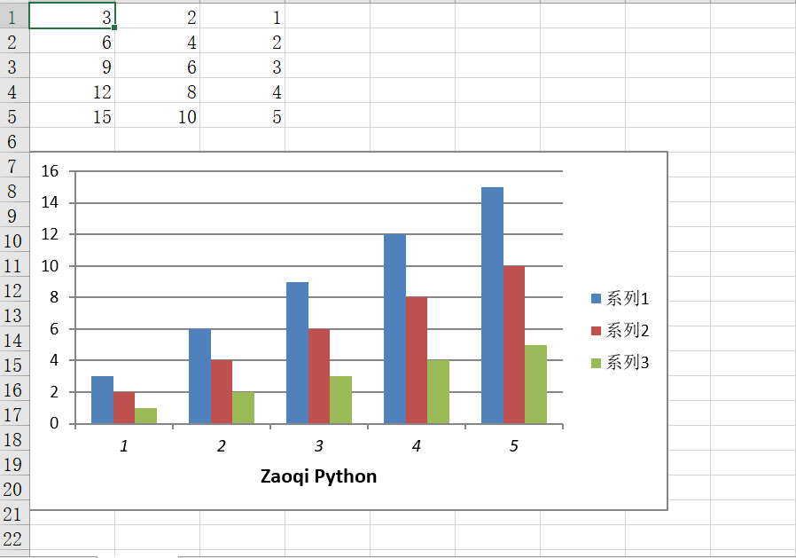

Python Excel xlsxwriter<br />先简单了解下Python操作Excel三个库之间的区别<br />`openpyxl`：只允许读取和写入`.xlsx`格式文件并进行增删改增查。<br />`xlwings`：允许读取和写入`.xlsx`和`.xls`两种格式文件并进行增删改查。<br />`xlsxwriter`：只允许写入`.xlsx`格式的文件。<br />`xlsxwriter`是Python中**用原生的方式**操作Excel一个强大的库。<br />比较三者，可能会觉得`xlsxwriter`这个库也太不行了，其实不是的，在写入这方面前两个库比不上它，它的精华在于写入(**多张样式图表**、**图片、表格样式修改等**)。
<a name="0XRhy"></a>
## 简介
`xlsxwriter`是用于创建Excel XLSX文件的Python模块，可用于将文本、数字、公式和超链接写入Excel2007 + XLSX文件中的多个工作表。它支持格式化等功能。可以说**除了Excel本身，就属这个功能最齐全了**。<br />它的缺点就是**不支持读取和修改，它只能创建新的文件**，如果读者想完美读取功能的话，可以结合`xlsxreader`来实现，两者结合可谓真正完整的Excel+XLSX再现。<br />其次，它不支持XLS文件的写入，XLS文件是一种二进制格式的文件。如果想创建XLS格式文件的话可以参考`xlwt`模块。
<a name="8bea02df"></a>
## 安装与概览
直接在命令行/终端中安装即可
```bash
pip install XlsxWriter
```
在正式讲解之前需要简单了解`Xlsxwriter`的基本流程如下
<a name="z76hh"></a>
## 常用操作拆解
下面对操作Excel时常见的几个操作进行举例讲解
<a name="3dtym"></a>
### 一、创建Excel文件
先导入模块而后使用`Workbook()`构造函数来创建一个新的工作簿对象。`Workbook()`接受一个非可选参数---创建文件的文件名。
```python
import xlsxwriter
f = xlsxwriter.Workbook()
```
<a name="tD8Bb"></a>
### 二、创建工作表
默认情况下，Excel文件中的工作表按代码执行顺序名称依次为Sheet1、Sheet2等。但是也可以指定一个名称，如上在函数内加入了Data。
```python
worksheet1 = workbook.add_worksheet()        
#worksheet2 = workbook.add_worksheet('Data')
```
<a name="xeUxJ"></a>
### 三、写入单个数据
如果对单个单元格进行写入数据用如下语法：
```python
worksheet.write(row, col, some_data)
```
注意的是在XlsxWriter中，row行和col列的索引为零也即工作表的第一个单元格A1为(0,0)<br />如果需要写入多行多列数据的话，可以用for循环。在这里举个例子呈现。
```python
import xlsxwriter
workbook = xlsxwriter.Workbook('data.xlsx')
worksheet = workbook.add_worksheet('Sheet0')
#写入数据以元组套列表形式
data = (
    ['春天',20],
    ['夏天',30],
    ['秋天',25],
    ['冬天',10],
)
#设置初始的输入数据的位置
row = 0
col = 0
#for循环添加数据
for weather, tem in (data):
    worksheet.write(row, col,weather)
    worksheet.write(row, col + 1, tem)
    row += 1
    workbook.close()
```
<a name="69ee14ae"></a>
### 四、写入一整行列数据
```python
worksheet.write_row("A1",data,bold)
worksheet.write_column("A1",data,bold)
```
第一行代码为按行插入且从A1单元格开始，data为要写入的数据(格式为一个列表)，bold为单元格样式。第二行代码与之不同的是按列插入。
<a name="eJS6X"></a>
### 五、设置单元格样式
```python
bold = f.add_format({
    'bold':  True,  # 字体加粗
    'border': 1,  # 单元格边框宽度
    'align': 'left',  # 水平对齐方式
    'valign': 'vcenter',  # 垂直对齐方式
    'fg_color': '#F4B084',  # 单元格背景颜色
    'text_wrap': True,  # 是否自动换行
})
```
在上方的写入行列数据中用到的bold参数，这是一个调节单元格样式的参数，常用的格式如上代码。
<a name="QqP16"></a>
### 六、插入图片
插入图片是`xlsxwriter`瞩目的地方，接下来将分为小部分详细讲解
```python
worksheet.insert_image('A1','绝对路径')
```
第一个参数是要指定哪个单元格插入图片，第二个参数是存放图片的绝对路径。
<a name="g3V2t"></a>
#### 6.1 插入超链接
```
worksheet.write_url(row, col, "internal:%s!A1" % ("链接对象"), string="链接显示名字")
```
row和col参数都是设置位置信息的。
<a name="bUYol"></a>
#### 6.2 插入图表
插入图表是`xlsxwriter`模块的最大闪光点，这里将详细介绍插入图表的代码及其解释。<br />首先，先熟悉插入图表的代码
```
chart = workbook.add_chart({'type': 'column','subtype': 'stacked'})
```
`workbook.add_chartsheet()`函数是最经典的插入图表函数，字典里的第一个键type参数指的是放入的图表类型。而第二个键指的是某些图表类型中的图表子类型。<br />支持的图表类型有以下：<br />`area`：创建一个Area（实线）样式表。<br />`bar`：创建条形样式（转置直方图）图表。<br />`column`：创建列样式（直方图）图表。<br />`line`：创建线型图表。<br />`pie`：创建一个饼图样式图表。<br />`doughnut`：创建一个甜甜圈样式表。<br />`scatter`：创建散点图样式图。<br />`stock`：创建一个股票样式图。<br />`radar`：创建雷达样式表。<br />设置了图表类型接下来就是插入数据，插入数据用`chart.add_series(options)`函数。<br />这里的options是以字典形式的图表数据，在Excel中图表系列是一组信息(值、轴标签、格式等)。<br />接下来就是将创建好的chart对象放入倒Excel表格中
```python
worksheet.insert_chart('A7', chart)
```
`insert_chart()`函数是将图表插入到工作表指定的位置，第一个参数为单元格位置信息，第二个参数为选定的图表。<br />用一个例子将上述三个函数结合，并画一个条形图
```python
import xlsxwriter
workbook = xlsxwriter.Workbook('条形图.xlsx')
worksheet = workbook.add_worksheet('Zaoqi')  #如果出现没图像显示就删除里面的参数
chart = workbook.add_chart({'type': 'column'})
data = [
    [3, 6, 9, 12, 15],
    [2, 4, 6, 8, 10],
    [1, 2, 3, 4, 5],
]
worksheet.write_column('A1', data[0])
worksheet.write_column('B1', data[1])
worksheet.write_column('C1', data[2])
chart.add_series({'values': '=Sheet1!$A$1:$A$5'})
chart.add_series({'values': '=Sheet1!$B$1:$B$5'})
chart.add_series({'values': '=Sheet1!$C$1:$C$5'})
worksheet.insert_chart('A7', chart)
workbook.close()
```
效果如下：<br />上述例子中的插入数据运用了和第一个例子不一样的for循环插入，运用的是`worksheet.write_column()`对整行整列进行数据添加。
:::tips
注意：如果表格里的图表没有显示则在这代码里改`worksheet = workbook.add_worksheet()`，删除里面的参数，原因是Excel的版本问题。
:::
在`chart.add_series()`函数中用到的字典类型格式为：`{'values': '=工作表名!$列对应字母$行对应数字:$列对应字母$行对应数字'}`。在这里，列对应字母和行对应数字可以看图片中，需要的是ABC三列中的1-5行数值，故这里引用3个添加函数。
<a name="W3XyQ"></a>
#### 6.3 设置x轴与y轴属性
```python
chart.set_x_axis({
    'name': 'Zaoqi Python',
    'name_font': {'size': 12, 'bold': True},
    'num_font':  {'italic': True },
})
```
第一个参数`name`是指轴的名称，`name_font`设置x轴的字体属性，这里设置了粗体和大小。`num_font`指轴编号(也即如图中x轴下方的1234)的字体属性这里设置了斜体。<br />同理，y轴、子图xy轴的设置也是一样的，区别在于将代码中的x换成对应的y和x。<br />在上述2中的代码加上这段代码看效果：编号变斜体、有了标题并且是粗体。<br />
<a name="PbjNJ"></a>
#### 6.4 合并两个不同类型的图表
合并图表用`combine()`函数
```python
import xlsxwriter
workbook = xlsxwriter.Workbook('条形图.xlsx')
worksheet = workbook.add_worksheet()
chart = workbook.add_chart({'type': 'column'})
line_chart = workbook.add_chart({'type': 'line'})
data = [
    [3, 6, 9, 12, 15],
    [2, 4, 6, 8, 10],
    [1, 2, 3, 4, 5],
]
worksheet.write_column('A1', data[0])
worksheet.write_column('B1', data[1])
worksheet.write_column('C1', data[2])
chart.add_series({'values': '=Sheet1!$A$1:$A$5'})
chart.add_series({'values': '=Sheet1!$B$1:$B$5'})
chart.add_series({'values': '=Sheet1!$C$1:$C$5'})
line_chart.add_series({'values': '=Sheet1!$A$1:$A$5'})
line_chart.add_series({'values': '=Sheet1!$B$1:$B$5'})
line_chart.add_series({'values': '=Sheet1!$C$1:$C$5'})
chart.set_x_axis({
    'name': 'Zaoqi Python',
    'name_font': {'size': 12, 'bold': True},
    'num_font':  {'italic': True },
})
chart.combine(line_chart)
worksheet.insert_chart('A7', chart)
workbook.close()
```
效果：<br />
<a name="EEugK"></a>
#### 6.5 设置图表尺寸
用`set_size()`函数来设置图表尺寸。
```python
chart.set_size({'width': 720, 'height': 576})
chart.set_size({'x_scale': 1.5, 'y_scale': 2})
worksheet.insert_chart('E2', chart, {'x_offset': -10, 'y_offset': 5})
```
函数里面有六个参数：`width`、`height`，`x_offset`,`y_offset`<br />前两个代表宽度与高度是以像素为单位，默认的图表的宽度*高度为480 x 288像素。<br />后两个参数是设置类型图片在整个chart图表区域中移动。含义用一张表格来说明

| 参数 | 正负 | 意义 |
| :--- | :--- | :--- |
| x_offset | 正 | 向右偏移 |
| x_offset | 负 | 向左偏移 |
| y_offset | 正 | 向下偏移 |
| y_offset | 负 | 向上偏移 |

<a name="gqpTV"></a>
#### 6.6 设置图表标题
用`set_title()`函数
```python
chart.set_title({'name': 'Zaoqi Python title'})
chart.set_title({
    'name': 'Zaoqi Python Title',
    'overlay': True,
    'layout': {
        'x': 0.62,
        'y': 0.24,
    }
})
chart.set_title({'none': True})  #关闭此默认标题同时关闭所有其他set_title()选项。
```
`name`指标题；`overlay`代表允许标题覆盖到图表上通常与`layout`一起使用。`layout`以图表相对单位设置标题的位置(x, y)。<br />这里只运用第一行代码`chart.set_title({'name': 'Zaoqi Python title'})`将它放入到4中代码的`combine`函数上面。得到效果如下：<br />
<a name="1zfjS"></a>
#### 6.7 设置图例
用`set_legend()`函数设置图例属性。
```python
chart.set_legend({'none': True})
chart.set_legend({'position': 'none'})
chart.set_legend({'position': 'bottom'})
chart.set_legend({'font': {'size': 4, 'bold': True}})
chart.set_legend({'delete_series': [0, 3]})
```
`none`：关闭图例；默认是开启的。`position`：图例的位置。`font`：图例的字体属性。`delete_series`：删除指定图例，以列表呈现。
<a name="BFlqE"></a>
#### 6.8 设置图表样式
用`set_style(num)`函数，用于将图表的样式设置为Excel中“设计”选项卡上可用的48种内置样式之一。参数num就是48种内置样式之一。<br />这里把num改成6也就是样式6，同样放在4种代码`combine`那段代码上面。效果如下
<a name="PhdXn"></a>
#### 6.9 设置图表区域
用`set_chartarea()`函数来设置图表区域的属性图表区域，也就是图表背后的区域。
```python
chart.set_chartarea({
    'fill':   {'color': 'black'}
})
```
`fill`：设置图表区域的实心填充属性，例如颜色。<br />10、在图表下方添加数据表<br />用`set_table()`函数在水平轴下方添加一个数据表。<br />效果如下：
<a name="9c59fdbd"></a>
### 七、关闭Excel文件
在上面例子中都可以看到最后都调用了这句代码
```python
workbook.close()
```
