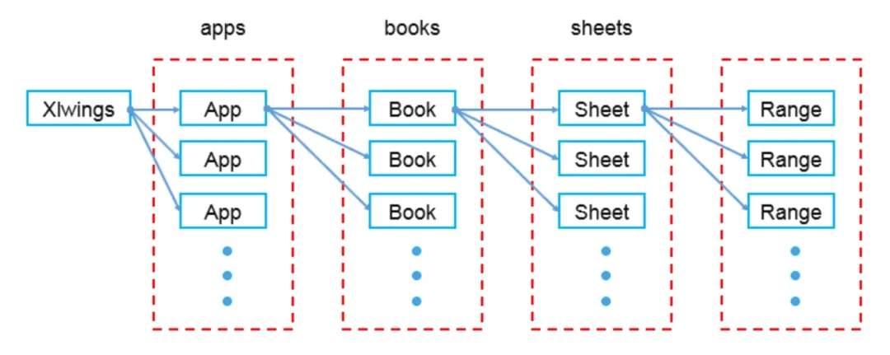
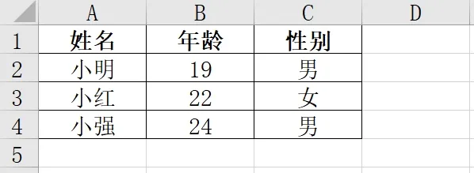
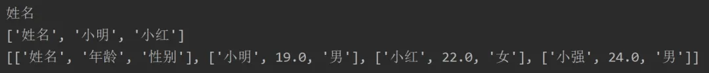
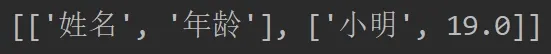
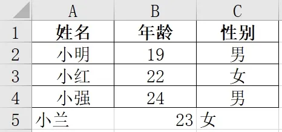

Python Excel<br />在Python中有许多直接操作 Excel 文件的库，如 `xlwings`、`xlrd`、`xlwt` 等等，各个库之间没有明确的好坏之分，每个库都有其适合的应用场景，并且`xlwings` 和 `openpyxl` 许多区别决定了它们的能力是互为补充：
> `xlwings`：需要安装有 Excel 软件，支持 `.xls`和 `.xlsx` 格式；可以调用 Excel 文件中 VBA 写好的程序；和 `matplotlib` 以及 `pandas` 的兼容性强
> `openpyxl`：不需要 Excel 软件，仅支持 `.xlsx` 格式

<a name="BIJjk"></a>
## 安装xlwings库
`xlwings` 是一个非标准库，需要在命令行中安装，在终端(Mac)/命令行(Win)使用pip安装即可。
```bash
pip install xlwings
```
<a name="HNN5A"></a>
## 前置知识
对 `xlwings` 的核心理解就在于下面这张图：<br />可以看到，和 `xlwings` 直接对接的是 `apps`，也就是 Excel 应用程序，然后才是 工作簿 `books` 和工作表 `sheets`，这点和 `openpyxl` 有较大区别，也正是因为此，`xlwings` 需要依然安装有 Excel 应用程序的环境。
<a name="IuuTK"></a>
## 操作案例
<a name="7EBvW"></a>
### 一、打开Excel程序
使用app打开
```python
import xlwings as xw
app = xw.App(visible=True, add_book=False) # 程序可见，只打开不新建工作薄
app.display_alerts = False # 警告关闭
app.screen_updating = False # 屏幕更新关闭
```
<a name="T0fML"></a>
### 二、保存、退出、关闭
这里需要注意，因为 `xlwings` 是以程序 apps 作为初级操作对象，因此开始和最后都是基于 app 的开和关
```python
path = r"C:\Scientific Research\Python"
wb = app.books.open(path + r'\practice.xlsx')
wb.save() # 保存文件
wb.close() # 关闭文件
app.quit() # 关闭程序
```
打开表格又分一下两种情况，即 固定 和 活动：
```python
xw.Book(path + r'\practice.xlsx')   # 固定打开表格
xw.books.open(path + r'\practice.xlsx') # 频繁打开表格
```
固定和频繁打开涉及到一个概念，称**活动对象**，它使 `xlwings` 的操作更显灵活：
```python
# 活动应用程序
app = xw.apps.active
# 活动工作簿
wb = xw.books.active  # 在活动app
wb = app.books.active  # 在特定app
# 活动工作表
sheet = xw.sheets.active  # 在活动工作簿
sheet = wb.sheets.active  # 在特定工作簿
# 活动工作表的Range
xw.Range('A1')
```
<a name="187c0956"></a>
### 三、新建 Excel 文件
无论是新建还是打开都记得保存工作簿、关闭工作簿、关闭程序
```python
path = r"C:\Scientific Research\Python"
wb = app.books.add()
wb.save(path + r'\new_practice.xlsx') 
wb.close() 
app.quit()
```
<a name="3LIsr"></a>
### 四、读取内容
示例文件 `practice.xlsx` 如下：<br />下面的代码部分不再显示程序的开闭代码，利于直观看到重点：
```python
path = r"C:\Scientific Research\Python"
wb = app.books.open(path + r'\practice.xlsx')
# 类似 openpyxl 中的 sheet = workbook.active
sheet = wb.sheets.active
# 获取单个单元格的值
A1 = sheet.range('A1').value
print(A1)
# 获取横向或纵向多个单元格的值，返回列表
A1_A3 = sheet.range('A1:A3').value
print(A1_A3)
# 获取给定范围内多个单元格的值，返回嵌套列表，按行为列表
A1_C4 = sheet.range('A1:C4').value
print(A1_C4)
```
<br />在 xlwings 中，可以通过 `sheet.range` 获取一个或多个单元格进行操作，另外也可以不用 `sheet.range` 获取：
```python
# 获取单个单元格的值
A1 = sheet['A1'].value
print(A1)
# 获取横向或纵向多个单元格的值，返回列表
A1_A3 = sheet['A1:A3'].value
print(A1_A3)
# 获取给定范围内多个单元格的值，返回嵌套列表，按行为列表
A1_C4 = sheet['A1:C4'].value
print(A1_C4)
```
无论是单个单元格还是多个单元格，可以用 `.value`直接获取，输出结果和使用 `.range` 完全一致，也避免了类似 `openpyxl` 对于多个单元格需要再建立循环遍历才能获取值。<br />还有一种类似 `pandas` 切片获取范围内所有值的方法：
```python
sheet = wb.sheets.active
A1_B2 = sheet[:2, :2].value
print(A1_B2)
```

<a name="626d1b83"></a>
### 五、写入数据
以下为写入 1 个单元格、一行或一列写入多个单元格、写入范围内多个单元格代码
```python
# 写入 1 个单元格
sheet.range('A2').value = '大明'
# 一行或一列写入多个单元格
# 横向写入A1:C1
sheet.range('A1').value = [1,2,3]
# 纵向写入A1:A3
sheet.range('A1').options(transpose=True).value = [1,2,3]
# 写入范围内多个单元格
sheet.range('A1').options(expand='table').value = [[1,2,3], [4,5,6]]
```
例如，如果要给 `practice.xlsx` 添加一行新的记录，代码如下：
```python
import xlwings as xw
app = xw.App(visible=True, add_book=False)
app.display_alerts = False
app.screen_updating = False
path = r"C:\Scientific Research\Python"
wb = app.books.open(path + r'\practice.xlsx')
sheet = wb.sheets.active
sheet.range('A5').value = ['小兰', 23, '女']
wb.save()
wb.close()
app.quit()
```

<a name="nNskZ"></a>
### 六、获取数据范围
有两种方法实现
```python
# 方法一
shape = sheet.used_range.shape
print(shape)
# 方法二
nrow = sheet.api.UsedRange.Rows.count
ncol = sheet.api.UsedRange.Columns.count
print(nrow)
print(ncol)
```
<a name="3U2eM"></a>
### 七、输出并修改行高列宽
```python
# 输出
print(sheet.range('A1:A2').row_height)
print(sheet.range('A1:A2').column_width)
# 修改
sheet.range('A1:A2').row_height = 15
sheet.range('A1:A2').column_width = 10
```
<a name="Ogict"></a>
### 八、获取及设置公式
可以调用Excel公式，这是pandas无法完成的
```python
# 获取公式
print(sheet.range('B2').formula_array)
# 写入公式
sheet.range('B2').formula='=SUM(A1,A2)'
```
<a name="K7I21"></a>
### 九、 获取、设置及清除颜色格式
当然类似openpyxl等样式修改也是支持的
```python
# 获取颜色
print(sheet.range('C1').color)
# 设置颜色
sheet.range('C1').color = (255, 0, 120)
# 清除颜色
sheet.range('C1').color = None
```
