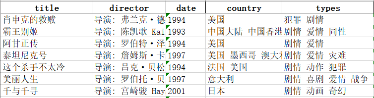

Python
<a name="LcVO2"></a>
## 准备
<a name="hBK1e"></a>
### PPT数据
首先需要准备填充PPT的数据，这里用的是豆瓣电影数据，共有25条电影信息，包含title,director,date,country,types共5个字段，存储方式为Excel。数据预览如下：<br /><br />另外，由于PPT还需要批量插入图片，因此这里也准备了25张电影海报图片，存放在文件夹movie_pic中。<br />
<a name="Wjyqh"></a>
### PPT模板
首先需要新建一个PPT模板，这个操作比较简单，直接进入到PPT母版视图，然后选择模板中第一张幻灯片的布局，依次插入电影名称、图片、类型、主演和导演、年份和国家6个占位符，其中除了图片其他都是内容占位符。这里一定要注意插入的顺序，后面代码也是根据占位符顺序来进行内容填充。为了美化PPT，可以个性化添加LOGO，背景图片，设置字体颜色大小等等。
<a name="zQsEt"></a>
## 实战
<a name="oVeQY"></a>
### 导入相关模块
```python
# 读取图片文件
import os
# 读取Excel数据
import pandas as pd
# 操作PPT
from pptx import Presentation
```
<a name="fz7JF"></a>
### 读取电影数据
用Pandas读取excel数据，并将数据转为字典格式。
```python
#读取电影数据
df = pd.read_excel(r".\ppt素材\top250.xlsx")
data = df.to_dict('records')
print(data)
```
<a name="wHqo3"></a>
### 读取PPT模板插入数据
用`Presentation()`方法读取PPT模板，然后遍历所有电影数据（25个字典），选择母版样式中的第一张幻灯片即`layout[0]`，接着遍历幻灯片中的所有占位符，这里用到`enumerate()`获取站位符的序号。将每个字典中的值插入到对应的占位符中，最后用`save()方`法保存新生成的PPT。
```python
# 读取母版文件构建PPT的对象
my_ppt = Presentation(r".\ppt素材\ppt模板.pptx")
# 获取母版所有幻灯片布局
layout = my_ppt.slide_layouts
# 遍历所有电影数据
for x in data:
    #print(x)
    #选择模板中第一个幻灯片的布局并创建新幻灯片
    slide = my_ppt.slides.add_slide(layout[0])
    #当前幻灯片中所有的占位符
    placeholders = slide.shapes.placeholders
    for i,pl in enumerate(placeholders):
        if i == 0:
            pl.text = x["title"]
        elif i == 2:
            pl.text = x["types"]
        elif i == 3:
            pl.text = x["director"]
        elif i == 4:
            pl.text = str(x["date"])
        elif i == 5:
            pl.text = x["country"]
my_ppt.save("result.pptx")
```
由于图片是单独存放在文件夹movie_pic中，需要`os.path.join()`方法拼接每张图片的完整路径，然后
```python
用insert_picture()方法将图片插入到PPT中。
# 电影海报存储路径
images = r".\ppt素材\movie_pic"

# 遍历所有电影数据
for x in data:
    slide = my_ppt.slides.add_slide(layout[0])
    placeholders = slide.shapes.placeholders
    for i,pl in enumerate(placeholders):
        if i == 0:
            pl.text = x["title"]
        elif i == 1:
            img_path = os.path.join(images,f'{x["title"]}.jpg')
            print(img_path)
            pl.insert_picture(img_path)
```
