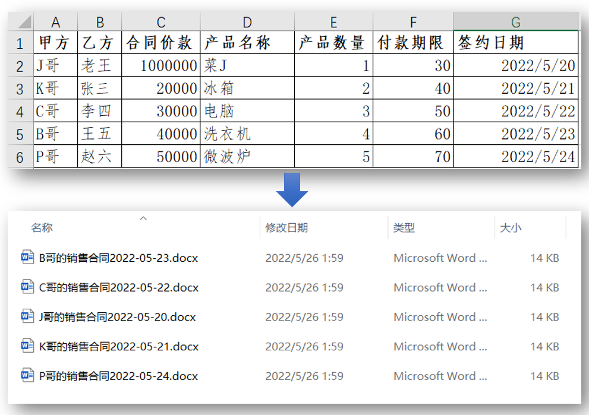
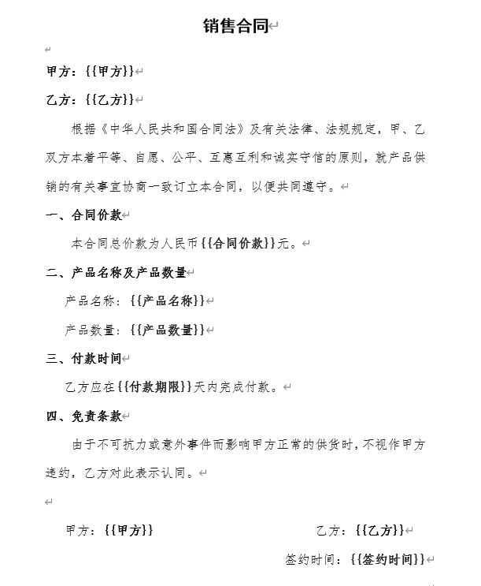
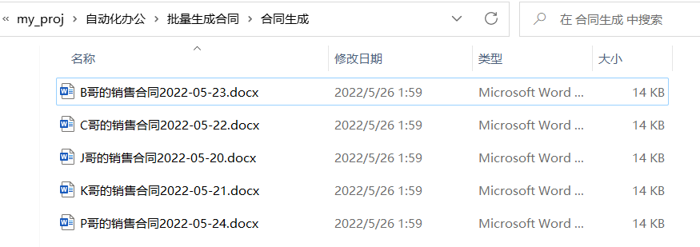
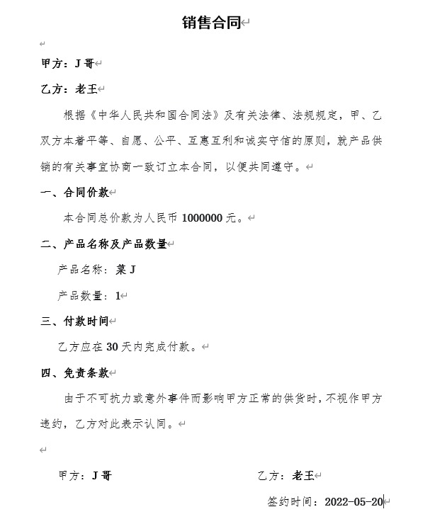

Python
<a name="kb44y"></a>
## 一、背景
在经济交往中，有时会涉及到销售合同的批量制作。比如需要根据如下合同数据（Excel），进行批量生成销售合同（Word）。<br />
<a name="QHgg3"></a>
## 二、准备
首先要准备好一份合同模板（Word），将需要替换的合同数据用`{{}}`表示，如下：<br />
<a name="ueaHm"></a>
## 三、实战
<a name="Uewmb"></a>
### 1、安装相关库
openpyxl是一个操作Excel非常好用的库，功能相对于xlrd、xlwt来说更为完整，首先安装它：
```bash
pip install openpyxl
```
docxtpl 是一个操作Word非常好用的库，其主要通过对docx文档模板加载，从而对其进行修改，也安装下这个库。
```bash
pip install docxtpl
```
<a name="wuRKr"></a>
### 2、读取合同数据
可以通过load_workbook方法打开合同数据（Excel表），然后读取每一个合同数据并存入到data字典，再将每个字典放入到列表datas中。PS：由于读取的签约日期是一个时间戳，需要通过strftime方法转为标准的年月日格式。
```python
from docxtpl import DocxTemplate
from openpyxl import load_workbook

wb = load_workbook("合同数据.xlsx")
ws = wb['Sheet1']
datas = []
for row in range(2, ws.max_row):
    name1 = ws[f"A{row}"].value
    name2 = ws[f"B{row}"].value
    price = ws[f"C{row}"].value
    product = ws[f"D{row}"].value
    count = ws[f"E{row}"].value
    deadline = ws[f"F{row}"].value
    time = ws[f"G{row}"].value
    time = time.strftime("%Y-%m-%d")
    data = {"甲方": name1,
            "乙方": name2, 
            "合同价款": price, 
            "产品名称": product, 
            "产品数量": count,
            "付款期限": deadline,
            "签约时间": time}
    datas.append(data)
datas
```
当然，也可以通过pandas大法来读取合同数据，主要运用到`dataframe_to_rows`方法，将pandas格式的数据转为一行一行的数据。`index=False`表示不需要索引，`header=False`表示不需要表头。
```python
import pandas as pd
from openpyxl.utils.dataframe import dataframe_to_rows

df = pd.read_excel("合同数据.xlsx")
df["签约日期"] = df["签约日期"].apply(lambda x:x.strftime("%Y-%m-%d"))
datas = []
for row in dataframe_to_rows(df,index=False,header=False):
    data = {"甲方": row[0], 
            "乙方": row[1], 
            "合同价款": row[2], 
            "产品名称": row[3], 
            "产品数量": row[4],
            "付款期限": row[5],
            "签约时间": row[6]} 
    datas.append(data)
datas
```
可以打印datas，效果如下：
```python
[{'甲方': 'J哥',
  '乙方': '老王',
  '合同价款': 1000000,
  '产品名称': '菜J学Python',
  '产品数量': 1,
  '付款期限': 30,
  '签约时间': '2022-05-20'},
 {'甲方': 'K哥',
  '乙方': '张三',
  '合同价款': 20000,
  '产品名称': '冰箱',
  '产品数量': 2,
  '付款期限': 40,
  '签约时间': '2022-05-21'},
 {'甲方': 'C哥',
  '乙方': '李四',
  '合同价款': 30000,
  '产品名称': '电脑',
  '产品数量': 3,
  '付款期限': 50,
  '签约时间': '2022-05-22'},
 {'甲方': 'B哥',
  '乙方': '王五',
  '合同价款': 40000,
  '产品名称': '洗衣机',
  '产品数量': 4,
  '付款期限': 60,
  '签约时间': '2022-05-23'},
 {'甲方': 'P哥',
  '乙方': '赵六',
  '合同价款': 50000,
  '产品名称': '微波炉',
  '产品数量': 5,
  '付款期限': 70,
  '签约时间': '2022-05-24'}]
```
<a name="tedGw"></a>
### 3、批量合同生成
这里运用for语句遍历每一个合同数据data（字典格式），打开合同模板，并将data替换掉合同模板中的数据，然后保存为新的销售合同。
```python
for data in datas:
    tpl = DocxTemplate('合同模板.docx')
    tpl.render(data)
    tpl.save(f'合同生成/{data["甲方"]}的销售合同{data["签约时间"]}.docx')
    print(f'{data["甲方"]}的销售合同已生成')
```
代码运行后，效果如下：<br /><br />打开其中一个销售合同，效果如下：<br />
