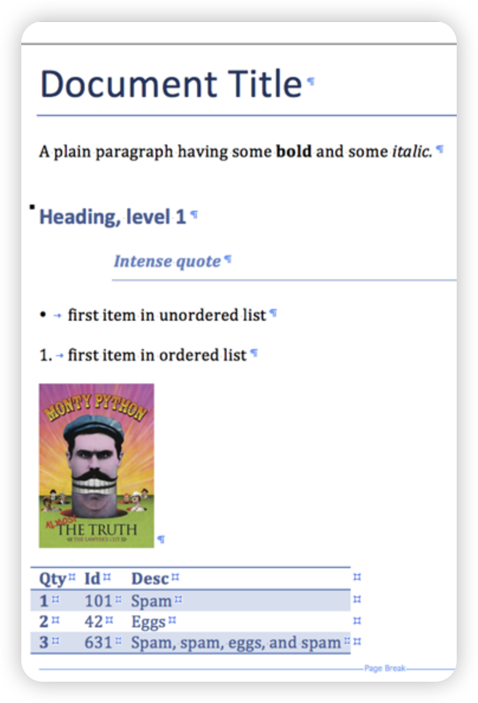

Python
<a name="E5olJ"></a>
### **什么是Python-Docx？**
Python-Docx是用于创建和更新Microsoft Word（.docx）文件的Python库。<br />日常需要经常处理Word文档，用Python的免费第三方包：Python-Docx处理docx十分方便。<br />而且这个包和pandas包结合使用，可以在word插入excel表格，节省了很多复制、粘贴、调整表格样式的时间，真的很方便！<br />但是要注意：Python-Docx只能处理docx、docx、docx文件！<br />下面给大家介绍一下如何使用Python-Docx吧，抛砖引玉~
<a name="sqLPj"></a>
### 安装

- 由于 python-docx 已经提交给 PyPI 仓库，所以可以使用 pip 安装，如下：
```bash
pip install python-docx
```

- 如果同时安装了 python2 和 python3 那么 pip 可能不能用，可以使用 pip3 来安装，如下：
```bash
pip3 install python-docx
```
<a name="ritxK"></a>
### **文档下载**
**Python-Docx的官网提供了使用文档：**该文档说明了如何使用Python-Docx的所有功能，并包含完整的API参考。在下载中包含的示例中也很好地展示了Python-Docx的功能。
<a name="ohLhL"></a>
### 创建一个空的 Word 文档
首先创建一个空的 Word 文档，然后向其中添加一些内容。<br />下面是一个简单的例子：
```python
from docx import Document

# 创建一个空白 Word 文档
doc = Document()

# 保存文档
doc.save('my_doc.docx')
```
这段代码将创建一个空白的 Word 文档，并将其保存为 my_doc.docx。
<a name="eRwf9"></a>
### 添加段落和样式
Python-Docx允许添加段落、样式和格式化文本。<br />以下是一个例子：
```python
from docx import Document

doc = Document()

# 添加标题
doc.add_heading('Python-Docx 库示例', level=1)

# 添加段落
doc.add_paragraph('这是一个段落示例。')

# 添加带有不同样式的段落
p = doc.add_paragraph('这是一个带样式的段落。')
p.add_run('这部分文字是加粗的。').bold = True
p.add_run('这部分文字是斜体的。').italic = True

# 保存文档
doc.save('my_doc.docx')
```
<a name="umEIE"></a>
### 添加表格
Python-Docx使得添加表格变得十分容易：
```python
from docx import Document

doc = Document()

# 添加表格
table = doc.add_table(rows=2, cols=2)

# 填充表格
table.cell(0, 0).text = "第一行第一列"
table.cell(0, 1).text = "第一行第二列"
table.cell(1, 0).text = "第二行第一列"
table.cell(1, 1).text = "第二行第二列"

# 保存文档
doc.save('my_doc.docx')
```
<a name="KijQa"></a>
### 替换文档中的文本
有时候，需要在文档中查找并替换特定的文本：
```python
from docx import Document

doc = Document('my_doc.docx')

# 替换文档中的文本
for p in doc.paragraphs:
    if '示例' in p.text:
        p.text = p.text.replace('示例', '演示')

# 保存替换后的文档
doc.save('my_doc_modified.docx')
```
<a name="TwgpF"></a>
### 添加图片和段落
添加图片到文档中是 Python-Docx 的另一个强大功能：
```python
from docx import Document
from docx.shared import Inches

doc = Document()

# 添加图片
doc.add_picture('example.jpg', width=Inches(2.0), height=Inches(2.0))

# 添加段落
doc.add_paragraph('上面是一个图片示例。')

# 保存文档
doc.save('my_doc_with_image.docx')
```
<a name="IrD8E"></a>
### 添加页眉和页脚
Python-Docx还允许添加页眉和页脚，以完善文档的样式和格式：
```python
from docx import Document

doc = Document()

# 添加页眉和页脚
section = doc.sections[0]
header = section.header
footer = section.footer

header.paragraphs[0].text = "这是页眉"
footer.paragraphs[0].text = "这是页脚"

# 保存文档
doc.save('my_doc_with_header_footer.docx')
```
<a name="meF0o"></a>
### 使用演示
<br />这里直接用代码给大家演示，如何生成👆上图所示的文档，内容包含：

1. 导入python-docx库
2. 新建wrod文档、一级、二级、三级标题、自然段
3. 设置字体格式
4. 在指定位置添加图片
5. 在指定位置添加表格
6. 文档另存为
```python
# 1、导入python-docx库
from docx import Document
from docx.shared import Inches

document = Document()
document.add_heading('Document Title', 0)

# 2、新建wrod文档、一级、二级、三级标题、自然段
p = document.add_paragraph('A plain paragraph having some ')

# 3、设置字体格式
p.add_run('bold').bold = True
p.add_run(' and some ')
p.add_run('italic.').italic = True

document.add_heading('Heading, level 1', level=1)
document.add_paragraph('Intense quote', style='Intense Quote')

document.add_paragraph('first item in unordered list', style='List Bullet')
document.add_paragraph('first item in ordered list', style='List Number')

# 4、在指定位置添加图片
document.add_picture('monty-truth.png', width=Inches(1.25))

records = (
    (3, '101', 'Spam'),
    (7, '422', 'Eggs'),
    (4, '631', 'Spam, spam, eggs, and spam')
)
# 5、在指定位置添加表格
table = document.add_table(rows=1, cols=3)
hdr_cells = table.rows[0].cells
hdr_cells[0].text = 'Qty'
hdr_cells[1].text = 'Id'
hdr_cells[2].text = 'Desc'
for qty, id, desc in records:
    row_cells = table.add_row().cells
    row_cells[0].text = str(qty)
    row_cells[1].text = id
    row_cells[2].text = desc

document.add_page_break()
# 6、文档另存为
document.save('demo.docx')
```
<a name="yALdX"></a>
### 其他资源
可以在Python-Docx的GitHub页面上找到更多示例代码。<br />[https://github.com/python-openxml/python-docx](https://github.com/python-openxml/python-docx)
<a name="L3JqG"></a>
### 总结
Python-Docx库为处理Word文档提供了极大的便利。通过本文的介绍和示例代码，可以开始使用Python-Docx创建、编辑和操纵Word文档，为你的工作和项目增添更多的可能性。掌握这个强大的库将在与Microsoft Word文档打交道时更加得心应手。
