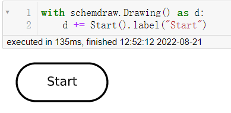
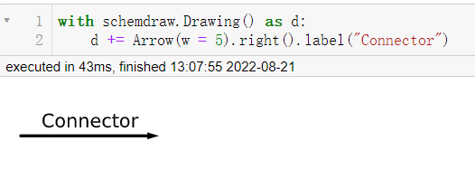
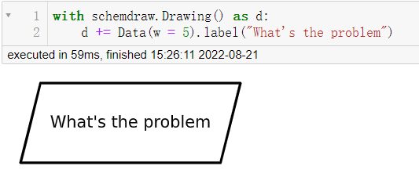
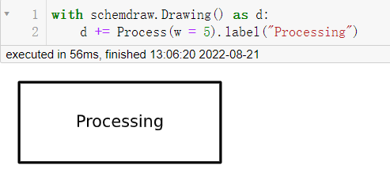
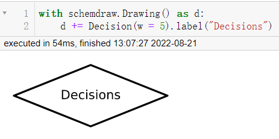
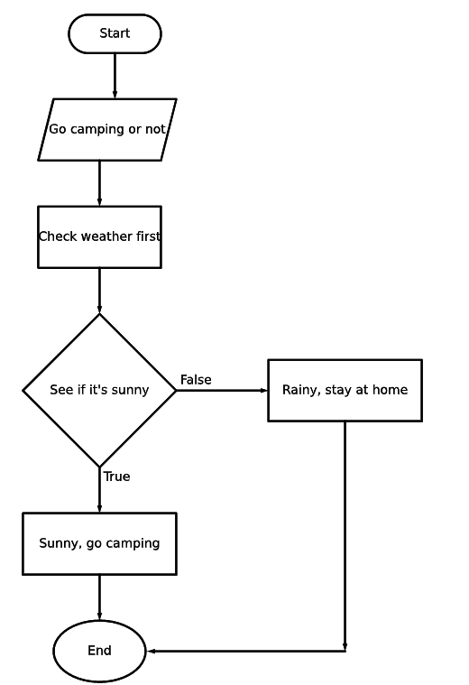
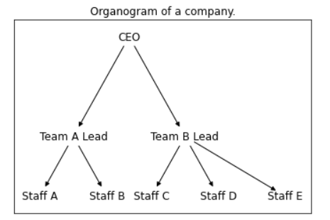
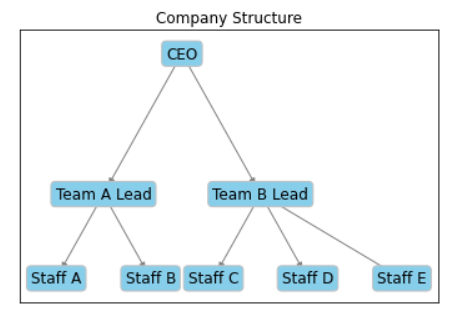

Python<br />流程图存在于生活的方方面面，对于追踪项目的进展，做出各种事情的决策都有着巨大的帮助，而对于万能的Python而言呢，绘制流程图也是十分轻松的，介绍两个用于绘制流程图的模块，先来看第一个。
<a name="Rs9ii"></a>
## SchemDraw
那么在SchemDraw模块当中呢，有六个元素用来代表流程图的主要节点的，椭圆形代表的是决策的开始和结束，代码如下
```python
import schemdraw
from schemdraw.flow import *

with schemdraw.Drawing() as d:
    d += Start().label("Start")
```
output<br /><br />箭头表示的是决策的走向，用来连接各个节点的，代码如下
```python
with schemdraw.Drawing() as d:
    d += Arrow(w = 5).right().label("Connector")
```
output<br /><br />平行四边形代表的是要去处理和解决的问题，而长方形所代表的是要为此做出的努力或者说是过程，代码如下
```python
with schemdraw.Drawing() as d:
    d += Data(w = 5).label("What's the problem")
```
output<br />
```python
with schemdraw.Drawing() as d:
    d += Process(w = 5).label("Processing")
```
output<br /><br />而菱形代表的则是决策的具体情况，代码如下
```python
with schemdraw.Drawing() as d:
    d += Decision(w = 5).label("Decisions")
```
output<br /><br />来绘制一个简单的流程图，假如周末的时候想着要不要出去露营(Camping)，那既然要去露营的话，肯定是需要查看一下天气，看一下是否是晴天(Sunny)，如果是下雨天(Rainy)的话，就不去，按照这种逻辑，来绘制一下流程图，代码如下
```python
import schemdraw
from schemdraw.flow import *

with schemdraw.Drawing() as d:
    d+= Start().label("Start")
    d+= Arrow().down(d.unit/2)

    # 具体是啥问题嘞
    d+= Data(w = 4).label("Go camping or not")
    d+= Arrow().down(d.unit/2)

    # 第一步 查看天气
    d+= Box(w = 4).label("Check weather first")
    d+= Arrow().down(d.unit/2)

    # 是否是晴天
    d+= (decision := Decision(w = 5, h= 5,
                              S = "True",
                              E = "False").label("See if it's sunny"))

    # 如果是真的话
    d+= Arrow().length(d.unit/2)
    d+= (true := Box(w = 5).label("Sunny, go camping"))
    d+= Arrow().length(d.unit/2)

    # 结束
    d+= (end := Ellipse().label("End"))

    # 如果不是晴天的话
    d+= Arrow().right(d.unit).at(decision.E)

    # 那如果是下雨天的话，就不能去露营咯
    d+= (false := Box(w = 5).label("Rainy, stay at home"))

    # 决策的走向
    d+= Arrow().down(d.unit*2.5).at(false.S)

    # 决策的走向
    d+= Arrow().left(d.unit*2.15)
    d.save("palindrome flowchart.jpeg", dpi = 300)
```
output<br />
<a name="gIQ72"></a>
## Networkx
Networkx模块用来创建和处理复杂的图网络结构，生成多种随机网络和经典网络，分析网络结构和建立网络模型，例如在绘制人脉关系网的案例当中就可以用到networkx模块，<br />而例如一个公司的组织架构图，也可以用到该模块，来简单直观的绘制公司的整体架构，代码如下
```python
import networkx as nx
import matplotlib.pyplot as plt
import numpy as np

G = nx.DiGraph()
nodes = np.arange(0, 8).tolist()
G.add_nodes_from(nodes)
# 节点连接的信息，哪些节点的是相连接的
G.add_edges_from([(0,1), (0,2),
 (1,3), (1, 4),
 (2, 5), (2, 6), (2,7)])
# 节点的位置
pos = {0:(10, 10),
 1:(7.5, 7.5), 2:(12.5, 7.5),
 3:(6, 6), 4:(9, 6),
 5:(11, 6), 6:(14, 6), 7:(17, 6)}
# 节点的标记
labels = {0:"CEO", 
          1: "Team A Lead",
          2: "Team B Lead",
          3: "Staff A",
          4: "Staff B",
          5: "Staff C",
          6: "Staff D",
          7: "Staff E"}

nx.draw_networkx(G, pos = pos, labels = labels, arrows = True,
                 node_shape = "s", node_color = "white")

plt.title("Company Structure")
plt.show()
```
output<br /><br />看到这里，大家可能会觉得会指出来的结果有点简单，想要添加上去些许颜色，代码如下
```python
nx.draw_networkx(G, pos = pos, labels = labels, 
                 bbox = dict(facecolor = "skyblue",
                 boxstyle = "round", ec = "silver", pad = 0.3),
                 edge_color = "gray"
                )
plt.title("Company Structure")
plt.show()
```
output<br />
