Python<br />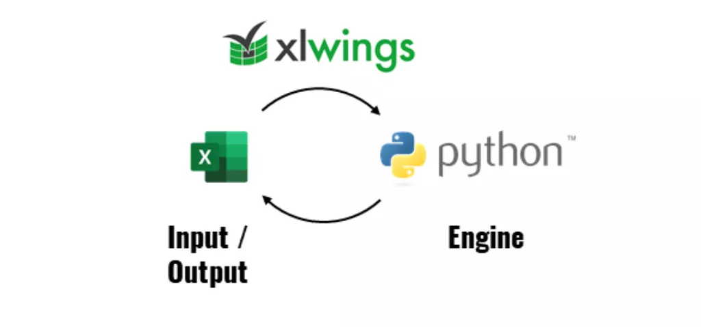<br />使用xlwings将Python和Excel两大数据工具进行集成，更便捷地处理日常工作。<br />Excel尽管已经诞生三十多年了，现在全球仍有7.5亿忠实用户，而作为网红语言的Python，也仅仅只有700万的开发人员。<br />Excel是全世界最流行的编程语言。自从微软引入了LAMBDA定义函数后，Excel已经可以实现编程语言的算法，因此它是具备图灵完备性的，和JavaScript、Java、Python一样。<br />虽然Excel对小规模数据场景来说是刚需利器，但它面对大数据时就会有些力不从心。<br />一张Excel表最多能显示1048576行和16384列，处理一张几十万行的表可能就会有些卡顿，当然可以使用VBA进行数据处理，也可以使用Python来操作Excel。<br />这就是本文要讲到的主题，Python的第三方库-xlwings，它作为Python和Excel的交互工具，可以轻松地通过VBA来调用Python脚本，实现复杂的数据分析。<br />比如说自动导入数据：<br />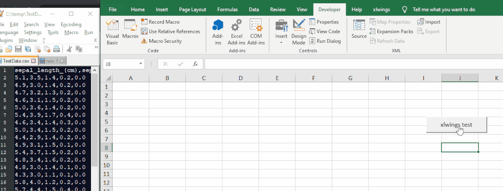<br />或者随机匹配文本：<br />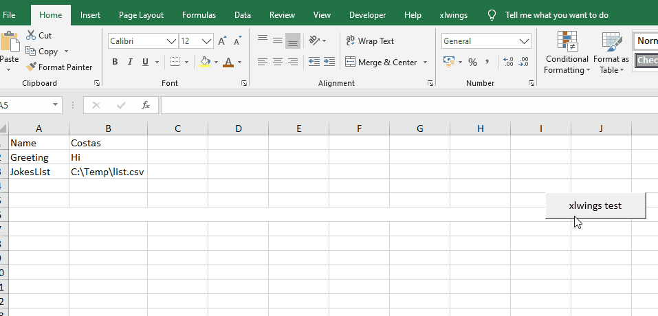
<a name="ChqFY"></a>
## 一、为什么将Python与Excel VBA集成？
VBA作为Excel内置的宏语言，几乎可以做任何事情，包括自动化、数据处理、分析建模等等，那为什么要用Python来集成Excel VBA呢？主要有以下三点理由：

1. 如果对VBA不算精通，可以直接使用Python编写分析函数用于Excel运算，而无需使用VBA；
2. Python相比VBA运行速度更快，且代码编写更简洁灵活；
3. Python中有众多优秀的第三方库，随用随取，可以节省大量代码时间；

对于Python爱好者来说，pandas、numpy等数据科学库用起来可能已经非常熟悉，如果能将它们用于Excel数据分析中，那将是如虎添翼。
<a name="m34Bo"></a>
## 二、为什么使用xlwings？
Python中有很多库可以操作Excel，像xlsxwriter、openpyxl、pandas、xlwings等。<br />但相比其他库，xlwings性能综合来看几乎是最优秀的，而且xlwings可以实现通过Excel宏调用Python代码。<br />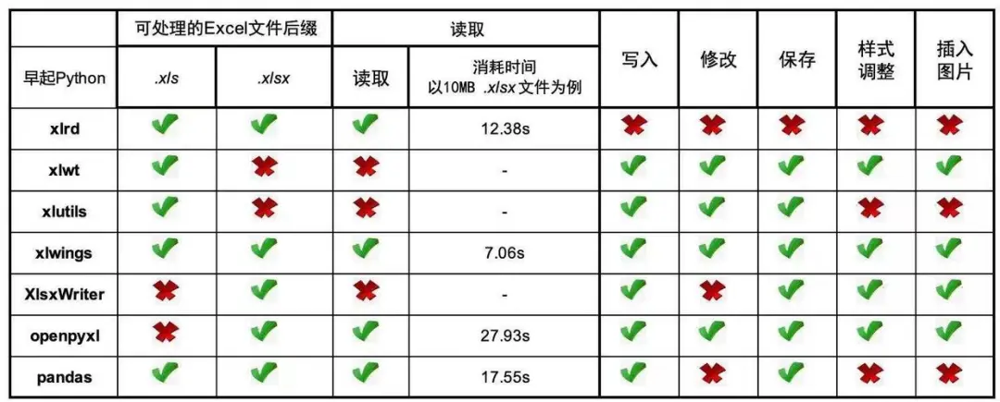<br />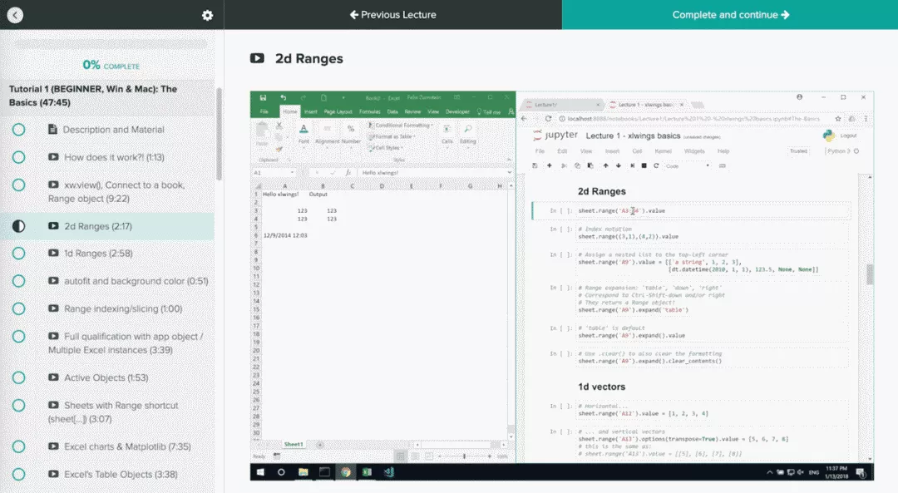<br />安装xlwings非常简单，在命令行通过pip实现快速安装：
```bash
pip install xlwings
```
安装好xlwings后，接下来需要安装xlwings的 Excel集成插件，安装之前需要关闭所有 Excel 应用，不然会报错。<br />同样在命令行输入以下命令：
```bash
xlwings addin install
```
出现下面提示代表集成插件安装成功。<br />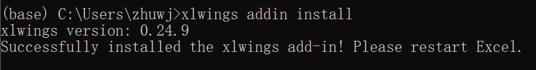<br />xlwings和插件都安装好后，这时候打开Excel，会发现工具栏出现一个xlwings的菜单框，代表xlwings插件安装成功，它起到一个桥梁的作用，为VBA调用Python脚本牵线搭桥。<br />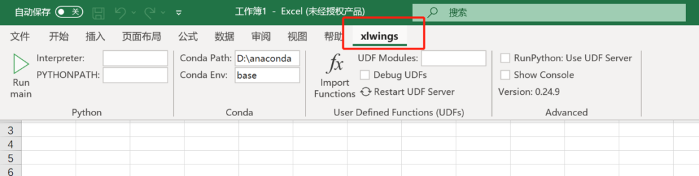<br />另外，如果菜单栏还没有显示“开发工具”，那需要把“开发工具”添加到功能区，因为要用到宏。<br />步骤很简单：<br />1、在"文件"选项卡上，转到"自定义>选项"。<br />2、在“自定义功能区”和“主选项卡”下，选中“开发工具”复选框。<br />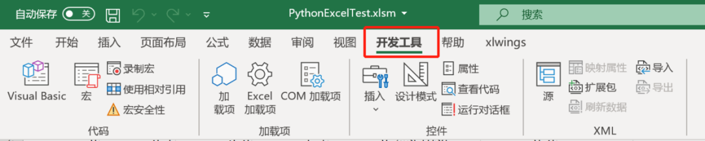<br />菜单栏显示开发工具，就可以开始使用宏。<br />如果还不知道什么是宏，可以暂且把它理解成实现自动化及批量处理的工具。<br />到这一步，前期的准备工作就完成了，接下来就是实战！
<a name="aj456"></a>
## 三、玩转xlwings
要想在excel中调用python脚本，需要写VBA程序来实现，但对于不懂VBA的小伙伴来说就是个麻烦事。<br />但xlwings解决了这个问题，不需要写VBA代码就能直接在excel中调用python脚本，并将结果输出到excel表中。<br />xlwings会创建.xlsm和.py两个文件，在.py文件里写python代码，在.xlsm文件里点击执行，就完成了excel与python的交互。<br />怎么创建这两个文件呢？非常简单，直接在命令行输入以下代码即可：
```bash
xlwings quickstart ProjectName
```
这里的ProjectName可以自定义，是创建后文件的名字。<br />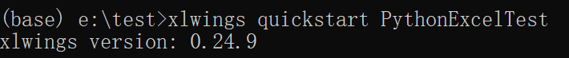<br />如果想把文件创建到指定文件夹里，需要提前将命令行导航到指定目录。<br />创建好后，在指定文件夹里会出现两个文件，就是之前说的.xlsm和.py文件。<br /><br />打开.xlsm文件，这是一个excel宏文件，xlwings已经提前写好了调用Python的VBA代码。<br />按快捷键Alt + F11，就能调出VBA编辑器。<br />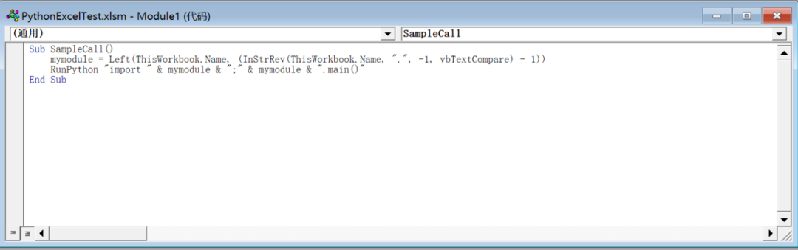
```vbnet
Sub SampleCall()
    mymodule = Left(ThisWorkbook.Name, (InStrRev(ThisWorkbook.Name, ".", -1, vbTextCompare) - 1))
    RunPython "import " & mymodule & ";" & mymodule & ".main()"
End Sub
```
里面这串代码主要执行两个步骤：<br />1、在.xlsm文件相同位置查找相同名称的.py文件 <br />2、调用.py脚本里的`main()`函数<br />先来看一个简单的例子，自动在excel表里输入`['a','b','c','d','e']`<br />第一步：把.py文件里的代码改成以下形式。
```python
import xlwings as xw
import pandas as pd


def main():
    wb = xw.Book.caller()
    values = ['a','b','c','d','e']
    wb.sheets[0].range('A1').value = values


@xw.func
def hello(name):
    return f"Hello {name}!"


if __name__ == "__main__":
    xw.Book("PythonExcelTest.xlsm").set_mock_caller()
    main()

```
然后在.xlsm文件sheet1中创建一个按钮，并设置默认的宏，变成一个触发按钮。<br />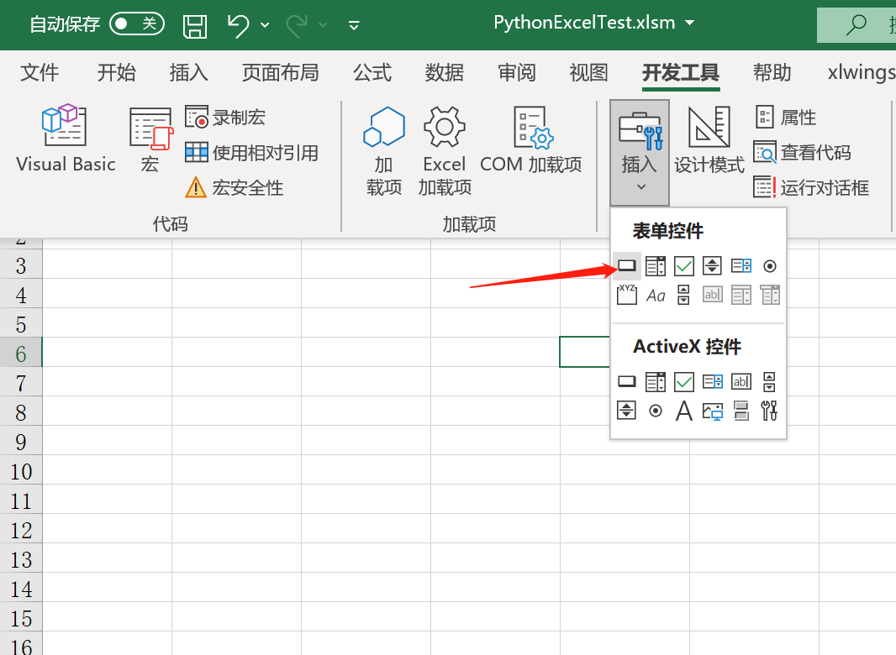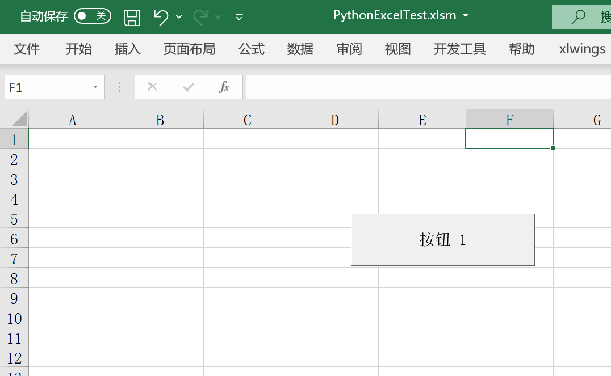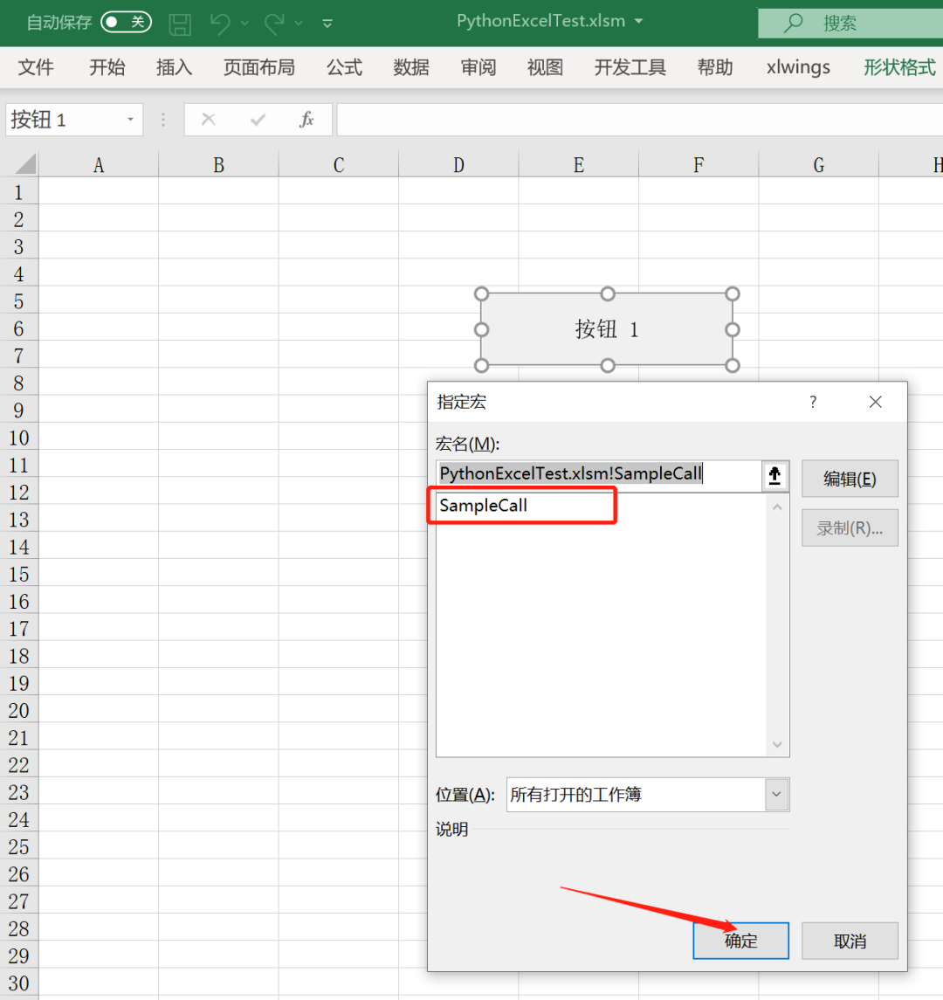<br />设置好触发按钮后，直接点击它，就会发现第一行出现了`['a','b','c','d','e']`。<br />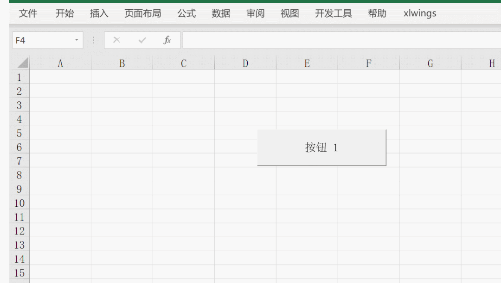<br />同样的，可以把鸢尾花数据集自动导入到excel中，只需要在.py文件里改动代码即可，代码如下：
```python
import xlwings as xw
import pandas as pd

def main():
    wb = xw.Book.caller()
    df = pd.read_csv(r"E:\\test\\PythonExcelTest\\iris.csv")
    df['total_length'] =  df['sepal_length'] + df['petal_length']
    wb.sheets[0].range('A1').value = df


@xw.func
def hello(name):
    return f"Hello {name}!"


if __name__ == "__main__":
    xw.Book("PythonExcelTest.xlsm").set_mock_caller()
    main()
```


 
